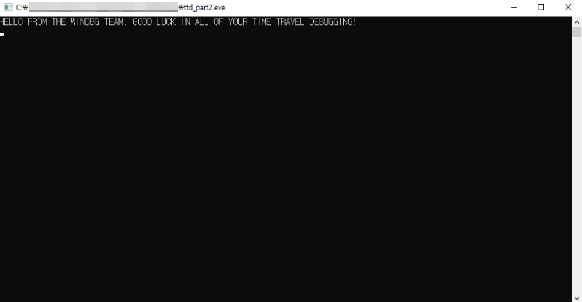
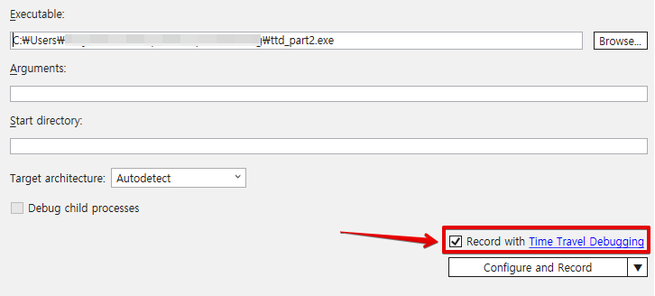
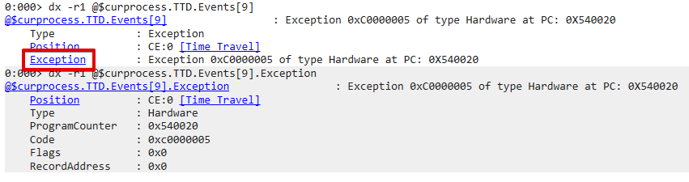
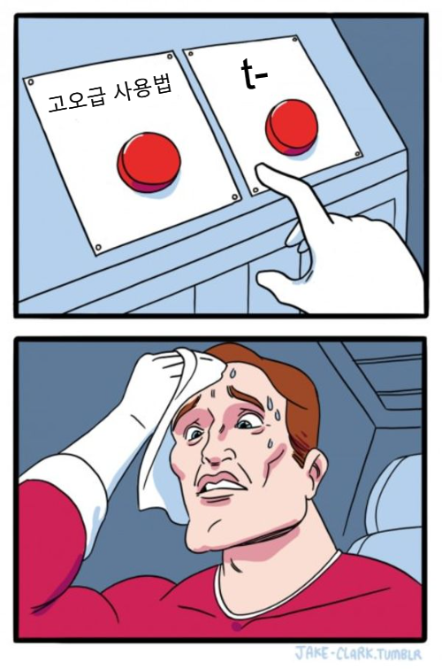
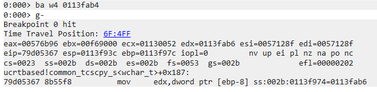
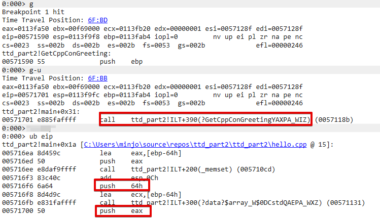
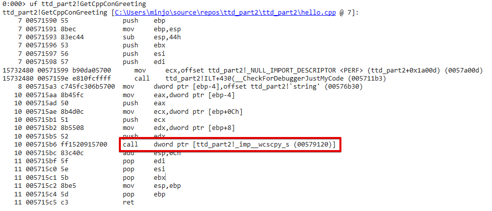

# Part II 두둥 등장


시간을 여행하는 해커를 위한 안내서 Part 1에서 Windbg TTD를 간단히 살펴봤습니다. 이번 Part 2에선 TTD를 사용해 간단한 버그의 root cause를 찾아보면서 TTD와 친해져 봅시다. Windbg를 한 번도 안 써보셨거나 Part 1을 보고 싶으신 분들은 [Part 1](https://hackyboiz.github.io/2021/01/24/fabu1ous/ttd-1/)을 보고 오세요.

최근에 L0ch형이 글 조회수로 절 놀리더라고요. 도와주십쇼. ㅎㅎ


# 준비물(필수)

1. visual studio
2. windbg preview
3. 리버싱 처음 해보는 척할 수 있는 연기력


# 샘플 만들기


Visual studio로 C++ 콘솔 app을 만들어 실습 샘플을 만들어 보겠습니다. 프로젝트의 이름 및 실행파일의 이름은 ttd_part2로 하겠습니다.


```c++
#include <array>
#include <stdio.h>
#include <string.h>

void GetCppConGreeting(wchar_t* buffer, size_t size)
{
    wchar_t const* const message = L"HELLO FROM THE WINDBG TEAM. GOOD LUCK IN ALL OF YOUR TIME TRAVEL DEBUGGING!";

    wcscpy_s(buffer, size, message);
}

int main()
{
    std::array <wchar_t, 50> greeting{};
    GetCppConGreeting(greeting.data(), sizeof(greeting));

    wprintf(L"%ls\\n", greeting.data());

    return 0;
}
```

실습에 사용할 버그의 코드입니다. greeting.data()에 문자열을 복사하고 출력하는 간단한 예제입니다. 대충 코드만 봐도 어떤 버그가 발생할지 느낌이 오지만 가볍게 무시합시다.

> Part2는 신비주의야! Part2는 혼자밖에 생각하지 않아!
>
> -이근-


우선 위 코드를 빌드하기 전, 실습에 방해되는 보호 기법과 보안설정을 꺼줍시다.

상단 메뉴 > 프로젝트 > 속성 > C/C++ > SDL 검사 > 아니요(/sdl-)


상단 메뉴 > 프로젝트 > 속성 > C/C++ > 코드 생성

- 기본 런타임 검사 : 기본값
- 보안 검사 : 보안 검사 사용 안함 (/GS-)




상단 메뉴 > 빌드 > 솔루션 빌드

빌드 후 ttd_part2.exe를 실행해 보면 위 사진과 같이 문자열 하나가 출력됩니다. 실습 환경에 따라 Exception이나 Crash가 발생했다는 메세지 박스가 뜰 수도 있습니다.


Windbg Preview를 tdd_part2.exe에 붙여서 실행해보면 Access violation이 발생한다는 것을 확인할 수 있습니다. 간단히 살펴보면 EIP가 오염돼 있군요. 


# Trace File 만들기



Windbg Preview (관리자 권한) > 파일 > Launch executable (advanced) >

타겟(ttd_part2.exe) 선택 > Record with TTD 체크 > Configuer and Record

이제 만들어둔 샘플로 본격적인 실습을 시작해 봅시다. TTD사용의 첫 단계인 Trace File 녹화를 해봅시다.


Part 1에서 저 Record 버튼을 누르고 최대한 빨리 분석하고자 하는 이슈를 발생시켜야 한다고 했었죠? ttd_part2.exe는 실행만 시켜도 크래쉬가 발생하기 때문에 Record 버튼을 눌러 주시기만 하면 됩니다. 딱히 추가로 신경 써 줄게 없습니다. 


녹화가 끝나고 TTD가 Trace file(`.run`)에 대한 IDX file(.idx)을 자동으로 생성하고 나면 분석 준비 끝!


# Trace File 분석하기

```plain text
dx -r1 @$curprocess.TTD.Events
```

dx 명령어를 사용해 Trace File에 녹화된 모든 이벤트 목록을 확인해 봅시다. tdd_part2.exe가 실행되면서 발생한 큼직 큼직한 사건들을 한눈에 볼 수 있습니다. 일단 Exception이 눈에 띄네요.


좌측에 있는 Index(`[0x9]`)를 클릭해 Exception에 대한 정보를 출력해 봅시다.




Time Travel Position, Exception Code, Exception Type 등 Exception에 대한 간단한 정보를 출력해 줍니다. 저희가 분석하려는 이슈는 Program Counter가 `0x540020`일 때 CPU가 던진 하드웨어 Exception으로 Access Violation에 해당함을 알 수 있습니다.

조금 더 자세한 정보를 원하시면 Exception 필드를 클릭해 Flag, RecordAddress 등의 정보도 볼 수 있습니다.


```plain text
!tt ce:0
```

[ Time Travel ]를 클릭하거나 `!tt`명령어를 사용해 해당 Exception이 발생한 시점으로 이동해 본격적으로 분석을 시작해 봅시다.


버그나 취약점을 분석할 때 대부분 제일 먼저 확인하게 되는 건 레지스터의 상태입니다. 일단 눈에 들어오는 게 2가지 있네요.

1. EIP(Program Counter)의 위치가 이상하다.
2. ESP와 EBP의 거리가 너무 멀다.

크래쉬 시점이 root cause일리 없으니 EIP가 오염되기 전으로 되돌리면서 root cause를 찾아봅시다.

네?  저 두 개만 봐도 스택 오버플로우인 거 알 거 같다고요? 글 초반부에 적어 놓은 3번째 준비물을 다시 준비해오시면 되겠습니다.




Part 1에서 다뤘던 것처럼 TTD를 사용해 프로그램의 실행을 되돌리는 방법은 많지만 "천 리 길도 한 걸음 부터"라는 말이 있듯이 우선 Step Into Back(명령어 "t-")을 사용해 한 걸음(Step)씩 되감아 봅시다.


허허... 시작이 반이라고 크래쉬 직전에 실행한 인스트럭션이 `main()`의 ret이네요. EIP가 오염된 이유를 찾았습니다. 벌써 분석 다한 거 같은 이 기분! 너무 홀가분하군요.

> 디버거에게는 작은 한 걸음이지만 리버서에게는 위대한 도약이다.
>
> -닐 암스트롱-

아마 ESP와 EBP의 거리가 먼 이유도 `main()`의 에필로그를 실행하다가 EBP가 이상한 위치로 튀어버린거겠죠?


Step Into Back("t-")을 2번 더 해줍니다. 이제야 EBP 위치가 말이 되네요.


```plain text
dc ebp
```

ebp 위치를 기준으로 메모리 상태를 살펴보면 SFP와 RET 값이 출력 메세지로 오염된 것을 확인할 수 있습니다. 분명히 `main()` 어딘가에서 출력 메세지가 stack을 오염시킨다는 걸 알았으니 그 이유를 알아봅시다.

```plain text
ba <access> <size> <address> {option}
```

방금까지 걷는 법을 알아봤으니 이젠 Breakpoint를 사용해 뛰는 법을 배워봅시다. Windbg의 breakpoint는 특정 메모리에 접근할 때 걸리도록 만들 수 있습니다.

- e : Execute
- r : Read or Write
- w : Write

현재 EBP가 가리키고 있는 메모리 위치(저의 경우에는 0x113fab4)에 Write access가 발생할 때 걸리는 breakpoint를 걸어야 합니다.

```plain text
ba w4 0113fab4
```




Breakpoint를 걸고 Go Back(명령어 "g-")를 해봅시다. `ucrtbased!common_tcscpy_s<wchar_t>+0x187`에 되감기가 멈추네요.


스택의 상황을 살펴봅시다.

main() → GetCppGreeting() → wcscpy_s()

`main()`의 스택 프레임이 망가졌으니 저희가 작성한 `GetCppConGreeting()`에 root cause가 있을 확률이 높습니다.

이 시점에서 개발자라면 `GetCppConGreeting()`의 코드를 열어 볼테고, 저같이 버그 바운티가 목적이라면 IDA를 사용해 정적 분석을 하겠지만 TTD에 집중하기 위해 좀 더 TTD를 써봅시다.


```plain text
dx &ttd_part2!GetCppConGreeting
bu &ttd_part2!GetCppConGreeting
```

버그가 발생할 거라 의심되는 `GetCppGreeting()`의 시작 주소에 breakpoint를 걸고


아까 스택이 오염되는 시점을 찾기 위해 걸어줬던 breakpoint는 삭제해줍시다.


그리고 프로그램 시작 지점으로 돌아가 Go(명령어 "g")를 통해 `GetCppConGreeting()`의 프롤로그로 이동해줍시다. EAX가 눈에 들어오는데 아마 저기가 출력 문자열이 복사되는 Destination이겠죠?


```plain text
gu
```

`GetCppConGreeting()`이 실행을 마치고 다시 `main()`으로 리턴한 직후 위에서 확인했던 EAX 위치를 살펴보면 예상했던 것처럼 Destination이 맞습니다. `GetCppConGreeting()`의 다른 파라미터들을 확인해 보면 root cause를 찾을 수 있을 거 같군요.




```plain text
!tt 0
g
g-u
ub eip
```

다시`GetCppConGreeting()`의 호출 시점으로 이동한 후 "g-u"를 사용해 호출 직전으로 되돌려줍니다. 여기서 현재 EIP를 기준으로 어떤 인스트럭션들을 실행했는지 확인해 보면 `GetCppConGreeting( [EAX], 0x64 )`, 즉 아까 확인했던 Destination과 0x64(100)가 파라미터인걸 알 수 있습니다.


만약 심볼이 살아있는 실행파일을 분석 중이라면 상단 메뉴 > Watch 레이블을 사용해 조금 더 쉽게 확인할 수 있습니다.


`GetCppConGreeting()`의 첫 번째 파라미터 dest_buf(`0x113fa50`)를 살펴봅시다. 크기는 100 bytes 네요? 100 bytes 버퍼에 size 100 만큼 문자열을 복사하는 듯한데 왜 버그가 발생하는 걸까요? 설령 Stack overflow가 발생해도 SFP만 오염되야 할 상황 같은데 RET이 오염될 이유는 없어 보입니다.




```plain text
uf ttd_part2!GetCppConGreeting
```

`GetCppConGreeting()` 함수의 인스트럭션들을 살펴봅시다. 문자열을 복사할 때 Wide character를 사용하는 함수` wcscpy_s()`를 사용하는군요. 즉 100 bytes 버퍼에 100 bytes 복사가 이루어지는 것이 아니라 200 bytes(wchar_t 100개) 복사가 이루어집니다.


```plain text
gu
dc 0113fa50
```

따라서 위 사진에서 볼 수 있듯이 100 bytes 버퍼를 넘어서 하이라이트 된 SFP와 RET까지 오염됩니다.


찾았다! Root Cause!


# Part III 예고


원래는 TTD를 버그 바운티에 사용해보면서 느낀 점이나 꿀팁 등을 정리해 올릴 생각이었는데 최근에 버그 바운티를 거의 안 해서 상황을 좀더 지켜봐야 할 것 같습니다. 그리고 이번 글을 작성하면서 `dx`명령어와 TTD.Memory object를 같이 쓰는 방법도 공부를 해봤는데 엄청 좋더라고요.

다음 part 3는

1. TTD 버그 바운티에 사용해보기
2. 고오급 사용법

이 둘 중 하나를 들고 오겠습니다.