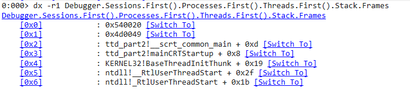
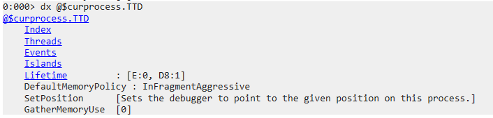
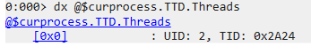

# Part III


벌써 Part 3입니다. 3주마다 시리즈 글 하나씩 블로그에 올리고 있는데 3주가 왜 이렇게 빨리 지나갈까요. 아마 개강도 하고 바빠지니 시간이 참 빠르게 흘러가는 것처럼 느껴지나 봅니다. 이번 Part 3에서는 `dx` 명령어와 TTD data object의 사용법을 정리해봤습니다. Part 2를 읽으신 분들이라면 이게 무엇을 뜻하는지 아시겠죠? 네, 이번에도 버그 바운티를 <s>안 했습니다</s> 못했습니다. Apex Legends 꿀잼 ㅎㅎ;; 사실 버그바운티를 하긴 했는데 막상 "TTD를 사용한 버그 바운티 꿀팁!"이라는 주제로 하나의 글을 쓰기엔 엄청 애매하더라고요. 이미 이전 파트들에서 작성한 내용들이 대부분이고 몇몇 상황들은 글로 형용하기엔 저의 글빨이 딸리고...


그래서 Part 2 마지막에 예고했던 두 가지 글 주제를 Part 3에 몰아 쓰기로 결정했습니다.


## 시간을 여행하는 해커를 위한 안내서 이전 글

1. [Part1](https://hackyboiz.github.io/2021/01/24/fabu1ous/ttd-1/)
2. [Part2](https://hackyboiz.github.io/2021/02/21/fabu1ous/ttd-2/)


# Time Travel Debugging objects

이번 Part 3에선 TTD data model object와 Trace File로부터 TTD data model object를 Query 하는 방법에 대해 알아볼 겁니다. TTD Trace File 사용 시 자동으로 Process Object와 Session Object에 데이터가 로드되며 `dx` 명령어를 통해 그 데이터들을 확인할 수 있습니다.


# dx 명령어

```c
0:000> dx Debugger
```


`dx`는 Debugger Object Model Expression을 출력해주는 명령어입니다. 제가 주로 사용하는 기능 위주로(딱 이 글을 읽는데 필요한 것들만) 설명하겠습니다. 따라서 `dx` 명령어에 대해 추가로 더 알아보고 싶으신 분들은 [ms docs dx]([]())를 읽어보시길 바랍니다.

우선 `dx` 명령어의 파라미터를 알아봅시다. 이번 Part 3에서 앞으로 사용할 파라미터들은 `-g`와 `-r#`이 있습니다.

- -g

  데이터를 그리드로 출력해주는 파라미터입니다. 주로 Heap Object나 Module Object 등을 확인할 때 사용합니다.

- -r#

  최대 `#` 레벨까지 하위 필드를 출력해주는 파라미터입니다. 생략하면 `-r1`이 기본값으로 적용됩니다.

## 사용 예시

- call stack 출력

```c
0:000> dx -r1 Debugger.Sessions.First().Processes.First().Threads.First().Stack.Frames
```



dx를 사용해 디버깅 세션의 첫 번째 프로세스의 첫 번째 쓰레드의 call stack을 `-r1`의 재귀 레벨로 출력한 모습입니다.

- 로드된 모듈 리스트 출력

```c
0:000 > dx -g @$curprocess.Modules
```


Trace 전체에서 로드하는 Module들을 grid 형식으로 출력한 모습입니다.


# Process Object



dx 명령어에 대해 알아봤으니 이제 본격 적으로 TTD data model object에 대해 알아봅시다. 글 초반 부에 언급했듯이 TTD를 사용하면 자동으로 Process object와 Session object에 데이터 모델들이 저장된다고 했었죠? 그중 Process Object입니다.  `@$curprocess.TTD` namespace를 이용해 접근할 수 있습니다.

- Lifetime

  

  TTD range object를 사용해 전체 Trace File의 범위를 보여줍니다. MinPosition은 Trace File의 시작 시점에 해당하는 TTD Position을, MaxPosition은 Trace File의 종료 시점에 해당하는 TTD Position을 뜻합니다.

- Threads

  

  TTD thread object를 사용해 전체 Trace File의 Lifetime에 존재하는 모든 쓰레드들에 대한 정보가 저장되어 있습니다.

- Events

  

  TTD event object들이 저장되어 있습니다. 출력 시 Trace File 전체에서 발생한 여러 이벤트들을 확인할 수 있습니다. 예를 들면 Module의 로드 시점이라던가 Exception 발생 시점이라던가. Part 2에선 이 Event object를 사용해 Exception 위치를 확인하고, 디버깅의 시작 위치를 정하기 위해 사용했었습니다.

  

# Session Object


이번엔 Session Object입니다. `@$cursession.TTD` namespace를 통해 접근할 수 있습니다.

- Data.Heap()

  

  Trace File 전체에서 할당된 Heap object들이 저장되어 있습니다. `Data.Heap()` 메소드와 grid 파라미터를 사용해 출력해줄 주소, 사이즈, 할당 시점, 해제 시점을 한눈에 볼 수 있어 되게 편리합니다. 최근에 버그 바운티를 하면서 힙 오버플로우로 의심되는 버그를 분석 중인데 이 `Data.Heap()` object를 정말 유용하게 사용하고 있습니다.

- Calls()

  

  특정 함수의 호출에 대한 여러 정보를 담고 있는 calls object입니다. `Calls()` 메소드를 통해 호출 횟수, 호출 시점, 리턴 시점, 리턴 값 등의 정보를 볼 수 있습니다. breakpoint의 상위 호환으로 사용이 가능합니다. 어떤 함수에서 버그가 발생하는지 알고 있다면 Calls query를 TimeStart값으로 정렬한 후 맨 마지막 데이터 혹은 crash 발생 시점과 가장 가까운 데이터를 선택해 버그가 발생하는 정확한 시점으로 이동이 가능합니다. 아쉽게도 Calls() 메소드를 사용하려면 해당 함수의 심볼이 살아 있어야 해서 버그 바운티를 할 때 사용하지 못하는 경우도 있습니다.

- Memory()

  

  Memory object를 사용해 특정 메모리 주소에 발생한 모든 접근을 확인할 수 있습니다. 특정 메모리 주소에 접근한 시점, 접근 타입, 당시 프로그램 카운터의 상황 등을 함께 저장하고 있습니다. ba 명령어의 상위 호환으로 사용할 수 있어서 Part 2에서 EBP가 덮어 쓰이는 시점을 찾기 위해 ba 명령어 대신 이 Memory object를 사용할까 고민했었습니다. ba의 경우엔 메모리의 range를 최대 8 bytes까지 지정할 수 있지만 TTD Memory object query는 제한이 없습니다.

  

# Query

TTD data object들의 종류와 그에 맞는 메소드들의 종류를 알아봤습니다. 이제 그 메소드들을 통해 리턴 받은 데이터들을 정렬 및 가공하는 방법을 알아봅시다.

## Sorting Queries

OrderBy() 혹은 OrderByDescending()을 사용해 특정 column을 기준으로 데이터를 정렬할 수 있습니다. 위에서 Calls() 메소드 이야기를 하면서 설명했던 내용인데 crash 시점, 혹은 Trace File의 종료 시점과 가장 가가운 데이터를 선택하기 위해 TimeStart와 OrderByDescending()을 주로 사용합니다.

- OrderBy()

```c
dx @$cursession.TTD.Calls("kernelbase!GetLastError").OrderBy(c => c.TimeStart)
```

TimeStart column으로 오름 차순 정렬을 하는 예제 query입니다. (사실 TimeStart로 오름 차순 정렬하는 건 의미가 없습니다. 이미 정렬 되어 있거든요.)

- OrderByDescending()

```c
dx -r2 @$cursession.TTD.Calls("kernelbase!GetLastError").OrderByDescending(c => c.TimeStart)
```

TimeStart column으로 내림 차순 정렬을 하는 예제 query입니다.

## Specifying elements in query

query에 append 된 element를 특정지어서 출력시킬 수 있습니다. First() 메소드를 사용해 첫 번째 element를 특정 짖거나 대괄호와 index number를 사용해 원하는 element를 특정할 수 있습니다.

```c
dx @$cursession.TTD.Calls("kernelbase!GetLastError").First()
dx @$cursession.TTD.Calls("kernelbase!GetLastError")[0x0]
```

## Filtering in a query

SQL과 비슷하게 Where() 혹은 Select()를 사용해 query를 필터링할 수 있습니다. 아래 예제는 `kernelbase!GetLastError`의 호출중 리턴 값이 0이 아닌 데이터의 TimeStart값과 ReturnValue값을 출력하도록 필터링된 query입니다. Select() 메소드는 각 column의 display name을 지정해 줄 수도 있습니다. 메모리 커럽션 취약점을 찾을 때 string 관련 함수의 size 파라미터와 리턴 값이 다른 호출만 골라 볼 때 사용하기 유용합니다.

```c
dx -r2 @$cursession.TTD.Calls("kernelbase!GetLastError").Where(c => c.ReturnValue != 0).Select(c => new { Time = c.TimeStart, Error = c.ReturnValue })
```

## Assigning query to a variable

특정 query를 변수에 저장한 후 사용할 수 있어서 긴 query를 매번 입력할 필요가 없습니다.

```c
dx -r2 @$myResults = @$cursession.TTD.Calls("kernelbase!GetLastError").Where(c => c.ReturnValue != 0).Select(c => new { Time = c.TimeStart, Error = c.ReturnValue })
```


# 마치며


이걸로 "시간을 여행하는 해커를 위한 안내서" 시리즈가 끝났습니다. 이번에 TTD로 버그 바운티 하면서 느낀 건데 TTD 없으면 더 이상 리버싱을 못하는 몸이 돼버렸습니다. 작년엔 TTD 없이 리버싱을 어떻게 한 거지? 오히려 그때 더 리버싱을 잘했던 거 같기도 합니다. ㅎㅎ;; 아무튼 그만큼 TTD가 좋다!라고 결론 짓도록 하겠습니다. 이젠 진짜 익스 하러 가보겠습니다.