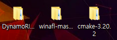
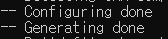
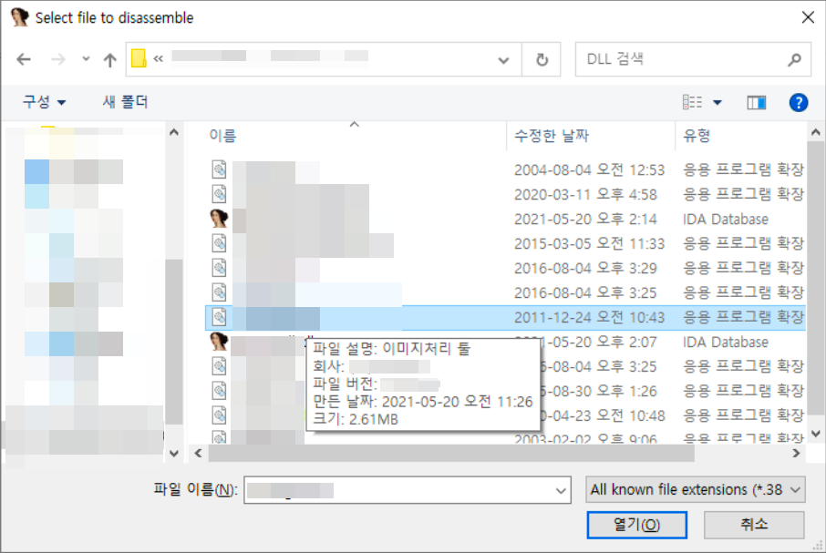
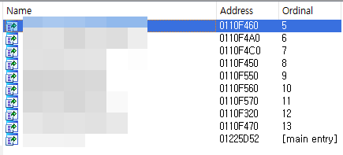

# 머릿말

안녕하세요 Fabu1ous입니다. 최근 버그 바운티 프로젝트를 하면서 WinAFL 사용법을 익히고 있습니다. WinAFL은 프로세스를 종료하지 않고 Harness 프로그램을 통해 특정 함수만을 반복 실행하는 방식을 사용해 빠른 퍼징이 가능합니다. Harness는 수레를 끌 수 있도록 말에게 씌우는 제갈, 말안장, 고삐 등이 합쳐진 기구입니다. ~~한글로는 마구라고 부르는데 마구로 마구 퍼징 하면 크래시가 마구마구 터지나?~~


WinAFL에 대한 간단한 소개와 직접 Harness를 작성해본 과정을 정리해봤습니다. 이번 Part 1에선 처음 Harness를 작성하고 퍼징 해본 과정을, 다음 글인 Part 2에선 Harness의 속도 개선을 위해 삽질한 과정을 써볼까 합니다. 


# WinAFL

AFL(American Fuzzy Lop)은 Coverage-guided 퍼징 툴입니다. Execution path 분석을 통한 넓은 코드 커버리지와 루프 실행을 통한 빠른 속도가 특징입니다. 그리고 이러한 AFL을 Windows에서 사용할 수 있게 변형한 것이 바로 WinAFL입니다.

이번 시리즈에선 WinAFL의 빠른 퍼징 속도에 집중해볼까 합니다. WinAFL의 반복 실행(iteration)은 다른 퍼저 들과 다른 방식을 사용하는데 이는 다음과 같습니다.

1. 타겟 함수에 도달할 때까지 프로그램 실행
2. 코드 커버리지 기록
3. 타겟 함수가 리턴할 때까지 실행
4. 코드 커버리지 회수, input 파일 수정, EIP를 조작해 2번 과정으로 복귀
5. 일정 횟수만큼 반복 실행 후 타겟 프로세스를 종료, 1번부터 다시 시작

여기서 중요한 게 바로 4번 과정, 즉 프로세스를 종료하지 않고 타겟 함수만 반복 실행을 한다는 것입니다. 매번 프로세스를 종료하고 재시작하는데 드는 시간을 절약할 수 있고 타겟 함수와 그 서브 루틴만을 퍼징 하기 때문에 그만큼 빠른 속도를 낼 수 있습니다.


# 환경 설정

기본적인 설명이 끝났으니 직접 사용해봐야겠죠? [WinAFL 공식 깃허브](https://github.com/googleprojectzero/winafl)에 빌드하는 방법이 쓰여있기는 하지만 저는 그걸 보고도 삽 집해서 글로 남겨놓겠습니다. ~~멍청이~~



### 준비물

1. Visual Studio
2. DynamoRIO
3. cmake
4. WinAFL

각각 공식 홈페이지나 깃허브에서 쉽게 구하실 수 있습니다. 설마 여기서부터 막히시는 분은 없으리라 생각합니다. 웬만하면(특히 Visual Studio는) 최신 버전으로 준비해주세요.  


```
mkdir build32
cd build32
cmake -G"Visual Studio 16 2019" -A Win32 .. -DDynamoRIO_DIR=%DynamoRIO경로%\cmake
```

Visual Studio의 command prompt를 관리자 권한으로 실행하고 winafl-master 폴더 내부로 들어가 위 명령어들을 실행해 주시면 됩니다. 저는 32bit짜리 DLL을 퍼징 하기 위해 `x86_x64 Cross Tools Command Prompt`를 사용했습니다. `-DDynamoRIO` 옵션 값에 DynamoRIO 속에 있는 cmake 폴더로 지정해주셔야 합니다.




위 사진과 같이 Configuring done, Generateing done이 출력된다면 빌드 준비가 끝났습니다.

```bash
cmake --build . --config Release
```

이제 위 명령어를 입력해 빌드해주시면 됩니다. 빌드가 잘 되었다면 `%winafl-master%\build32\bin\Release`에 afl-fuzz.exe와 winafl.dll이 있습니다. 실제로 퍼징을 돌릴 때 사용할 친구들이니 꼭 위치를 기억해두세요. git clone 하면서 이미 컴파일된 실행파일도 존재하는데 이것들과 햇갈리시면 안 됩니다.


# Target Function

WinAFL은 프로세스를 종료하지 않고 타겟 함수만을 반복 실행합니다. 아무 함수나 타겟으로 잡고 퍼징을 돌릴 수 있는 것은 아니고 몇 가지 충족해야 할 조건들이 있습니다. 따라서 퍼징에 들어가기 앞서 먼저 타겟 프로그램에 대한 분석을 해야 하고 타겟 함수 선정에 많은 시간을 투자하게 될 수도 있습니다. ~~참 깐깐하내~~

타겟 함수는 다음과 같은 조건을 만족해야 합니다.

1. 함수 내에서 input 파일을 열어야 함
2. 그 파일을 파싱 해야 함
3. 함수 내에서 input 파일을 닫아야 함
4. 리턴까지 정상적으로 실행되어야 함

위 조건을 만족하는 함수를 찾기 위해 제가 사용한 방법을 작성해보겠습니다. 우선 타겟 함수를 찾기 위해선 타겟 프로그램이 어떤 DLL을 사용하는지, 그 DLL의 역할은 무엇인지 대강 알아야 합니다.



마우스 커서를 DLL위에 올려보면 파일 설명, 제조사, 파일 버전 등의 정보를 얻을 수 있고 이는 1차적으로 타겟 DLL을 정하는데 도움이 됩니다. 




적당한 DLL을 찾으셨다면 IDA로 열어서 Exports 테이블 훑어봅시다. 운이 좋다면 External symbol이 살아있는 함수들 중 이름에 File 어쩌고저쩌고하는 함수가 몇 개 있을수도 있습니다. 이름만 보고도 타겟 함수의 자질이 보이는 경우가 있을 텐데 디컴파일한 후 위 조건에 충족하는지 확인해 보시면 됩니다. 저처럼 External symbol이 살아있는 함수가 거의 없고 그마저도 타겟 함수 충족 조건에 만족하지 않는다면


Imports 테이블에서 파일 함수(예를 들면 fopen, wfopen, wfopen_s, fclose 등)를 검색해보시면 됩니다. 이래도 없다면 저는 다른 타겟을 찾아보는데 더 좋은 방법을 알고 계신 분이 있다면 댓글로 남겨주세요. 저는 Imports 테이블에서 해당 DLL이 `MSVCR100!fclose()`를 사용한다는 사실을 알아냈습니다.


그다음 Windbg로 타겟 프로그램을 열어 방금 알아낸 `MSVCR100!fclose()`에 브레이크 포인트를 걸고 어떤 함수가 호출하는지 알아냈습니다. `fclose()`의 실행이 끝나면 `TargetDLL+0xbf62d`로 리턴한다는 사실을 알 수 있고


해당 주소를 아이다로 열어(단축키 g : Jump to address) 함수의 시작 주소를 알 수 있습니다. 디컴파일을 통해 해당 함수의 코드를 분석해본 결과 file open, file parsing, file close 작업이 모두 있었고 따라서 `TargetDLL+0xbf5c0`을 타겟 함수로 정했습니다. 약간의 팁을 드리자면 타겟 함수가 받는 인자가 적으면 적을수록 다음 단계인 Harness 작성이 쉬워집니다. 파일 이름만을 인자로 받는다면 Best!


# Harness

타겟 함수를 정했으니 이제 타겟 DLL을 로드하고 타겟 함수가 필요로 하는 초기 설정을 해주는 Harness 프로그램을 작성해야 합니다. 기본적인 틀은 다음과 같습니다.

1. TargetDLL.dll 로드
2. GetProcAddress()를 호출해 타겟 함수의 주소를 받아옴
3. 타겟 함수 호출

아쉽게도 제가 정한 타겟 함수는 심볼이 죽어있더군요. GetProcAddress()를 사용해 함수 주소를 받아올 수 없으니 다음과 같이 수정했습니다.

1. TargetDll.dll 로드
2. TargetDll.dll의 base 주소 + 타겟 함수의 offset = 타겟 함수 주소
3. 타겟 함수 호출

```c
#include <stdio.h>
#include <windows.h>
#include <iostream>

typedef int (*TARGET)(wchar_t* filename);
TARGET funcPtr;

extern "C" __declspec(dllexport) __declspec(noinline) int fuzzme(wchar_t* path)
{
	int result = funcPtr(path);
	return result;
} // 퍼저에 지정해줄 반복 실행 대상입니다. Extern symbol을 살려두고
	// 컴파일러가 인라인 처리하지 않도록 설정해줍니다.

wchar_t* charToWChar(const char* text)
{
	size_t size = strlen(text) + 1;
	wchar_t* wa = (wchar_t*)malloc(sizeof(wchar_t) * size);
	mbstowcs(wa, text, size);
	return wa;
}

int main(int argc, char* argv[])
{
	SetDllDirectory("..."); // Dll 경로
	HMODULE DLLHandle = LoadLibrary("TargetDll.dll"); // 타겟 DLL
	
	if (DLLHandle == 0)
	{
		printf("Cannot load TargetDll.dll\n");
		return -1;
	}
	
	funcPtr = (TARGET)DLLHandle + 0xbf5c0; // base + offset
	
	printf("0x%x\n", DLLHandle);
	printf("0x%x\n", funcPtr);
	
	int result = fuzzme(funcPtr, charToWChar(argv[1]));
	printf("%d\n", result);
}
```

파일 이름을 `main`의 `argv`로 받아와 `fuzzme`를 거쳐 타겟 함수를 실행하는 Harness 코드입니다. 타겟 DLL이 32bit고 WinAFL도 32bit로 빌드했는데 Harness를 64bit로 컴파일하면 안 되겠죠? 32bit로 컴파일해줍니다.


```
cd %DynamoRIO경로%\bin32
drrun.exe -c "%winafl경로%\\build32\\bin\\Release\\winafl.dll" -debug -target_module harness.exe -coverage_module "%타겟DLL경로%" -target_method fuzzme -fuzz_iterations 10 -nargs 1 -- "%harness경로%" "%파일경로%"
```

이제 작성한 Harness를 디버그 모드로 테스트해볼 시간입니다. DanamoRIO의 bin32 폴더로 들어가 위와 같은 명령어를 통해 Harness가 퍼징에 적합한지 검사할 수 있습니다.


테스트가 끝나면 bin32 폴더에 테스트 로그가 남아있습니다. 위 명령어는 테스트 옵션 중 `iterations`를 10으로 주었으므로 총 10번의 실행이 로그에 남아있어야 하며 "Everything appears to be running normally."라는 로그가 있다면 성공입니다.


# 마구 퍼징하기

```
cd "%winafl-master%경로\build32\bin\Release"
afl-fuzz.exe -i in -o out -D %DynamoRIO경로% -t 10000 -- -coverage_module TargetDll.dll -target_module harness.exe - target_method fuzzme -fuzz_iterations 5000 -nargs 1 -- "%harness경로" @@
```

자! 드디어 퍼징을 할 때가 왔습니다. 빌드한 WinAFL 폴더로 이동한 후 위 명령어를 입력해 퍼징을 시작합니다. WinAFL이 `fuzzme` 함수를 5000번 실행하고 프로세스를 재시작하도록 옵션을 주었습니다.


이렇게 하면 WinAFL은 엄청난 속도로 펒...


# Part 2 예고

3초에 1번 꼴로 타겟이 실행되는 걸 보면 Harness에 큰 하자가 있는 것이 분명합니다. 다음 글에선 이 실행 속도를 개선하기 위해 삽질한 과정을 작성해 오도록 하겠습니다.

