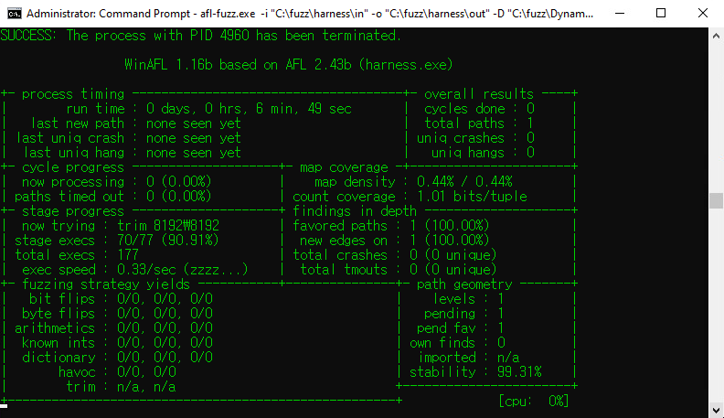

# Part 1 요약


애미야... 실행속도가... 짜다...

[Part 1 보러가기](https://hackyboiz.github.io/2021/05/23/fabu1ous/winafl-1/)


# 루프 쓴다며!



WinAFL은 빠른 퍼징 속도를 자랑한다고 해서 많이 기대했는데 3초에 1번 꼴로 타겟 함수를 실행하고 Total paths도 1인걸 보니 많이 허탈하더군요. 아무리 느려도 BFF 보단 빨라야 하는 거 아닌가라는 생각에 어이가 없어서 뭐가 문제일까 곰곰이 생각하던 중 이상한 걸 발견했습니다.


실행 횟수가 늘어날때마다 PID와 함께 그 프로세스를 종료시켰다는 로그가 출력되더군요. Iteration을 할 때 몇몇 리소스가 여전히 어딘가에서 사용 중이라면 이런 현상이 발생한다고 합니다. 그래서 처음엔 타겟 함수가 child process를 생성하고 종료하지 않아 WinAFL이 대신 종료시키는 거라고 생각했습니다. ProcMon으로 WinAFL의 iteration 하나를 캡쳐하고 화면에 출력되는 PID를 찾아봤더니 child process가 아니라 harness.exe의 PID였습니다.


Part 1에서 WinAFL은 프로세스(Harness.exe)를 종료하지 않고 타겟 함수를 루프로 반복 실행해 빠른 퍼징 속도를 낼 수 있다는 사실을 굉장히 강조했습니다. 물론 Harness를 똑바로 작성했을 때의 이야기입니다. 제가 작성한 Harness처럼 문제가 있다면 오히려 WinAFL의 저런 특징들이 독이 되서 반대로 퍼징 속도가 극악무도하게 느려집니다.


# 그래서 뭐가 문제인가

위에서 언급한 것처럼 iteration을 할 때 몇몇 리소스가 여전히 사용 중이라면 이를 해결하기 위해 WinAFL이 프로세스를 종료합니다. 타겟함수 내에서 input 파일이 제대로 닫히지 않은 것이 문제인 것 같아서 분석해 봤습니다. ( 네, 이때서야 타겟 함수를 분석했습니다. Harness가 똑바로 동작안하는 것도 당연하지... )


타겟 함수에는 2가지 문제점이 있었습니다. 첫 번째, input 파일을 두 번 열고 닫습니다. 타겟 함수는 파일의 손상이 있는지 확인하고 그에 맞는 핸들 번호를 리턴하는데 우선 파일을 열어 파일 시그니쳐를 읽고 검사합니다. 만약 파일 시그니처가 유효하다면 서브 루틴에서 다시 한번 더 파일을 열어 파싱 하고 검사합니다. Part1에서 설명한 대로 타겟 함수가 만족해야 할 조건은 다음과 같습니다.

1. 함수 내에서 input 파일을 열어야 함
2. 그 파일을 파싱 해야 함
3. 함수 내에서 input 파일을 닫아야 함
4. 리턴까지 정상적으로 실행되어야 함

여기서 3번 과정이 중요한데 Harness가 파일을 닫아야 WinAFL이 파일의 내용을 수정할 수 있습니다.

WinAFL이 파일을 mutate 하기 위해 접근하지만 Harness가 다시 사용해 실패하게 되고 강제로 Harness를 종료시키게 됩니다.

두 번째, 처음 파일을 열었을 때 파일 시그니처 "4 byte"만 읽기 때문에 퍼징에 의미 없는 동작입니다. 처음부터 타겟 함수를 조금이라도 분석했으면 이런 문제가 발생하지 않았을 텐데...


# Harness

문제점을 알아냈으니 Harness를 수정해 봅시다. 우선 타겟 함수를 변경했습니다. 기존 타겟 함수 내부에 있던 서브 루틴으로 파일의 아카이브 헤더를 읽어와 파싱 하고 검사합니다. 새로운 타겟 함수는 vtable을 인자로 받아 사용하고 `__thiscall` 호출 규약을 사용하기 때문에 그에 맞게 코드를 수정해 줬습니다.

```c
#include <stdio.h>
#include <windows.h>

typedef int (__thiscall *TARGET)(int* vp, wchar_t* filename);
TARGET target;

typedef int (__thiscall *OPERATE)(int* vp);
OPERATE pre_target;
OPERATE post_target;
OPERATE filecl;

extern "C" __declspec(dllexport) __declspec(noinline) int fuzzme(int* vp, wchar_t* path)
{
	int result = target(vp, path);
	printf("result: %d\\n", result);
	filecl(vp);
	return result;
}

wchar_t* charToWChar(const char* text)
{
	size_t size = strlen(text) + 1;
	wchar_t* wa = (wchar_t*)malloc(sizeof(wchar_t) * size);
	mbstowcs(wa, text, size);
	return wa;
}

int main(int argc, char* argv[])
{
	int vp[32];
	
	SetDllDirectory("..."); // Dll 경로
	HMODULE DLLHandle = LoadLibrary("TargetDll.dll");
	
	if (DLLHandle == 0)
	{
		printf("Cannot load TargetDll.dll\\n");
		return -1;
	}
	printf("0x%x\\n", DLLHandle);
	
	target = (TARGET)DLLHandle + 0x1500;
	filecl = (OPERATE)DLLHandle + 0x16e0;
	pre_target = (OPERATE)DLLHandle + 0x1000;
	post_target = (OPERATE)DLLHandle + 0x10c0;
	
	pre_target(vp);
	int result = fuzzme(vp, charToWChar(argv[1]));
	post_target(vp);
	
	return result;
}
```


프로세스 종료 문제가 사라졌고 초당 90번 정도 실행 속도가 나옵니다. WinAFL은 여전히 느리다고 불평하지만 3초에 1번 실행하던 이전 버전보단 훨씬 괜찮은 거 같습니다. 무엇보다 bff에 비하면 엄청나게 빠른 거라 저는 만족합니다.


# 병렬 처리

코어 갯수만큼 인스턴스를 돌릴 수 있습니다.

```
afl-fuzz.exe -i in -o out -M fuzzer01 -D "%DynamoRIO경로%\\bin32" -t 10000 -- -coverage_module TargetDll.dll -target_module harness.exe -target_method fuzzme -fuzz_iterations 5000 -nargs 2 -- "%harness경로%harness.exe" @@
afl-fuzz.exe -i in -o out -S fuzzer02 -D "%DynamoRIO경로%\\bin32" -t 10000 -- -coverage_module TargetDll.dll -target_module harness.exe -target_method fuzzme -fuzz_iterations 5000 -nargs 2 -- "%harness경로%harness.exe" @@
```


8 코어라서 8개 돌리는 중입니다. 아름답습니다. harness 수정하기 전에는 CPU 40% 정도 쓰던데 지금은 83%~88%를 찍는 거 보니 기분도 좋네요.


# 마치며

음... 뭔가 엄청 길어질 거라 생각해서 Part 2로 나누긴 했는데 아무래도 실제 상용 프로그램을 분석한 내용을 상세하게 적을 수 없기 때문에 글이 많이 짧아진 거 같네요. 글로 보면 짧은데 저의 삽질은 엄청 길었습니다. ㅎㅎ. Harness를 자동으로 생성해주는 winnie-AFL이란 것도 있던데 다음 글은 아마 winnie-AFL에 관한 글이 될 거 같습니다.

