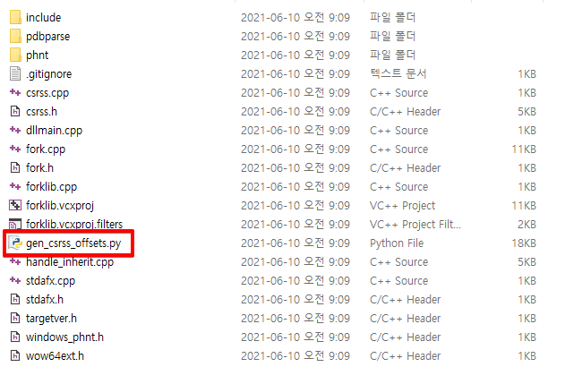
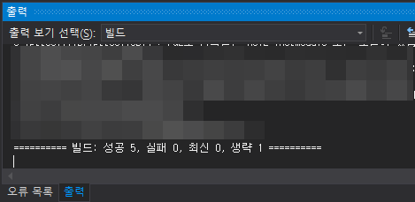
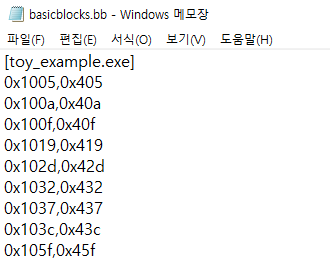

# 머릿말


안녕하세요. Fabu1ous 입니다. 저번엔 Winnie에 대해 설명을 했으니 이번엔 실제로 사용해봅시다. WinAFL을 기반으로 만들어진 퍼저로 code coverage를 늘리기 위해 사용하던 기존 방식인 Intel PT나 DynamoRIO 대신 basic-block breakpoint와 fork를 사용합니다. 따라서 WinAFL과 사용법이 크게 다르진 않지만 사전 작업이 조금 다릅니다. 오늘은 Winnie를 쓰기 위해 해야 하는 사전작업들을 알아보고 Winnie를 실행해봅시다.


# Winnie

[sslab-gatech/winnie](https://github.com/sslab-gatech/winnie)

우선 Winnie 공식 github에 가셔서 다운로드합시다.


# Build

forklib는 unix 계열 OS에서 사용하는 fork()를 windows에 포팅한 라이브러리로

csrss.dll과 ntdll.dll을 리버싱 해 얻은 offset들이 하드 코딩되어있습니다. 따라서 사용자의 시스템에 맞게 컴파일해야 합니다. 필요한 오프셋들을 알아서 파싱 해오는 python 스크립트를 같이 제공하고 있어서 저희는 실행만 해주면 됩니다.



`gen_csrss_offsets.py` 이놈만 실행시켜주시면 됩니다. python 3는 지원하지 않는다고 하니 시스템에 python 2를 설치해야 합니다. 저의 경우 python2.7.13을 사용했습니다.


주의하실 점은 python2-x64를 사용하셔야 합니다. 32-bit용 pyhton 또한 지원하지 않습니다.

python2를 설치하셨다면 아래 명령어를 차래대로 실행해주시면 됩니다.

```bash
python -m pip install --upgrade pip
python -m pip install construct pefile
python ./gen_csrss_offsets.py
```


`csrss_offset.h`를 생성했다는 문구를 확인하셨다면 성공입니다.


생성된 `csrss_offsets.h` 해더 파일에는 사용자의 시스템에 맞는 offset들이 담겨있습니다.


자, 이제 실제로 빌드를 할 차례입니다. FullSpeed.sln 솔루션을 VisualStudio2017 혹은 VisualStudio2019으로 열어 Realease x64 configuration으로 빌드하시면 됩니다. 저는 VisualStudio2019를 사용했습니다.



빌드를 성공적으로 마치셨다면 winnie-master폴더 내부에 x64라는 새로운 폴더가 생성된 것을 확인하실 수 있습니다.


# Ready to Fuzz


Winnie의 깃헙에서 제공하는 Toy example을 통해 winnie의 사용법을 알아봅시다. 우선 `winnie-master/samples/toy_example` 경로로 이동해 `toy_example.sln` 솔루션을 빌드해줍시다.


Release x64로 빌드를 마치셨다면 Toy example 폴더에 x64라는 새로운 폴더가 생성된 것을 확인하실 수 있습니다. 여기서 저희가 사용할 3가지 파일을 복사해 afl-fuzz.exe와 같은 폴더로 옮기시면 됩니다. 그리고 예시 input 파일 또한 제공해 주니 이것도 복사해줍시다.

- example_library.dll : target module이 될 dll입니다.
- harness.dll : winnie에 사용될 harness의 가장 기본적인 예시입니다.
- toy_example.exe : target program이 될 메인 바이너리입니다.


`winnie-master/x64/Release` 경로(이하 working directory)로 이동해 위에서 언급한 세 개의 파일과 예제 input의 복사본을 생성해주시면 됩니다.


저번 Part에서 간략하게 설명했듯이 winnie의 full-speed instrumentation은 basic block단위로 break point를 걸어 coverage를 기록합니다. 따라서 target module의 basic block에 대한 주소들을 요구하는데 이를 담고 있는 파일을 basic-block-file(bb-file)이라 부릅니다. winnie에 포함된 bb.py라는 IDA용 python script를 사용해 bb-file을 생성해 봅시다.


각 모듈을 IDA Pro로 열고 [상단메뉴 > File > Script file...]을 통해 bb.py를 실행시켜 working directory에 basicblocks.bb라는 파일이 생성해주시면 됩니다. 저희의 경우에는 toy_example.exe와 example_library.dll, 총 2개의 모듈에 대한 bb 정보를 획득하면 됩니다. 만약 basicblocks.bb라는 파일이 이미 생성 경로에 존재한다면 덮어쓰는 것이 아니라 기존 내용에 새로운 bb 정보가 추가됩니다.



위 사진은 생성된 bb-file의 일부 모습입니다. 생성된 bb-file에 toy_example.exe와 example_library.dll의 bb 정보가 모두 들어있는 것을 확인하셨다면 퍼징 할 준비는 끝났습니다.


# Fuzzing

```bash
afl-fuzz [AFL 옵션] -- [fullspeed 옵션] -- [fork server 옵션] -- [target argv]
```

Winnie로 퍼징을 시작하는 명령어는 위과 같은 형태입니다. 각각 옵션들은 다음과 같습니다.

- AFL 옵션 : input 및 output 파일 경로, 타임 아웃 설정
- fullspeed 옵션 : fullspeed intrumentation에 필요한 파라미터들(예를 들면 bb-file)
- fork server 옵션 : harness의 경로 지정, fork server의 동작 설정
- target argv : target program 경로 및 아규먼트 설정

```bash
afl-fuzz -i in -o out -t 1000 -I 1000 -- -bbfile basicblocks.bb -- -harness harness.dll -no_minidumps -- toy_example @@
```


# 다음 파트 예고

저번 Winnie Part 1에서 설명한 대로 Winnie는 2개의 단계로 구성되어 있습니다. 기존 퍼저들과 다른 차별점이자 Winnie에서 주목해야 할 점입니다.

1. Semi-automated Harness Generater

   Winnie 또한 WinAFL에서 파생된 fuzzer이므로 Harness 작성이 필요합니다. Winnie를 주제로 글을 쓰기 시작한 이유인 자동 Harness 생성기를 사용해보고 그 동작을 분석해봅시다.

2. Full Speed instrumentation Fuzzing

   Winnie는 fork와 basic-block 단위 breakpoint를 사용하는 full speed instrumentation fuzzing을 사용합니다. 가능하다면 fork의 windows 포팅이 어떻게 구성되었는지 확인해봅시다.