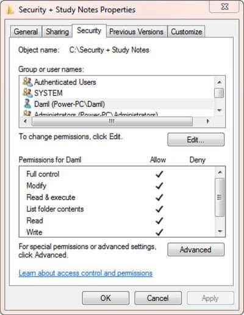
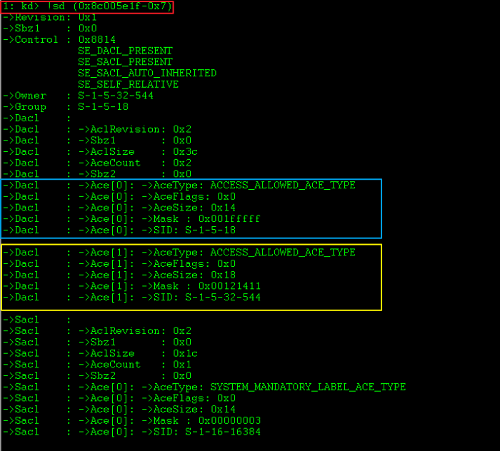
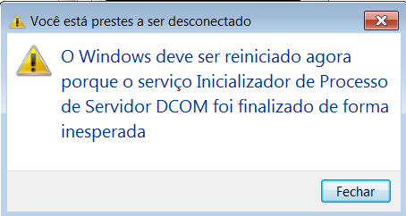
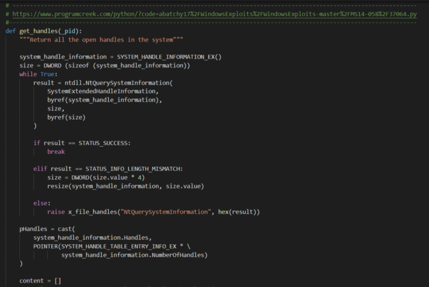
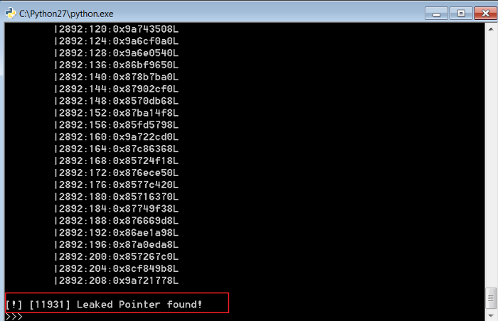
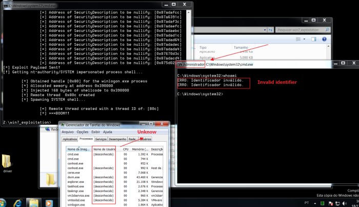

> "Arbitrary Write NULL" 취약점에 "NtQuerySystemInformation"을 활용하는 간단한 방법입니다.

오늘은 "HEVD-(Hacksys Extreme Vulnerable Driver)"를 통해 "LPE - (Local Privilege Escalation : 로컬 권한 상승)을 달성할 수 있는 "NtQuerySystemInformation" 시스템콜 공격 기술을 심도 있게 살펴보려고 합니다.

해당 글에서는 대부분의 취약한 드라이버에서 흔히 등장하는 "Arbitrary Write NULL"(임의 NULL 쓰기) 취약점을 exploit하는 가능성 및 기능적 방법론에 대해서만 설명합니다.

또한, "HEVD IOCTL" 통신을 위한 커널 디버깅 환경 설정 및 설치 과정은 생략합니다. 이 write-up은 최종 스크립트를 작성하기 위해 다른 사람의 영향을 받았음에도 불구하고 제가 어떤 노력을 했는지에 대해 설명합니다. 재밌게 읽어주세요! =)

# Introduction

우선, "Arbitrary Write NULL"이 뭔지에 대해 이야기해 봅시다.

간단한 "cmd.exe"의 "ring3 (user-land)" 세션으로 부터 취약점과 커널의 관점에서 "LPE"를 달성하기 위해 어떤 행위가 가능할까요?

간단하게, "Arbitrary Write NULL"은 "Arbitrary Write" 취약점과 매우 유사합니다. 차이점이 있다면, 전자는 원하는 주소/포인터에 "write→[0x00000000]" 동작이 가능하고, 후자는 "Write-What-Where"라고 명시적으로 정의할 수 있습니다. 즉 "write → [0xdeadbeef]"와 같은 행위가 가능해 "0x00000000" 뿐만 아니라 특정 주소/포인터의 값을 "0xdeadbeef"로 overflow하고 조작할 수 있다는 뜻입니다.

이제 HEVD 드라이버의 취약한 함수를 해부하고 무슨일이 일어나는지 알아봅시다.

# [HEVD]-TriggerWriteNull

HEVD - https://github.com/hacksysteam/HackSysExtremeVulnerableDriver

`TriggerWriteNULL`는 kernel user-buffer를 핸들하고 ring3(user-land)에 있는지 확인하는 함수입니다.

"ifdef SECURE" (물론 아니지만)를 보시면, "probeForWrite()" 함수는 user input buffer가 "ring3"에 위치해 있는지 확인하고 검증합니다. 그게 아니라면 적절한 보안 검사 없이 입력 버퍼를 NULL로 초기화합니다.

주석에 쓰여있드시 "#ifdef SUCURE" bit set이 정의되지 않고 컴파일되면 "[edi]" 레지스터가 "[ebx]"에 의해 "0x00000000"으로 overflow됩니다.

IOCTL drive 연결은 미리 정의되어 있으므로 , 첫 user-buffer의 첫 4 byte "(shellcode_ptr)"에 대해 테스트 해보고 "0x00000000"으로 초기화되는 것을 확인할 수 있습니다.

적절한 주소에 break point를 걸고 실행합니다.

스크립트가 실행되고 break point에 걸리면 "[edi]"가 user-buffer의 주소 "(shellcode_ptr → 0x00500000)"를 담고 있다는 것을 확인할 수 있습니다.

"shellcode"는 "LPE"를 달성하는 "x86 어셈블리" 코드가 담겨있습니다. 첫 "4 bytes"에는 저희 "shellcode"의 시작 부분이 담겨 있다는 것을 알 수 있습니다. 일단 이 사실은 무시하고 "0xa16460cc" 주소를 주목해 봅시다.

이 사진에서 취약점을 확인할 수 있습니다. ebx=0x00000000가 저희 user-buffer eax=0xa16460cc의 값으로 덮어쓰여 지고 있는 게 보입니다.

여기서의 문제는 분명합니다. 단순 사용자 "(ring3)"로서 아무 주소나 제공하면 NULL로 초기화를 할 수 있습니다.

정의된 주소/포인터에 "NULL"을 덮어 쓸 수 있는데, LPE를 달성하기 위해선 어떻게 해야 할까요? DACL과 Security Description를 알아봅시다.

# DACL & Security Description

우선, "DACL"과 "Security Description"이 무엇이고 "Arbitrary Write NULL"을 exploit 하는데 어떻게 쓰일 수 있을까요?

https://networkencyclopedia.com/discretionary-access-control-list-dacl/ 에 의하면

> What is DACL (Discretionary Access Control List)? A DACL stands for Discretionary Access Control List, in Microsoft Windows family, is an internal list attached to an object in Active Directory that specifies which users and groups can access the object and what kinds of operations they can perform on the object. In Windows 2000 and Windows NT, an internal list attached to a file or folder on a volume formatted using the NTFS that has a similar function. How DACL works? In Windows, each object in Active Directory or a local NTFS volume has an attribute called Security Descriptor that stores information about The object’s owner (the security identifier or the owner) and the groups to which the owner belongs. The discretionary access control list (DACL) of the object, which lists the security principals (users, groups, and computers) that have access to the object and their level of access. The system access control list (SACL), which lists the security principals that should trigger audit events when accessing the list

간단하게, "DACL"은 여러 기능을 포함하고 있는데, 그중 하나가 "Security Description" (조금 이따가 깊게 다룰)입니다. 호출을 처리하고 특정 사용자, 그룹 또는 컴퓨터에 대해 허용되는 객체(파일, 프로세스, 쓰레드 등)을 필터링하기 위한 리스트입니다. 이해하기 어렵나요? "Window UI"를 살펴봅시다. =)

아마 이 사진은 좀 익숙하실 겁니다. 위 창에서 다양한 "DACL & Security Description"을 관리할 수 있습니다.

이런게 왜 만들어졌는지는 이해하기 어렵지 않겠죠? 중요한 것은, 사용자가 어떤 권한을 가질 수 있는지를 내부적으로 정의한다는 것입니다. 어떤 객체가 "DACL"의 필터링을 받을까요? "Windows Internals"와 "structs"를 살펴봅시다.

우선, "WinDBG"에서 프로세스 목록을 봅시다.

"WinDBG"에서 windows 프로세스 목록을 살펴보면, 모든 프로세스가 주소값을 빼면, 동일한 패턴은 갖는다는 것을 알 수 있습니다. 위 사진에서 "0x856117c8" 주소는 windows 객체를 나타냅니다. 이 객체는 다음 과 같은 것들을 정의 합니다. (프로세스 이름, 권한, 프로세스 ID, 핸들 등)

지금 저희가 유심히 봐야 할 것은 실제 공격에 사용할 "nt!_OBJECT_HEADER struct"입니다.

nt!_OBJECT_HEADER의 주소를 구합니다.

시스템 프로세스의 header에서 정보를 구합니다.

위 사진에서 볼 수 있드시 "nt!_OBJECT_HEADER struct"를 사용해 프로세스를 해부해 볼수 있고 각 객체가 어디에 위치해 있는지 알 수 있습니다.

여기서 중요한 점은 "nt!_OBJECT_HEADER"는 "nt!_ERPOCESS"로부터의 offset을 보여줍니다.

Security Description에선 어떤 동작이 이뤄질까요?

Security Description "(0x85117b0 + 0x014)"이 "0x8c005e1f"를 가리키고 있다는 것에 주목합니다.

해당 주소는 "DACL & Security Description"과 어떠한 상호작용이 이루어지는데, 우선 "0x8c005e1f" 주소를 좀 더 깊게 살펴봅시다.

WinDBG를 통해 SecurityDescription 주소에 "!sd" 명령어를 사용합시다. 간단한 bit 계산으로 Windows Internals의 동작을 이해할 수 있습니다. 위 사진에서 표시된 값들은 프로세스에 저장된 유저 정보입니다. 아래 DACL 정보와 비교해봅시다.

위 두 사진을 비교해보면, "SYSTEM"과 "DAML" 유저들은 SecurityDescription "(Windows Internals)"와 관련이 있다는 것을 알 수 있습니다. 예시로 (정확하진 않지만) 위 두 값들을 비교하는 법을 알아 봅시다.

일반 유저 권한으로 "ring0 (kernel)" 주소 어디든 NULL로 초기화 할 수 있다는 사실을 기억한채로 SecurityDescription 주소 "(0x865117b0+0x014)"를 "NULL (0x00000000)"로 덮어 쓰면 어떻게 되는지 알아봅시다.

SecurityDescription은 0x8c005e1f을 가리키고 있습니다.

SecurityDescription 포인터를 NULL로 덮어씁니다.

자! 이제 "System.exe (PID:4)" 프로세스는 NULL로 초기화된 SecurityDescriptor 포인터를 갖고 있습니다. 이 상태로 "VM snapshot"을 찍어 봅시다.

혹시나 사진을 이해하지 못하실까봐 설명하자면 "[system]프로세스를 종료하시겠습니까?"라고 써있습니다.

DCOM server 프로세스 런처가 crash 납니다.

> 잠시만, 무슨일이 일어난거죠? [System.exe] 프로세스를 수동으로, 유저 권한으로, 작업관리자에서 종료할 수 있다고?

네! 오직 "nt authority/SYSTEM"만이 해당 프로세스를 종료할 권한을 가지고 있습니다. 하지만 어떻게 일반 유저가 시스템에서 "BSOD"를 발생 시켰을까요? 이 방법은 SYSTEM 프로세스의 SecurityDescription 동작을 NULL로 바꿔버리는 아주 유명한(well-known) exploit 기법입니다. 타겟 프로세스에 권한 bit을 없에 버릴 수 있기 때문에 해당 기법은 권한 상승 exploit에 자주 사용됩니다. 요약하자면, 저희는 WinDBG를 통해 SecurityDescription에 담긴 권한 정보를 모두 지워 "누구나" 프로세스를 쓰고, 읽고, 실행할 수 있게 만들었습니다.

하지만 아직 문제가 남아 있습니다. Exploit을 성공하기 위한 방법은 알겠는데, "ring3 (user-land)"에서 "SYSTEM" 프로세스 객체를 어떻게 식별할 수 있을까요?

위 이미지는 WinDBG를 통해 "ring0 (kernel mode)"에서 나열한 프로세스 목록입니다. 객체가 어디에 있는지, 그 주소를 확인 할 수 있지만 "ring3 (user-land)"에서 해당 값들이 접근과 예측이 불가능하다는 것을 잊어버리면 안됩니다. "Windows 7"부터는 "(Address Space Layout Randomization: ASLR)"라는 주소 랜덤화가 구현되어있기 때문에 정적인 주소로 시도되는 모든 공격은 불가능합니다.

> 그래서 이젠 어쩐다?

# NtQuerySystemInformation - Handle Leaking Attack

전에도 말했드시, 현재 타겟 OS (windows 7)으론 "ring3 (user-land)"에서 exploit하는 것이 불가합니다. 이를 우회할 방법이 없을까요? 답은 바로 "NtQuerySystemInformation WinAPI call"입니다.

"NtQuerySystemInformation"은 설계상 다양한 보안 결함이 있는 사용자 "기능"입니다. "WinAPI call"의 가장 큰 문제점은 user call(undocumented behavior)을 수락하도록 기본적으로 구성되어 있다는 것입니다. 즉,  ring0 정보와 함께 파싱되서 SYSTEM 주소/포인터를 노출하는 일이 발생하기도 한다는 뜻입니다. 공격자는 어떤 포인터가 중요하고 타겟 취약점에 사용될 수 있는지 잘 알 고 있기 때문에 이런 "WinAPI Call"은 메모리 노출 공격에 자주 사용되는 유명한(well-known) 방법입니다.

> 하지만 ring3에서 어떻게 정보를 노출 시키죠?

취약한 기능 호출에 대해 알아보기 전에 우선 "handle"의 정의를 알아보고 왜 주목해야하는지 설명하겠습니다.

https://stackoverflow.com/questions/902967/what-is-a-windows-handle 에 의하면

> It’s an abstract reference value to a resource, often memory or an open file, or a pipe.
>
> *Properly, in Windows, (and generally in computing) a handle is an abstraction which hides a real memory address from the API user, allowing the system to reorganize physical memory transparently to the program. Resolving a handle into a pointer locks the memory, and releasing the handle invalidates the pointer. In this case think of it as an index into a table of pointers… you use the index for the system API calls, and the system can change the pointer in the table at will.*
>
> *Alternatively a real pointer may be given as the handle when the API writer intends that the user of the API be insulated from the specifics of what the address returned points to; in this case it must be considered that what the handle points to may change at any time (from API version to version or even from call to call of the API that returns the handle) — the handle should therefore be treated as simply an opaque value meaningful only to the API.*

요약하자면, "handle"은 운영체제 객체(파일, api, pipe 등) 사이의 통신을 만들고 설정하기 위한 속성들을 담고 있습니다. 이런 handle들은 객체들에 대한 다양한 정보를 담고 있는데 그중 하나가 바로 포인터입니다. 정말 재미있는 점은, "handle"은 포인터를 load하고 "ring3 (user-land)"에서 노출시킬 방법이 있다는 겁니다.

"NtQuerySystemInformation"은 흥미로운 call들을 지우너합니다. 그중 "SystemExtendedHandleInformation"은 다음과 같은 struct를 지원합니다.

SYSTEM_HANDLE_TABLE_ENTRY_INFO

SYSTEM_HANDLE_INFORMATION

해당 struct는 "handle 포인터"를 노출시키는데 도움을 줄 겁니다.

설계상의 결함을 이용해 "ring3 (user-mode)"에서 handle data를 퍼징해보고 무슨 일이 발생하는지 알아봅시다.

handle data를 노출 시키는 코드입니다.

이 부분은 모든 handle을 루프로 돌며 데이터를 수집합니다.

위 스크립트가 ring3에서 PID:4의 포인터를 노출하고 있습니다.

보시다시피 일반 유저로도 포인터와 데이터를 노출 시킬 수 있습니다. 혹시 기억하시나요? 이 포인터들은 "프로세스 객체"와 아주 밀접한 관계입니다.

찾았습니다! 하지만 아직 문제가 남아 있습니다. "ASLR"이 동작하고 있다는 가정하에 "프로세스 객체" 포인터가 포함된 주소를 예측하기 위해 어떤 주소, PID 및 Handle 값이 올바른지 어떻게 알 수 있을까요?

이 질문의 답은: "저도 모릅니다. 하지만 방법은 있어요!"

쓸만한 포인터를 가지고 있는 프로세스의 handle을 NULL로 초기화 한다면 crash가 발생하겠죠. 이 방법을 여러번 반복해서 "lsass.exe PID"를 정의했습니다. 하지만 무작정 handle을 NULL로 초기화하면 운영체제가 crash나고 재부팅될 수 있으므로 이 방법을 실제로 활용하는 것은 권장하지 않습니다.

"lsass.exe"의 handle만을 필터링하도록 코드를 수정해줍니다.

"SYSTEM 프로세스"에 "누구나" 접근할 수 있는 상황을 만들었다면, 이젠 타겟 시스템 프로세스에 "Shellcode Injection"을 할 차례입니다.

"nt authority/SYSTEM cmd.exe shell"을 획득했습니다. crash가 발생하지 않았고 이슈없이 모든 프로세스가 잘 동작하고 있습니다.

> *Final Exploit link:https://github.com/w4fz5uck5/3XPL01t5/tree/master/OSEE_Training/HEVD_exploits/windowsx86/[HEVD]-WriteNULL References:https://github.com/hacksysteam/HackSysExtremeVulnerableDriver/blob/master/Driver/HEVD/Windows/HackSysExtremeVulnerableDriver.h https://github.com/daem0nc0re/HEVD-CSharpKernelPwn/blob/master/HEVD_Win7x86/WriteNull/Program.cs http://bprint.rewolf.pl/bprint/?p=1683 https://github.com/ZecOps/CVE-2020–0796-LPE-POC/blob/master/poc.py https://www.trustwave.com/en-us/resources/blogs/spiderlabs-blog/windows-debugging-and-exploiting-part-4-ntquerysysteminformation/*

