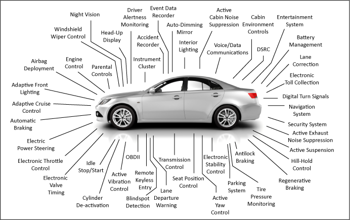

### CAN(Controller Area Network) 통신

차량 내에서 호스트 컴퓨터 없이 마이크로 컨트롤러나 장치들이 서로 통신하기 위해 설계된 표준 통신 규격입니다. 초기에 차량용 네트워크 시스템으로 개발되었지만, 최근에는 차량뿐만 아니라 산업용 자동화 기기나 의료용 장비에서도 종종 사용되고 있습니다. 

차량 내의 **ECU(Electoric Control Unit)**들은 CAN을 이용하여 통신합니다. CAN의 장점은 ECU들 간의 통신을 위해 단일 인터페이스를 제공한다는 점입니다. 이는 자동차 내부 네트워크의 복잡도와 비용을 줄일 수 있어 경제적입니다.

CAN 네트워크는 브로드캐스트(Broadcast) 방식으로 동작하기 때문에, 메시지를 전송할 때에는 네트워크 내부에 있는 모든 디바이스에게 메시지를 전송합니다. 만약 두 개의 노드가 동시에 메시지를 전송하는 경우에는 충돌이 일어날 가능성이 있습니다. 그렇기 때문에 각각의 ECU는 고유의 ID를 가지며, 고유의 ID가 낮을수록 우선 순위가 더 높습니다. 한편 CAN은 고온, 충격, 진동 등 노이즈가 심한 환경에서도 안정적으로 동작하는 장점을 가지고 있다고 합니다.

한편 CAN은 구조적으로 공격에 취약하다는 특징이 있는데, 이는 CAN이 설계 당시에 보안을 고려하여 만들어지지 않았기 때문입니다. 대표적으로 도청(Eavesdropping), 서비스 거부 공격(DoS), 데이터 삽입 공격(Data insertion)에 취약하다고 알려져 있습니다.

### ECU(Electoric Control Unit)

자동차의 엔진, 자동변속기, 파워핸들, 스마트키 등 자동차의 다양한 하위 시스템을 제어하는 전자 제어 장치를 의미합니다. 각각의 ECU들은 차량에 부착된 센서로부터 정보를 받아들여 스스로 판단하고 제어하는 역할을 합니다. 

