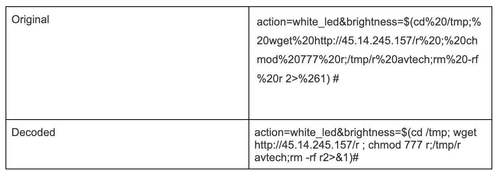
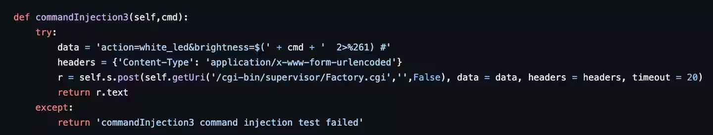
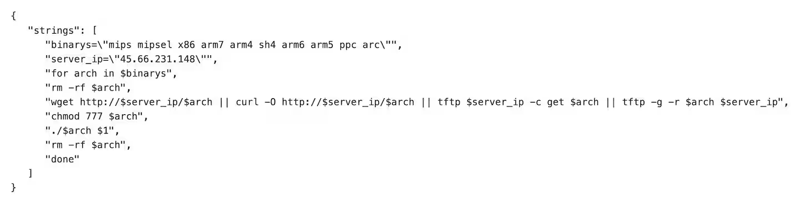
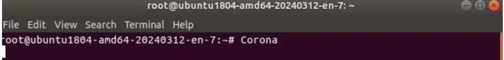

## URL

- https://www.akamai.com/blog/security-research/2024-corona-mirai-botnet-infects-zero-day-sirt

## Target

- AVTECH IP camera AVM1203 펌웨어 <= FullImg-1023-1007-1011-1009 

## Explain

해당 취약점은 Akamai SIRT 팀에 의해 발견된 취약점으로, 글로벗 허니팟 네트워크를 통해 발견된 제로데이 취약점입니다. 이 취약점은 AVTECH IP 카메라의 밝기 기능을 통해 원격 코드 실행을 가능하게 하며, 이를 통해 [Mirai](https://www.cloudflare.com/ko-kr/learning/ddos/glossary/mirai-botnet/) 변종을 퍼뜨릴 수 있게 합니다.

취약점은 `brightness` 변수에 삽입된 문자열이 command에 삽입되어 실행되기 때문에 발생합니다. 아래 그림과 같이 공격자는 해당 변수에 공격 코드를 삽입할 수 있습니다.

> Exploit 페이로드와 디코딩된 문자열

취약점이 존재하는 소스코드는 /cgi-bin/supervisor/Factory.cgi 파일에 존재합니다. Akamai SIRT 팀은 이를 이용해서 아래 그림과 같이 PoC 코드를 구성했습니다. 

> 취약점의 PoC 코드

비교적 간단한 취약점이지만, 공격자는 이 취약점을 이용해 아래 그림과 같이 JavaScript 다운로더를 실행시켜 Mirai 악성코드의 변종을 퍼뜨리고 있습니다. 

> JavaScript 다운로더

악성코드가 실행될 경우 Telnet을 이용해 포트 23, 2323, 37215에 연결하고  Corona 라는 문자열을 콘솔에 출력하는데, 이는 Corona Mirai 악성코드의 변종일 가능성이 높다고 합니다.

> 악성코드 감염 시 Corona 문자열 출력

## Reference

- https://nvd.nist.gov/vuln/detail/cve-2024-7029