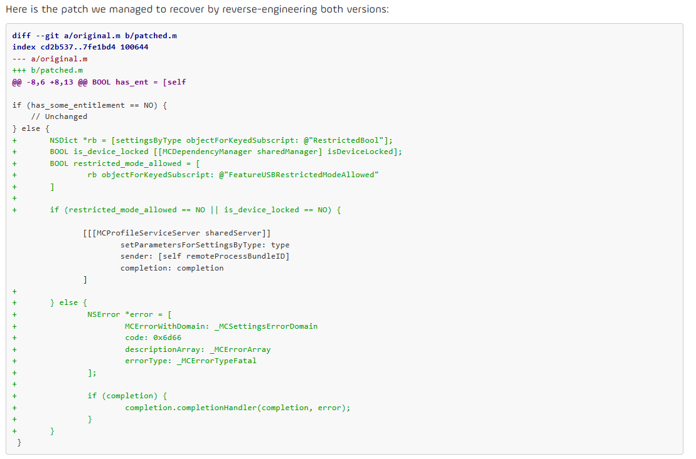
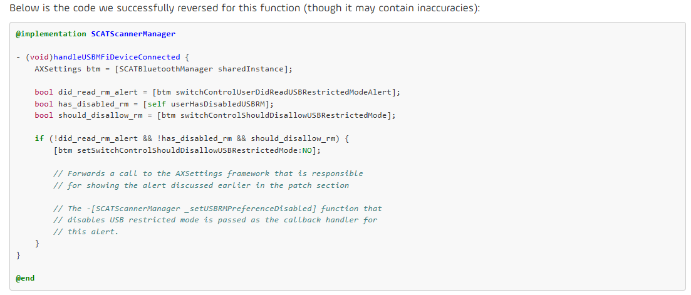
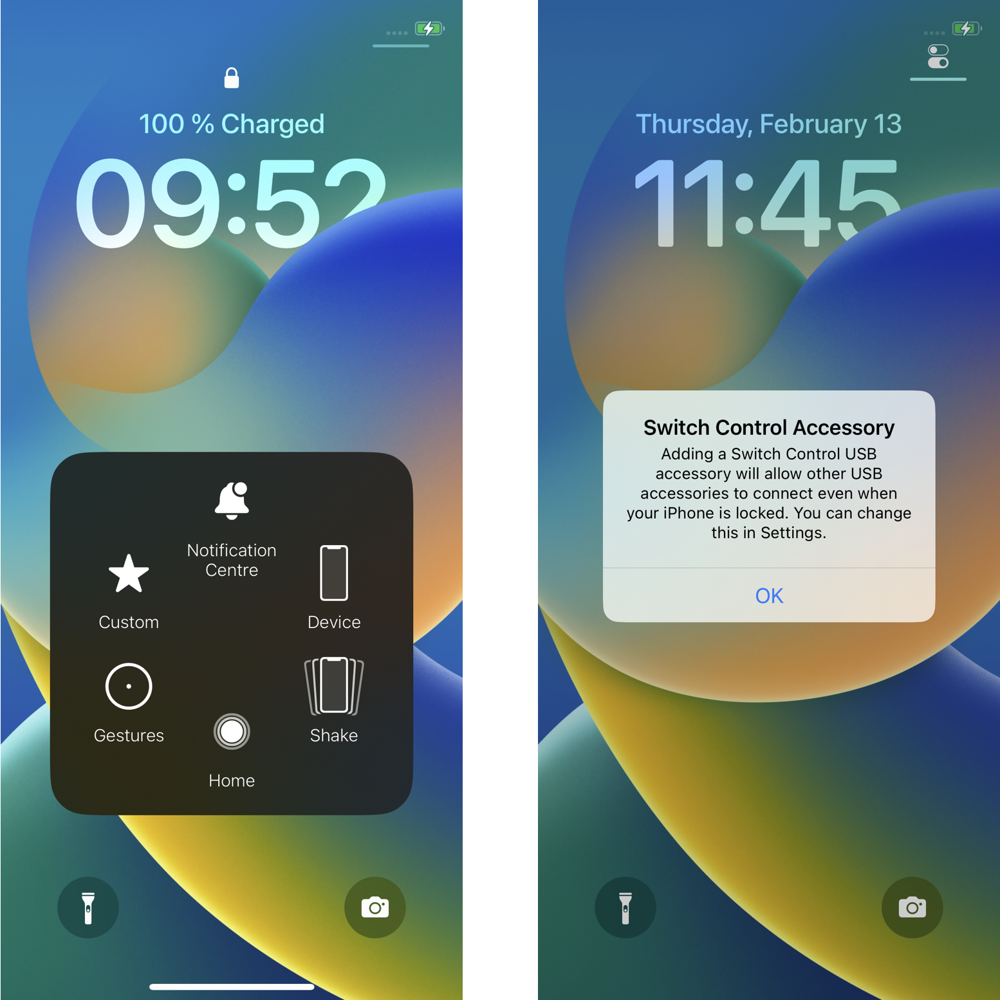

## URL

- https://blog.quarkslab.com/first-analysis-of-apples-usb-restricted-mode-bypass-cve-2025-24200.html

## Target

- iOS 18.3.1 and iPadOS 18.3.1 이하 버전

## Explain

**USB restricted mode란?**

USB restricted mode는 iOS 11.4.1에서 도입된 보안 기능으로, 장치가 잠긴 상태에서 1시간 이상 경과하면 데이터 포트(라이트닝 포트)를 통한 연결을 차단합니다. 이는 Cellebrite나 GrayKey와 같은 포렌식 도구를 사용한 무단 데이터 추출을 방지하기 위한 것입니다.

**취약점 분석**

CVE-2025-24200은 Apple의 접근성 프레임워크에서 발견된 인증 문제로, Citizen Lab의 Bill Marczak에 의해 보고되었습니다. 이 취약점은 잠긴 장치에서 USB restricted mode를 우회할 수 있게 하며, Apple은 이 문제가 특정 개인을 대상으로 한 매우 정교한 공격에서 악용되었을 수 있음을 인정했습니다.

Quarkslab의 분석에 따르면, 이번 패치에서 변경된 점은 아래와 같다고 합니다. `setParametersForSettingsByType` 호출 직전 `restriced_mode_allowed` 조건을 한 번 더 검증해 취약점 발생을 막은 것으로 보입니다.

Quarkslab은 `assistivetouchd`의 `_setUSBRMPreferenceDisabled` 함수를 attack vector로 파악하고 있습니다. 이 함수는 USB restricted mode를 비활성화할 수 있는 코드를 포함합니다.

해당 함수는 `handleUSBMFiDeviceConnected`에서 호출되는데, MFi (Made for iPhone certified) 인증을 받은 기기를 연결하기만 하면 함수가 실행됩니다.

실제로 그들이 `frida`를 이용해 `handleUSBMFiDeviceConnected` 함수를 실행시켰을 때, 아래 사진과 같은 팝업이 나왔으며, OK 버튼을 누르면 USB restricted mode가 해제되었다고 합니다.

