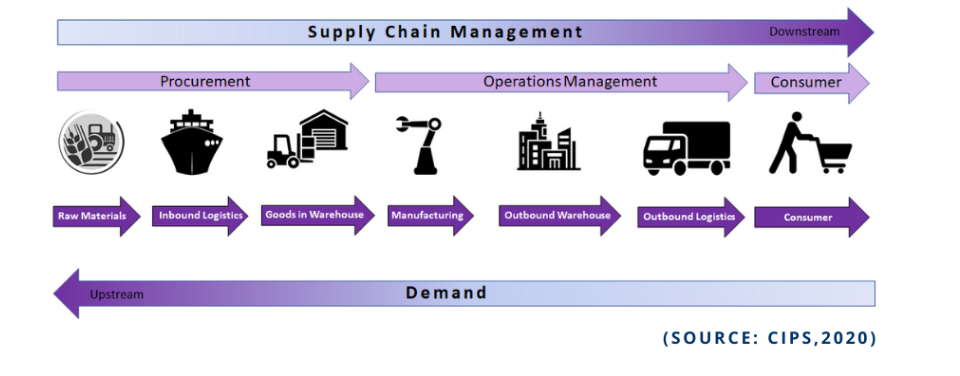

**공급망 공격(Supply Chain Attack)**이란 공급망을 구성하는 프로세스 전반에서 발생하는 공격입니다. 공급망(Supply Chain)이란, 제품이나 서비스가 소비자에게 도달하기 관련된 모든 조직, 사람 등의 시스템을 의미합니다.

공급망 공격에서, 공격자는 공급망의 가장 약한 지점을 공격하지만 그 영향력은 전체 소비자에게 전달됩니다. 공급망 공격의 패턴은 크게 하드웨어, 소프트웨어, 펌웨어, 시스템 정보 및 데이터로 나눌 수 있습니다. (MITRE, Supply Chain Attack Framework and Attack Patterns)

대표적인 공급망 공격의 사례로는 솔라윈즈(SolarWinds) 사건이 있습니다. 솔라윈즈의 Orion이라는 소프트웨어를 대상으로 하여, 해커가 소프트웨어 업데이트에 악성코드를 포함시켜, 정상적인 소프트웨어 업데이트 과정에서 악성코드가 유포된 사건입니다. 미국의 상무부, 재무부 등 정부기관은 물론 200곳 이상의 기관 및 기업에 피해를 입었다고 알려져 있습니다.