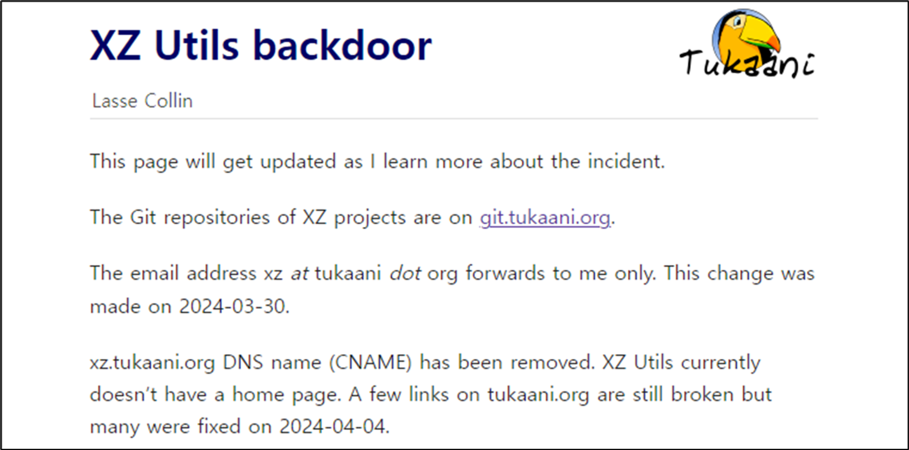
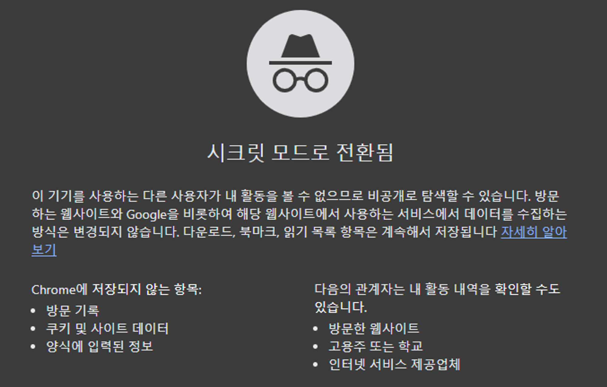
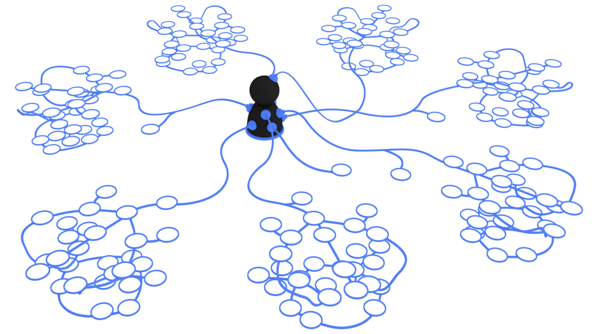
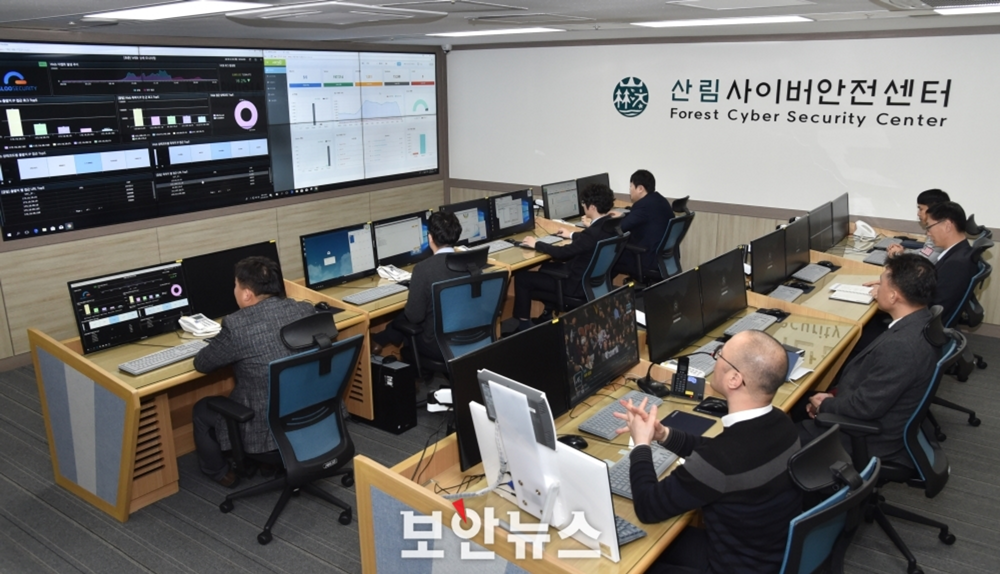
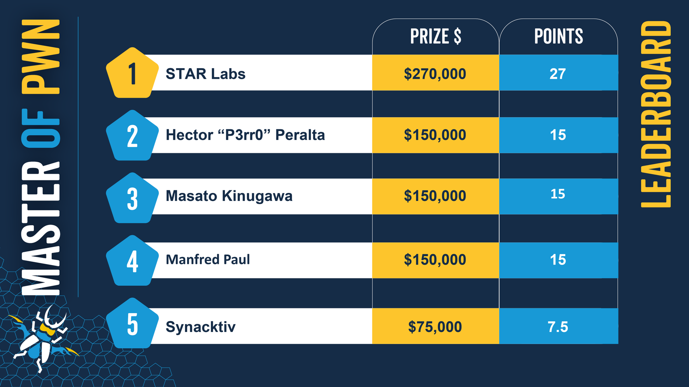

안녕하세요! hunjison 입니다.

요새 날이 많이 따뜻해졌어요. 이런 날씨에는 창문 열고 잔잔한 노래 들으면서 해킹 공부하는게 최고죠 😋
오늘도 해킹짹짹 시작해 볼게요 🐤

## **이번 주 짹짹 PICK🐥**

> 🔒 XZ Utils 백도어 악성코드, 2021년부터 공들여 준비해온 공급망 공격이었다

2024-04-01 | 보안뉴스 | [기사보기](https://m.boannews.com/html/detail.html?idx=128372) 

리눅스 및 GNU 운영체제에서 이용되는 압축 프로그램 XZ Utils에서 [백도어](#짹짹-TALK)가 발견되었습니다! 

공격자는 2021년부터 Github에서 평판을 쌓았고, 프로젝트 정식 참여 인원이 된 이후, XZ 소스코드에 [SSH](#짹짹-TALK) 우회 백도어를 삽입한 것으로 알려졌습니다. 이번 공격은 한 단계 진화된 형태의 [공급망 공격](#짹짹-TALK)이라는 점에서 눈여겨볼 필요가 있겠네요!

## 
> ⚠️ 구글, *시크릿 모드* 통해 몰래 수집한 데이터 삭제하기로 합의

2024-04-01 | Time | [기사보기](https://time.com/6962521/google-incognito-lawsuit-data-settlement/)

구글이 '시크릿 모드'를 통해 사용자 동의 없이 수집한 수백만 건의 데이터를 삭제하기로 합의했습니다‼️ 2020년에 제기된 이 사건은, 원고들이 50억 달러의 손해 배상을 요구하는 집단 소송을 요구하면서 확대되었는데요. 이번 합의를 통해 개인은 구글을 상대로 직접 손해배상을 청구할 수 있게 되었다고 하네요😎

## 
> ⚠️ VPN 앱 다운로드, 스마트폰을 악성 프록시로 바꿔 버린다?!

2024-04-01 | MalwareBytes | [기사보기](https://www.malwarebytes.com/blog/news/2024/04/free-vpn-apps-turn-android-phones-into-criminal-proxies)

Google Play에서 다운로드 가능한 [VPN](#짹짹-TALK) 앱이, 사용자의 기기를 [프록시 서버](#짹짹-TALK)로 악용할 수 있다고 합니다😱 해당 앱들은 사용자의 동의 없이 프록시 서버로 동작해 공격자의 요청을 전송하는 통로가 될 수 있다고 하네요. 총 28개의 앱이 발견되었으며, 그 중에서 17개는 무료 VPN 앱이라고 하니 VPN 앱 설치에 주의해야 할 것 같습니다🚨

## 
> 🗣 미국과 영국, 최초로 인공지능 안전 협약 체결

2024-04-02 | BBC | [기사보기](https://www.bbc.com/news/technology-68675654)

미국과 영국이 AI 안전성 테스트에 대해 합의서에 서명했습니다. 합의의 내용은 AI 모델의 위험 테스트 방법에 관한 것이라고 알려졌는데, AI 모델의 안전성에 대해 세계 최초로 이루어진 합의라고 합니다 🙌 

## 
> 🗣 산림청 '산림사이버안전센터'를 아시나요?

2024-04-04 | 보안뉴스 | [기사보기](https://m.boannews.com/html/detail.html?tab_type=1&idx=128523) 

산림과 사이버안전, 꽤 낯선 조합처럼 느껴지는데요. 이번 식목일을 맞아 '산림사이버안전센터'에 대한 소개 뉴스를 가져와 보았습니다😊 산림사이버안전센터가 어떤 일을 하는지 궁금하시다면, 링크를 통해 확인해보시길 바래요!

## 짹짹이에게 물어봐  

**백도어(Backdoor)**

시스템에 불법적으로 접근할 목적으로 정상적인 인증 절차를 우회하거나 무효화하는 악성코드 유형

**SSH(Secure Shell)**

네트워크 상의 다른 컴퓨터에 로그인하거나 원격 시스템에서 명령을 실행하고 다른 시스템으로 파일을 복사할 수 있도록 해 주는 응용 프로그램 또는 그 프로토콜

**공급망 공격(Supply Chain Attack)**

공격자가 기업의 소프트웨어 설치 및 업데이트 배포 과정에 침입해 정상 소프트웨어인 것처럼 꾸민 악성 소프트웨어를 사용자 기기에 설치하는 방식 ([자세히 보기](https://m.boannews.com/html/detail.html?idx=122516))

**VPN(Virtual Private Network)**

인터넷을 통해 만들어진 사설 통신망으로, 일반적으로 사생활 보호를 위해 사용됨 

**프록시 서버(Proxy Server)**

클라이언트와 서버 사이에서 데이터를 전달해 주는 서버

## 지식 PLUS ➕

**Pwn2Own**은 세계적으로 유명한 해킹 대회 중 하나로, **널리 사용되는 기기나 프로그램들의 새로운 취약점(0-day)을 공개하며 경쟁하는 대회**입니다. 올해 3월에 개최된 Pwn2Own Vancouver 2024에서는 약 29개의 취약점이 시연되었으며, 무려 15억의 금액이 지급되었다고 하네요**😲**. 취약점이 공개된 대상은 Tesla Model 3, Google Chrome, Microsoft Windows, VMware ESXi 등 입니다. 한국에서도 *Seunghun Lee*와 *Theori*가 각각 3위 4위를 차지했다고 하니 많이 축하해주세요🎉

## 짹짹 TALK

제 8회 Zer0Con 여의도 개최 | [바로 보기](https://www.dailysecu.com/news/articleView.html?idxno=154657)

이더리움 창시자가 판교에? | [바로 보기](https://www.hankyung.com/article/2024033190877)

NIST 취약점 DB 관리 어려움 호소 | [바로 보기](https://boannews.com/media/view.asp?idx=128491&page=6&kind=1)

두나무, 티오리와 웹3 보안 인재 양성한다 | [바로 보기](https://www.econovill.com/news/articleView.html?idxno=651139)

사이버보안 기업 '시큐레터' 상장 7개월만 거래정지 | [바로 보기](https://m.boannews.com/html/detail.html?idx=128602&kind=&sub_kind=)

사이버보안 기업 '루브릭' 상장 추진 | [바로 보기](https://www.digitaltoday.co.kr/news/articleView.html?idxno=511738)

해커 이종호, "한국, 마음 먹으면 다 뚫려" | [바로 보기](https://www.hankyung.com/article/202404049502i)

웨어러블 360도 카메라 '링크플로우', 115억 시리즈 C 투자유치 | [바로 보기](https://news.mt.co.kr/mtview.php?no=2024040411060469126)