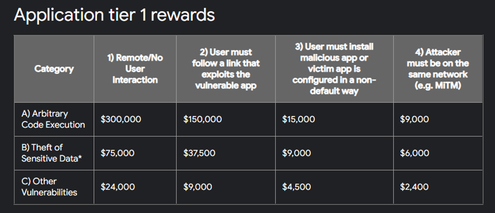
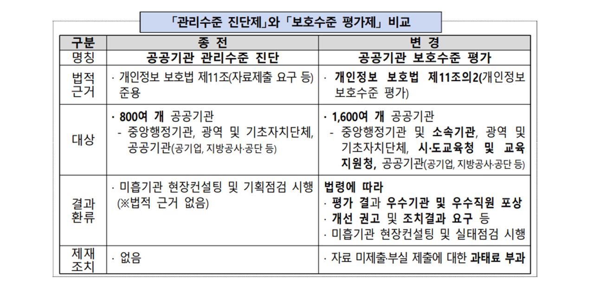
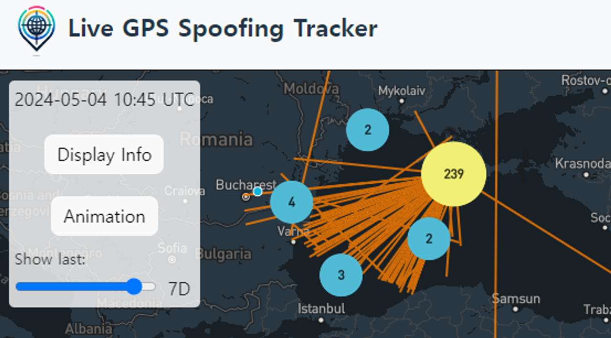
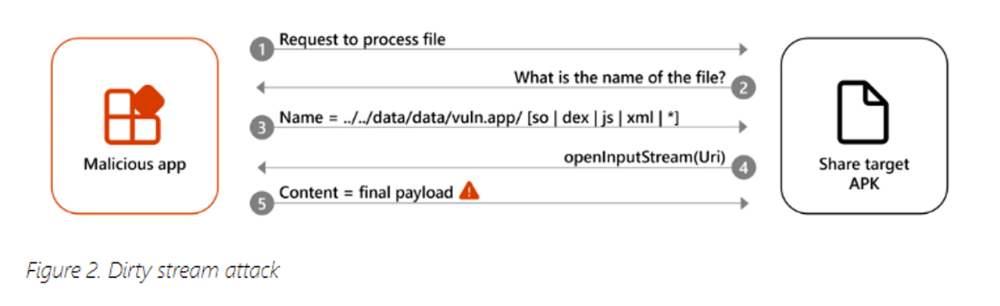

안녕하세요, hunjison입니다! 

이번 주에도 따끈따끈한 사이버 보안 소식과 함께 돌아왔습니다 ⭐

구글의 버그바운티 금액 10배 증가, 야후 보이즈 범죄자들 소식 등 흥미로운 소식이 많으니, 항상 뉴스레터 콘텐츠 기대 많이 해주세요! 😍

## **이번 주 짹짹 PICK🐥**

> 🗣 Google은 이제 일부 Android 앱의 RCE 버그에 대해 최대 450,000달러를 지불합니다.

2024.04.30 | bleepingcomputer | [기사보기](https://www.bleepingcomputer.com/news/security/google-now-pays-up-to-450-000-for-rce-bugs-in-some-android-apps/)

Google이 Android 앱에서 [원격 코드 실행(Remote Code Execution)](#짹짹-TALK) 취약점을 신고할 경우 지급하는 [버그바운티](#짹짹-TALK) 포상금을 무려 10배 늘렸다고 합니다. 기존 최대 30,000 달러 였던 포상금을 최대 300,000 달러까지 늘리고, 보고서가 뛰어날 경우 1.5 배의 상금을 지급하겠다고 한 것인데요. 최대 450,000 달러(약 6억원)까지 지급된다니 대단하네요! 😯

Google은 자사에서 개발하는 앱의 취약점을 찾아내기 위해 작년 5월 Mobile VRP(Vulnerability Rewards Program)을 시작했는데, 아래와 같은 앱들이 프로그램의 대상이라고 합니다.

- Google Play Services (com.google.android.gms)
- AGSA (com.google.android.googlequicksearchbox)
- Google Chrome (com.android.chrome)
- Google Cloud (com.google.android.apps.cloudconsole)
- Gmail (com.google.android.gm)
- Chrome Remote Desktop (com.google.chromeremotedesktop)

상금을 대폭 확대했으니 여러분도 도전해 보시는건 어떨까요?

## 
> ⚠️ 범죄를 숨기려고 하지도 않는 `Yahoo Boys` 범죄자들

2024.05.03 | wired | [기사보기](https://www.wired.com/story/yahoo-boys-scammers-facebook-telegram-tiktok-youtube/)

작년 한 해 서구 영어권 국가의 10대들이 나이지리아에 기반을 둔 사이버 범죄자들이 수행하는 성착취 기반 금전 탈취 공격에 표적이 되는 사건이 급증하였습니다 😫 이들은 Yahoo의 이메일을 사용하여 야후 보이즈(Yahoo boys)라고 불리는데요.

최근 야후 보이즈들은 회원 수가 약 20만 명에 달하는 Facebook 그룹 16개, WhatsApp 채널 12개, Telegram 채널 10개, TikTok 계정 20개, Youtuve 계정 12개 등 공개 SNS를 이용해 다른 회원들에게 사기 방법을 공유한다고 합니다. 

사기치는 방법을 당당하게 공개한다니,,,, 무언가 조치가 필요해 보이네요 😨

## 
> 🗣 공공기관 개인정보 유출사고 없도록 `보호수준 평가제` 시행

2024.04.30 | 연합뉴스 | [기사보기](https://www.yna.co.kr/view/AKR20240429044600530)

개인정보보호위원회는 공공기관 1,600여 개을 대상으로 '2024년 개인정보 보호수준 평가제'를 시행한다고 밝혔습니다. 기존 실행되던 '관리 수준 진단제'에 비해 한층 강화된 평가 체계로, 정당한 사유 없이 자료를 내지 않거나 허위로 제출한 공공기관에 과태료 부과하고 조치 결과 보고서를 요구할 수 있게 된다고 하네요!

최근 공공기관에서 개인정보 유출 사고가 꾸준히 발생하고 있어 이러한 흐름에 관심가질 필요가 있겠습니다 🤠

## 
> ⚠️ 수천 대의 비행기와 선박이 직면한 GPS jamming 및 spoofing 공격

2024.04.30 | wired | [기사보기](https://www.wired.com/story/the-dangerous-rise-of-gps-attacks/)

최근 GPS 시스템에 대한 공격이 지속적으로 이루어지고 있다고 합니다! 실제로 Finnair 항공사는 GPS 간섭으로 인해 항공기 두 대가 공항 착륙을 중단하고 회항하는 사건이 있었다고 하네요 😡

공격에는 크게 2가지 형태가 있다고 하는데, 바로 GPS 재밍과 GPS 스푸핑 공격이 있다고 합니다. GPS 재밍은 다량의 전파 신호를 보내 GPS 시스템을 사용 불가능하게 만드는 것이고, GPS 스푸핑은 원본 신호를 가짜 신호로 변경하는 공격이라고 하네요.

[링크](https://spoofing.skai-data-services.com/)에서 실시간 스푸핑 지도를 확인할 수 있는데, 공격이 상상 이상으로 확대되고 있는걸 볼 수 있어요 💥

## 
> ⚠️ 마이크로소프트, 안드로이드 앱에 영향을 미치는 `더티 스트림(Dirty Stream)` 공격 경고

2024.05.02 | bleepingcomputers | [기사보기](https://www.bleepingcomputer.com/news/security/microsoft-warns-of-dirty-stream-attack-impacting-android-apps/#google_vignette)

Microsoft는 악성 안드로이드 앱이 다른 애플리케이션의 홈 디렉터리에 있는 파일을 덮어쓰도록 허용하여 잠재적으로 임의 코드 실행 및 비밀 도용으로 이어질 수 있는 "**더티 스트림(Dirty Stream)**"라는 새로운 공격을 발견했습니다. 

더티 스트림 공격을 이용하면 악성 앱이 조작된 `intent`을 이용해 파일 이름이나 경로를 조작해 다른 앱의 디렉터리에 파일을 실행하거나 저장할 수 있다고 하는데요 🧐 

현재 더티 스트림 공격에 노출된 것으로 알려진 앱은 Xiaomi's File Manager (10억 다운로드)와 WPS Office(5억 다운로드)라고 하니 어마어마하네요 😮

## 짹짹이에게 물어봐  

**버그 바운티 (Bug Bounty)**

기업의 소프트웨어, 서비스 등에서 보안 취약점을 발견하여 최초로 신고한 해커에게 포상금을 지급하는 취약점 보상 프로그램

**원격 코드 실행 (Remote Code Execution, RCE)**

공격자가 원격으로 조직의 컴퓨터나 네트워크에서 임의의 명령어를 실행할 수 있는 공격. RCE 공격은 취약한 소프트웨어 혹은 서비스에 조작된 파일 혹은 명령어를 주입했을 때, 소프트웨어가 오동작하여 시스템에 명령어를 실행하게 됨

## 지식 PLUS ➕

- [위협 환경 탐색: 노출 관리, 침투 테스트, 레드팀 구성 및 RBVM 이해](https://thehackernews.com/2024/04/navigating-threat-landscape.html)
- [Notepad++ 기본 플러그인 악용한 위키로더 악성코드 유포](https://m.boannews.com/html/detail.html?idx=129305&kind=)
- [비트코인 포렌식 분석으로 자금세탁 클러스터 및 범죄수익 발견](https://thehackernews.com/2024/05/bitcoin-forensic-analysis-uncovers.html)
- [샌즈랩, 100억 규모 사이버 보안 특화 생성형 AI 연구개발 사업 수주](https://boannews.com/media/view.asp?idx=129555&page=2&kind=3)
- [NFT 기반 가상자산 엔터버튼 해킹 및 토큰 도난 사고 발생](https://boannews.com/media/view.asp?idx=129492&page=3&kind=1)
- [Dropbox, 모든 사용자에게 영향을 미치는 디지털 서명 서비스 침해 사실 공개](https://thehackernews.com/2024/05/dropbox-discloses-breach-of-digital.html)
- [본격 시행되는 국가정보원 보안기능 시험제도 톺아보기](https://boannews.com/media/view.asp?idx=129447)
- [KAIST-네이버-인텔, AI 반도체 신 생태계 조성 공동 협력](https://boannews.com/media/view.asp?idx=129463&page=5&kind=2)

## 5월 채용 및 대외활동 소식 TALK

- [2024년 5월 물리·정보보안 기업은 어떤 인재 찾고 있나](https://boannews.com/media/view.asp?idx=129432&page=6&kind=3)
- [KISIA, 2024년 '시큐리티 아카데미' 4기 교육생 모집](https://boannews.com/media/view.asp?idx=129509&page=4&kind=2)
- [정부, 데이터 분석 'S급' 인재 키운다](https://boannews.com/media/view.asp?idx=129526&page=1&kind=2)
- 차세대 보안리더 양성 프로그램(Best of the Best) 13기 모집(~5/28)
- DFIR 연구팀 'F-Active' 신규 팀원 모집(~5/6)