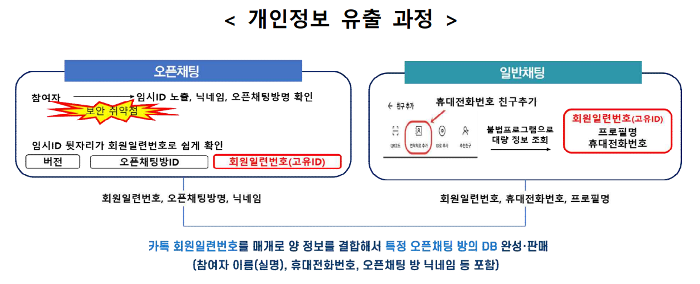
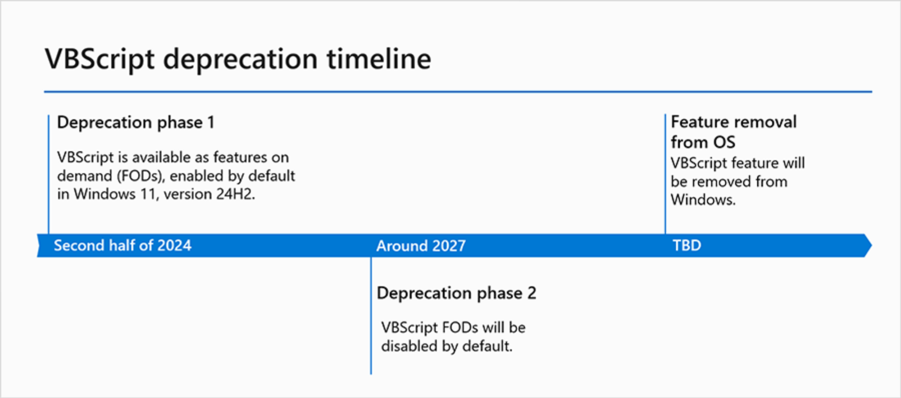
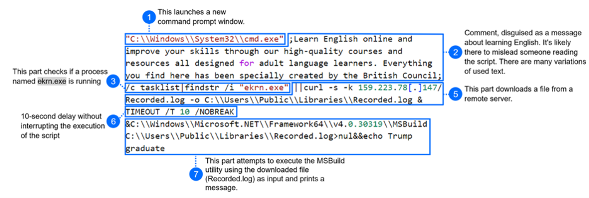

안녕하세요, hunjison 입니다 🤠

카카오 개인정보 유출 사건부터 JAVS 공급망 공격까지 이번 주에도 따끈한 보안 뉴스를 가지고 왔어요! 

최근 보안 트렌드를 놓치지 않고 싶다면 매주 월요일, 해킹짹짹을 기대해주세요 🐾

## 이번 주 짹짹 PICK🐥

> 🗣️ **개인정보 유출한 카카오에 '과징금 151억'... 역대 최대 금액**

2024.05.23 | 보안뉴스 | [기사보기](https://m.boannews.com/html/detail.html?tab_type=1&idx=130023)

카카오톡 오픈채팅에서 발생한 개인정보 유출 사건에 무려 151억 4,196 만원의 과징금이 부여되었어요! 👀

개인정보위원회는 지난 3월 '카카오톡 오픈채팅 이용자 개인정보가 불법 거래되고 있다'는 언론 보도에 따라 개인정보 보호법 위반 여부를 조사했는데요. 조사한 결과 **사용자를 고유하게 식별할 수 있는 회원일련번호가 노출**되었고, 이를 통해 해커가 불법 프로그램으로 개인정보를 유출했다고 해요 😡

이번 과징금 부여는 **국내 기업 중에서 역대 최고 금액**이라고 하네요. 일부 개발자 커뮤니티에서는 공개된 API를 통해 이용자 정보 추출이 가능하다는 점이 알려져 있었음에도, 카카오는 이러한 내용에 대해 올바르게 검토하지 않았던 점도 밝혀졌어요. 

다만 카카오는 "개인정보위에 적극적으로 소명했으나 이 같은 결과가 나오게 되어 매우 아쉽다"며 "행정소송을 포함한 다양한 조치 및 대응을 검토할 예정"이라고 입장을 밝혔습니다. 개인정보 이슈가 나날이 주목 받는 것 같으니 관심 있으시다면 [링크](https://korea.kr/briefing/policyBriefingView.do?newsId=156632079&pWise=sub&pWiseSub=C1)를 한 번 살펴보시길 바래요! 👌

## 
> 🗣️ **Microsoft, VBScript 지원 중단 계획 발표**

2024.05.22 | Microsoft | [기사보기](https://techcommunity.microsoft.com/t5/windows-it-pro-blog/vbscript-deprecation-timelines-and-next-steps/ba-p/4148301)

Microsoft가 2024년 하반기부터 VBScript를 지원 중단하기 위한 계획을 발표했어요!

VBScript는 1996년 Microsoft에서 개발한 스크립트 언어로, Windows 기반 시스템에서 작업을 자동화하거나 응용 프로그램을 제어하는 데에 사용되었어요. VBScript는 ILOVEYOU, Code Red, Emotet 등의 악성 코드에 이용되었으며 [RAT](#짹짹-TALK), [다운로더](#짹짹-TALK), [웜](#짹짹-TALK)과 같이 여러 종류의 악성 코드에서도 이용되었습니다 😨

다만 VBScript가 바로 사라지는 것은 아니에요! 2024년 하반기 Windows 11에서 VBScript는 선택 기능(Feature on Demand)으로 제공되며, 기본적으로 활성화된다고 해요. 2027년이 되어야 VBScript가 기본으로 활성화되지 않는다고 하니 아직은 VBScript를 이용한 악성코드가 더 이용될 것 같아요 😈

## 
> ⚠️ **카카오톡, 1년 새 장애 '6번', 장애 발생 이유는?**

2024.05.21 | 조선비즈 | [기사보기](https://biz.chosun.com/it-science/ict/2024/05/21/7FZSY5SMDNHZXCYZOYK2FIK6RE/)

"이거 왜 이래? 카카오톡 나만 안 되는 거야?"

최근 발생한 카카오톡 접속 오류, 혹시 느끼셨나요? 지난 13일, 20일, 21일에 연속으로 카카오톡이 로그인되지 않거나 메시지 송수신이 원활하지 않는 등 서비스 장애가 빈번하다는 지적이 나오고 있어요 🔨

전문가들은 이에 대해 카카오톡에 다양한 기능이 늘어나면서 늘어난 데이터 처리량을 감당하지 못해 서버 장애가 발생하는 것으로 평가했는데요. 최근 인스타그램 '스토리'와 유사한 '펑' 기능을 추가하고, AI를 이용해 대화 요약이나 말투 변경 등의 기능이 계속해서 추가되고 있는 것이 이러한 기능 중에 하나로 보입니다. 

카카오톡은 전 국민이 이용하는 모바일 메신저이니만큼, 이러한 서비스 장애가 반복되지 않도록 올바른 조치가 필요할 것 같아요! 🙉

## 
> ⚠️ **군과 정부를 대상으로 하는 중국 해킹 조직 "Unfading Sea Haze**

2024.05.22 | Bitdefender | [기사보기](https://www.bitdefender.com/blog/businessinsights/deep-dive-into-unfading-sea-haze-a-new-threat-actor-in-the-south-china-sea/)

'Unfading Sea Haze'라는 해킹 단체가 새롭게 발견되었어요!

중국 정부로부터 지원 받는 것으로 추정되는 이 단체는 남중국해/서필리핀해 인근의 군대 및 정부 기관을 표적으로 삼고 있다고 해요. 특히 [TTPs](#짹짹-TALK)라고 불리는 해커의 공격 방식이나 해커가 사용한 도구들이 잘 알려진 해킹 조직인 APT41과 유사하다고 해요.🤔

이 단체의 공격 기법은 문서로 위장한 바로가기(LNK) 파일이 포함된 악성 압축(ZIP) 파일을 메일로 전달하는 [스피어 피싱](#짹짹-TALK) 이메일로 시작됩니다. 이후 Microsoft의 MSBuild 프로그램을 이용해 [파일리스 공격](#짹짹-TALK)을 수행한다고 하네요!

이외에도 다양한 공격 기법이 해당 문서에 잘 정리되어 있으니, 한 번 읽어보시길 바래요 😁

## 
> ⚠️ **법조계 SW인 JAVS, 공급망 공격에 당했다**

2024.05.23 | rapid7 | [기사보기](https://www.rapid7.com/blog/post/2024/05/23/cve-2024-4978-backdoored-justice-av-solutions-viewer-software-used-in-apparent-supply-chain-attack/)

법정용 녹화 솔루션을 제공하는 JAVS가 [공급망 공격](#짹짹-TALK)에 노출되었어요! JAVS 공식 웹사이트에 악성 바이너리가 포함된 소프트웨어가 업로드 되어 있었다고 해요 😫😫

S2W Talon 그룹이 이를 처음 [식별](https://x.com/S2W_Official/status/1775041190335070497)했고, Rapid7에서는 JAVS에 포함된 fffmpeg.exe라는 바이너리가 기존에 공개된 GateDoor/Rustdoor 악성코드와 관련되어 있음을 발견했다고 해요. 이번 공급망 공격은 [CVE-2024-4978](https://nvd.nist.gov/vuln/detail/CVE-2024-4978)으로 지정되었어요.

JAVS는 법정, 재판실, 배심원실, 감옥, 교도소 시설 등에서 사용되고 전 세계적으로 10,000개 이상의 기관에서 설치했다고 하니, 더 늦기 전에 발견되어 다행이에요!😲

## 짹짹이에게 물어봐   

**RAT(Remote Access Trojan)**

공격자가 감염된 컴퓨터를 원격으로 제어할 수 있도록 설계된 악성 코드

**다운로더(Downloader)**

다른 악성 코드를 다운로드할 목적으로 존재하는 악성 코드

**웜(Worm)**

독립적으로 실행되는 악의적인 소프트웨어로, 스스로를 복제하고 다른 컴퓨터로 확산됨

**TTPs**

전략(Tactics), 전술(Techniques), 과정(Procedures)의 약자로 공격자들의 행위 전반을 나타내는 표현

**스피어 피싱(Spear-Phishing)**

특정 개인 또는 회사를 표적으로 하는 고도의 맞춤 사이버 공격

**파일리스(Fileless) 악성코드**

피해자 컴퓨터 시스템에 파일로 저장되지 않고, 메모리나 레지스트리와 같은 시스템 자원을 이용하여 실행되는 악성 코드

**공급망 공격(Supply chain attack)**

공격자가 기업의 소프트웨어 설치 및 업데이트 배포 과정에 침입해 정상 소프트웨어인 것처럼 꾸민 악성 소프트웨어를 사용자 기기에 설치하는 방식

## 지식 PLUS ➕

[Chaining N-days to Compromise All: Part 6 — Windows Kernel LPE: Get SYSTEM](https://medium.com/@vr-blog/chaining-n-days-to-compromise-all-part-6-windows-kernel-lpe-get-system-83cd756ce90a)

[MS, PC에서 일어난 모든 것 기억하는 '리콜' 출시...AI PC 탑재 앱 공개](https://www.aitimes.com/news/articleView.html?idxno=159857&fbclid=IwZXh0bgNhZW0CMTEAAR2pnRHdifo4Ou9lo97jcbdgNUXguwgaJYlvITLFA0ZdXQv4OTcXGLJRyvo_aem_AaMJc6kj_iH2J9E0v-0YojrxHXdyk5ZyTGOvHnLj38fY8_4FkFZMtnsAwAAj7lNttaatBsTyjSDIf3rPQ_J57XAB)

[DevOps Dilemma: How Can CISOs Regain Control in the Age of Speed?](https://thehackernews.com/2024/05/devops-dilemma-how-can-cisos-regain.html)

[산업부, 첨단산업 석박사 고급인재 2,000명 양성 착수](https://m.boannews.com/html/detail.html?tab_type=1&idx=129922)

## **5월 교육** 🐥

[BoB 13기 교육생 모집](https://www.kitribob.kr/board/detail/1/9079?current_page=1&per_page=15&st=subject&q=#) | KITRI | 2024.05.28까지 접수