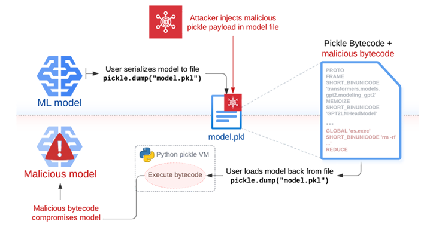
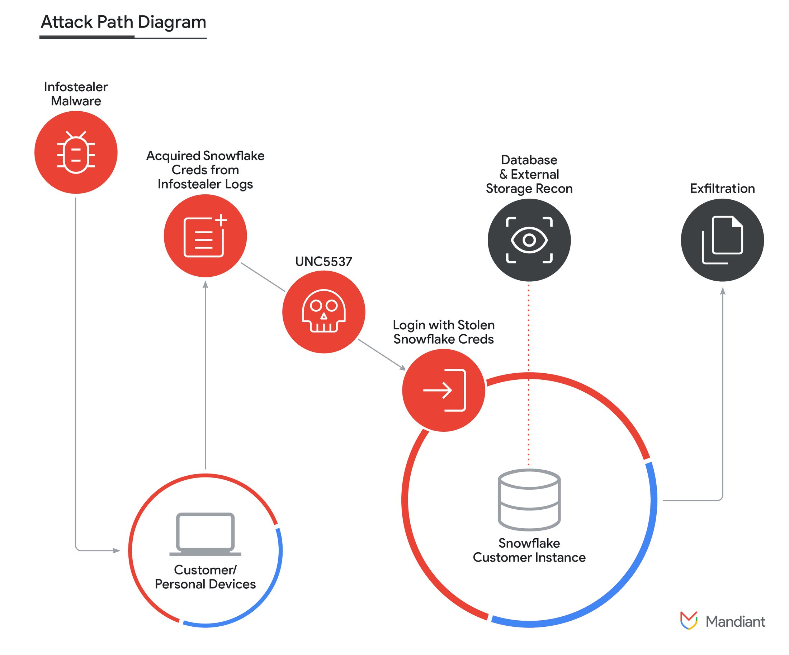

안녕하세요, hunjison 입니다!

사이버 보안 인력이 부족하다는 말… 여기 저기에서 많이 들어보셨죠? 👀 그런데 정작 주변을 보면 취업하기가 쉽지 않은 것 같아요…. 😱

**"사이버 보안 인력이 부족하다는 건 거짓말이다"**는 칼럼과 함께 이번 주 뉴스레터도 흥미로운 이야기들을 담아 보았어요 💥

## 이번 주 짹짹 PICK🐥

> 🗣️ **사이버 보안 인력이 부족하다는 건 거짓말이다**

2024.06.11 | 보안뉴스 | [기사보기](https://boannews.com/media/view.asp?idx=130004&page=5&kind=3)

*온라인 칼럼에 개인적인 의견을 덧붙여 작성한 글입니다.

**"사이버 보안 인력이 부족하다…"** 기업들이 늘 하는 말입니다. 그런데 정작 취준생들은 **온갖 자격증, 학벌, 프로젝트를 가지고도 취업이 잘 되지 않는다**고 하소연하는데, 어떻게 된 일일까요? 😱

해당 칼럼은 SailPoint CISO Rex Booth가 작성한 칼럼입니다. 그는 기업들이 '보안 전문가'를 찾을 때 자격증이나 학위를 여럿 가지고 있으면서 수년 간의 경험을 가진 사람을 찾는다고 말합니다. 자격증과 학위를 가진 소수의 인원, 소위 '우수한 보안 인력'을 두고 기업과 헤드헌터들이 서로 경쟁한다는 것이죠.

문제는 이렇게 우수한 인력과 우수하지 않은 인력, 즉 흑백논리로 사람을 가르는 데에 있습니다. 애초에 기준이 너무 높으니 초심자들이 접근하려 하지 않는다는 것이죠. 보안 전문가가 될 가능성이 있는 수많은 인재들이 '보안 전문가'의 높은 벽을 느끼고 다른 분야로 빠져 나가는 중입니다. 제 주변에서도 '탈(脫) 보안이 답이다'라며 개발이나 IT 분야로 전향한 사람이 심심치 않게 보입니다 😧

이러한 상황을 마주한 우리는, 안타깝지만 기업의 눈높이에 맞춰 준비해 나갈 수 밖에 없습니다. 역설적이게도 자격증과 학위가, 조금 더 넓게 '그럴 듯해 보이는 무언가'가 이력서에 필요하다는 이야기입니다. 대학생들이 참여할 수 있는 연합 동아리([KUCIS](https://kisia.or.kr/talent_support/kucis_info/), CCA 등) 혹은 대외 활동(BoB 등)들이 그러한 역할을 해 주고 있습니다.

충분한 가능성과 능력이 있는 '보안 뉴비'들이 가능성을 충분히 인정 받고 더 나은 환경에서 근무할 수 있는 여건이 마련되었으면 좋겠다는 이상적인 생각을 해봅니다 😥

## 
> ⚠️ **머신러닝 모델을 직접 공격하는 Sleepy Pickle 공격 기법**

2024.06.13 | TheHackerNews | [기사보기](https://thehackernews.com/2024/06/new-attack-technique-sleepy-pickle.html)

머신러닝 모델을 직접적으로 공격할 수 있는 공격 기법이 등장했어요! 😝

Pickle은 PyTorch와 같은 머신러닝 라이브러리에서 자주 사용되는 데이터 직렬화(Serialization) 형식이에요. 데이터 직렬화란 데이터 구조를 다른 컴퓨터에 사용할 수 있는 형식으로 변환하는 과정을 의미해요. 

'Sleepy Pickle'이라고 불리는 이 공격 기법은 보통의 공격처럼 머신러닝이 수행되는 시스템을 공격하는 것이 아니라, **머신러닝 모델 자체를 표적**으로 삼는다는 점에서 은밀하고(Stealthy) 기발한 공격 기법이라고 하네요! 💯

공격자는 [Fickling](https://github.com/trailofbits/fickling)과 같은 오픈 소스 도구를 이용해 피클 파일에 페이로드를 삽입할 수 있고, 피해자가 해당 피클 파일을 [역직렬화(Deserialization)](#짹짹이에게-물어봐)하면 페이로드가 실행되어 1) 모델이 수정되거나, 2) 출력을 제어하거나, 3) 처리된 데이터를 사용자에게 반환하기 전에 변조할 수 있다고 하네요 ☠️

[Hugging Face](#짹짹이에게-물어봐)와 같은 오픈 소스 플랫폼에서 머신러닝 모델을 다운로드할 때에도 신뢰할 수 있는 소스에서 다운로드하는 것이 맞는지 주의해야겠네요 🤨

## 
> ⚠️ **스노우플레이크 고객을 대상으로 한 UNC5537의 대규모 데이터 탈취 공격**

2024.06.11 | Google | [기사보기](https://cloud.google.com/blog/topics/threat-intelligence/unc5537-snowflake-data-theft-extortion?hl=en)

UNC5537이라는 공격 단체가 스노우플레이크 고객 계정을 체계적으로 침해하여 민감한 데이터를 탈취하고 있다고 해요 😡

스노우플레이크(Snowflake)는 클라우드 기반의 데이터 웨어하우스(Data Warehouse) 플랫폼으로, 데이터 저장/분석/공유/처리 기능을 제공합니다. 스노우플레이는 AWS, Azure, GCP 등 다양한 클라우드 인프라에서 운영될 수 있고, 다양한 산업 분야에서 대규모 데이터 분석 및 처리를 가능하게 합니다. 쉽게 말해 많은 데이터가 모여 있는 시스템이라고 이해하면 되겠죠? 

공격자들은 정보 탈취 악성코드(Infostealer)를 통해 획득한 고객 개인 정보를 이용해 스노우플레이크 계정에 접근했고, 실제 피해를 당한 고객은 [다중 인증(Multi-Factor Authentication)](#짹짹이에게-물어봐)이 활성화되지 않은 것으로 확인됐다고 해요.

만약 내 정보가 유출되어서, 나 때문에 회사의 빅데이터 정보가 모두 유출된다면 생각만 해도 끔찍할 것 같아요. 🥵 회사 계정과 개인 계정의 비밀번호를 다르게 하고, 정기적으로 악성코드가 감염되지 않았는지 확인해야 할 것 같아요.

## 
> ⚠️ **개인정보위, AI 응용서비스 SKT에이닷·스노우·DeepL·뷰노 사전 실태점검 결과는?**

2024.06.13 | 보안뉴스 | [기사보기](https://boannews.com/media/view.asp?idx=130576&page=2&kind=2)

개인정보보호위원회에서 AI 기반 응용서비스를 제공하고 있는 SKT, 스노우, DeepL, 뷰노 4개 사업자에 대해 사전 실태점검 결과를 발표했다고 해요! 👀 점검 결과 SKT와 스노우는 시정 및 개선권고를 받았고, DeepL과 뷰노는 별도의 제재 사항이 없었다고 하네요 😍

SKT의 AI 개인비서 서비스 '에이닷'은 통화 녹음 파일을 SKT 서버에서 텍스트로 변환하여 저장하는데, 텍스트 파일 보관 시스템에 접속 기록이 보관되지 않은 사실이 발견되어 시정 권고가 내려졌어요. 🔨 

스노우는 특정 기능을 제공하기 위해 이미지를 서버로 전송해 사용·처리함에도 개인정보 처리방침에는 이용자가 알기 어려운 형태로 안내하고 있어 시정 권고가 내려졌어요. 👽

AI가 시대적인 트렌드로 자리 잡으면서 기업들이 앞다퉈 AI 기반 서비스를 출시하고 있어요. 이런 흐름 속에서 우리의 소중한 개인정보가 서비스 내에서 어떻게 처리되는지 사전에 점검하는 것이 상당히 중요한 것 같아요.

개인정보 분야는 앞으로 더 많은 관심을 받게 될 것 같아요! 여러분도 주목해주세요 ❣️

## 짹짹이에게 물어봐   

**데이터 직렬화(Serialization)**

데이터 구조를 다른 컴퓨터에 사용할 수 있는 형식으로 변환하는 과정. 예를 들어 클래스나 오브젝트를 바이너리 형태로 저장할 수 있게 변환할 수 있음

**데이터 역직렬화(Deserialization)**

직렬화된 데이터를 컴퓨터에서 사용할 수 있도록 변환하는 과정. 예를 들어 바이너리 형태의 데이터를 클래스나 오브젝트로 변환할 수 있음

**Hugging Face**

인공지능(AI)과 머신러닝(ML)과 관련된 오픈 소스 소프트웨어 및 인공지능(AI) 모델을 제공하는 오픈소스 커뮤니티

**다중 인증(Multi-Factor Authentication)**

사용자에게 암호 이외의 추가 정보를 입력하도록 요구하는 다중 단계 계정 로그인 과정

## 지식 PLUS ➕

[2024년 6월 셋째 주, LH·카카오페이·비바리퍼블리카 등 정보보안 인력 채용](https://boannews.com/media/view.asp?idx=130512&page=4&kind=3)

[New phishing toolkit uses PWAs to steal login credentials](https://www.bleepingcomputer.com/news/security/new-phishing-toolkit-uses-pwas-to-steal-login-credentials/)

[확장된 보안 분석 기법 ‘위협 헌팅’ , 선제적 대응방식으로 주목](https://boannews.com/media/view.asp?idx=130570&page=2&kind=5)

[YouTube is currently experimenting with server-side ad injection](https://www.reddit.com/r/privacy/comments/1de8ofk/youtube_is_currently_experimenting_with/)

## **6월 컨퍼런스 | 대회** 🐥

[사이버보안컨퍼런스](https://e.chosunbiz.com/tc-events/2024-%ec%82%ac%ec%9d%b4%eb%b2%84%eb%b3%b4%ec%95%88%ec%bd%98%ed%8d%bc%eb%9f%b0%ec%8a%a4/?preview=true) | 조선비즈 | 2024.06.20

[AI 아이디어랩](https://www.xn--ai-h41ir8ydiaw0lto5awzac9ida382tyjj.com/) | 코드게이트 | ~ 2024.06.30 접수

[제10회 대학생 프로그래밍 경진대회](https://research.samsung.com/scpc) | 삼성전자 | ~ 24.07.04

[암호분석경진대회](https://cryptocontest.kr/challenge/) | 한국정보보호학회 | ~24.08.31 

[금융권 보안 취약점 신고포상제 (버그바운티)](https://www.fsec.or.kr/bbs/1014) | 금융보안원 | ~24.08.31

[금융보안아카데미 2기](https://www.fsec.or.kr/bbs/detail?menuNo=66&bbsNo=11489) | 금융보안원 | ~ 24.06.17 접수
