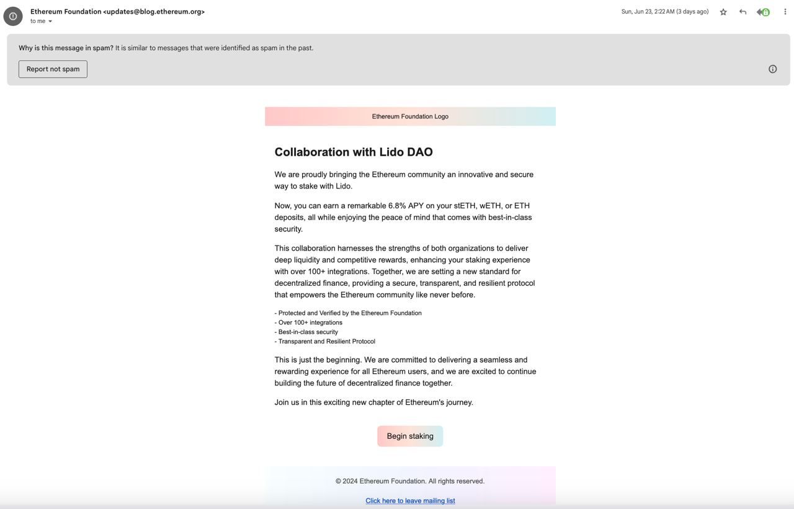
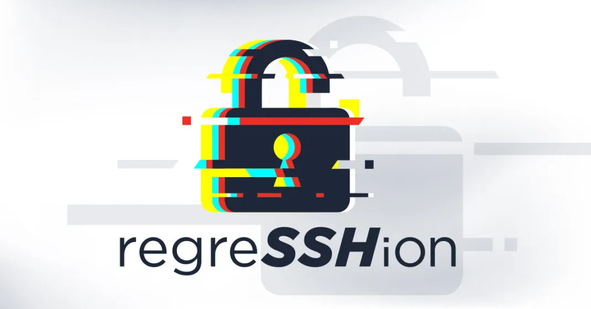

안녕하세요, 요새 해킹이 잘 되어 기분 좋은 hunjison 입니다 😚

이번 주에는 도요타시 전체 인구의 개인정보가 유출되는 말도 안되는.. 사건도 있었고,

새로운 OpenSSH RCE 취약점이 발견되는 등 흥미로운 기사도 많았어요!

## 이번 주 짹짹 PICK🐥

> ⚠️ **일본 도요타시, 도시 인구 전체인 42만 명의 개인 정보 유출**

2024.07.05 | 보안뉴스 | [기사보기](https://m.boannews.com/html/detail.html?tab_type=1&idx=131137)

일본 도요타시에서 **시민 전체 인구인 42만 명의 개인정보가 유출**되는 사고가 발생했어요 😅😅

통지서 등의 작성을 위탁하는 ‘이세토’라는 회사가 랜섬웨어에 감염되어 개인정보가 유출된 것이라고 하는데요. 이세토 회사에서는 계약이 종료되는 시점에 삭제해야 할 데이터를 저장한 채로 두고 있다가 서버가 공격을 당했다고 합니다.

이번 사건으로 인해 도요타 전체 시민의 이름, 주소, 세액, 계좌 등의 정보가 유출되었다고 하니 정말 끔찍하네요. ‘이세토‘에 개인정보를 위탁한 지자체는 도요타시 뿐이 아니었는데요. 도쿠시마현에서 약 20만 건의 자동차 납세자 개인정보가, 와카야마시도 15만 건의 주민세 대상자 개인정보가 유출되었다고 합니다.

 최근 랜섬웨어 조직들이 지자체를 타게팅해 공격하는 사례가 증가하고 있어, **위탁 기업에 대한 보안 솔루션 도입과 개인정보 관리 체계 점검**에 더 많은 관심을 가져야 할 것 같네요 😯

## 
> ⚠️ **이더리움 재단 공식 이메일로 피싱 메일이 …?**

2024.07.02 | Ethereum foundation blog | [블로그](https://blog.ethereum.org/2024/07/02/blog-incident) | [트위터](https://x.com/TimBeiko/status/1804721462407725441)

이더리움 재단(Ethereum Foundation) 공식 블로그 계정에서 피싱 메일이 발송되었다고 하네요!

지난 6월 23일 `updates@blog.ethereum.org` 계정에서 위 사진과 같이 거짓 정보를 담고 있는 피싱 메일이 35,794개의 이메일 주소로 발송되었다고 하는데요. 해당 웹사이트에서 지갑을 생성하고 거래에 서명하면, [크립토 드레이너(Crypto Drainer)](#짹짹이에게-물어봐)가 동작해 지갑에 있는 모든 돈이 빠져나간다고 하네요 😨😫 해당 피싱 사이트는 실제로 매우 정교하게 만들어져 있었다고 해요!

이더리움 재단은 SendPulse라는 **이메일 서비스 제공 업체**를 이용해 메일을 전송하였는데요. 해당 계정에 접근하는 데에는 Google Workspace 계정을 이용했다고 합니다. 해커는 유출된 Google Workspace 계정을 바탕으로 SendPulse 서비스에 접근 가능한 것으로 보입니다.

다행히도 이더리움 재단은 공격 정황을 발견하자마자 공격자를 추적했고, SNS를 통해 해당 링크를 클릭하지 말라고 안내하는 등 적절한 조치를 취했어요. 또한 해당 피싱 링크가 차단될 수 있도록 다수의 Web3 지갑 공급자와 Cloudflare 등 여러 사이트에 해당 링크를 제출했다고 해요. [온체인(On-Chain)](#짹짹이에게-물어봐) 데이터를 통해 확인한 결과 다행히 누구도 피싱에 속아 돈을 잃지 않은 것으로 보인다고 합니다! 👌

메일링 서비스에 저장된 계정 정보를 이용해 피싱 공격을 하는 사례는 처음 들어보아 흥미로운 기사였습니다 🐾

## 
> ⚠️ **OpenSSH 서버(sshd)에서 원격 코드 실행(RCE) 취약점 발견**

2024.07.01 | thehackernews | [기사보기](https://thehackernews.com/2024/07/new-openssh-vulnerability-could-lead-to.html)

리눅스 시스템 [OpenSSH](#짹짹이에게-물어봐) 서버(sshd)에서 원격 코드 실행(Remote Code Execution) 취약점이 발견되어 화제입니다!

해당 취약점은 regreSSHion이라는 이름으로 발표되었고, CVE-2024-6387가 할당되었다고 하네요. 이러한 이름이 붙은 이유는 **이미 보고된 취약점이 회귀(regression)**했기 때문이라고 하네요 🙀🙀

2006년에 동일한 취약점(CVE-2006-5051)이 보고되어 이미 수정했었는데, 이후 어떠한 이유로 다시 취약한 코드가 등장했다고 해요. 회귀 시점은 2020년 10월(OpenSSH 8.5p1)로 알려져 해당 버전 이후의 버전은 모두 취약하다고 합니다.

기존 발견된 취약점이 존재하는지 확인하는 테스트가 앞으로는 꼭 필요할 것 같네요! 이미 패치된 취약점도 다시 보아야겠어요 😁

## 
> 🗣️ **유로폴, 공격자들이 사용하는 593개의 Cobalt Strike 서버 종료 성공**

2024.07.03 | bleepingcomputer | [기사보기](https://www.bleepingcomputer.com/news/security/europol-takes-down-593-cobalt-strike-servers-used-by-cybercriminals/)

유로폴(Europol)이 **공격자들의 Cobalt Strike 서버 593개를 종료하는 데에 성공**했다고 하네요 🙌🎶 오랜만에 전해드리는 기쁜 소식이에요!

Cobalt Strike는 보안 전문가가 침투 테스트를 수행하기 위해 사용하기 위해 개발된 도구이지만, 불법 복제본이 온라인에 유출되면서 현재 사이버 범죄자들이 많이 사용하는 도구라고 해요 😫

유로폴은 Cobalt Strike 서버의 IP 주소를 식별하기 위해 여러 민간 기관과 협력했고, 식별한 주소를 [인터넷 서비스 제공자(ISP)](#짹짹이에게-물어봐)에 제공해 서버를 제거했다고 하네요. 2021년부터 무려 3년 동안 진행된 이번 프로젝트는 27개국에서 식별한 690개의 IP 주소 중에서 593개를 성공적으로 제거했다고 해요 👊

공격자들이 운영하는 서버를 식별하고 차단한 것은 대단한 성과인 것 같아요. 그렇지만 공격자들 역시 새로운 방법을 찾아갈 것이고, 앞으로도 국제 기관과 민간 기관 간의 협업이 중요하게 작용할 것으로 보입니다.

## 짹짹이에게 물어봐   

**크립토 드레이너(Crypto Drainer)**

암호화폐 지갑에 접근해 암호화폐 전체를 가져가는 악성 스크립트. 일반적으로 피싱 혹은 사기 웹사이트에 삽입된 스크립트를 의미함 ([참고](https://www.boannews.com/media/view.asp?idx=114043&kind=14))

**온체인(On-Chain)**

블록체인에서 발생하는 모든 거래 내역을 블록체인 위(On)에 기록하는 방식을 의미하며, 온체인 데이터는 이러한 방식을 통해 기록된 데이터를 의미함

**OpenSSH**

안전한 통신에 필수적인 Secure Shell(SSH) 프로토콜을 기반으로 하는 보안 네트워킹 유틸리티 모음으로, 강력한 암호화를 제공하여 원격 서버 관리 및 안전한 데이터 통신에 필수적인 도구

**인터넷 서비스 제공자(Internet Service Provider, ISP)**

인터넷 서비스를 제공하는 기업 (우리나라에서는 KT, LG유플러스, SK브로드밴드 등)

## 지식 PLUS ➕

[Ticketmaster hackers release stolen ticket barcodes for Taylor Swift Eras Tour](https://malware.news/t/ticketmaster-hackers-release-stolen-ticket-barcodes-for-taylor-swift-eras-tour/83738)

[Polyfill Supply Chain Threat: 4x Worse Than We Thought](https://malware.news/t/polyfill-supply-chain-threat-4x-worse-than-we-thought/83735)

[Cybercrime groups restructuring after major takedowns: Experts](https://techxplore.com/news/2024-07-cybercrime-groups-major-takedowns-experts.html)

[3년 전에 패치된 취약점, 공격자들이 재발굴해 스파이웨어 퍼트리는 중](https://www.boannews.com/media/view.asp?idx=131108&page=2&kind=1)

## **6월 컨퍼런스 | 대회** 🐥

[암호분석경진대회](https://cryptocontest.kr/challenge/) | 한국정보보호학회 | ~24.08.31 

[금융권 보안 취약점 신고포상제 (버그바운티)](http://www.itdaily.kr/news/articleView.html?idxno=223547) | 금융보안원 | ~24.08.31

[국제 사이버범죄대응 심포지엄](https://iscr.cyber.go.kr/) | 경찰청 | 24.07.01 사전 등록 시작 (24.08.27 ~ 24.08.29)

+**홍보를 원하는 채용/컨퍼런스‧학회/대회/대외활동 등이 있다면 편하게 연락주세요!**
