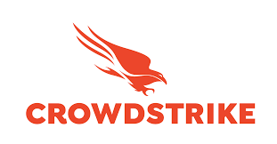

안녕하세요, hunjison입니다.

이번 주는 CrowdStrike 특집입니다! 사건의 핵심 원인부터 공격자들의 악용까지 현재 공개된 정보를 총 정리해보았습니다 😎 도움이 되었으면 좋겠어요.

## 이번 주 짹짹 PICK🐥

> 🗣️ **CrowdStrike 사태, 현재까지 공개된 정보 총 정리**

CrowdStrike 사태와 관련해 공식적으로 사고 후 보고서(PIR)이 발표되었습니다

현재까지 파악된 사건의 원인부터 공격자들의 악용까지 싹 다 정리해볼게요!

1. **CrowdStrike 사태란? | [참고](https://hackyboiz.github.io/2024/07/22/clalxk/newsletter0722/)**
    
    지난 7월 19일 금요일 한국 시간 기준 오후 1시 9분부터 2시 27분까지 CrowdStrike 사의 Falcon Sensor 제품의 자동 업데이트가 진행되면서, Windows에서 블루스크린(BSOD, Blue Screen of Death)이 발생한 문제입니다.
    
    CrowdStrike Falcon은 엔드포인트 탐지 및 대응(EDR) 및 안티 바이러스 기능을 수행하는 제품으로, 2022년 1월 기준 해당 부문 시장 점유율이 14.2%로 1위에 해당했습니다([출처](https://www.crowdstrike.com/press-releases/crowdstrike-ranks-1-for-modern-endpoint-security-market-shares/)). 
    
    이번 사태는 Windows 운영체제에만 영향을 주었지만, 전 세계의 모든 Windows PC가 말 그대로 먹통이 되었기 때문에 심각한 문제입니다.
    

1. **CrowdStrike에서 밝힌 사건의 원인 | [출처](https://www.crowdstrike.com/falcon-content-update-remediation-and-guidance-hub/)**
    
    이번 사건은 Falcon 플랫폼의 Rapid Response Content 업데이트로 인해 발생했다고 합니다.
    
    Rapid Response Content란 Falcon이 Windows에 대한 동적 보호를 수행할 수 있도록 하기 위해, 센서가 데이터를 수집하고 악의적 행동 지표를 식별하고 공격을 탐지 혹은 예방할 수 있도록 구성하는 역할을 합니다. 뒤이어 설명할 IPC 템플릿 인스턴스 역시 Rapid Response Content의 한 유형입니다.
    
    이번 사태에서는 2개의 IPC(InterProcessCommunication) 템플릿 인스턴스가 추가로 배포되었습니다. 배포 과정에서 콘텐츠 검증기(Content Validator)의 버그로 인해 해당 인스턴스들이 배포되었다고 합니다. 해당 인스턴스들은 채널 파일 291(`%WINDIR%\System32\drivers\CrowdStrike\C-00000291*.sys`)에 포함되었으며, 범위를 벗어난 메모리 읽기(out-of-bounds memory read)를 일으켜 Windows 시스템 크래시를 유발했습니다.
    
2. **QA 관점에서 살펴본 CrowdStrike 사건 | [참고](https://qase.io/blog/crowdstrike-outage-from-a-qa-perspective/)**
    
    이번 사건의 가장 큰 문제점은 CrowdStrike 사의 품질보증(QA) 관리 체계가 지나치게 허술했다는 점입니다.
    
    CrowdStrike 사에서 이번 문제의 핵심 원인으로 “콘텐츠 검증기의 버그”를 꼽고 있으며, 이에 대한 대책으로 로컬 개발자 테스트, 콘텐츠 업데이트 및 롤백 테스트, 안정성 테스트 등 테스트 강화를 꼽고 있습니다.
    
    참고 링크에서 한 전문가는 CrowdStrike가 지나치게 비용을 낮춘 것 같다고 이야기하고 있습니다.
    
3. **사태 해결 및 공격자들의 악용 | [참고1](https://boannews.com/media/view.asp?idx=131510&page=7&kind=1), [참고2](https://www.crowdstrike.com/blog/lumma-stealer-with-cypherit-phishing-lure/)**
    
    Microsoft에서는 이번 사태를 해결하기 위해 복구 방법을 [적극적으로 제공](https://blogs.microsoft.com/blog/2024/07/20/helping-our-customers-through-the-crowdstrike-outage/)하고 있으며, 국내에서는 KISA 에서 [긴급 조치 방안](https://www.boho.or.kr/kr/bbs/view.do?bbsId=B0000133&pageIndex=1&nttId=71499&menuNo=205020)을 마련하여 배포하고 있습니다.
    
    한편 공격자들은 가짜 복구 도구들을 유포하거나 이번 사태를 해결할 수 있는 핫픽스라고 속여 멀웨어를 배포하기도 했습니다. CrowdStrike를 가장한 공격자들이 Falcon 업데이트라고 속이는 피싱 메일 또한 관찰되고 있습니다. 
    
4. **사건의 핵심 원인은 아직 미공개 | [출처](https://www.crowdstrike.com/blog/falcon-update-for-windows-hosts-technical-details/)**
    
    CrowdStrike의 PIR 보고서에서는 QA 관점에서의 원인에 대해 “콘텐츠 검증기의 버그”가 있었다고 말할 뿐, 자세한 내용을 공개하지 않았습니다. 또한 해당 IPC 템플릿 인스턴스가 왜 OOB read를 일으켰는지에 대한 상세한 설명 역시 빠져 있습니다.
    
    CrowdStrike 홈페이지에 따르면 이에 대한 근본 원인 분석이 수행되고 있으며 보고서 역시 이후 공개된다고 하니, 업데이트를 지켜봐야 할 것 같습니다.
    

---

### 지식 PLUS ➕

- [Anyone can Access Deleted and Private Repository Data on GitHub](https://trufflesecurity.com/blog/anyone-can-access-deleted-and-private-repo-data-github)
- [Virtual Escape; Real Reward: Introducing Google’s kvmCTF](https://security.googleblog.com/2024/06/virtual-escape-real-reward-introducing.html)
- [CVE-2024-40767: OpenStack Nova Vulnerability Exposes Cloud Servers to Data Theft Risk](https://securityonline.info/cve-2024-40767-openstack-nova-vulnerability-exposes-cloud-servers-to-data-theft-risk/#google_vignette)
- [APT45: North Korea’s Digital Military Machine](https://cloud.google.com/blog/topics/threat-intelligence/apt45-north-korea-digital-military-machine?hl=en)
- [美, 北해커 기소·현상수배…"美·韓·中 정부·업체 해킹"(종합)](https://www.yna.co.kr/view/AKR20240726002951071?input=1195m)

## **7월 컨퍼런스 | 대회** 🐥

[AI+SECURITY 아이디어 공모전](https://www.kisa.or.kr/401/form?postSeq=3304&page=1) | ~24.08.12 16시

[암호분석경진대회](https://cryptocontest.kr/challenge/) | 한국정보보호학회 | ~24.08.31 

[금융권 보안 취약점 신고포상제 (버그바운티)](http://www.itdaily.kr/news/articleView.html?idxno=223547) | 금융보안원 | ~24.08.31

[국제 사이버범죄대응 심포지엄](https://iscr.cyber.go.kr/) | 경찰청 | 24.07.01 사전 등록 시작 (24.08.27 ~ 24.08.29)