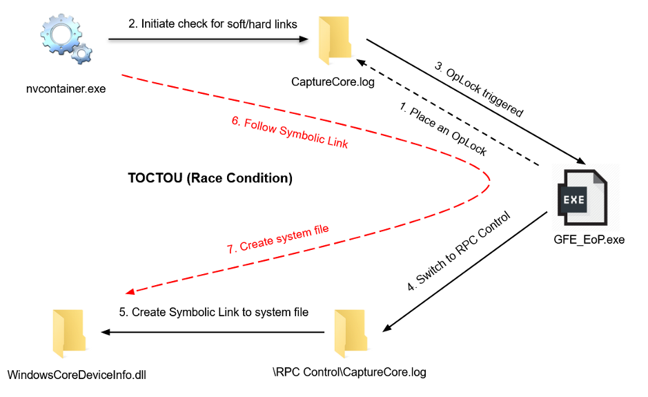

## URL 

[CVE-2020-17053: Use-After-Free IE Vulnerability](https://www.trendmicro.com/en_us/research/20/k/cve-2020-17053-use-after-free-ie-vulnerability.html)

## Target

- NVIDIA GeForce Experience 3.20.5.70 이전 버전

## Explain

NVDIA GeForce Experience의 GeForce 그래픽카드가 설치된 장비로 원격 게임을 지원하는 GAMESTREAM 기능에서 Local Privilege Escalation 취약점이 발견되었습니다.

nvcontainer.exe 프로세스는 user impersonation 없이 `C:\\ProgramData\\NVIDIA Corporation\\ShadowPlay\\` 디렉터리에 `CaptureCore.log` 파일을 쓰거나 생성합니다. 이때 상위 폴더 상속으로 인해 모든 사용자는 해당 파일과 파일이 있는 폴더에 모든 권한을 갖습니다. 하지만 `CaptureCore.log` 파일을 삭제한 후 GAMESTREAM을 재시작하면 `nvspapi64.dll`에서 소프트 링크와 하드 링크에 대한 검사를 진행하여 심볼릭 링크 파일을 삭제합니다. 이 작업은 `nvspapi64.dll`에서 수행되는데 검사를 진행한 후 `CaptureCore.log`에 대한 핸들을 닫고 최종 경로를 가져와 작업을 수행하기 위해 다시 핸들을 엽니다.

이를 활용하여 특정 파일에 대한 access event를 catch 하는 [OpLock](https://docs.microsoft.com/en-us/windows/win32/fileio/opportunistic-locks)을 CaptureCore.log에 설정한 후 검사를 진행하면 OpLock이 트리거 되어 C:\Windows\System32 폴더에 arbitrary file creation이 가능합니다.