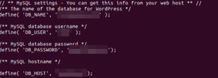
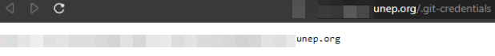

## URL 

[UNEP Breached, 100K+ Employee Records Accessed](https://johnjhacking.com/blog/unep-breach/)

## Target

- ilo.org
- unep.org

## Explain

유엔에서 Git Credentials이 노출된 endpoint를 통해 직원들의 기록 및 프로젝트, 보고서 등의 정보에 접근할 수 있는 취약점이 발견되었습니다. ilo.org의 하위 도메인에 노출된 .git content가 존재합니다. [git-dumper](https://github.com/arthaud/git-dumper)를 사용하여 프로젝트 폴더를 덤프할 수 있고 코드에 노출된 자격 증명으로 mysql 데이터베이스와 survey management platform에 접근할 수 있습니다.

또한 unep.org에서  `.git-credentials`가 노출된 서브 도메인이 존재합니다. GitHub credentials를 통해 private project에 접근할 수 있고 데이터베이스 및 각종 애플리케이션 정보에 접근할 수 있습니다.

