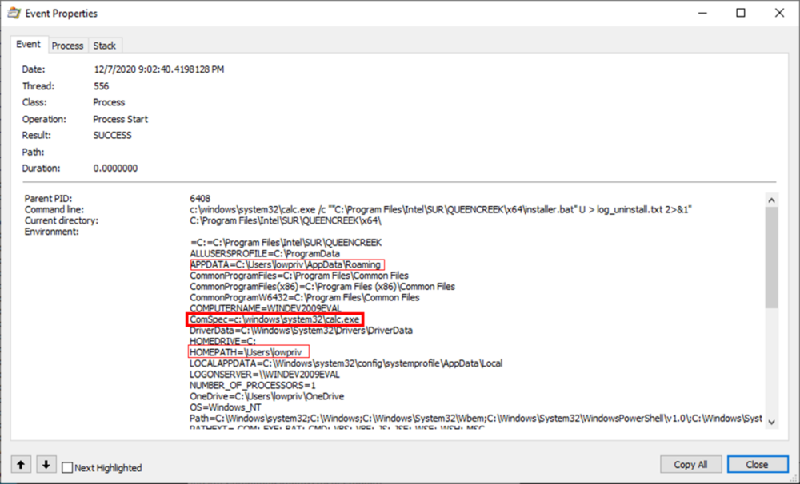

## URL 

[The many pitfalls of Windows MSI - Privilege escalation in Windows 7/8.1/10/Server and a range of third-party products](https://improsec.com/tech-blog/the-many-pitfalls-of-windows-msi-privilege-escalation-in-windows-78110server-and-a-range-of-third-party-products)

## Target

- Windows 7/8.1/10
- Windows Server 2008/2012/2016/2019

## Explain

Microsoft Windows의 소프트웨어 설치, 유지, 제거를 위한 인스톨러인 MSI에서 서드 파티 애플리케이션을 통해 권한 상승을 할 수 있는 취약점이 발견되었습니다.

MSI 패키지가 설치되는 동안 패키지의 복사본은 자동으로 생성된 이름을 갖고 숨김 폴더 `C:\Windows\Installer`에 생성됩니다. 시스템에 있는 모든 사용자들은 `msiexec /fa C:\Windows\Installer\<filename>.msi` 명령을 실행하거나 관련된 API/COM 함수를 직접적으로 호출하여 패키지를 재설치할 수 있습니다.

패키지에 따라 재설치할 때 `NT Authority/SYSTEM` 컨텍스트로 새로운 MSIEXEC 프로세스를 생성합니다. 설치된 서드 파티 애플리케이션을 재설치하는 동안 `NT Authority/SYSTEM` 컨텍스트에서 `cmd.exe`가 호출됩니다. 해당 프로세스가 실행되는 동안 프로세스에 낮은 권한의 사용자에 속하는 환경 변수가 적용되어있습니다. `C:\Windows\System32\cmd.exe`로 설정되어 있는 변수 `ComSpec`의 값을 변경하면 `NT Authority/SYSTEM` 권한으로 `ComSpec`에 설정된 애플리케이션이 실행됩니다.

