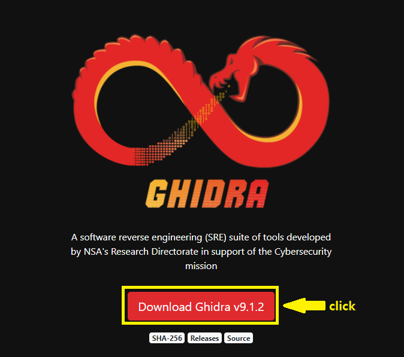
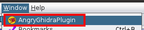

하지메마시떼! 반갑습니다 오늘도 띨띨한 idioth입니다.

오늘 소개해드릴 툴은 AngryGhidra라는 툴입니다.

누군가(?)가 올려준 링크를 보고 오 이거 편하겠는데 한 번 써볼까? 하고 써봤다가 사용해볼 만한 가치가 있는 것 같아서 글을 작성해봅니다.

[angr](https://github.com/angr/angr)에 대해 설명해드리자면 바이너리 분석을 도와주는 python 라이브러리입니다.

기존 angr를 사용하려면 IDA와 같은 툴을 사용하여 분석하고 주소를 구하고 python 코드에다가 적고... 다시 구하고 코드에다가 적고 하는 노가다를 진행해야 했습니다. 하지만 이 녀석을 사용하면 Ghidra에서 분석하고 클릭질만 몇 번 하면 angr의 기능을 사용할 수 있습니다.

저녁 먹고 와서 공부도 하기 싫겠다... 요거나 세팅해서 써보면서 갖고 놀아봐야겠다... 히히히 하는 생각은 30분 만에 깨져버리게 됩니다.

# 예상치 못한 삽질

분명 Readme.md에서는 릴리즈 버전을 설치하여 Extension 추가하면 된다 했다.

→ 근데 왜 릴리즈 버전이 아무것도 없는 거지? 함정인가

그냥 git clone하면 빌드 된 파일이 있을 거라 생각하였으나 없었다.

→ clone하고 있는 파일들 전부다 Ghidra Extension에서 클릭해봤으나 오류만 엄청 뜸.. build.gradle 파일이 있으니 gradle로 빌드를 해보자

gradle을 통해 빌드를 하는데 정상적으로 되질 않네..?

→ 내가 뭘 하려 할 때마다 오류가 뜬다... 이쯤에서 멘탈이 나가서 혼자 모니터 앞에서 욕을 하기 시작

우여곡절 속에서 빌드 성공(!) 후 신나서 L0ch에게 야 빌드 했다 이제 돌려본다 옆에서 딱 기다려 ㅋㅋ하고 옆에 세워뒀습니다. 하지만 가져온 바이너리를 돌렸는데 angr가 돌아가지 않았다...

> L0ch 日 : 아니 형 된다면서 안되잖아 뭐야 빨리 다시 삽질해요

~~나쁜넘~~ 아무튼 여기서 멈출 수 없으므로 angr를 재설치해보고 python 버전이 문젠가 삽질을 다시 시작합니다...

결국 멘탈이 박살 난 상태로 집에 가서 애니메이션(?)을 보며 힐링 후 다음 날 다시 도전을 해보았습니다.

UE(User Error)일 가능성이 크다고 생각하며 오늘의 나와 어제의 나는 다르기 때문에 또 돌렸는데 실행이 안 됐습니다.. 도대체 왜 안돼?라고 생각하는 찰나 내 머리에 스친 생각

> 아니 이거 elf 파일인데 왜 windows에서 돌리고 있지??

<p align="center"></p>

ubuntu로 옮긴 다음에 다시 위의 과정 반복 후 다시 L0ch를 불렀습니다. 이 자식은 형이 부르는데 맨날 투덜거려요. "안되기만 해 봐" 하면서 와놓고 되니까 따봉 날리고 갑니다.

현재는 Pre-release로 AngryGhidra v0.1이 업로드된 상태라서 귀찮으신 분은 [릴리즈 버전을 다운로드](https://github.com/Nalen98/AngryGhidra/releases) 받아 Extension을 바로 추가하면 될 것 같습니다.

# 근데 Ghidra가 뭔데?

[Ghidra](https://ghidra-sre.org/)는 NSA에서 개발한 역어셈블러 프레임워크입니다. 뭐 하는 녀석인지 잘 모르겠으면 IDA 같은 녀석이라고 보시면 됩니다.

오픈 소스로 공개되었으며 jdk 11 버전에서 정상적으로 작동됩니다.

다른 응용 프로그램들처럼 설치 파일을 통해 설치하는 것이 아닌 압축 파일을 다운 받아서 압축만 해제하면 바로 실행할 수 있습니다.

지원 플랫폼

- Windows 7 or 10 (64bit)
- Linux (64bit, CentOs 7 is preferred)
- macOS(OS X) 10.8.3+ (Mountain Lion or later)

32비트 OS에서는 Ghidra를 사용할 수 없습니다.

## 우분투에 Ghidra 설치하기

### 자바 환경 설치

```bash
$ sudo add-apt-repository ppa:openjdk-r/ppa
$ sudo apt install openjdk-11-jre openjdk-11-jre-headless openjdk-11-jdk openjdk-11-jdk-headless
```

### Ghidra 설치

[기드라 사이트](https://ghidra-sre.org/)에서 최신 버전의 기드라를 설치해줍니다.



설치 후 원하는 폴더에서 압축을 해제하면 ghidra가 정상적으로 설치됩니다.

```bash
idioth@ubuntu:~$ ls -al ghidra_9.1.2_PUBLIC
total 56
drwxr-xr-x  9 idioth idioth  4096  9월 11 15:15 .
drwxr-xr-x 31 idioth idioth  4096  9월 14 17:01 ..
drwxr-xr-x  5 idioth idioth  4096  2월 12  2020 docs
drwxr-xr-x  5 idioth idioth  4096  2월 12  2020 Extensions
drwxr-xr-x  8 idioth idioth  4096  2월 12  2020 Ghidra
-rwxr-xr-x  1 idioth idioth   883  2월 12  2020 ghidraRun
-rw-r--r--  1 idioth idioth   384  2월 12  2020 ghidraRun.bat
drwxr-xr-x  7 idioth idioth  4096  2월 12  2020 GPL
-rw-r--r--  1 idioth idioth 11357  2월 12  2020 LICENSE
drwxr-xr-x  2 idioth idioth  4096  2월 12  2020 licenses
drwxr-xr-x  2 idioth idioth  4096  2월 12  2020 server
drwxr-xr-x  2 idioth idioth  4096  2월 12  2020 support
```

Windows의 경우 ghidraRun.bat를 통해 실행하고 우분투의 경우 ghidraRun을 통해 실행해 줍니다. 실행 권한이 없을 경우 chmod +x ghidraRun을 통해 실행 권한을 주면 됩니다.

# AngryGhidra

기드라가 정상적으로 설치되었다면 [AngryGhidra](https://github.com/Nalen98/AngryGhidra/releases)를 설치해 줍니다.

## Angr 설치

```bash
$ sudo pip3 install angr
```

## Releases로 플러그인 등록

pre-releases가 올라왔으니 저와 같은 시간 낭비(?)는 하지 말고 릴리즈 버전으로 등록을 해봅시다.

```bash
$ wget https://github.com/Nalen98/AngryGhidra/releases/download/0.1%2Bghidra-9.1.2/ghidra_9.1.2_PUBLIC_20200909_AngryGhidra.zip
```

릴리즈 버전을 설치해 줍니다.


기드라 실행 후 File-Install Extensions을 선택해 줍니다.


우측 상단에 +버튼을 선택해 줍니다.


설치 받은 zip 파일을 선택해 준 후 체크해 줍니다.

그러면 끝납니다. 체크하고 OK 누르면 설치 완료~

## Gradle을 통해서 직접 빌드하는 방법

릴리즈 버전이 올라와 있기 때문에 굳이 이 방법을 택하시는 분이 없을 거라 생각하지만 혹시 본인이 직접 빌드 해보고 싶으시다면 직접 빌드 해보시는 것도 추천드립니다.

```bash
$ sudo apt install gradle
$ git clone https://github.com/Nalen98/AngryGhidra
```

gradle을 통해서 빌드 하기 위해 gradle을 설치하고 AngryGhidra repository를 가져옵니다.

```bash
~/AngryGhidra$ gradle buildExtension
Starting a Gradle Daemon, 1 incompatible and 1 stopped Daemons could not be reused, use --status for details

FAILURE: Build failed with an exception.

* Where:
Build file '/home/idioth/AngryGhidra/build.gradle' line: 31

* What went wrong:
A problem occurred evaluating root project 'AngryGhidra'.
> GHIDRA_INSTALL_DIR is not defined!

* Try:
Run with --stacktrace option to get the stack trace. Run with --info or --debug option to get more log output. Run with --scan to get full insights.

* Get more help at https://help.gradle.org

BUILD FAILED in 3s
```

그냥 빌드를 진행할 경우 기드라의 설치 경로를 알 수 없기 때문에 정상적으로 빌드가 되지 않습니다. 좀 더 똑똑한(?) 제가 가르쳐주도록 합니다.

```bash
~/AngryGhidra$ sudo GHIDRA_INSTALL_DIR=/home/idioth/ghidra_9.1.2_PUBLIC gradle buildExtension

> Task :buildHelp 
INFO  Using log config file: jar:file:/home/idioth/ghidra_9.1.2_PUBLIC/Ghidra/Framework/Generic/lib/Generic.jar!/generic.log4j.xml (LoggingInitialization)  
INFO  Using log file: /root/.ghidra/.ghidra_9.1.2_PUBLIC/application.log (LoggingInitialization)  
[JavaHelpFilesBuilder] Generating Help Files for: [file:///home/idioth/AngryGhidra/src/main/help/help/]
[JavaHelpFilesBuilder] Generating map file: file:///home/idioth/AngryGhidra/build/help/main/help/AngryGhidra_map.xml...
[JavaHelpFilesBuilder]  finished generating map file
[JavaHelpFilesBuilder] Generating TOC file: AngryGhidra_TOC.xml...
[JavaHelpFilesBuilder]  finished generating TOC file
[JavaHelpFilesBuilder] Done generating help files for module: AngryGhidra

> Task :buildExtension 

Created ghidra_9.1.2_PUBLIC_20200914_AngryGhidra.zip in /home/idioth/AngryGhidra/dist

BUILD SUCCESSFUL in 15s
8 actionable tasks: 8 executed
```

위와 같이 자신의 기드라 경로를 추가해 준 후 빌드를 진행합니다. 

```bash
~/AngryGhidra/dist$ ls
ghidra_9.1.2_PUBLIC_20200914_AngryGhidra.zip
```

정상적으로 빌드가 진행됐다면 dist 폴더에 Extension 파일이 생깁니다.

여기까지 오셨다면 릴리즈를 통해 추가하는 것과 같은 방법으로 추가하시면 됩니다!

## AngryGhidra를 통한 문제 풀이

angr로 푸는 문제 중 가장 간단한(?) [Defcamp - r100](https://github.com/ByteBandits/writeups/blob/master/defcamp-quals-2015/reverse/r100/r100.bin)을 통해서 어떤 식으로 사용하는지 확인해봅시다.

먼저 기드라로 해당 파일을 열어준 후 main 소스 코드를 확인해봅시다.

```cpp
undefined8 FUN_004007e8(void)
{
	int iVar1;
	char *pcVar2;
	undefined8 uVar3;
	long in_FS_OFFSET;
	char local_118 [264];
	long local_10;

	local_10 = *(long *)(in_FS_OFFSET + 0x28);
	printf("Enter the password: ");
	pcVar2 = fgets(local_118, 0xff, stdin);
	if (pcVar2 == (char *)0x0) {
		uVar3 = 0;
	}
	else {
		iVar1 = FUN_004006fd(local_118);
		if (iVar1 == 0) {
			put("Nice!");
			uVar3 = 0;
		}
		else {
			puts("Incorrect password!");
			uVar3 = 1;
		}
	}
	if (local_10 != *(long *)(in_FS_OFFSET + 0x28)) {
		__stack_chk_fail();
	}
	return uVar3;
}
```

password를 입력받고 `FUN_004006fd` 함수에서 어떠한 수행을 하고 return 값에 따라서 Nice와 incorrect로 넘어가네요.

Incorrect 부분을 피하고 Nice로 가는 패스워드를 찾아야 합니다.

저 함수를 일일이 분석하는 방법도 있지만 우리에게는 AngryGhidra가 있습니다.


먼저 함수의 시작 부분에서 blank state를 설정해 줍니다.


우리는 Nice 문자열 부분으로 넘어가는 값을 찾고 싶으니 Nice 쪽으로 넘어가는 주소를 Find Address로 설정해 줍니다.


Incorrect로 가는 부분은 피해야 되니 Avoid Address로 설정한 다음에 AngryGhidra를 실행해봅시다!




Window - AngryGhidraPlugin을 클릭하면 위의 사진과 같은 창이 뜹니다. 인자의 길이를 지정할 수도 있고, auto_load_libs를 설정할 수도 있습니다.

Blank State와 Find address, avoid address를 모두 설정하였으니 Run 버튼을 눌러 angr를 돌려봅시다.

잠시 기다려보면 Solution Found라고 뜨며 아래와 같이 어떤 문자열이 뜹니다.


나온 문자열을 바이너리에 입력해보면

```bash
~/Desktop$ ./r100.bin 
Enter the password: Code_Talkers
Nice!
```

정상적으로 찾은 것을 알 수 있습니다.

나는 소스 코드 보고 클릭질만 몇 번 하면 값을 찾아준다? 정말 인간의 욕구에 충실한 플러그인이 아닐 수가 없습니다.

직접 스크립트를 작성해서 돌리는 것이 기능적으로는 훨씬 효율적일 수 있지만 리버싱을 진행하면서 바로바로 angr 환경 세팅 및 실행할 수 있다는 점이 매력적이었습니다.

아직은 간단한 것들로만 해보고 더 복잡한 것들은 사용해보지 않았는데 나중에 기회가 된다면 더 복잡한 바이너리에 사용해보고 올려보도록 하겠습니다 ㅋㅋ

오늘도 저의 멍청함을 확인하고 극복한 나에게 건배하며.. adios..

<p align="center"></p>