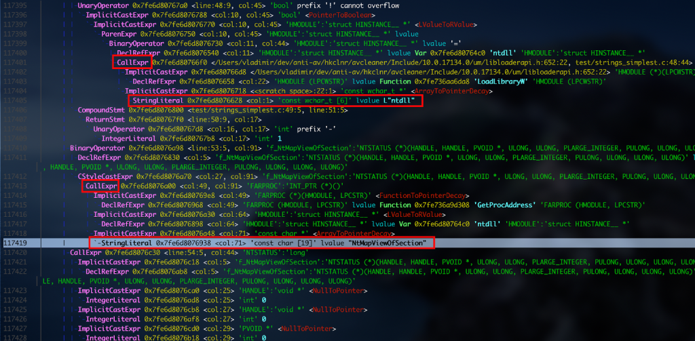

안녕하세요. 하지 말라는 것은 더 하고 싶은 idioth입니다.

원래 사람은 하지 말라면 더 하고 싶은 법. 그래서 평소 탐지 우회하는 것에 대해 관심이 많은데 관련 글이 있길래 들고 왔습니다.


평소에는 그냥 혼자 공부하고 혼자 보는거라 직독직해 해놓고 스스로 머릿 속에서 정리하였는데 글로 적으려니 고생을 좀 했습니다. 영어 실력이 좋은 것도 아니고 번역을 많이 해본 것도 아니라 의역과 오역이 난무하는 글이 될 것 같습니다...

보시다가 이 부분은 왜 이렇게 번역이 됐지? 혹은 너무 이상한데? 하시는 것 있으시면 댓글로 달아드리면 눈물 흘리며 수정하도록 하겠습니다!


> 원문 글 : [Engineering Antivirus evasion](https://blog.scrt.ch/2020/06/19/engineering-antivirus-evasion/)


**tl;dr:** 이 게시물은 모든 AV/EDR을 우회하기 위해 자동으로 Meterpreter을 refactoring 하는 것에 대해 설명한다. 모든 기술에 대한 아이디어와 문자열 난독화 패스의 구현이 상세히 설명되어있다. API import를 숨기는 것과 syscall 재작성에 대한 자세한 내용은 게시글이 너무 길어지므로 다음 글에서 소개할 것이다. 소스코드는 [github](https://github.com/scrt/avcleaner)에서 확인할 수 있다.

기업이 정보 시스템을 보호하기 위해서 안티 바이러스와 EDR 같은 보안 소프트웨어는 필수적이다. 과거에는 모든 멀웨어 탐지 기술을 우회하기가 쉬웠지만 탐지 기술이 발전함에 따라 우회에 더 많은 노력이 필요하다.

취약점을 증명하기 위한 Proof-of-Concept가 안티 바이러스에 의해 차단된 경우 위험성에 대해 이야기하는 것은 매우 어렵다. 이론적으로 탐지를 우회하는 것이 가능하다고 얘기할 수 있지만 증명하기가 어렵다.

 또한 시스템의 existing foothold에서만 발견할 수 있는 취약점들이 있다. pentester가 initial level에 접근할 수 없는 경우 시스템의 실제 보안 상태를 도출할 수 없다.

따라서 안티바이러스 소프트웨어 우회는 필요하다. SCRT(필자의 팀)에서는 공개적으로 사용 가능한 오픈 소스 툴을 사용해 툴을 사용하는데 숙련된 누구나 따라 할 수 있으며 private 하고 비싼 툴에 의존하지 않아도 된다는 점을 강조한다.

# 문제점

사람들은 안티 바이러스의 탐지가 정적인지 동적인지 분류하는 것을 좋아한다. 보통 실행 전에 트리거 되면 정적 탐지로 간주된다. 하지만 프로세스 생성, in-memory file downloads 같은 이벤트를 통해 멀웨어 실행 시 signature와 같은 정적 탐지 메커니즘이 호출될 수 있다는 것은 아는 것이 좋다. 모든 보안 소프트웨어에 Meterpreter를 사용하려면 다음과 같이 수정해야 한다.

- 파일 시스템 스캔 혹은 메모리 스캔 중에 모든 static signature 우회
- userland API hooking 우회와 관련된 "행동 탐지" 우회

Meterpreter는 여러 모듈로 구성되며 전체 코드 베이스의 양이 많고 계속 업데이트되므로 private fork를 수행하기 힘들다. 따라서 자동으로 코드 베이스를 수정할 방법이 필요하다.

# 해결 방안

멀웨어 탐지는 대부분 문자열, API hook, 혹은 둘의 조합을 기반으로 한다.

Cylance 같은 머신러닝 classifier를 구현하는 제품에서도 문자열, API import, 후킹 할 수 있는 API 호출이 없는 멀웨어는 탐지를 우회할 수 있다.

Meterpreter는 수천 개의 문자열을 가지고 있고 API imports는 어떠한 방법으로도 숨겨지지 않으며 `WriteProcessMemory` 같은 민감한 API는 userland API hook으로 쉽게 intercept 할 수 있다. 따라서 자동화된 방식을 사용하여 2개의 솔루션을 만들어야 한다.

- Source-to-source code refactoring
- LLVM 컴파일 시 코드 베이스 난독화

후자가 선호되는 방식이며 많은 유명한 연구들에서 같은 결론에 도달했다. transformation pass를 한 번 작성해서 소프트웨어의 프로그래밍 언어나 target architecture에 상관없이 재사용할 수 있기 때문이다.


이미지 출처: [http://www.aosabook.org/en/llvm.html](http://www.aosabook.org/en/llvm.html)

그러나 이 방법은 Visual Studio가 아닌 다른 컴파일러로 Meterpreter를 컴파일할 수 있어야 한다. 이를 수정하기 위해 2018년 12월에 몇 가지 작업을 퍼블리시했지만 1년이 더 지난 지금도 공식 코드 베이스에 적용되지 않았다.

그동안 우리는 첫 번째 접근법을 구현하기로 결정했다. 최첨단 소스 코드 refactoring를 살펴본 결과 *libTooling*(Clang/LLVM toolchain의 일부)이 C/C++ 소스의 구문 분석과 수정에 가장 적합했다.

Note: 코드 베이스는 Visual Studio 의존성이 강하기 때문에 Clang은 Meterpreter의 많은 부분의 구문 분석에 실패할 것이다. 그러나 타겟 안티바이러스를 50% 확률로 우회할 수 있었다. 또한 소스 코드를 변환하는 것이 컴파일 시에 변환하는 것보다 장점이 있을 것이다. 후자는 에러 없이 전체 프로젝트를 컴파일해야 하지만 전자는 수천 개의 컴파일 에러에 탄력적이며 불완전한 추상 구문 트리로 끝이 난다.


LLVM passes vs libTooling

## 문자열 난독화

C/C++에서 문자열은 다양한 context 안에 존재한다.

*libTooling*을 사용하는 것은 복잡하므로 Meterpreter의 코드 베이스에서 의심스러운 문자열이 나타나는 부분을 보면 다음과 같다.

- function arguments
- list initializers

### Fcuntion arguments

ESET Nod32는 다음 코드에서 `ntdll` 문자열을 의심스러운 문자열로 탐지한다.

```cpp
ntdll = LoadLibrary(TEXT("ntdll"))
```

그러나 다음과 같이 코드를 재작성하면 성공적으로 탐지를 우회한다.

```cpp
wchar_t ntdll_str[] = {'n', 't', 'd', 'l', 'l', 0};
ntdll = LoadLibrary(ntdll_str)
```

첫 번째 코드는 `.rdata` 섹션에 `"ntdll"` 문자열이 저장돼서 안티바이러스에게 쉽게 발견된다. 두 번째 코드는 문자열이 실행 시 스택에 저장돼서 보통 정적으로 구분할 수 없다. *IDA Pro*와 같은 툴에서는 문자열을 탐지할 수 있지만 바이너리를 더 복잡하게 분석해야 한다.

### List initializers

Meterpreter의 코드 베이스에서 다음과 같은 구성은 [c/meterpreter/source/extensions/extapi/extapi.c](https://github.com/rapid7/metasploit-payloads/blob/c8aa435b3c4872c58dba04acf53d157c3de2771c/c/meterpreter/source/extensions/extapi/extapi.c#L23)와 같은 파일에서 찾을 수 있다.

```cpp
Command customCommands[] =
{
    COMMAND_REQ("extapi_window_enum", request_window_enum),
    COMMAND_REQ("extapi_service_enum", request_service_enum),
    COMMAND_REQ("extapi_service_query", request_service_query),
    COMMAND_REQ("extapi_service_control", request_service_control),
    COMMAND_REQ("extapi_clipboard_get_data", request_clipboard_get_data),
    COMMAND_REQ("extapi_clipboard_set_data", request_clipboard_set_data),
    COMMAND_REQ("extapi_clipboard_monitor_start", request_clipboard_monitor_start),
    COMMAND_REQ("extapi_clipboard_monitor_pause", request_clipboard_monitor_pause),
    COMMAND_REQ("extapi_clipboard_monitor_resume", request_clipboard_monitor_resume),
    COMMAND_REQ("extapi_clipboard_monitor_purge", request_clipboard_monitor_purge),
    COMMAND_REQ("extapi_clipboard_monitor_stop", request_clipboard_monitor_stop),
    COMMAND_REQ("extapi_clipboard_monitor_dump", request_clipboard_monitor_dump),
    COMMAND_REQ("extapi_adsi_domain_query", request_adsi_domain_query),
    COMMAND_REQ("extapi_ntds_parse", ntds_parse),
    COMMAND_REQ("extapi_wmi_query", request_wmi_query),
    COMMAND_REQ("extapi_pageant_send_query", request_pageant_send_query),
    ...
}
```

이 문자열들은 `ext_server_espia_x64.dll`의 `.rdata` 영역에 평문으로 저장되고 *ESET Nod32*에서 탐지된다.

이 문자열들은 list initialzier에 위치한 매크로의 매개변수이다. 목표는 자동으로 위의 코드를 다음과 같이 재작성하는 것이다.

```cpp
char hid_extapi_UQOoNXigAPq4[] = {'e','x','t','a','p','i','_','w','i','n','d','o','w','_','e','n','u','m',0};
char hid_extapi_vhFHmZ8u2hfz[] = {'e','x','t','a','p','i','_','s','e','r','v','i','c','e','_','e','n','u','m',0};
char hid_extapi_pW25eeIGBeru[] = {'e','x','t','a','p','i','_','s','e','r','v','i','c','e','_','q','u','e','r','y'
0};
char hid_extapi_S4Ws57MYBjib[] = {'e','x','t','a','p','i','_','s','e','r','v','i','c','e','_','c','o','n','t','r'
'o','l',0};
char hid_extapi_HJ0lD9Dl56A4[] = {'e','x','t','a','p','i','_','c','l','i','p','b','o','a','r','d','_','g','e','t'
'_','d','a','t','a',0};
char hid_extapi_IiEzXils3UsR[] = {'e','x','t','a','p','i','_','c','l','i','p','b','o','a','r','d','_','s','e','t'
'_','d','a','t','a',0};
char hid_extapi_czLOBo0HcqCP[] = {'e','x','t','a','p','i','_','c','l','i','p','b','o','a','r','d','_','m','o','n'
'i','t','o','r','_','s','t','a','r','t',0};
char hid_extapi_WcWbTrsQujiT[] = {'e','x','t','a','p','i','_','c','l','i','p','b','o','a','r','d','_','m','o','n'
'i','t','o','r','_','p','a','u','s','e',0};
char hid_extapi_rPiFTZW4ShwA[] = {'e','x','t','a','p','i','_','c','l','i','p','b','o','a','r','d','_','m','o','n'
'i','t','o','r','_','r','e','s','u','m','e',0};
char hid_extapi_05fAoaZLqOoy[] = {'e','x','t','a','p','i','_','c','l','i','p','b','o','a','r','d','_','m','o','n'
'i','t','o','r','_','p','u','r','g','e',0};
char hid_extapi_cOOyHTPTvZGK[] = {'e','x','t','a','p','i','_','c','l','i','p','b','o','a','r','d','_','m','o','n','i','t','o','r','_','s','t','o','p',0};
char hid_extapi_smtmvW05cI9y[] = {'e','x','t','a','p','i','_','c','l','i','p','b','o','a','r','d','_','m','o','n','i','t','o','r','_','d','u','m','p',0};
char hid_extapi_01kuYCM8z49k[] = {'e','x','t','a','p','i','_','a','d','s','i','_','d','o','m','a','i','n','_','q','u','e','r','y',0};
char hid_extapi_SMK9uFj6nThk[] = {'e','x','t','a','p','i','_','n','t','d','s','_','p','a','r','s','e',0};
char hid_extapi_PHxnGM7M0609[] = {'e','x','t','a','p','i','_','w','m','i','_','q','u','e','r','y',0};
char hid_extapi_J7EGS6FRHwkV[] = {'e','x','t','a','p','i','_','p','a','g','e','a','n','t','_','s','e','n','d','_','q','u','e','r','y',0};

Command customCommands[] =
{

    COMMAND_REQ(hid_extapi_UQOoNXigAPq4, request_window_enum),
    COMMAND_REQ(hid_extapi_vhFHmZ8u2hfz, request_service_enum),
    COMMAND_REQ(hid_extapi_pW25eeIGBeru, request_service_query),
    COMMAND_REQ(hid_extapi_S4Ws57MYBjib, request_service_control),
    COMMAND_REQ(hid_extapi_HJ0lD9Dl56A4, request_clipboard_get_data),
    COMMAND_REQ(hid_extapi_IiEzXils3UsR, request_clipboard_set_data),
    COMMAND_REQ(hid_extapi_czLOBo0HcqCP, request_clipboard_monitor_start),
    COMMAND_REQ(hid_extapi_WcWbTrsQujiT, request_clipboard_monitor_pause),
    COMMAND_REQ(hid_extapi_rPiFTZW4ShwA, request_clipboard_monitor_resume),
    COMMAND_REQ(hid_extapi_05fAoaZLqOoy, request_clipboard_monitor_purge),
    COMMAND_REQ(hid_extapi_cOOyHTPTvZGK, request_clipboard_monitor_stop),
    COMMAND_REQ(hid_extapi_smtmvW05cI9y, request_clipboard_monitor_dump),
    COMMAND_REQ(hid_extapi_01kuYCM8z49k, request_adsi_domain_query),
    COMMAND_REQ(hid_extapi_SMK9uFj6nThk, ntds_parse),
    COMMAND_REQ(hid_extapi_PHxnGM7M0609, request_wmi_query),
    COMMAND_REQ(hid_extapi_J7EGS6FRHwkV, request_pageant_send_query),
    COMMAND_TERMINATOR
};
```

## API Import 숨기기

외부 라이브러리에서 export 된 함수를 호출하면 linker가 *Import Address Table*(IAT)에 기록한다. 함수 이름은 바이너리에서 평문으로 볼 수 있고 실행하지 않고 정적으로 확인할 수 있다. 의심스러운 함수명들을 숨기고 정상적인 바이너리에 존재하는 것들은 유지하는 것이 좋다.

Meterpreter의 *kiwi* extension에서 다음과 같은 코드를 찾을 수 있다.

```cpp
enumStatus = SamEnumerateUsersInDomain(hDomain, &EnumerationContext, 0, &pEnumBuffer, 100, &CountRetourne
```

이 함수는 `samlib.dll`에서 export 되므로 컴파일된 바이너리에는 `samlib.dll`과 `SamEnumberateUsersInDomain` 문자열이 표시된다.

이를 해결하기 위해 실행 중에 `LoadLibrary/GetProcAddress`를 사용하여 API를 가져올 수 있다. 이 함수들은 문자열을 인자로 사용하므로 난독화를 잘해야 한다. 따라서 위의 코드를 다음과 같이 재작성해야 한다.

```cpp
typedef NTSTATUS(__stdcall* _SamEnumerateUsersInDomain)(
    SAMPR_HANDLE DomainHandle,
    PDWORD EnumerationContext,
    DWORD UserAccountControl,
    PSAMPR_RID_ENUMERATION* Buffer,
    DWORD PreferedMaximumLength,
    PDWORD CountReturned
);
char hid_SAMLIB_01zmejmkLCHt[] = {'S','A','M','L','I','B','.','D','L','L',0};
char hid_SamEnu_BZxlW5ZBUAAe[] = {'S','a','m','E','n','u','m','e','r','a','t','e','U','s','e','r','s','I','n','D','o','m','a','i','n',0};
HANDLE hhid_SAMLIB_BZUriyLrlgrJ = LoadLibrary(hid_SAMLIB_01zmejmkLCHt);
_SamEnumerateUsersInDomain ffSamEnumerateUsersInDoma =(_SamEnumerateUsersInDomain)GetProcAddress(hhid_SAMLIB_BZUriyLrlgrJ, hid_SamEnu_BZxlW5ZBUAAe);
enumStatus = ffSamEnumerateUsersInDoma(hDomain, &EnumerationContext, 0, &pEnumBuffer, 100, &CountRetourned);
```

## syscall 재작성

Cylance가 실행 중인 컴퓨터에서 Meterpreter의 *migrate*를 사용하면 안티바이러스 탐지가 실행된다. Cylance는 userland hook으로 프로세스 인젝션을 탐지한다. 탐지를 우회하려면 hook을 제거하는 것으로 간단히 우회할 수 있다. ntdll을 읽은 후 syscall 번호를 복구하고 ready-to-call shellcode에 삽입하는 것은 간단하고 userland hook을 효과적으로 우회한다. 필자는 지금까지 NTDLL.DLL을 악성 파일로 판단하는 것을 보지 못했다.

# 구현

앞서 말한 모든 아이디어들은 *libTooling*을 기반으로 한 source code refactoring tool에서 구현할 수 있다. 이 부분은 *libTooling* 문서가 부족해서 필자의 팀에서 가능한 시간 동안 한 것을 문서화했다. 따라서 개선의 여지가 있으며 무언가 눈에 띄는 경우 필자는 그것에 대해 듣고 싶다.

## 추상 구문 트리 101

컴파일러는 보통 여러 구성 요소로 구성되는데 일반적으로 *Parser*와 *Lexer*로 구성된다. 소스 코드가 컴파일러에 들어가면 먼저 프로그래머가 작성한 원본 소스 코드에서 Parse Tree를 생성하고 컴파일러가 필요로 하는 노드에 semantic information을 추가한다. 이 결과를 *Abstract Syntax Tree*(추상 구문 트리)라고 부른다. 다음은 위키피디아의 예시이다.

```cpp
while b ≠ 0
  if a > b
    a := a − b
  else
    b := b − a
return a
```

간단한 프로그램의 일반적인 AST는 다음과 같다.


[추상 구문 트리 예시](https://en.wikipedia.org/wiki/Abstract_syntax_tree)

이 데이터 구조는 다른 프로그램의 property를 이해하는 프로그램을 작성할 때 정밀한 알고리즘을 제공하므로 대규모 코드 refactoring에 적합하다.

### Clang's Abstract Syntax Tree

The Right Way의 소스 코드를 변경해야 하므로 Clang의 AST에 대해 알아야 한다. Clagn은 AST 덤프를 command-line switch에 예쁘게 표시하지만 컴파일러 플래그 설정이 까다롭다.

간단한 테스트 translation unit을 만들어보자.

```cpp
#include <windows.h>

typedef NTSTATUS (NTAPI *f_NtMapViewOfSection)(HANDLE, HANDLE, PVOID *, ULONG, ULONG,
PLARGE_INTEGER, PULONG, ULONG, ULONG, ULONG);

int main(void)
{
    f_NtMapViewOfSection lNtMapViewOfSection;
    HMODULE ntdll;

    if (!(ntdll = LoadLibrary(TEXT("ntdll"))))
    {
        return -1;
    }

    lNtMapViewOfSection = (f_NtMapViewOfSection)GetProcAddress(ntdll, "NtMapViewOfSection");
    lNtMapViewOfSection(0,0,0,0,0,0,0,0,0,0);
    return 0;
}
```

그리고 다음 스크립트를 `.sh` 파일에 작성해라

```cpp
WIN_INCLUDE="/Users/vladimir/headers/winsdk"
CLANG_PATH="/usr/local/Cellar/llvm/9.0.1"#"/usr/lib/clang/8.0.1/"

clang -cc1 -ast-dump "$1" -D "_WIN64" -D "_UNICODE" -D "UNICODE" -D "_WINSOCK_DEPRECATED_NO_WARNINGS"\
  "-I" "$CLANG_PATH/include" \
  "-I" "$CLANG_PATH" \
  "-I" "$WIN_INCLUDE/Include/msvc-14.15.26726-include"\
  "-I" "$WIN_INCLUDE/Include/10.0.17134.0/ucrt" \
  "-I" "$WIN_INCLUDE/Include/10.0.17134.0/shared" \
  "-I" "$WIN_INCLUDE/Include/10.0.17134.0/um" \
  "-I" "$WIN_INCLUDE/Include/10.0.17134.0/winrt" \
  "-fdeprecated-macro" \
  "-w" \
  "-fdebug-compilation-dir"\
  "-fno-use-cxa-atexit" "-fms-extensions" "-fms-compatibility" \
  "-fms-compatibility-version=19.15.26726" "-std=c++14" "-fdelayed-template-parsing" "-fobjc-runtime=gcc" "-fcxx-exceptions" "-fexceptions" "-fseh-exceptions" "-fdiagnostics-show-option" "-fcolor-diagnostics" "-x" "c++"
```

`WIN_INCLUDE`는 Win32 API와 interact 하기 위해 필요한 헤더들이 있는 폴더이다. 윈도우10에서 가져왔으며 MinGW에서 가져오지 말고 필자와 같은 방법으로 하는 것을 추천한다. 그 후 테스트 C 파일을 인자로 스크립트를 실행하면 18MB 파일이 생성되지만 `NtMapViewOfSection` 같은 우리가 선언한 문자열 리터럴을 검색해서 AST에서 봐야 할 부분으로 이동할 수 있다.



AST를 시각화했으므로 어떻게 노드를 업데이트해야 소스 코드의 syntax 오류가 없을지 알 수 있다. 뒷부분은 *libTooling*을 통한 AST manipulation 구현에 대해서 상세히 다룬다.

### ClangTool boilerplate

구현을 하기 전에 boilerplate 코드가 필요하므로 다음 코드를 `main.cpp`에 입력해라.

```cpp
#include "clang/AST/ASTConsumer.h"
#include "clang/AST/ASTContext.h"
#include "clang/AST/Decl.h"
#include "clang/AST/Type.h"
#include "clang/ASTMatchers/ASTMatchFinder.h"
#include "clang/ASTMatchers/ASTMatchers.h"
#include "clang/Basic/SourceManager.h"
#include "clang/Frontend/CompilerInstance.h"
#include "clang/Frontend/FrontendAction.h"
#include "clang/Tooling/CommonOptionsParser.h"
#include "clang/Tooling/Tooling.h"
#include "clang/Rewrite/Core/Rewriter.h"

// LLVM includes
#include "llvm/ADT/ArrayRef.h"
#include "llvm/ADT/StringRef.h"
#include "llvm/Support/CommandLine.h"
#include "llvm/Support/raw_ostream.h"

#include "Consumer.h"
#include "MatchHandler.h"

#include <iostream>
#include <memory>
#include <string>
#include <vector>
#include <fstream>
#include <clang/Tooling/Inclusions/IncludeStyle.h>
#include <clang/Tooling/Inclusions/HeaderIncludes.h>
#include <sstream>

namespace ClSetup {
    llvm::cl::OptionCategory ToolCategory("StringEncryptor");
}

namespace StringEncryptor {

    clang::Rewriter ASTRewriter;
    class Action : public clang::ASTFrontendAction {

    public:
        using ASTConsumerPointer = std::unique_ptr<clang::ASTConsumer>;

        ASTConsumerPointer CreateASTConsumer(clang::CompilerInstance &Compiler,
                                             llvm::StringRef Filename) override {

            ASTRewriter.setSourceMgr(Compiler.getSourceManager(), Compiler.getLangOpts());
            std::vector<ASTConsumer*> consumers;

            consumers.push_back(&StringConsumer);
  
            // several passes can be combined together by adding them to `consumers`
            auto TheConsumer = llvm::make_unique<Consumer>();
            TheConsumer->consumers = consumers;
            return TheConsumer;
        }

        bool BeginSourceFileAction(clang::CompilerInstance &Compiler) override {
            llvm::outs() << "Processing file " << '\n';
            return true;
        }

        void EndSourceFileAction() override {

            clang::SourceManager &SM = ASTRewriter.getSourceMgr();

            std::string FileName = SM.getFileEntryForID(SM.getMainFileID())->getName();
            llvm::errs() << "** EndSourceFileAction for: " << FileName << "\n";

            // Now emit the rewritten buffer.
            llvm::errs() << "Here is the edited source file :\n\n";
            std::string TypeS;
            llvm::raw_string_ostream s(TypeS);
            auto FileID = SM.getMainFileID();
            auto ReWriteBuffer = ASTRewriter.getRewriteBufferFor(FileID);

            if(ReWriteBuffer != nullptr)
                ReWriteBuffer->write((s));
            else{
                llvm::errs() << "File was not modified\n";
                return;
            }

            std::string result = s.str();
            std::ofstream fo(FileName);
       
            if(fo.is_open())
                fo << result;
            else
                llvm::errs() << "[!] Error saving result to " << FileName << "\n";
        }
    };
}

auto main(int argc, const char *argv[]) -> int {

    using namespace clang::tooling;
    using namespace ClSetup;

    CommonOptionsParser OptionsParser(argc, argv, ToolCategory);
    ClangTool Tool(OptionsParser.getCompilations(),
                   OptionsParser.getSourcePathList());

    auto Action = newFrontendActionFactory<StringEncryptor::Action>();
    return Tool.run(Action.get());
}
```

이 boilerplate 코드는 공식 문서에서 가져와서 설명하지 않는다. 언급할만한 변경점은 `CreateASTConsumer`이다. 우리의 목표는 같은 translation unit에서 여러 transformation pass를 수행하는 것이다. consumers collection(필수 line: `consumer.push_back(&...);`)에 항목들을 추가하면 된다.

## 문자열 난독화

이 부분에서는 세 가지 단계로 구성된 문자열 난독화 패스에서 가장 중요한 구현 세부 사항을 설명한다.

- 소스 코드에 문자열 리터럴을 찾는다.
- 그것들을 변수로 변환한다.
- 적절한 위치(함수 또는 전역 context 포함)에 변수 정의/할당을 삽입

### 소스 코드에서 문자열 리터럴 찾기

`StringConsumer`는 아래와 같이 정의될 수 있다.(`StringEncryptor` namespace의 앞부분)

```cpp
class StringEncryptionConsumer : public clang::ASTConsumer {
public:

    void HandleTranslationUnit(clang::ASTContext &Context) override {
        using namespace clang::ast_matchers;
        using namespace StringEncryptor;

        llvm::outs() << "[StringEncryption] Registering ASTMatcher...\n";
        MatchFinder Finder;
        MatchHandler Handler(&ASTRewriter);

        const auto Matcher = stringLiteral().bind("decl");

        Finder.addMatcher(Matcher, &Handler);
        Finder.matchAST(Context);
    }
};

StringEncryptionConsumer StringConsumer = StringEncryptionConsumer();
```

translation unit이 있으면 Clang이 AST에서 패턴을 찾을 수 있고 찾을 때마다 호출될 핸들러를 등록할 수 있다. [ASTMatcher](https://clang.llvm.org/docs/LibASTMatchersReference.html)는 강력한 패턴 매칭을 지원하지만 여기서는 문자열 리터럴만 찾으므로 충분히 활용되지 않는다.

우리는 `MatchHandler`를 구현하여 문제의 핵심을 파악할 수 있고 `MatchResult` instance를 얻을 수 있을 것이다. `MatchResult`는 식별된 AST 노드에 대한 참조와 중요한 context 정보를 포함한다.

클래스를 정의하여 `clang::ast_matchers::MatchFinder::MatchCallback`으로부터 좋은 stuff를 상속받자.

```cpp
#ifndef AVCLEANER_MATCHHANDLER_H
#define AVCLEANER_MATCHHANDLER_H

#include <vector>
#include <string>
#include <memory>
#include "llvm/Support/raw_ostream.h"
#include "llvm/Support/CommandLine.h"
#include "llvm/ADT/StringRef.h"
#include "llvm/ADT/ArrayRef.h"
#include "clang/Rewrite/Core/Rewriter.h"
#include "clang/Tooling/Tooling.h"
#include "clang/Tooling/CommonOptionsParser.h"
#include "clang/Frontend/FrontendAction.h"
#include "clang/Frontend/CompilerInstance.h"
#include "clang/Basic/SourceManager.h"
#include "clang/ASTMatchers/ASTMatchers.h"
#include "clang/ASTMatchers/ASTMatchFinder.h"
#include "clang/AST/Type.h"
#include "clang/AST/Decl.h"
#include "clang/AST/ASTContext.h"
#include "clang/AST/ASTConsumer.h"
#include "MatchHandler.h"

class MatchHandler : public clang::ast_matchers::MatchFinder::MatchCallback {

public:
    using MatchResult = clang::ast_matchers::MatchFinder::MatchResult;

    MatchHandler(clang::Rewriter *rewriter);
    void run(const MatchResult &Result) override; // callback function that runs whenever a Match is found.

};

#endif //AVCLEANER_MATCHHANDLER_H
```

`MatchHandler.cpp`에서 `MatchHandler`의 생성자와 `run` 콜백 함수를 구현해야 한다. `MatchHandler`의 생성자는 나중에 사용할 `clang::Rewriter`의 instance만 저장하면 되므로 간단하다.

```cpp
using namespace clang;

MatchHandler::MatchHandler(clang::Rewriter *rewriter) {
    this->ASTRewriter = rewriter;
}
```

`run`의 구현은 아래와 같다:

```cpp
void MatchHandler::run(const MatchResult &Result) {
    const auto *Decl = Result.Nodes.getNodeAs<clang::StringLiteral>("decl");
    clang::SourceManager &SM = ASTRewriter->getSourceMgr();

    // skip strings in included headers
    if (!SM.isInMainFile(Decl->getBeginLoc()))
        return;

    // strings that comprise less than 5 characters are not worth the effort
    if (!Decl->getBytes().str().size() > 4) {
        return;
    }

    climbParentsIgnoreCast(*Decl, clang::ast_type_traits::DynTypedNode(), Result.Context, 0);
}
```

위에서 짚고 넘어갈 세 가지가 있다:

- `StringEncryptionConsumer`에서 정의된 패턴과 일치하는 AST 노드를 추출한다. 그러기 위해서 바인딩된 패턴 identifier를 인자로 문자열을 예상하는 `getNodeAs`를 호출할 수 있다.(`const auto Matcher = stringLiteral().bind("decl")`)
- 분석 중인 translation unit에서 정의되지 않은 문자열은 넘어간다. 실제 우리가 만든 pass는 시스템 헤더를 translation unit에 복사하는 *Clang*의 전처리기 이후에 실행된다.
- 이제 문자열 리터럴을 처리할 준비가 됐다. 문자열 리터럴이 어떤 context에서 발견됐는지 알아야 하므로 사용자 정의 함수에서 추출된 노드(위의 경우 `climbParentsIgnoreCase`)를 AST에 대한 참조를 포함한 `Result.Context`를 통해 전달한다. 목표는 흥미로운 노드를 찾을 때까지 위쪽의 트리를 탐색하는 것이다. 이 경우에서 흥미로운 노드는 `CallExpr` 타입이다.

```cpp
bool
MatchHandler::climbParentsIgnoreCast(const StringLiteral &NodeString, clang::ast_type_traits::DynTypedNode node,
                                     clang::ASTContext *const pContext, uint64_t iterations) {

    ASTContext::DynTypedNodeList parents = pContext->getParents(NodeString);

    if (iterations > 0) {
        parents = pContext->getParents(node);
    }

    for (const auto &parent : parents) {

        StringRef ParentNodeKind = parent.getNodeKind().asStringRef();

        if (ParentNodeKind.find("Cast") != std::string::npos) {

            return climbParentsIgnoreCast(NodeString, parent, pContext, ++iterations);
        }

        handleStringInContext(&NodeString, pContext, parent);
    }

    return false;
}
```

간단히 말해서 이 함수는 흥미로운 것("Cast"가 아닌 것)을 찾을 때 까지 `StringLiteral` 노드의 부모 노드들을 재귀적으로 탐색한다. `handleStringInContext`는 복잡하지 않다.

```cpp
void MatchHandler::handleStringInContext(const clang::StringLiteral *pLiteral, clang::ASTContext *const pContext,
                                         const clang::ast_type_traits::DynTypedNode node) {

    StringRef ParentNodeKind = node.getNodeKind().asStringRef();

    if (ParentNodeKind.compare("CallExpr") == 0) {
        handleCallExpr(pLiteral, pContext, node);
    } else if (ParentNodeKind.compare("InitListExpr") == 0) {
        handleInitListExpr(pLiteral, pContext, node);
    } else {
        llvm::outs() << "Unhandled context " << ParentNodeKind << " for string " << pLiteral->getBytes() << "\n";
    }
}
```

위 코드에서 눈에 띄는 건 실제로 처리되는 노드가 두 종류인 것이다. 또한 필요할 때 추가하는 게 쉬워야 한다. 실제로 두 경우 이미 비슷하게 처리되고 있다.

```cpp
void MatchHandler::handleCallExpr(const clang::StringLiteral *pLiteral, clang::ASTContext *const pContext,
                                  const clang::ast_type_traits::DynTypedNode node) {

    const auto *FunctionCall = node.get<clang::CallExpr>();

    if (isBlacklistedFunction(FunctionCall)) {
        return; // exclude printf-like functions when the replacement is not constant anymore (C89 standard...).
    }

    handleExpr(pLiteral, pContext, node);
}

void MatchHandler::handleInitListExpr(const clang::StringLiteral *pLiteral, clang::ASTContext *const pContext,
                                      const clang::ast_type_traits::DynTypedNode node) {

    handleExpr(pLiteral, pContext, node);
}
```

### 문자열 리터럴 교체

[`CallExpr`](https://clang.llvm.org/doxygen/classclang_1_1CallExpr.html)과 [`InitListExpr`](https://clang.llvm.org/doxygen/classclang_1_1InitListExpr.html)은 비슷하게 처리되므로 둘 다 사용할 수 있는 공통적인 함수를 정의한다.

```cpp
bool MatchHandler::handleExpr(const clang::StringLiteral *pLiteral, clang::ASTContext *const pContext,
                                  const clang::ast_type_traits::DynTypedNode node) {

    clang::SourceRange LiteralRange = clang::SourceRange(
            ASTRewriter->getSourceMgr().getFileLoc(pLiteral->getBeginLoc()),
            ASTRewriter->getSourceMgr().getFileLoc(pLiteral->getEndLoc())
    );

    if(shouldAbort(pLiteral, pContext, LiteralRange))
        return false;

    std::string Replacement = translateStringToIdentifier(pLiteral->getBytes().str());

    if(!insertVariableDeclaration(pLiteral, pContext, LiteralRange, Replacement))
        return false ;

    Globs::PatchedSourceLocation.push_back(LiteralRange);

    return replaceStringLiteral(pLiteral, pContext, LiteralRange, Replacement);
}
```

- 변수명을 무작위로 생성한다.
- 가까운 위치에서 빈 공간을 찾고 변수 선언을 삽입해라. 이것은 기본적으로 `ASTRewriter→InsertText()`를 둘러싼 wrapper이다.
- 1단계에서 생성된 identifier를 가진 문자열을 바꾼다.
- collection에 문자열 리터럴의 위치를 추가한다. 이는 `InitListExpr`를 지날 때 같은 문자열 리터럴을 두 번 표시해주므로 유용하다.(이유는 알 수 없다).

마지막 단계는 실제 구현이 어렵기 때문에 먼저 보자.

```cpp
bool MatchHandler::replaceStringLiteral(const clang::StringLiteral *pLiteral, clang::ASTContext *const pContext,
                                        clang::SourceRange LiteralRange,
                                        const std::string& Replacement) {

    // handle "TEXT" macro argument, for instance LoadLibrary(TEXT("ntdll"));
    bool isMacro = ASTRewriter->getSourceMgr().isMacroBodyExpansion(pLiteral->getBeginLoc());

    if (isMacro) {
        StringRef OrigText = clang::Lexer::getSourceText(CharSourceRange(pLiteral->getSourceRange(), true),
                                                         pContext->getSourceManager(), pContext->getLangOpts());

        // weird bug with TEXT Macro / other macros...there must be a proper way to do this.
        if (OrigText.find("TEXT") != std::string::npos) {

            ASTRewriter->RemoveText(LiteralRange);
            LiteralRange.setEnd(ASTRewriter->getSourceMgr().getFileLoc(pLiteral->getEndLoc().getLocWithOffset(-1)));
        }
    }

    return ASTRewriter->ReplaceText(LiteralRange, Replacement);
}
```

보통 텍스트 교체는 `ReplaceText` API를 쓰지만 많은 버그가 발생했다. 매크로의 경우 Clang의 API는 불규칙하게 동작하여 복잡하다. 예를 들어 `isMacroBodyExpansion()`을 통한 확인이 없으면 인자가 아니라 `"TEXT"`가 교체된다. `LoadLibrary(TEXT("ntdll"))`에서`LoadLibrary(your_variable("ntdll"))`로 잘못 교체되는 것이다.

이유는 `"TEXT"`가 *Clang*의 전처리기에 의해 처리될 때 `L"ntdll"`을 교체하는 매크로이기 때문이다. transformation pass는 전처리기 작업이 완료된 후 발생하므로 `"ntdll"`의 시작과 끝 위치를 쿼리 하는 것은 몇 글자가 빠진 잘못된 값이 나올 수 있어서 유용하지 않다. 불행하게도 기존 translation unit에 실제 위치를 쿼리하는 것은 Clang API를 이용하였고 시행착오를 거쳐서 해결 방법을 찾았다.

### 인접한 빈 공간에 변수 선언 삽입

이제 문자열 리터럴을 변수 identifier로 바꿀 수 있으니 변수를 정의하고 원래 문자열로 할당해야 한다. 패치된 소스 코드에 아무것도 덮어쓰지 않고 `char your_variable[] = "ntdll"`을 해야 한다.

두 가지 시나리오가 있다:

- 문자열 리터럴이 함수 바디 안에 위치한다.
- 문자열 리터럴이 함수 바디 밖에 위치한다.

후자는 문자열 리터럴이 사용되는 표현식의 시작 부분을 찾으면 돼서 가장 간단하다.

전자는 포함된 함수를 찾아야 한다. 그 후 Clang은 API로 함수 바디의 시작 위치를 쿼리 한다. 변수가 전체 함수에서 볼 수 있고 우리가 삽입한 토큰이 내용을 덮어 씌우지 않으므로 변수 선언을 삽입할 공간으로 이상적이다.

어떤 경우든 두 가지 상황은 `FunctionDecl` 혹은 `VarDecl` 타입의 노드가 발견될 때까지 모든 부모 노드를 방문해서 해결한다.

```cpp
MatchHandler::findInjectionSpot(clang::ASTContext *const Context, clang::ast_type_traits::DynTypedNode Parent,
                                const clang::StringLiteral &Literal, bool IsGlobal, uint64_t Iterations) {

    if (Iterations > CLIMB_PARENTS_MAX_ITER)
        throw std::runtime_error("Reached max iterations when trying to find a function declaration");

    ASTContext::DynTypedNodeList parents = Context->getParents(Literal);;

    if (Iterations > 0) {
        parents = Context->getParents(Parent);
    }

    for (const auto &parent : parents) {

        StringRef ParentNodeKind = parent.getNodeKind().asStringRef();

        if (ParentNodeKind.find("FunctionDecl") != std::string::npos) {
            auto FunDecl = parent.get<clang::FunctionDecl>();
            auto *Statement = FunDecl->getBody();
            auto *FirstChild = *Statement->child_begin();
            return {FirstChild->getBeginLoc(), FunDecl->getEndLoc()};

        } else if (ParentNodeKind.find("VarDecl") != std::string::npos) {

            if (IsGlobal) {
                return parent.get<clang::VarDecl>()->getSourceRange();
            }
        }

        return findInjectionSpot(Context, parent, Literal, IsGlobal, ++Iterations);
    }
}
```

## Test

```cpp
git clone https://github.com/SCRT/avcleaner
mkdir avcleaner/CMakeBuild && cd avcleaner/CMakeBuild
cmake ..
make
cd ..
bash run_example.sh test/string_simplest.c
```


보다시피 잘 동작한다. 지금 이 예제는 정규식으로 해결할 만큼 코드가 짧다. 

## Going further

지금은 obfuscation pass의 이름이 `StringEncryptor`이지만 실제로 문자열이 암호화되지 않는다. 문자열을 암호화하려면 얼마나 많은 노력이 필요할까?

### To be continued...

문자열을 난독화하는 것은 쉬운 부분이지만 Clang API에 익숙해야 한다. 소스 코드 문서를 보는데 1~2주 정도 쓰는 것을 추천한다.

다음 파트에서는 자동으로 API import를 숨기는 것에 대해 다룰 것이다.