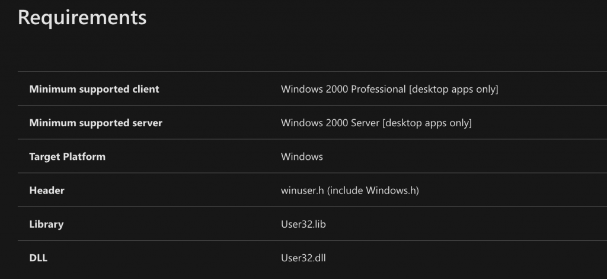

저번에 올렸던 Engineering Antivirus evasion를 이어서 Part 2의 번역본도 들고 왔습니다.

저번의 발 번역에 이어서 이번에도 의역과 오역이 난무하는 글이므로 글이 이해가 안 되시거나 얘가 왜 이렇게 썼는지 이해가 안 되시는 부분이 있으시면 바로 지적해주시기 바랍니다!


> 원문글 : [Engineering antivirus evasion (Part II)](https://blog.scrt.ch/2020/07/15/engineering-antivirus-evasion-part-ii/)


**tl;dr** 소프트웨어는 Windows 운영 체제와 상호 작용하기 위해 동적 링크 라이브러리(DLL)를 통해 함수를 가져온다. 이 함수들은 Import Address Table 테이블에 평문으로 작성되고 안티바이러스 소프트웨어는 이를 활용하여 악의적인 활동을 탐지한다. 우리는 Meterpreter를 중심으로 C/C++ 소프트웨어를 refactoring 하여 이러한 footprint를 제거할 수 있는 난독화 아이디어와 구현을 보여준다. 소스 코드는 [https://github.com/scrt/avcleaner](https://github.com/scrt/avcleaner)에서 확인할 수 있다.

## 소개

이전 글에서 정규식을 사용하지 않고 소스 코드에서 문자열 리터럴을 바꾸는 방법을 보여줬다. 바이너리의 footprint를 줄이고 정적 시그니처에 의존하는 보안 소프트웨어를 우회하는 것이 목적이다.

그러나 소스 코드의 문자열 리터럴 말고도 정적으로 수집하고 분석할 수 있는 정보들이 많다. 이 글은 바이너리에서 API import를 숨기는 방법과 C/C++로 작성된 모든 소프트웨어에서 그 작업을 자동화하는 방법에 대해서 다룰 것이다.

## API imports의 문제점

간단한 C 프로그램을 아래와 같이 작성하고 빌드하자

```cpp
#include <Windows.h>
int main(int argc, char** argv) { 
    MessageBox(NULL, "Test", "Something", MB_OK);
    return 0;
}
```

그리고 가장 좋아하는 컴파일러로 빌드해라. MinGW는 *macOS*에서 *Windows*로 크로스 빌드를 하는 데 사용된다.

```bash
x86_64-w64-mingw32-gcc test.c -o /tmp/toto.exe
```

그 후에 rabin2(radare2에 포함되어 있음) 또는 GNU strings 유틸리티를 사용하여 문자열을 리스트 할 수 있다.

```bash
rabin2 -zz /tmp/toto.exe | bat
```

```bash
 205   │ 201  0x00003c92 0x00408692 7   8    .idata        ascii   strncmp
 206   │ 202  0x00003c9c 0x0040869c 8   9    .idata        ascii   vfprintf
 207   │ 203  0x00003ca8 0x004086a8 11  12   .idata        ascii   MessageBoxA
 208   │ 204  0x00003d10 0x00408710 12  13   .idata        ascii   KERNEL32.dll
 209   │ 205  0x00003d84 0x00408784 10  11   .idata        ascii   msvcrt.dll
 210   │ 206  0x00003d94 0x00408794 10  11   .idata        ascii   USER32.dll
...

9557   │ 9553 0x0004f481 0x00458e81 30  31                 ascii   .refptr.__native_startup_state
9558   │ 9554 0x0004f4a0 0x00458ea0 11  12                 ascii   __ImageBase
9559   │ 9555 0x0004f4ac 0x00458eac 11  12                 ascii   MessageBoxA
9560   │ 9556 0x0004f4b8 0x00458eb8 12  13                 ascii   GetLastError
9561   │ 9557 0x0004f4c5 0x00458ec5 17  18                 ascii   __imp_MessageBoxA
9562   │ 9558 0x0004f4d7 0x00458ed7 23  24                 ascii   GetSystemTimeAsFileTime
9563   │ 9559 0x0004f4ef 0x00458eef 22  23                 ascii   mingw_initltssuo_force
9564   │ 9560 0x0004f506 0x00458f06 19  20                 ascii   __rt_psrelocs_start
```

이 함수를 `User32.dll` 라이브러리에서 가져와야 하므로 MessageBoxA 문자열은 3번 나타난다.(뒤에서 자세히 설명)

MessageBoxA 문자열은 안티바이러스에서 감지되지 않지만 다음 API들은 감지될 것이다.

- InternetReadFile
- ShellExecute
- CreateRemoteThread
- OpenProcess
- ReadProcessMemory
- WriteProcessMemory
- ...

## API imports 숨기기

윈도우 시스템에서 개발자들이 외부 라이브러리 함수를 호출하는 데 사용할 수 있는 방법들은 다음과 같다.

- Load-time dynamic linking
- Run-time dynamic linking

### Load-time dynamic linking

외부 라이브러리 함수를 호출하는 기본적인 방법이며 링커에 의해 자동적으로 처리된다. 빌드 사이클 동안 애플리케이션은 각 동적 링크 라이브러리(DLL)의 import library(.lib)에 연결된다. 가져온 각 함수에 대해 링커는 DLL에 대한 내용을 IAT에 엔트리를 작성한다.

애플리케이션이 시작될 때, 운영체제는 IAT를 탐색하여 프로세스의 주소 공간에 있는 모든 라이브러리 리스트를 매핑하고 가져온 각 함수의 주소는 DLL의 Export Address Table에 해당 엔트리를 가리키도록 업데이트된다.


Import Address Table (IAT)

### Run-time dynamic linking

다른 방법은 LoadLibrary로 해당 라이브러리를 로드한 후 GetProcAddress로 함수의 주소를 얻어 수동적으로 수행하는 것이다. 예를 들어 위의 예시를 run-time dynamic linking을 적용할 수 있다.

먼저 MessageBoxA API의 함수 포인터를 정의해야 한다. 시작하기 전에 C의 함수 포인터 구문에 대해 간단하게 설명한다.

```cpp
<return type> (*<your pointer name>)(arg1, arg2, ...);
```

볼 수 있듯이 star operator(함수 포인터이므로)와  괄호를 제외하면 함수를 정의하는 구문과 같다.

이제 MessageBox의 프로토타입이 필요한데 Windows SDK의 `winuser.h` 혹은 [MSDN](https://docs.microsoft.com/en-us/windows/win32/api/winuser/nf-winuser-messagebox)에서 찾을 수 있다.

```cpp
int MessageBox(
  HWND    hWnd,
  LPCTSTR lpText,
  LPCTSTR lpCaption,
  UINT    uType
);
```

앞서 말한 함수 포인터 구문은 정확한 정보로 업데이트할 수 있다.

```cpp
int (*_MessageBoxA)(
    HWND hWnd,
    LPCTSTR lpText,
    LPCTSTR lpCaption,
    UINT uType
);
```

MSDN은 이 함수가 `User32.dll`에서 내보내진 다고 설명한다.



MessageBoxA API는 `User32.dll`에서 내보내 진다. 따라서 애플리케이션은 이 라이브러리를 먼저 로드해야 한다.

```cpp
HANDLE hUser32 = LoadLibrary("User32.dll");
```

그 후 `GetProcAddress`를 사용하여 위에서 정의한 함수 포인터에 정확한 주소를 할당할 수 있다.

```cpp
_MessageBoxA fMessageBoxA = (_MessageBoxA) GetProcAddress(hUser32, "MessageBoxA");
```

여기서 원래 예를 `MessageBoxA` 대신 `fMessageBoxA`를 호출하도록 수정해야 하며 다음과 같다.

```cpp
#include <Windows.h>

typedef int (*_MessageBoxA)(
  HWND    hWnd,
  LPCTSTR lpText,
  LPCTSTR lpCaption,
  UINT    uType
);

int main(int argc, char** argv) {

    HANDLE hUser32 = LoadLibraryA("User32.dll");
    _MessageBoxA fMessageBoxA = (_MessageBoxA) GetProcAddress(hUser32, "MessageBoxA");
    fMessageBoxA(NULL, "Test", "Something", MB_OK);
    return 0;
}
```

`HWND, LCTSTR, UINT` 데이터 타입을 위해 `Windows.h` include가 필요하다. 이 간단한 예제를 빌드하고 실행하면 예상대로 alert box가 실행된다.


run-time dynamic linking을 하기 위해 `LoadLibrary`와 `GetProcAddress`을 사용하는 간단한 예시

### 최종 적용

`strings toto.exe`를 실행하면 아직 `User32.dll`과 `MessageBoxA` 문자열이 나타난다. 이 문자열들은 암호화되어야 하지만 이전 글에서 보여준 간단한 난독화 트릭으로 안티바이러스 탐지를 우회할 수 있다. 최종 결과는 다음과 같다.

```cpp
#include <Windows.h>

typedef int (*_MessageBoxA)(
  HWND    hWnd,
  LPCTSTR lpText,
  LPCTSTR lpCaption,
  UINT    uType
);

int main(int argc, char** argv) {

    char user32[] = {'U','s','e','r','3','2','.','d','l','l',0};
    HANDLE hUser32 = LoadLibraryA(user32);

    char messabox[] = {'M','e','s','s','a','g','e','B','o','x','A',0};
    _MessageBoxA fMessageBoxA = (_MessageBoxA) GetProcAddress(hUser32, messabox);
    fMessageBoxA(NULL, "Test", "Something", MB_OK);
    return 0;
}
```

이번에는 `strings`와 `rabin2` 둘 다 문자열을 찾을 수 없다.

```cpp
➜  x86_64-w64-mingw32-gcc test.c -o /tmp/toto.exe
➜  strings /tmp/toto.exe | grep MessageBox
➜  rabin2 -zz /tmp/toto.exe | grep MessageBox
➜
```

## 자동화된 소스 코드 리팩터링

이전 글에 설명된 것과 같은 방법으로 기존 코드 베이스를 refactoring 하여 의심스러운 API를 런타임에 로드하고 Import Address Table에서 제거할 수 있다. `libTooling`으로 구현된 기존의 작업을 기반으로 할 것이다.

이 작업을 다음과 같이 나열해보자.

- 이전 예제의 추상 구문 트리를 생성해라. 함수 호출을 수정하기 위해 노드를 조작하는 방법을 이해하는데 필요하다.
- [ASTMatcher](https://clang.llvm.org/docs/LibASTMatchersReference.html)를 사용하여 지정된 API에 대한 API 코드 베이스의 모든 함수 호출을 찾아라.
- 다른 함수 식별자로 모든 호출을 대체해라.
- 각 함수 호출 전에 `LoadLibrary/GetProcAddress` 호출을 삽입하라.
- 작동하는지 확인해라.
- 모든 의심스러운 API를 종합하고 난독화해라.

### MessageBox 애플리케이션의 추상 구문 트리

원본 MessageBox 애플리케이션의 Clang 추상 구문 트리를 보기 위해 당신의 Windows SDK 경로를 적용하여 스크립트를 사용하자

```cpp
WIN_INCLUDE="/Users/vladimir/dev/avcleaner"
CLANG_PATH="/usr/local/Cellar/llvm/9.0.1"

clang -cc1 -ast-dump "$1" -D "_WIN64" -D "_UNICODE" -D "UNICODE" -D "_WINSOCK_DEPRECATED_NO_WARNINGS"\
  "-I" "$CLANG_PATH/include" \
  "-I" "$CLANG_PATH" \
  "-I" "$WIN_INCLUDE/Include/msvc-14.15.26726-include"\
  "-I" "$WIN_INCLUDE/Include/10.0.17134.0/ucrt" \
  "-I" "$WIN_INCLUDE/Include/10.0.17134.0/shared" \
  "-I" "$WIN_INCLUDE/Include/10.0.17134.0/um" \
  "-I" "$WIN_INCLUDE/Include/10.0.17134.0/winrt" \
  "-fdeprecated-macro" \
  "-w" \
  "-fdebug-compilation-dir"\
  "-fno-use-cxa-atexit" "-fms-extensions" "-fms-compatibility" \
  "-fms-compatibility-version=19.15.26726" "-std=c++14" "-fdelayed-template-parsing" "-fobjc-runtime=gcc" "-fcxx-exceptions" "-fexceptions" "-fseh-exceptions" "-fdiagnostics-show-option" "-fcolor-diagnostics" "-x" "c++"
```

```bash
bash clang-astdump.sh test/messagebox_simple.c > test/messagebox_simple.c.ast
```


MessageBoxA API를 호출하는 간단한 애플리케이션의 Clang 추상 구문 트리

CallExpr 유형의 AST 노드를 찾으면 소스 코드에서의 함수 호출을 찾을 수 있다. 위 사진에 나와있는 것처럼 실제 호출되는 함수 이름은 하위 노드 중 하나에 지정되어 있으므로 나중에 접근할 수 있어야 한다.

### 특정 API의 함수 호출 찾기

[ASTMatcher](https://clang.llvm.org/docs/LibASTMatchersReference.html)는 특정 함수에 대한 모든 함수 호출을 열거하는데 필요하다. 우선 이전 글에서 사용된 것보다 더 복잡하므로 이 matcher에 맞는 구문을 얻는 것이 중요하다. 적합한 것을 찾기 위해서 소스 코드에서 custom query를 실행할 수 있는 interactive tool인 `clang-query`를 사용했다. 흥미롭게도 이것은 libTooling 기반이고 이 글에서 보여준 어떤 것보다 훨씬 강력하다.

```bash
clang-query> match callExpr(callee(functionDecl(hasName("MessageBoxA"))))

Match #1:

/Users/vladimir/dev/scrt/avcleaner/test/messagebox_simple.c:6:5: note: "root" binds here
    MessageBoxA(NULL, "Test", "Something", MB_OK);
    ^~~~~~~~~~~~~~~~~~~~~~~~~~~~~~~~~~~~~~~~~~~~~
1 match.
clang-query>
```

시행착오와 명령 줄 완성(tab completion)으로 빠르게 작업 솔루션에 접근할 수 있었다. matcher가 잘 동작하는 것을 확인했으니 이전 글에서 수행한 것과 같은 새로운 [ASTConsumer](https://clang.llvm.org/doxygen/classclang_1_1ASTConsumer.html)를 생성할 수 있다. `clang-query`를 사용하여 수행한 것을 C++ 재현하는 것이다.

```cpp
class ApiCallConsumer : public clang::ASTConsumer {
public:

    ApiCallConsumer(std::string ApiName, std::string TypeDef, std::string Library)
            : _ApiName(std::move(ApiName)), _TypeDef(std::move(TypeDef)), _Library(std::move(Library)) {}

    void HandleTranslationUnit(clang::ASTContext &Context) override {
        
        using namespace clang::ast_matchers;
        using namespace AVObfuscator;

        llvm::outs() << "[ApiCallObfuscation] Registering ASTMatcher for " << _ApiName << "\n";
        MatchFinder Finder;
        ApiMatchHandler Handler(&ASTRewriter, _ApiName, _TypeDef, _Library);

        const auto Matcher = callExpr(callee(functionDecl(hasName(_ApiName)))).bind("callExpr");

        Finder.addMatcher(Matcher, &Handler);
        Finder.matchAST(Context);
    }

private:
    std::string _ApiName;
    std::string _TypeDef;
    std::string _Library;
};
```

중요한 구현 세부 사항은 많은 다른 함수들에 적용할 수 있는 가능성을 제공하는 것이고 최종적인 목표는 각 수정된 API 함수에 `LoadLibrary/GetProcAddress`를 삽입하는 것이므로 함수 프로토타입과 DLL 이름을 제공해야 한다.

그렇게 하면 수정할 API만큼 많은 [ASTConsumers](https://clang.llvm.org/doxygen/classclang_1_1ASTConsumer.html)를 등록할 수 있다. 이 [ASTConsumer](https://clang.llvm.org/doxygen/classclang_1_1ASTConsumer.html)의 인스턴스화는 [ASTFrontendAction](https://clang.llvm.org/doxygen/classclang_1_1FrontendAction.html)에서 수행되야만 한다:


`main.cpp`의 주요 변경점.

이것은 이전 글에서 작업한 기존 코드에 대한 유일한 변경점이다. 우리가 추가할 코드들은 `ApiMatchHandelr.cpp`를 만드는 것부터 시작한다.

matcher는 콜백 함수와 함께 제공되므로 다음 하나를 제공하자.

```cpp
void ApiMatchHandler::run(const MatchResult &Result) {

    llvm::outs() << "Found " << _ApiName << "\n";

    const auto *CallExpression = Result.Nodes.getNodeAs<clang::CallExpr>("callExpr");
    handleCallExpr(CallExpression, Result.Context);
}
```

섹션의 시작 부분에서 리스트로 분리된 작업들은 아래 메소드를 통해 코드로 바꿀 수 있다.

```cpp
bool handleCallExpr(const clang::CallExpr *CallExpression, clang::ASTContext *const pContext);

bool replaceIdentifier(const clang::CallExpr *CallExpression, const std::string &ApiName,
                        const std::string &NewIdentifier);
bool
addGetProcAddress(const clang::CallExpr *pCallExpression, clang::ASTContext *const pContext,
                    const std::string &NewIdentifier, std::string &ApiName);

clang::SourceRange findInjectionSpot(clang::ASTContext *const Context, clang::ast_type_traits::DynTypedNode Parent,
                                        const clang::CallExpr &Literal, uint64_t Iterations);
```

### 함수 호출 대체

이것은 가장 사소한 부분이다. 목표는 AST의 `MessageBoxA`를 무작위 식별자로 대체하는 것이다. 이러한 무작위 변수 초기화는 다음 섹션에서 수행된다.

```cpp
bool ApiMatchHandler::handleCallExpr(const CallExpr *CallExpression, clang::ASTContext *const pContext) {

    // generate a random variable name
    std::string Replacement = Utils::translateStringToIdentifier(_ApiName);

    // inject Run-time dynamic linking
    if (!addGetProcAddress(CallExpression, pContext, Replacement, _ApiName))
        return false;

    // MessageBoxA -> random identifier generated above
    return replaceIdentifier(CallExpression, _ApiName, Replacement);
}
```

[ReplaceText](https://clang.llvm.org/doxygen/Rewriter_8h_source.html#l00164) Clagn API는 함수 식별자의 이름을 변경하는 데 사용된다.

```cpp
bool ApiMatchHandler::replaceIdentifier(const CallExpr *CallExpression, const std::string &ApiName,
                                        const std::string &NewIdentifier) {
    return this->ASTRewriter->ReplaceText(CallExpression->getBeginLoc(), ApiName.length(), NewIdentifier);
}
```

### LoadLibrary/GetProcAddress 삽입

우리가 추가하고자 하는 API에 Run-time dynamic linking을 추가하는 과정은 다음과 같다:

- translation unit의 상단 혹은 enclosing 함수 안에 API 프로토타입을 추가해라. 쉽게 하기 위해 우리는 후자를 선택하지만 동일한 함수에서 API를 여러 번 호출할 경우 이미 추가되었는지 확인할 필요가 있다.
- 아래 라인을 추가해라

    `HANDLE <random identifier> LoadLibrary(<library name>);`

- `GetProcAddress` 호출을 추가해라

물론 이 작업을 하면서 문자열 리터럴을 삽입하지 않기 위해 각 문자열을 스택 문자열로 작성해야 한다. 이것은 코드를 읽기 지루하게 만들지만 복잡하진 않다.

```cpp
bool ApiMatchHandler::addGetProcAddress(const clang::CallExpr *pCallExpression, clang::ASTContext *const pContext,
                                        const std::string &NewIdentifier, std::string &ApiName) {

    SourceRange EnclosingFunctionRange = findInjectionSpot(pContext, clang::ast_type_traits::DynTypedNode(),
                                                           *pCallExpression, 0);

    std::stringstream Result;

    // add function prototype if not already added
    if(std::find(TypedefAdded.begin(), TypedefAdded.end(), pCallExpression->getDirectCallee()) == TypedefAdded.end()) {

        Result << "\t" << _TypeDef << "\n";
    }

    // add LoadLibrary with obfuscated strings
    std::string LoadLibraryVariable = Utils::translateStringToIdentifier(_Library);
    std::string LoadLibraryString = Utils::generateVariableDeclaration(LoadLibraryVariable, _Library);
    std::string LoadLibraryHandleIdentifier = Utils::translateStringToIdentifier("hHandle_"+_Library);
    Result << "\t" << LoadLibraryString << std::endl;
    Result << "\tHANDLE " << LoadLibraryHandleIdentifier << " = LoadLibrary(" << LoadLibraryVariable << ");\n";

    // add GetProcAddress with obfuscated string: TypeDef NewIdentifier = (TypeDef) GetProcAddress(handleIdentifier, ApiName)
    std::string ApiNameIdentifier = Utils::translateStringToIdentifier(ApiName);
    std::string ApiNameDecl = Utils::generateVariableDeclaration(ApiNameIdentifier, ApiName);
    Result << "\t" << ApiNameDecl << "\n";
    Result << "\t_ "<< ApiName << " " << NewIdentifier << " = (_" << ApiName << ") GetProcAddress("
           << LoadLibraryHandleIdentifier << ", " << ApiNameIdentifier << ");\n";

    TypedefAdded.push_back(pCallExpression->getDirectCallee());

    // add everything at the beginning of the function.
    return !(ASTRewriter->InsertText(EnclosingFunctionRange.getBegin(), Result.str()));
}
```

### Test

```cpp
git clone https://github.com/scrt/avcleaner
mkdir avcleaner/CMakeBuild && cd avcleaner/CMakeBuild
cmake ..
make
cd ..
```

전부 잘 동작하는지 테스트하기 위해 아래 테스트 파일을 사용하자.

```cpp
#include <Windows.h>

int main(int argc, char** argv) {

    MessageBoxA(NULL, "Test", "Something", MB_OK);
    MessageBoxA(NULL, "Another test", "Another something", MB_OK);
    return 0;
}
```

obfuscator 실행!

```cpp
./CMakeBuild/avcleaner.bin test/messagebox_simple.c --strings=true --api=true -- -D _WIN64 -D _UNICODE -D UNICODE -D _WINSOCK_DEPRECATED_NO_WARNINGS\
 -I /usr/local/Cellar/llvm/9.0.1\
 -I /Users/vladimir/dev/scrt/avcleaner/Include/msvc-14.15.26726-include\
 -I /Users/vladimir/dev/scrt/avcleaner/Include/10.0.17134.0/ucrt\
 -I /Users/vladimir/dev/scrt/avcleaner/Include/10.0.17134.0/shared\
 -I /Users/vladimir/dev/scrt/avcleaner/Include/10.0.17134.0/um\
 -I /Users/vladimir/dev/scrt/avcleaner/Include/10.0.17134.0/winrt -w -fdebug-compilation-dir -fno-use-cxa-atexit -fms-extensions -fms-compatibility -fms-compatibility-version=19.15.26726 -std=c++14 -fdelayed-template-parsing -fobjc-runtime=gcc -fcxx-exceptions -fexceptions -fdiagnostics-show-option -fcolor-diagnostics -x c++ -ferror-limit=1900 -target x86_64-pc-windows-msvc19.15.26726 -fsyntax-only -disable-free -disable-llvm-verifier -discard-value-names -dwarf-column-info -debugger-tuning=gdb -momit-leaf-frame-pointer -v
```

결과 확인!

```cpp
#include <Windows.h>

int main(int argc, char** argv) {
    
    const char  hid_Someth_lNGj92poubUG[] = {'\x53','\x6f','\x6d','\x65','\x74','\x68','\x69','\x6e','\x67',0};

    const char  hid_Anothe_UP7KUo4Sa8LC[] = {'\x41','\x6e','\x6f','\x74','\x68','\x65','\x72','\x20','\x74','\x65','\x73','\x74',0};

    const char  hid_Anothe_ACsNhmIcS1tA[] = {'\x41','\x6e','\x6f','\x74','\x68','\x65','\x72','\x20','\x73','\x6f','\x6d','\x65','\x74','\x68','\x69','\x6e','\x67',0};
    typedef int (*_MessageBoxA)(HWND hWnd, LPCTSTR lpText, LPCTSTR lpCaption, UINT uType);
    TCHAR hid_User___Bhk5rL2239Kc[] = {'\x55','\x73','\x65','\x72','\x33','\x32','\x2e','\x64','\x6c','\x6c',0};

    HANDLE hid_hHandl_PFP2JD4HjR8w = LoadLibrary(hid_User___Bhk5rL2239Kc);
    TCHAR hid_Messag_drqxgJLSrxfT[] = {'\x4d','\x65','\x73','\x73','\x61','\x67','\x65','\x42','\x6f','\x78','\x41',0};

    _MessageBoxA hid_Messag_1W70P1kc8OJv = (_MessageBoxA) GetProcAddress(hid_hHandl_PFP2JD4HjR8w, hid_Messag_drqxgJLSrxfT);
    TCHAR hid_User___EMmJBb201EuJ[] = {'\x55','\x73','\x65','\x72','\x33','\x32','\x2e','\x64','\x6c','\x6c',0};

    HANDLE hid_hHandl_vU1riOrVWM8g = LoadLibrary(hid_User___EMmJBb201EuJ);
    TCHAR hid_Messag_GoaJMFscXsdw[] = {'\x4d','\x65','\x73','\x73','\x61','\x67','\x65','\x42','\x6f','\x78','\x41',0};

    _MessageBoxA hid_Messag_6nzSLR0dttUn = (_MessageBoxA) GetProcAddress(hid_hHandl_vU1riOrVWM8g, hid_Messag_GoaJMFscXsdw);
hid_Messag_1W70P1kc8OJv(NULL, "Test", hid_Someth_lNGj92poubUG, MB_OK);
    hid_Messag_6nzSLR0dttUn(NULL, hid_Anothe_UP7KUo4Sa8LC, hid_Anothe_ACsNhmIcS1tA, MB_OK);
    return 0;
}
```

볼 수 있듯이 문자열 난독화와 API 난독화 패스의 조합은 상당히 강력하다. `Test` 문자열은 작은 문자열은 무시하는 것으로 결정했기 때문에 남아있다. 그 후 난독화 소스 코드는 빌드할 수 있다.

```cpp
$ cp test/messagebox_simple.c.patch /tmp/test.c
$ x86_64-w64-mingw32-gcc /tmp/test.c -o /tmp/toto.exe
```

윈도우10 가상 머신에서 테스트 결과 원래 기능이 계속 작동하는 것으로 보인다. 더 중요한 것은 난독화된 바이너리에 `MessageBox` 문자열이 없다.

```cpp
$ rabin2 -zz /tmp/toto.exe | grep MessageBox | wc -l
  0
```

### Generalisation

안티바이러스 ESET Nod32 관련해서 우리는 `samlib.dll`과 관련된 API imports 중 특히 아래에 있는 API들을 숨기는 것이 중요하다는 것을 발견했다.

- SamConnect
- SamConnectWithCreds
- SamEnumerateDomainInSamServer
- SamLookupDomainInSamServer
- SamOpenDomain
- SamOpenUser
- SamOpenGroup
- SamOpenAlias
- SamQueryInformationUser
- SamSetInformationUser
- SamiChangePasswordUser
- SamGetGroupsForUser
- SamGetAliasMembership
- SamGetMembersInGroup
- SamGetMembersInAlias
- SamEnumerateUsersInDomain
- SamEnumerateGroupsInDomain
- SamEnumerateAliasesInDomain
- SamLookupNamesInDomain
- SamLookupIdsInDomain
- SamRidToSid
- SamCloseHandle
- SamFreeMemory

이러한 함수들은 AV 엔진 어디에서도 블랙리스트에 있지 않지만 내부 탐지 신뢰 점수를 높인다. 이러한 함수에 `ApiCallConsumer`를 등록해야 하므로 이름과 함수 프로토타입이 필요하다.

```cpp
static std::map<std::string, std::string> ApiToHide_samlib = {
    {"SamConnect",                     "typedef NTSTATUS (__stdcall* _SamEnumerateDomainsInSamServer)(SAMPR_HANDLE ServerHandle, DWORD * EnumerationContext, PSAMPR_RID_ENUMERATION* Buffer, DWORD PreferedMaximumLength,DWORD * CountReturned);"},
    {"SamConnectWithCreds",            "typedef NTSTATUS(__stdcall* _SamConnect)(PUNICODE_STRING ServerName, SAMPR_HANDLE * ServerHandle, ACCESS_MASK DesiredAccess, BOOLEAN Trusted);"},
    {"SamEnumerateDomainsInSamServer", "typedef NTSTATUS(__stdcall* _SamConnectWithCreds)(PUNICODE_STRING ServerName, SAMPR_HANDLE * ServerHandle, ACCESS_MASK DesiredAccess, LSA_OBJECT_ATTRIBUTES * ObjectAttributes, RPC_AUTH_IDENTITY_HANDLE AuthIdentity, PWSTR ServerPrincName, ULONG * unk0);"},
    ...
}
```

그 후 이러한 컬렉션을 반복하고 각 컬렉션을 처리하기 위해 `main.cpp`를 업데이트한다.

```cpp
for(auto const& el: ApiToHide_samlib){

    auto Cons = std::make_unique<ApiCallConsumer*>(new ApiCallConsumer(el.first, el.second,
                                                                        "samlib.dll"));
    consumers.push_back(*Cons);
}
```

여기서 `std::make_unique`는 이 반복문에서 힙에 있는 객체를 인스턴스화할 수 있기에 중요하고 나중에 이러한 객체를 수동으로 쉽게 해제할 수 있다. 이것은 더 이상 사용하지 않을 때 자동으로 해제될 것이다.

마지막으로 mimikatz, 특히 `kuhl_m_lsadump.c`로 난독화를 테스트할 수 있다.

```bash
bash run_example_mimikatz.sh test/kuhl_m_lsadump.c
```

이것은 흥미로운 결과를 만든다.


`samlib.dll`에서 가져온 API를 위한 Run-time dynamic linking

실제 함수 호출은 완벽하게 수정되었다.


`samlib.dll`에서 가져온 함수 호출들은 완벽하게 수정되었다.

`PRINT_ERROR` 매크로 내부의 문자열은 `do{}while(0)`을 통해 매크로를 사용하여 난독화 되지 않았다. obfuscator의 버그를 찾는데 `mimikatz`보다 좋은 프로젝트를 찾기 못했다.

## 개선사항

이 부분은 여러분을 위해 남겨진 작업들이다 🙂

### More stealth

run-time dynamic linking을 수행하기 위해 실제로 API `LoadLibrary/GetProcAddress`가 필요하지 않다.

후킹을 피하기 위해 이 함수들은 재구현하는 것이 좋고 이미 그것을 할 수 있는 오픈소스 프로젝트가 있다.([ReflectiveDllInjection](https://github.com/rapid7/ReflectiveDLLInjection/))

여기까지 읽었다면, translation unit의 상단에 이러한 함수들을 위한 구현을 추가하고(`findInjectionSpot` 사용) WinAPI 대신에 구현을 사용하기 위해 메소드 `addGetProcAddress`를 업데이트하면 된다는 것을 알 것이다.

### Error handling

- `LoadLibrary`는 성공적으로 수행되지 않을 경우 `NULL`을 반환하므로 이에 대한 검사를 추가하여 오류를 정상적으로 복구할 수 있다. 현재 상황에서 크래시가 매우 잘 날 수도 있다.
- `GetProcAddress`도 오류가 발생하면 `NULL`을 반환하므로 이것도 확인하는 것이 중요하다.

## 결론

이 글에서 우리는 정규식을 사용하지 않고 C/C++ 코드 베이스에서 함수 호출을 정확하게 교체할 수 있는 방법을 보여줬다. 모든 것은 안티바이러스 소프트웨어가 우리가 pentest를 하는 동안 사용하는 Meterpreter나 다른 소프트웨어에 관해 행동 정보를 정적으로 수집하는 것을 막기 위해 진행되었다.

ESET Nod32에 적용된 이 작업은 모든 Meterpreter 모듈이 탐지되지 않도록 하는 주요 단계였고 더 발전된 제품에 도움이 되었다.

API imports를 숨기는 것도 하나지만 악성코드가 실행되면 보안 소프트웨어가 API 호출 모니터링에 의해 행동 정보를 수집하는 방법도 있다.

그런 관점에서 다음 글은 의심스러운 Win32 API가 직접적인 syscalls을 하도록 자동적으로 refactoring 하는 것이다. 이것은 Cylance, Traps과 Kaspersky 같은 AV의 userland hook을 통한 런타임 탐지 우회의 핵심 단계이다.

## 출처

[1] The Rootkit Arsenal, Chapter 11, p.480.

[2][https://devblogs.microsoft.com/cppblog/exploring-clang-tooling-part-2-examining-the-clang-ast-with-clang-query/](https://devblogs.microsoft.com/cppblog/exploring-clang-tooling-part-2-examining-the-clang-ast-with-clang-query/)