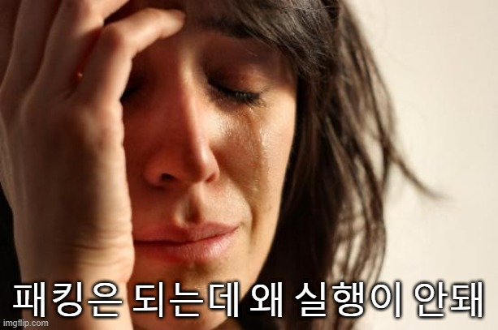
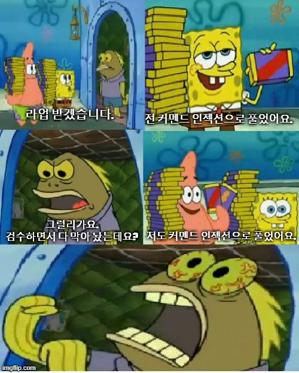

# 사건의 전말

매년 크리스마스에 이벤트 형식으로 열리는 솔로들을 위한(?) 크리스마스 CTF의 주최를 이번에 세종대학교 정보보안 동아리 SSG와 함께 맡았습니다. 사실 우리가 문제를 만들어야 된다는 이야기도 갑자기 들었죠. Fabu1ous는 맡게 된 과정을 눈 앞에서 목격했으나 idioth과 L0ch는 통보를 받았습니다...

> ??? : 크리스마스 때 뭐하냐
idioth : 데이트요
??? : 여자 친구 없잖아
idioth : 그때는 있겠죠
??? : 문제나 만들어라
L0ch : 전 있는데용 ㅎㅎ
??? : 알 바 아니고

불안한 직감은 언제나 옳습니다. '우리 문제 만들어야 돼'를 듣자마자 직감했습니다. 아 크리스마스 CTF구나... 처음엔 인당 두 문제씩 만들기로 했습니다. 하지만 여기서 사건이 하나 벌어지는데...

데이터 챌린지를 나가기로 했었는데 팀장 녀석이 분야를 착각해서 신청을 못했습니다. 그로 인해 각 3문제를 만들기로...ㅋㅋㅋㅋ

> idioth : 얘들아 우리 세 문제씩 만들기로 했어 ㅎㅎ
L0ch, Fabu1ous : ???
idioth : 데이터 챌린지 신청 못함 ㅋㅋㅋㅋㅋㅋ

처음에 만들기로 한 문제에 대한 버그 클래스는 아래와 같습니다만...

- idioth
    - rev : custom packer
    - web : cve-2020-9484 tomcat rce
    - misc : snake
- L0ch
    - pwn : Windows pwnable uaf
    - pwn : Linux pwnable type confusion
    - rev : obfuscate
- Fabu1ous
    - pwn : angr challenge
    - pwn : uninit stack
    - misc : 미정

여러 가지 이유로 많이 바뀌었습니다... 코로나 때문에 갑자기 학기가 1주일 당겨지면서 11월과 12월 초가 통째로 바빠질 줄은 그들은 몰랐습니다...

학기가 끝난 후 그들은 랩실에 갇혀서 근 1주일을 밤새며 문제를 만들기에 박차를 가하게 됩니다.

대회 전날 그들의 모습

# idioth

안녕하세요. idioth입니다. 뭐... 처음에 대회를 한다 했을 때는 좀 많이 당황했습니다.

일단 5월 중순에 소집 해제하고 이제 막 다시 공부를 시작한 참이라서... 출제하기 전까지 CTF를 2개 정도 나갔는데 문제를 baby-rev 정도밖에 못 풀었습니다. 뭔가 좀 많이 바뀐 것 같더라고요. 포너블을 내기에는 기억도 어렴풋하고...

암호 공부를 해야겠다는 생각은 늘 하고 있었는데 최근에 어떤 문제들이 많은가 봤더니 암호랑 접목을 많이 시켜서 나오더라고요. 일단 암호는 내가 할 줄 모르니 패스... 그럼 뭐 만들지? 하다가 복무 중에 했던 Custom Packer 스터디가 떠올랐습니다.

아! 이거다! 패커 딱 대!

문제 만들어야 된다는 소리를 들은 후 주제를 대충 정한 후 바로 다음 달부터 패커 개발에 들어갔습니다. 일단 패커 관련된 문제가 나오지 않았다는 것은... 다들 아시죠? (ㅎㅎ)

1. 64비트로 만들자
2. 어 내가 그때 스터디했던 건 32비트네?
3. 너무 옛날 거네? 게다가 게시글도 사라졌네?
4. ...github에 올라와있는 걸 보고 어떤 흐름으로 가면 좋은 지 보자

그리고 열심히 열심히 한 달에 걸쳐서 완성을 했습니다! 역시 난 한다면 하는 남자! 하지만...

코드를 계속 보는데도 도대체 어디가 문제인지 모르겠습니다... 아 시간이 없는데 이제 과제 폭풍이 몰려오고 있는데... 어떡하지?

일단 tomcat부터 만들자... tomcat 자체에 취약점이 있으니 웹 사이트 구현하고 트리거할 수 있게 기능 구현만 하면 되니까 금방 하겠지? 웹 하는 애들이 도와준댔어.

응 그런거 없어~ 웹 만들어 본거라곤 공부 처음 시작할 때 html, php와 django를 통해 만들어 본 것이 전부라서 맨 땅에 헤딩을 하면서 구현을 시작했습니다. 게다가 학교에서 python 학부 수업 조교도 진행해서 뭔가 할 일이 굉장히 많았죠(핑계야)

> 기상 - 하루 한 줄 - 조교 - 과제 - (블로그 글) - 문제 만들기

위의 순환을 계속 돌았습니다. 겉으로의 구현도 끝나고 파일 업로드 등의 구현도 11월 말에 다 끝났습니다. 하지만 가장 큰 문제가 있었습니다.

버전은 어떻게 알려 줄 것이고 지금 상태에선 session 폴더와 모든 것이 게싱이다.

여러 가지 사람들과 이야기를 해본 끝에 LFI를 통해서 모든 파일을 다 읽을 수 있게 하도록 했습니다.

그 과정에서 path traversal 필터링을 거는 게 좋을까 말까에 대해서는 그래도 `../` 같은 기본적인 거는 걸어놓는 게 좋지 않을까?라는 생각을 했습니다.

근데 주변에서 어차피 그런 거 보이면 일단 때려 넣고 보니까 기본적인 거는 걸어놓는 게 좋아.라는 말을 듣고 `gift` 문제가 탄생하게 됩니다.

다 만들었을 때는 그래도 웹 처음 만든 것 치고 괜찮은 것 같은데?라는 생각을 했으나... 저의 오만함이었음을 깨달았습니다. 으으... 저는 게싱을 최대한 줄였다고 생각했지만 제가 만들었던 문제라서 그렇게 생각했던 것 같습니다 ㅜㅜ...

하지만 가장 큰 문제는 `gift` 하나 만들었는데 대회가 일주일 남았다.

일단 리버싱 문제를 하나 만들어야지... 그냥 간단한 것 내야겠다... crackme 하나 해야지~ 하고 만들었습니다. 근데 뭔가 너무 허전해서 고민을 했습니다. 아 뭔가 없나... 하다가 딱 생각이 났습니다.

오 이제 맥도 ARM으로 나오는데 ARM 리버싱 할까? ㄱㄱㄱㄱ arm 어셈 분석하는 걸로 내고~ ida hexrays를 막아놓자. 어차피 잘하시는 분들은 arm도 금방 보실 테고 하니까 anti-hexrays는 금방 푸시겠지?

ida에서는 깨져서 나오는데... 왜 ghidra에서는 제대로 나오는 걸까...?

??? : 야 그냥 핸드 레이로 내자

idioth : ㄱ 어차피 baby 용으로 낸 거니까 괜찮겠지?

-`lock` 끝-

아 이제 snake 하나만 남았네요 ㅎㅎ misc 문제라서 너무 부담이 없습니다~ 뱀 게임 재미나게 하나 만들어야지~~~~~하고 생각하는 와중에 앞을 보니까 절망의 구렁텅이에 빠진 한 남자가 있었습니다.

> L0ch : 나만익스안돼나만익스안돼나만익스안돼나만익스안돼나만익스안돼나만익스안돼나만익스안돼나만익스안돼나만익스안돼나만익스안돼나만익스안돼나만익스안돼나만익스안돼나만익스안돼나만익스안돼나만익스안돼나만익스안돼

앞에서 보는데 진짜 너무 무섭더라고요. 그래서 그냥 제 misc 문제를 주고 reversing을 제가 내기로 했습니다. 참가한 대회 중 하나에서 angr로 푼 문제가 있어서 angr 문제를 내자. 근데 이것도 arm으로 내면 재밌겠당. 하고 후딱 만들었습니다.

근데 arm에서는 왜 simulation manager를 돌려도 값이 안 나오지? 그냥 x64로 완성하고 난 후 L0ch를 보니 뱀 게임을 완성하고 자기 type confusion 못 만들 것 같은데 baby pwnable 뭐 낼 지 물어보더라고요. 그래서 그냥 던져 줬습니다. arm rop 재밌을 듯? `baby_RudOlPh` 탄생~

근데 angr 문제를 검수하고 값을 연산하는 로직을 수정하고 나니까 이상하게 값이 밀려서 나왔습니다. 처음에 c++로 짰었고 전체적으로 계속 수정을 했는데 input이 이상하게 들어가거나 해서 코드가 전체적으로 꼬여버렸습니다. 결국 c로 옮기게 되었고 c로 옮겨서 나오는 값들을 확인해보자 byte 몇 개가 사라지더라고요.

대회는 당장 내일이고 급하니까 범위가 넘어가서 그런가 보다 생각하고 그냥 크게 연산하는 로직들을 지워버리고 만들었습니다. 그렇게 `angrforge` 탄생. 사실 이 문제는 욕먹을 거라 생각했습니다. 손으로 푸신 분 계시던데 진짜 죄송합니다... 다음에 문제 만들 일이 생긴다면 이런 *** 같은 의도 파악조차 안 되는 문제는 만들지 않겠습니다.

대회는 여차저차 잘 끝났지만 마음이 불편했습니다. 나는 나대로 열심히 했는데 결과물이 좋지 않았으니까요. 일단 내가 생각한 대로 만들어진 문제가 없었습니다. `lock`이나 `angrforge` 같은 경우는 시간에 쫓겨 로직에 대한 큰 고민 없이 만든 문제들이라서 마음에 들지 않았습니다.

거의 대부분의 문제 제작 시간을 `gift`에 쏟았고, 실제 이러한 서비스가 운영돼서 이 취약점이 존재한다면 이렇게 접근하면 재밌겠다.라는 시나리오도 잘 만들었다고 생각했습니다.

근데 이건 출제자의 생각이지 참여하신 분들이 그렇게 생각 안 하신다면 그게 맞는 거죠.

대회가 끝나고 나서 심야 버스를 타고 집으로 출발했습니다. 거의 40시간 넘게 깨어 있었던 것 같네요. 버스에서 잠도 안 오더군요. 그냥 현타가 세게 왔습니다.

아... 내가 진짜 못하는구나. 내가 생각했던 것이나 다른 문제들을 풀거나 분석하면서 봤던 로직들을 구현하지도 못하고, 생각의 넓이나 깊이도 부족하구나. 내가 생각한 것보다 사람들은 더 넓은 것을 보는구나.

돌이켜 생각해보니 사람들이 봤을 때 주제나 컨셉이 재밌고 신선한 것에만 너무 신경 쓰지 않았나? 내가 사람들에게 그 재미를 온전히 전달할 만큼의 기본 베이스가 되는가?라는 생각이 들었습니다.

집에 돌아와서 샤워하고 누웠는데 해가 뜰 때까지 잠을 못 잤습니다. 잡생각이 많아서 일단 지쳐서 잠들고 일어나니 상위권 팀들 라업이 기대가 되더군요. `lock`이랑 `angrforge`는 모르겠고 `gift`를 어떻게 푸셨고 어떻게 느끼셨는지에 대한 생각이 정말 컸습니다.

라업을 다 보고 나서 라업을 다 뜯어고쳤습니다. 좀 더 내가 생각했던 것과 고민했던 것이 무엇인지 그리고 2021년에는 어떤 식으로 공부하면 좋을지 이번 기회에 제가 부족했던 것, 부족함을 알고 있었지만 애써 외면하던 것들에 직면하게 되어서 좋은 경험이었던 것 같습니다.

다들 미천한(?) 문제 푸시느라 고생 많으셨습니다. 재밌게 즐기셨다면 정말 좋았을 텐데...! 다들 새해 복 많이 받으세요!

# L0ch

안녕하세요. L0ch입니다! CTF 문제 출제 경험이라고는 동아리 내부 CTF 밖에 없던 저에게 크리스마스 CTF 문제를 만들어야 한다는 소식을 들었을 때..

> ??????? 문제를 만들라구요???

진짜 딱 저 표정이었습니다. 거짓말 아니고 진짜로요.

국방의 의무를 수행하느라 백지가 된 머리로 열심히 따라가고 있던 와중에 (대한민국 군인들 화이팅 ㅠㅠ) CTF 문제를 그것도 세 문제나 만들라니요.. 아무튼 데이터 챌린지 신청 못한 팀장 탓임 @idioth @idioth @idioth

그렇게 열심히 최근 CTF 트렌드를 찾아보고 어느 정도 틀을 잡아가기 시작했습니다.

첫 번째 문제였던 address_book 이 나오게 된 배경입니다.

때는 하루 한 줄을 쓰기 위해 떠돌아다니던 중 Chrome의 공유 포인터 관련 UAF 취약점 정보를 보게 되었죠. 

거기에 영감을 받아 공유 포인터를 커스텀으로 구현해서 거기에 취약점을 만들어볼까? 
+ MS tuesday patch의 diff 패치를 바이너리에 적용해 binary diffing으로 취약점을 찾을 수 있도록 해볼까? 

이렇게 해서 나온 문제입니다. 물론 사람 인생이 계획대로만 될 리가 있나요 ㅎㅎ

문제는 제가 윈너블 경험이 부족하다는 점이었습니다. 버그헌팅을 하면서 원데이 몇 번 분석해본 게 전부인 저에게 취약점 설계부터 익스까지 한다? 멘탈이 아주 곱게 갈릴 거라는 걸 시작부터 예감했죠.

우선 C++의 공유 포인터를 구현하려면 당연히 C++을 써야 하는데 기본적인 OOP 개념이 부족했습니다. 문제를 만들던 중 코드 리뷰를 해보니까 진짜 개판 오 분 전이었는데 더한 문제는 어떻게 고쳐야 할지를 몰랐습니다..   분석하시면서 이거 왜 이렇게 짜 놨지 하는 부분이 있었을 텐데, 다 부족한 저의 개발실력 때문입니다.. 

또 하나 문제는.. 

> 아니 다 만들어놓고 익스가 왜 안되는데!!!!!!!!!!!!!!!!!!!!!!!!!!

원래 익스에 포함되는 과정 중 하나였던 `flag.txt` 파일 open을 함수가 계속 `응 파일 못 열었어 ㅋㅋ` 를 뱉는데 이게 무슨 경우지? 왜 파일을 못 여는 거지?? 혼잣말하면서 욕도 해보고 달래도 보고 열심히 삽질을 했지만 원인을 찾지 못해 결국 바이너리 내부에서 `flag.txt` 를 open만 하고 익스 과정 중 ROP 체인에서 open 과정을 빼고 file descriptor를 이용해 flag를 출력하는 것으로 타협을 볼 수밖에 없었습니다.

> 후일담
idioth : ㅋㅋㅋㅋ 너 address book 익스 할 때 진짜 무서웠던 거 아냐
본인 : ??? 왜요 나 왜
idioth : 누구 하나 걸리면 진짜 죽는단 표정이었어
Fabu1ous : ㅇㅈ
본인 :

취약점을 찾기 어렵게 만든 이유가 diff patch를 이용한 binary diffing으로 취약점을 찾을 수 있도록 의도한 거지만.. 계획에 차질이 생겨 diff patch도 적용을 못해 결과적으로 좋지 않은 퀄리티의 아쉬운 문제라고 생각합니다... 

그렇게 한 문제를 마무리하고 보니,  왜 시작도 안 한 두 문제가 남아있고 저는 기말고사를 눈앞에 두고 있는 걸까요?

> 저는 그렇게.. 학점을 놓아주었습니다

학점을 포기한 대가로 나머지 baby_RudOlPh와 picky_eater를 구상할 수 있었습니다. *~~등가교환의 법칙~~*

picky_eater는 idioth 팀장님의 아이디어를 쏙 빼왔습니다. address book과 고군분투하고있던 저를 불쌍하게 봤었나봐요. "이거 네가 할래?" 라며 snake 게임 컨셉의 아이디어를 주더라고요. 그 정도로 불쌍해 보였나?;; 아무튼 감사합니다 ㅎㅎ
그래도 만들 땐 재밌게 만들었던 문제인 것 같습니다!

마지막 baby_RudOlPh는 두 줄로 설명하겠습니다. 

> ??? : (회의 도중) 님들 생각해보니까 뉴비용 포너블 문제가 없는데요?

그래서 만들게 된 ARM(AArch64) ROP 문제입니다. 그냥 내면 재미없잖아요! 그래서 ARM을 끼얹었죠

(사실 기간 내에 원래 생각했던 type confusion 문제를 못 만들 것 같아서 뉴비문제 냈다는 건 안 비밀)

정리하고 보니까 더 잘할 수 있었음에도 그러지 못해 아쉬운 감정이 많이 남는 대회라고 생각이 드네요. 나중에 다른 CTF에 문제를 출제할 수 있는 기회가 올진 모르겠지만 기회가 된다면 더 많이, 철저하게 준비해서 좋은 퀄리티의 문제를 만들 수 있도록 노력하겠습니다. 부족한 제 문제를 풀어주신 모든 참가자 여러분들께 감사의 말씀드립니다..!

# Fabu1ous

- Oil-system & Match-maker

버그 잡는 건 정말 힘든 작업이군요. 대회 때 oil-system의 풀이 수가 20이던데 아마 모두 언인텐디드일거라 생각합니다. Match-maker도 메모리 leak 중 언인텐디드가 한 개 있었습니다. 솔직히 아주 조금 억울한 부분이 있지만 그게 무슨 의미가 있겠습니까... 이런 상황이 발생한 이유를 적어보고 성찰의 시간이나 가져봅시다.

1. 뱁새가 황새를 따라가면 다리가 찢어진다

    문제를 만들 때까진 몰랐는데 지금 보니 정말 별거 없는 문제더군요. 큰 틀만 보면 리턴 값을 조작해 `win()` 함수를 실행하는 문제들과 크게 다를 게 없습니다. 흔히 아는 만큼 보인다고 하죠. 어려운 문제를 만들겠다는 의욕은 앞섰지만 실력은 안 따라주고 결국 쓸데없이 복잡한 동작을 하는 문제가 탄생한 거 같습니다.

2. 돌다리도 두들겨 보고 건너라.

    최종 검사하세요. 두 번 하세요. 최종 검사의 검사도 하세요. 이번 사건 이후로 어떤 일이든 쉽게 확신을 갖진 않을 것 같습니다.

- No g

설문 조사에 의하면 이번 대회에서 호불호가 가장 심했던 문제네요. 셜록홈즈 암호( 춤추는 사람 그림 암호 )와 비슷한 느낌으로 crypto와 misc 그 사이 어딘가의 문제를 만들려고 해 봤습니다. No g라는 제목에서 힌트를 얻어 쉽게 푸신 분들도 있지만 그러지 못하고 기상천외한 삽질을 하신 분들도 있더군요. 가볍게 misc나 풀면서 머리 식히려고 봤다가 고통받으신 분들께 사죄하겠습니다. ㅎㅎ

죄송해요 ㅠㅠㅠㅠㅠ

2년 연속 Christmas CTF에 대해 안 좋은 기억만 남네요. 올해는 꼭 여친 사귀어서 Christmas CTF 말고 데이트하러 가야겠습니다. 

~~아이씨... 누가 여기다 양파를 가져다 놓은 거야!?~~