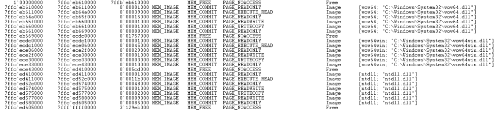
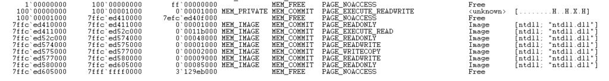

> 원문 글 : [MemFuck: Bypassing User-Mode Hooks](https://winternl.com/memfuck/)

## 서문

동적 악성코드 분석은 많은 AV/EDR/MDS에서 악성 프로그램을 탐지하는데 자주 사용하는 방식이다. 동적 분석은 정적 분석과 달리 실행 과정에서 만들어진 윈도우 API 호출을 캡처하고 분석하며 정적 분석보다 탐지율이 높다. system call을 캡처하는  많은 기술이 있지만 가장 많이 사용하는 것은 user-level hook이다. 이러한 hook은 악성 기능을 분석하기 위해 함수 호출을 가로챈다. 임의 실행 파일에서 API 호출의 시퀀스는 다음과 같다.

```
OpenProcess
VirtualAllocEx
WriteProcessMemory
CreateRemoteThreadEx
QueueUserAPC
NtAlertResumeThread
```

안티 바이러스들은 호출이나 그 조합을 기반으로 악성 행위를 정의한다. 안티 바이러스의 입장에서 특정한 호출 조합은 코드 인젝션이며 대부분 악의적이거나 원하지 않는 행동으로 판단된다.

user-mode hook은 안티 바이러스와 NGAV, EDR, sandbox, anti-cheat, DRM 등을 포함한 많은 보안 제품과 툴에서 사용된다. user-mode hook은 구현하기 쉽고, 안정적이고, 간단하며 성능 오버헤드가 적다.

대부분 user-land hook은 inline hook이며 control flow를 custom handler로 리다이렉트 시키기 위한 대상 함수 rewrite를 포함한다. 핸들러의 내부에서 파라미터들은 보존되고 요청된 함수를 실행하거나 분석할지 결정할 수 있다. 이것들은 잘 문서화되어 있으므로 이러한 개념에 익숙할 것이라고 가정할 것이다.

## 32-bit Hooks


32비트 user-land hook이 포함된다. 32비트 유저 모드 보안 제품은 대부분 가능한 깊은 위치에서 hook 하며 ntdll에 대부분의 의심스러운 함수들(NtQueueApcThread 등)이 존재한다. 해결 방법은 system call을 사용하여 원하는 기능을 직접적으로 호출하는 것이다. Ring3 후킹으로 모든 보안 제품을 우회할 수 있다.

필자는 5년 동안 32비트 윈도우를 접한 경우가 하나도 없으므로 일반적인 경우인 WoW64에서 동작하는 32비트 응용 프로그램에 대해 살펴볼 것이다.

## WoW64에서의 32비트 후킹


가장 흔한 악성코드의 인스턴스는 Wow64에서 동작하는 32비트 프로그램이다(64비트 머신에서 동작). NGAV와 EDR은 이러한 시나리오에서의 hook 구현이 미흡하다. 대부분 보안 제품은 x86 유저 모드 영역에서만 hook을 한다. user-mode hook을 활용하는 안티바이러스는 WoW64 layer에 hook을 위치하는 것이 좋지만 모든 업체가 그것을 구현하지는 않는다. [Sophos 우회에 관한 MDSec의 게시글](https://www.mdsec.co.uk/2020/08/firewalker-a-new-approach-to-generically-bypass-user-space-edr-hooking/)을 보아라.

많은 보안 제품들이 32비트 프로세스에서 WoW64 실행을 모니터링하지 않는다는 사실은 오랫동안 알려져 있었고 [악성코드 제작자](https://blog.malwarebytes.com/threat-analysis/2018/01/a-coin-miner-with-a-heavens-gate/)와 [red-team](https://outflank.nl/blog/2019/06/19/red-team-tactics-combining-direct-system-calls-and-srdi-to-bypass-av-edr/)에 의해 공격당했다. 필자가 분석한 악성코드 중에 얼마나 많은 것들이 이를 악용한 [rewolf's wow64ext](https://github.com/rwfpl/rewolf-wow64ext)를 포함하는지 말할 수 없다.

## 요약 : 기존 기술

- 단순히 함수의 Ntdll 버전을 호출하는 것
- [함수의 Wow64 버전을 호출하는 것](https://web.archive.org/web/20190407064851/https://blog.ensilo.com/globeimposter-ransomware-technical)
- [직접 Syscall 호출](https://cdn2.hubspot.net/hubfs/487909/ENSILO%20WHITEPAPER%20ENTER%20THE%20DARK%20GATE.pdf)
- 원본 thunk 추적 ([FireWalker](https://www.mdsec.co.uk/2020/08/firewalker-a-new-approach-to-generically-bypass-user-space-edr-hooking/))
- [보조 DLL 매핑](https://blog.malwarebytes.com/threat-analysis/2018/03/hancitor-fileless-attack-with-a-copy-trick/)
- Code splicing (byte stealing)

모두 잘 작동하고 좋지만 64비트 버전의 ntdll에 위치한 hook에서 동작하지 않을 수 있다. 필자의 관찰에서 이러한 레벨의 hook은 어떤 public 코드로도 본 적이 없고 어떤 안티바이러스도 구현하지 않았다. 몇 가지 존재할 것이라고 확신하지만 보지 못했다.

## MemFuck에 들어가며

Memfuck은 오직 PoC이며 production code와 유사하지 않다. 즉 필자는 유저 영역에서 가능한 강력한 anti-analysis 기술이라고 생각한다.

MemFuck은 다른 anti-analysis 방법으로 실험을 시작했다. 본질적으로 가능한 한 비어있는 프로세스를 생성하길 원했으므로 DLL이나 쉘 코드의 수정 없이 보안 제품을 attach 할 수 없었다. 필자는 2008년에 이 [게시글](https://gynvael.coldwind.pl/?id=93)을 발견했는데 매우 흥미로웠다. 물론 32비트 윈도우 XP에서 많은 변화가 있었으므로 많은 코드가 호환되지 않지만 대부분의 개념이 존재한다.


무엇이 ntdll을 필요로 하는가? 모든 결과는 특정한 DLL에 의존하므로 이를 망쳐버리면 어떠한 일이 일어날까

## Unmap Everything

MemFuck은 32비트 주소 영역에서 가능한 모든 것을 unmap 하는 것에 의해 시작된다. 물론 PEB/PEB64, TEB/TEB64와 [KUSER_SHARED_DATA](https://docs.microsoft.com/en-us/windows-hardware/drivers/ddi/ntddk/ns-ntddk-kuser_shared_data) (작년에 마침내 문서화되었다) 같이 해제가 불가능한 것들도 있다. 이에 대해 몇 가지 방법이 있지만 가능한 귀찮지 않은 방법을 선택하고 싶었다. 우리는 모든 것에 NtUnmapViewOfSection을 호출하는 x86 쉘 코드를 할당할 수 있지만 그렇게 ntdll을 unmap 하면 무슨 일이 일어날까? Ntdll은 자기 자신을 unmap 할 수 없으므로 이 방법은 동작하지 않는다. 다음 단계에서 필자는 code segment switching(Heaven's Gate)을 통해 직접 syscall 호출을 시험해보았다. 32비트 주소 영역에서 64비트 syscall 실행은 충분히 가능하지만 이 방법은 몇 가지 이유로 이상적이지 않았다.

- 32비트 주소 영역에서 코드가 매핑되고 실행되므로 분석하기 쉬울 것이다.
- 64비트 주소 영역은 여전히 손상되어 있지 않다.
- 이 기술은 user-mode hook을 우회하기 효과적이지만 이미 문서화되어 있다.

전부는 아니지만 대부분 Ring3 hook을 활용하는 AV/EDR 업체들은 하나의 일반적인 가정을 한다고 생각한다. WoW64 위에서 실행하는 32비트 프로세스는 4GB로 제한된 주소 아래에서 사용자 정의된 코드를 가진다. 따라서 매핑되지 않은 코드를 더 많이 배치하고 기능을 계속할 수 있는 이 제한 이상의 메모리를 할당해보자. Alex Ionescu에 따르면 [이것은 가능하지 않다](https://twitter.com/aionescu/status/677599528409677824?lang=en). 그러나 Petr Benes와 얘기한 후 그는 최근 버전의 윈도우10에서 이러한 제한이 해제되었다고 생각한다. 윈도우10 Build 19041.508에서 테스트했다.

64비트 버전의 [NtAllocateVirtualMemory](https://docs.microsoft.com/en-us/windows-hardware/drivers/ddi/ntifs/nf-ntifs-ntallocatevirtualmemory) 호출하기 위해 [rewolf's wow64ext](https://github.com/rwfpl/rewolf-wow64ext)를 사용했다. 필자가 처음 호출을 시도했을 때 혼란스러운 결과를 봤다. BaseAddress 요청이 Null이면 운영체제가 메모리 할당할 위치를 결정한다. 물론 윈도우는 우리가 있어서는 안 되는 곳에 메모리를 할당하는 것을 원하지 않으며 64비트 호출은 32비트 주소 영역에 잘 할당된 메모리를 반환한다. ZeroBit 플래그를 망치는 것은 어떨까? 필자는 ZeroBit 플래그를 조작해서 가능한 높은 주소에 request 하는 방법을 설명하는 [stackoverflow 게시글](https://stackoverflow.com/questions/50429365/what-is-the-most-reliable-portable-way-to-allocate-memory-at-low-addresses-on)을 찾았다. 다시 필자는 ZeroBit 플래그를 조작하여 64비트 NtAllocateVirtual request에 MEM_TOP_DOWN 플래그를 추가해보았다. 메모리가 살짝 높긴 하지만 32비트 주소를 만났다. 이 지점에서 매개변수를 조작하는 아이디어를 얻었다. 우리가 원하는 주소를 요청하자! 필자는 BaseAddress를 64비트 주소(많은 메모리와 3개의 DLL)로 설정했고 놀랍게도 그 주소에 할당됐다.


물론 여기서 우리가 첫 번째로 해야 할 것은 여기에 쉘 코드를 써서 어떠한 행동이 일어나는지 보는 것이다. [ShellcodeStdio](https://github.com/jackullrich/ShellcodeStdio)를 사용해서 빠르고 쉽게 64비트 쉘 코드를 작성했다. 이 쉘 코드는 64비트 공간에 할당되고 쓰이며 기본적으로 32비트 유저 모드의 모든 것에 unmap을 시도한다.

첫 번째 시도에 대한 수도 코드는 아래와 같다.

```cpp
DEFINE_FUNC_PTR("ntdll.dll", NtUnmapViewOfSection);
DEFINE_FUNC_PTR("ntdll.dll", NtProtectVirtualMemory);
for (DWORD m = 0; m < 0x80000000; m += 0x1000)
    {
      PVOID ptrToProtect = (PVOID)m;
      ULONG dwBytesToProtect = 1;
      ULONG dwOldProt = 0;
      NtProtectVirtualMemory((HANDLE)-1, &ptrToProtect, &dwBytesToProtect, PAGE_READWRITE, &dwOldProt);
      NtUnmapViewOfSection((HANDLE)-1, (PVOID)m);
    }
```


프로세스가 엉망이다. 그러나 여전히 코드는 실행되고 있으며 잘 동작하고 있다. anti-analysis을 하기에 상당히 좋은 환경이다. 32비트 주소 영역의 완전한 제어를 갖고 우리가 원하는 것을 확실히 로드하고 언로드 할 수 있다. OllyDbg와 x64dbg 같은 많은 디버거들은 여기서 크래시가 나서 분석을 계속하기 위해 Windbg를 사용했다.

## An Interstring Intermission

프로세스의 32비트 주소 영역을 완전히 지워버리면서 코드는 의도대로 실행하고 동작하도록 하는 목표에 거의 성공했었다. 여기에는 공격적인 결과와 방어적인 결과가 같이 있다. 아마 이 기간 동안 가장 흥미로운 사실 중 하나는 [MSDN 페이지](https://docs.microsoft.com/en-us/windows/win32/winprog64/exception-handling-under-wow64)를 발견했을 때이다.

> WOW64는 x86 예외에 대한 전송으로 native x64, ia64 또는 ARM64 예외를 사용한다. 따라서 WOW64에서 동작하는 32비트 응용 프로그램에서 포착되지 않은 예외는 native 64비트 예외처럼 동작한다.

4GB 경계 위의 주소에 64비트 쉘 코드를 쓸 수 있는데, 64비트 공간에 64비트 벡터 예외 처리기(Vectored Exception Handler)를 설치하며 32비트 예외에 의해 트리거 되고 Control Flow가 64bit VEH에 의해 리다이렉션 된다.


32비트 ntdll이 로드되어 제대로 됐음을 확신했다. 모든 것이 unmap 된 예외를 트리거하는 것은 쉽지만 처리할 WoW64 레이어로 전환할 코드가 없다. 하지만 이 아이디어에는 많은 흥미로운 잠재력이 있다.

## Ntdll No More

더 이상 어떤 목적을 위해서든 ntdll에 의존하지 않는다는 원래 개념으로 돌아가서 WoW64 계층에 남은 3개의 dll을 unmapping 하는 일이 남았다. WoW64는 대부분 시스템에서 거의 동일하다.(WoW64.dll, wow64win.dll, ntdll.dll)



32비트 코드로 돌아가지 않을 것이라고 생각하니 더 이상 필요하지 않은 이 dll들을 unmap 하자.

```cpp
		DWORD64 addrWoW64 = 0;
    DWORD64 addrWoW64Win = 0;
    DWORD64 addrNtdll = 0;
    PPEB peb64 = getPEB();
    LIST_ENTRY* first = peb64->Ldr->InMemoryOrderModuleList.Flink;
    LIST_ENTRY* ptr = first;
    int cntr = 0;
    do {
      LDR_DATA_TABLE_ENTRY* dte = getDataTableEntry(ptr);
      ptr = ptr->Flink;
      if (cntr == 1) {
        addrNtdll = (DWORD64)dte->DllBase;
      }
      else if (cntr == 2) {
        addrWoW64 = (DWORD64)dte->DllBase;
      }
      else if (cntr == 3) {
        addrWoW64Win = (DWORD64)dte->DllBase;
      }
      cntr++;
    } while (ptr != first);
    NtUnmapViewOfSection(-1, addrWoW64);
    NtUnmapViewOfSection(-1, addrWoW64Win);
```



32비트 주소 공간에 더 이상 hook은 존재하지 않으며 WoW64 dll(Wow64SystemServiceEx 등)에 있는 것도 다 사라졌다. 남은 일은 ntdll을 unmap 하는 것이다. 다시 한번 부모 모듈에서 NtUnmapViewOfSection을 호출하는 문제가 생겼다. 직접 system call을 하자.

64비트 MSVC 컴파일러가 inline assembly를 제공하지 않으므로 function ordering, 내부 코드 배치 제한으로 인해 system call stub에 새로운 메모리 영역을 할당하기로 결정했다. 윈도우 10 64비트의 Syscall stub은 아래와 같다.

```
mov r10, rcx
mov eax, xxh
syscall
retn
```

NtdllVirtualMemory를 호출하고 DWORD by DWORD로 코드를 작성해라. 그리고 typedef prototype을 할당하면 Nt* 함수를 쉽게 호출할 수 있다.

```cpp
		DWORD dwCode1 = 0xb8d18b4c;
    DWORD dwCode2 = 0x0000002a; // syscall code for NtUnmapViewOfSection
    DWORD dwCode3 = 0x90c3050f;
    // mov r10, rcx ; 0x4c 0x8b 0xd1
    // mov eax, xxh ; 0xb8 xx 00 00 00
    // syscall ; 0x0f 0x05
    // retn ; 0xc3
    *(DWORD*)syscallbase = dwCode1;
    *((DWORD*)syscallbase + 1) = dwCode2;
    *((DWORD*)syscallbase + 2) = dwCode3;
    p_SysUnmapViewOfSection sysUnmap = (p_SysUnmapViewOfSection)syscallbase;
```

마지막으로 64비트 ntdll에 대해 NtUnmapViewOfSection의 직접적인 system call 후에 프로세스에는 아무것도 없다. 안티 바이러스가 시도하고 hook 하는 user-mode에 남은 것이 없다. 주입된 DLL이 unmap 된지는 오래됐다.


여기부터 Rtl* 함수 사용 없이 syscall을 통해 직접 code injection이나 detected code를 실행하는 것이다. 이것을 하면서 WoW64에 관해 많은 것을 배웠고, 한계점과 특이점, 32비트와 64비트 VEH 같은 새로운 탐구 영역을 얻었다.

## Source Code

[Github 주소](https://github.com/jackullrich/memfuck)