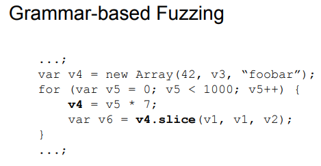

# Fuzzilli란

자바스크립트를 퍼징 하기 위해서는 기존에 있는 방법(랜덤한 데이터를 만드는 법 등)을 사용해서는 효율적인 퍼징을 할 수 없습니다. 

그렇기에 sample을 만들 때 문법에 맞는 sample을 만들어야 합니다. 이를 위해 [domato](https://github.com/googleprojectzero/domato)라는 grammar-based 퍼저가 있습니다. domato는 사용자가 룰을 만들어 준 뒤 그 룰에 따라 sample을 만듭니다. 하지만 domato는 다음과 같은 문제가 있습니다.



`v4` 값에 대해 `slice`함수를 실행할 때 `slice`가 정의되어 있지 않아 뒤에 있는 코드를 실행할 수 없습니다. 


이를 해결하기 위해서 try-catch 문을 통해 예외 처리를 해주면 예외가 일어나도 다음 문장을 실행할 수 있습니다. 하지만 JIT compiler로 컴파일이 되면 try-catch문이 없는 코드와는 아예 다른 코드를 생성합니다. 그렇기에 높은 수준의 Semantic correctness를 가진 sample을 만들어야 합니다.

이를 위해서는 몇 가지 방법이 있는데 Fuzzill는 mutation을 통해 semantically valid한 샘플만 corpus에 추가하는 방법을 사용합니다.

Fuzzilli에서는 FuzzIL이라는 custom intermediate 언어를 만들어 mutation에 사용합니다.


만들어진 FuzzIL은 다음 그림과 같이 JS 코드로 생성됩니다.


FuzzIL에는 여러 mutator가 존재하는데 다음과 같습니다.


- Input Mutator - Input을 바꿉니다.
- Operation Mutator - Operation을 바꿉니다.
- Splice Mutator -  다른 corpus에서 코드를 잘라와 새로 넣어줍니다.
- Insertion Mutator - 새로운 코드를 만들어 넣어줍니다.

    등등 여러 mutator가 있습니다.

이러한 mutator와 함께 feedback을 추가해 커버리지를 높이는 방식을 사용합니다.

Fuzzilli는 다음과 같은 방법으로 퍼징을 진행합니다.


# Fuzzilli 설치 및 실행

Ubuntu 20.04 LTS에서 진행했습니다.

먼저 clang과 필요한 것들을 설치해줍니다.

```jsx
apt-get install clang clang++ libicu-dev
```

버전에 맞는 [swift](https://swift.org/download/)를 설치합니다.

swift를 설치 한 뒤 PATH를 등록해줍니다.

```jsx
wget https://swift.org/builds/swift-5.3.3-release/ubuntu2004/swift-5.3.3-RELEASE/swift-5.3.3-RELEASE-ubuntu20.04.tar.gz
mkdir ~/swift
tar -xvf swift-5.3.3-RELEASE-ubuntu20.04.tar.gz -C ~/swift

export PATH=~/swift/swift-5.3.3-RELEASE-ubuntu20.04/usr/bin/:$PATH
```

git을 이용해 fuzzilli를 받아 빌드해줍니다.

```jsx
git clone https://github.com/googleprojectzero/fuzzilli.git
cd swift
swift build -c release
```

실행하기 전에 타깃 바이너리를 컴파일해야 하는데, chromium의 v8을 기준으로 설명하겠습니다.

다음의 코드를 통해 v8 source를 받고 컴파일합니다.

```jsx
git clone https://chromium.googlesource.com/chromium/tools/depot_tools.git
export PATH=/path/to/depot_tools:$PATH

mkdir ~/v8
cd ~/v8
fetch v8
cd v8

/path/to/fuzzilli/Targets/V8/fuzzbuild.sh
```

완료하면 v8/out/fuzzbuild/d8이 생성됩니다.

fuzzilli와 v8을 모두 빌드했으면 다음의 명령어를 통해 fuzzilli를 실행할 수 있습니다.

```jsx
swift run FuzzilliCli --profile=v8 ~/Desktop/v8/v8/out/fuzzbuild/d8
```

실행할 때 여러 옵션들이 있는데 자세한 옵션은 github를 참고하면 됩니다.

# Fuzzilli 분석

다음의 코드는 FuzzilIL을 test 하기 위해 만드는 FuzzIL입니다. 이 코드를 통해 FuzzIL이 어떻게 만들어지는지 mutation 결과가 어떻게 되는지 분석을 해보겠습니다.

```swift
				let b = makeBuilder() //IL을 담을 ProgramBuilder 생성.

        let f = b.definePlainFunction(withSignature: FunctionSignature(withParameterCount: 2)) { params in //인자를 2개 받는 함수 선언
            let x = b.loadProperty("x", of: params[0]) // 첫 번째 인자의 x property를 가져옴.
            let y = b.loadProperty("y", of: params[0]) // 첫 번째 인자의 y property를 가져옴.
            let s = b.binary(x, y, with: .Add) // x와 y의 값을 더 함.(첫 번째 인자의 x,y 값의 합.)
            let p = b.binary(s, params[1], with: .Mul) // s의 값과 두번째 인자를 곱함.
            b.doReturn(value: p) // p의 값을 리턴.
        }

        b.forLoop(b.loadInt(0), .lessThan, b.loadInt(1000), .Add, b.loadInt(1)) { i in // 반복문 선언, for(i=0;i<1000;i++)
            let x = b.loadInt(42) // x = 42
            let y = b.loadInt(43) // y = 43
            let arg1 = b.createObject(with: ["x": x, "y": y]) // arg1 = {"x":42, "y":43}
            let arg2 = i //arg2 = i
            b.callFunction(f, withArgs: [arg1, arg2]) //f(arg1, arg2)
        }

        return b.finalize() // 마무리
```

위의 코드를 IL로 보면 다음과 같습니다.

```swift
v0 <- BeginPlainFunctionDefinition -> v1, v2
    v3 <- LoadProperty v1, 'x'
    v4 <- LoadProperty v1, 'y'
    v5 <- BinaryOperation v3, '+', v4
    v6 <- BinaryOperation v5, '*', v2
    Return v6
EndPlainFunctionDefinition

v7 <- LoadInteger '0'
v8 <- LoadInteger '1000'
v9 <- LoadInteger '1'

BeginFor v7, '<', v8, '+', v9 -> v10
    v11 <- LoadInteger '42'
    v12 <- LoadInteger '43'
    v13 <- CreateObject ['x':v11, 'y':v12]
    v14 <- CallFunction v0, [v13, v10]
EndFor
```

이 IL코드를 javascript 코드로 변환하면 다음과 같이 생성됩니다.

```swift
function main() { //v8 code prefix
function v0(v1,v2) {
    const v3 = v1.x;
    const v4 = v1.y;
    const v5 = v3 + v4;
    const v6 = v5 * v2;
    return v6;
}
for (let v10 = 0; v10 < 1000; v10++) {
    const v13 = {x:42,y:43};
    const v14 = v0(v13,v10);
}
gc();                              //
}                                  //
%NeverOptimizeFunction(main);      // v8 code suffix
main();                            //
```

## Mutator

### CodeGenMutator

기존의 코드에 새로운 코드를 삽입하는 Mutation을 진행합니다.

```jsx
function main() {
    function v0(v1,v2) {
        const v3 = v1.x;
        const v4 = v1.y;
        const v5 = v3 + v4;
        **v0 = v4;**
        **const v6 = [v0,v0,v1,v0];**
        const v7 = v5 * v2;
        return v7;
    }
    for (let v11 = 0; v11 < 1000; v11++) {
        **let v15 = Object();
        const v16 = Object;
        const v17 = v15--;**
        const v18 = {x:42,y:43};
        const v19 = v0(v18,v11);
    }
gc();
}
%NeverOptimizeFunction(main);
main();
```

### InputMutator

random으로 Input에 대해 골라서 다른 input으로 바꿔줍니다.

```jsx
function main() {
    function v0(v1,v2) {
        const v3 = v1.x;
        const v4 = v1.y;
        const v5 = v3 + v4;
        **const v6 = v5 ^ v2;**
        return v6;
    }
    for (**let v10 = 9007199254740992;** v10 < 1000; v10++) {
        const v13 = {x:42,a:43};
        const v14 = v0(v13,v10);
    }
    gc();
    }
%NeverOptimizeFunction(main);
main();
```

### OperationMutator

Operation을 하나 골라서 mutate 해줍니다.

```jsx
function main() {
function v0(v1,v2) {
    const v3 = v1.x;
    const v4 = v1.y;
    const v5 = v3 + v4;
    const v6 = v5 * v2;
    return v6;
}
for (let v10 = 0; v10 < 1000; **v10 = v10 && 1**) {
    const v13 = {toString:42,y:43};
    const v14 = v0(v13,v10);
}
gc();
}
%NeverOptimizeFunction(main);
main();
```

### CombineMutator

corpus에 있는 요소 중 하나를 골라서 코드를 추가해줍니다.

```jsx
function main() {
    function v0(v1,v2) {
        const v3 = v1.x;
        const v4 = v1.y;
        const v5 = v3 + v4;
        const v6 = v5 * v2;
        return v6;
    }
    **const v11 = Object();**
    for (let v12 = 0; v12 < 1000; v12++) {
        const v15 = {x:42,y:43};
        const v16 = v0(v15,v12);
    }
    gc();
}
%NeverOptimizeFunction(main);
main();
```

### JITStressMutator

존재하는 함수를 호출합니다.

```jsx
function main() {
    function v0(v1,v2) {
        const v3 = v1.x;
        const v4 = v1.y;
        const v5 = v3 + v4;
        const v6 = v5 * v2;
        return v6;
    }
    for (let v10 = 0; v10 < 1000; v10++) {
        const v13 = {x:42,y:43};
        const v14 = v0(v13,v10);
    }
    **const v15 = Object;
    const v17 = v0(1000,Object);**
    gc();
}
%NeverOptimizeFunction(main);
main();
```

# 마치며

Fuzzilli에 대해 간단하게 알아보았습니다. 
위에서 소개한 mutator 외에도 여러 mutator가 존재하고 새로운 mutator를 만들거나 새로운 속성들을 추가해주면서 퍼저를 개선할 수 있습니다.

또한 기존의 javascript 파일을 FuzzIL로 변환해 corpus를 구성해주는 방법을 통해 발전시킬 수 있습니다.

Fuzzilli를 잘 분석해서 개선한다면 js engine에 대해 효율적으로 퍼징 할 수 있다고 생각합니다.