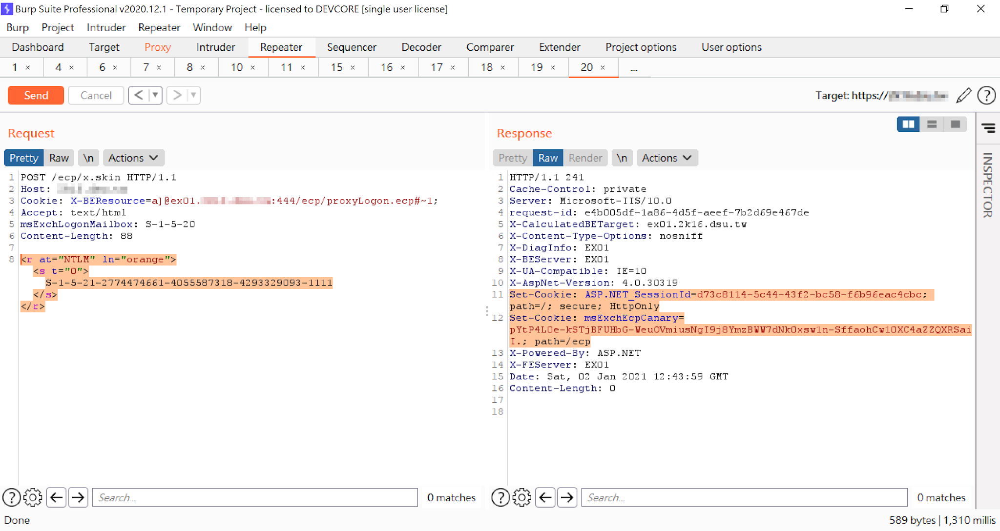

---

title: "[하루한줄] A New Attack Surface on MS Exchange Part 1 - ProxyLogon!"

author: j0ker

tags: [j0ker, microsoft, exchange, ssrf, arbitrary_file_write, CVE-2021-26855, CVE-2021-27065] 

categories: [1day1line] 

date: 2021-08-13 14:00:00 

cc: true

index_img: /img/1day1line.png

---

## URL

- https://blog.orange.tw/2021/08/proxylogon-a-new-attack-surface-on-ms-exchange-part-1.html

## Target

- MS Exchange

  

## Explain

1. 이번에는 Pwnie Awards에서 Best Server-Side Bug로 선정된 Orange의 MS Exchange 취약점 글 입니다! 취약점이 크리티컬할 뿐만 아니라 완전 새로운 공격 포인트를 찾았다는 좋은 평가를 받았습니다.

   ## CVE-2021-26855

   ```powershell
   protected virtual Uri GetTargetBackEndServerUrl() {
       this.LogElapsedTime("E_TargetBEUrl");
       Uri result;
       try {
           UrlAnchorMailbox urlAnchorMailbox = this.AnchoredRoutingTarget.AnchorMailbox as UrlAnchorMailbox;
           if (urlAnchorMailbox != null) {
               result = urlAnchorMailbox.Url;
           } else {
               UriBuilder clientUrlForProxy = this.GetClientUrlForProxy();
               clientUrlForProxy.Scheme = Uri.UriSchemeHttps;
               clientUrlForProxy.Host = this.AnchoredRoutingTarget.BackEndServer.Fqdn; //here
               clientUrlForProxy.Port = 444;
   ...
   ```

   보면 `AnchoredRoutingTarget.BackEndServer.Fqdn`에서 host 정보를 가져오는 것을 알 수 있습니다. 이 host 정보는 쿠키에서 가져오는 것인데 가져오고 Request를 처리하는 과정에서 어떠한 검증도 진행하지 않습니다.

   ```powershell
   protected override AnchorMailbox ResolveAnchorMailbox() {
       HttpCookie httpCookie = base.ClientRequest.Cookies["X-AnonResource-Backend"];
       if (httpCookie != null) {
           this.savedBackendServer = httpCookie.Value;
       }
       if (!string.IsNullOrEmpty(this.savedBackendServer)) {
           base.Logger.Set(3, "X-AnonResource-Backend-Cookie");
           if (ExTraceGlobals.VerboseTracer.IsTraceEnabled(1)) {
               ExTraceGlobals.VerboseTracer.TraceDebug<HttpCookie, int>((long)this.GetHashCode(), "[OwaResourceProxyRequestHandler::ResolveAnchorMailbox]: AnonResourceBackend cookie used: {0}; context {1}.", httpCookie, base.TraceContext);
           }
           return new ServerInfoAnchorMailbox(BackEndServer.FromString(this.savedBackendServer), this);  //here
       }
       return new AnonymousAnchorMailbox(this);
   ```

   따라서 간단하게 URL을 조작하는 것만으로 SSRF를 할 수 있습니다.

   ## CVE-2021-27065

   먼저 `msExchLogonMailbox` 헤더를 수정하여 SYSTEM 유저 계정의 ECP 세션을 획득할 수 있습니다.

   

   DDIService는 XAML을 통해 powershell 코드를 실행하는데, 아래 함수를 이용하면 powershell 코드의 출력 내용을 원하는 경로에 쓸 수 있습니다.

   ```powershell
   public override RunResult Run(DataRow input, DataTable dataTable, DataObjectStore store, Type codeBehind, Workflow.UpdateTableDelegate updateTableDelegate) {
       DataRow dataRow = dataTable.Rows[0];
       string value = (string)input[this.InputVariable];
       string path = (string)input[this.OutputFileNameVariable];
       RunResult runResult = new RunResult();
       try {
           runResult.ErrorOccur = true;
           using (StreamWriter streamWriter = new StreamWriter(File.Open(path, FileMode.CreateNew)))
           {
               streamWriter.WriteLine(value);
           }
           runResult.ErrorOccur = false;
       }
       
       // ...
   }
   ```
