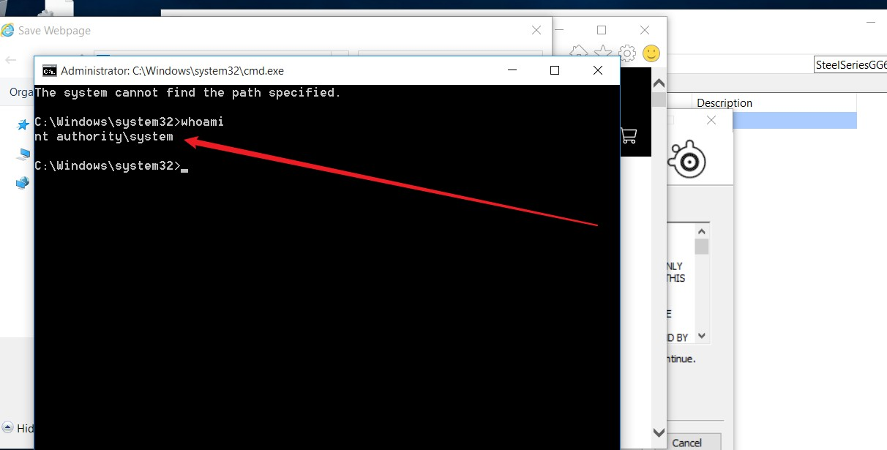

---

title: "[하루한줄] Razer 마우스 인식을 위한 설치 과정에서의 권한 상승 취약점 그리고 SteelSeries에서의 유사 취약점 "

author: j0ker

tags: [j0ker, lpe, razer, steelseries, mouse, installer] 

categories: [1day1line] 

date: 2021-08-27 14:00:00 

cc: true

index_img: /img/1day1line.png

---

## URL

https://twitter.com/s1guza/status/1429404751024754691 , http://0xsp.com/security%20research%20&%20development%20(SRD)/local-administrator-is-not-just-with-razer-it-is-possible-for-all

## Target

-  Razer Installer
-  SteelSeries Installer

  

## Explain
저번주 트위터에서 j0nh4t이라는 유저는 Razer 마우스 연결시 자동으로 실행되는 설치 파일에서의 권한 상승 취약점을 공개했습니다. 해당 취약점은 Razer 마우스를 연결하면 해당 마우스 인식을 위해 드라이버를 설치하는 설치 파일이 System 계정으로 실행되어 설치 과정에서 파일 탐색기를 열고 파워쉘을 열면 System 계정으로 파워쉘이 실행되어 권한 상승을 할 수 있는 취약점이었습니다.

21일에 이 취약점이 공개된 뒤, 이를 본 zux0x3a는 해당 취약점과 비슷하게 SteelSeries 키보드 연결 시 실행되는 설치 파일에서 권한 상승 취약점을 찾아 이를 공개했습니다. 해당 취약점 역시 System 계정으로 실행되는 설치파일의 설치 과정에서 발생하였습니다. 라이센스 동의 절차에서 "Learn More"를 눌러 IE를 실행시키고 IE에서는 페이지 저장 기능을 통해 System 계정으로 실행되는 cmd.exe를 실행하였습니다. 
