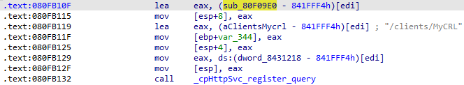
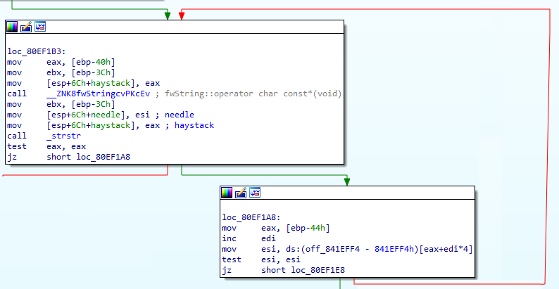
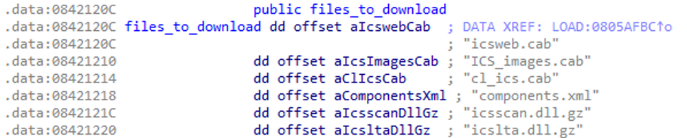

## Title

CVE-2024-24919: Check Point사 제품들에서 발견된 Path Traversal 취약점으로 인한 Sensitive Information Disclosure

## URL

- [Check Point - Wrong Check Point (CVE-2024-24919)](https://labs.watchtowr.com/check-point-wrong-check-point-cve-2024-24919/)

## Target

- CloudGuard Network, Quantum Maestro, Quantum Scalable Chassis, Quantum Security Gateways, Quantum Spark Appliances
- R77.20 (EOL), R77.30 (EOL), R80.10 (EOL), R80.20 (EOL), R80.20.x, R80.20SP (EOL), R80.30 (EOL), R80.30SP (EOL), R80.40 (EOL), R81, R81.10, R81.10.x, R81.20

## Explain

패치 전후 버전을 비교해 보면 `send_path_traversal_alert_log` 라는 로깅함수가 추가된 것을 확인할 수 있습니다. 그리고 해당 함수를 호출하는 함수인  `sanitize_filename` 을 찾을 수 있고 같은 방식으로 `sub_80F09E0`와 `cpHttpSvc_register_query` 함수를 찾을 수 있습니다. 



`cpHttpSvc_register_query` 함수를 확인해보면  `/clients/MyCRL` HTTP 경로를 사용하는 것을 확인할 수 있고 해당 페이지에 요청을 보내 취약점을 트리거할 것이라는 것을 추측할 수 있습니다.

해당 엔드포인트는 특정 경로를 GET이나 POST로 요청하면 파일 시스템에 해당 경로에 있는 파일을 반환해주는 역할을 합니다. GET 요청을 할 때 `/clients/MyCRL/test%0Atest` 와 같이 제어문자를 넣거나 POST에 `..` 를 넣어도 오류를 반환합니다.



따라서 취약점을 확인하기 위해 sub_80F09E0 함수를 확인해 보면, _fopen과 _fread 함수를 확인할 수 있습니다.



함수 내에서 IDA에서 인식하지 못하는 문자열들을 참조하는 것을 확인할 수 있는데 해당 문자열들을 바이너리를 실행하면 GDB에서 확인이 가능합니다. 파일을 요청할 경우 해당 문자열 리스트에 있는 문자열이 있는지 확인을 하는데 `strstr` 함수를 사용해 확인합니다.


해당 문자열 리스트를 확인하면 위와 같이 `/`가 포함되어 있는 `CSHELL/` 이라는 문자열을 확인할 수 있는데 이는 폴더를 접근하기 위한 것으로 추측됩니다. 따라서 해당 문자열을 제일 앞에 배치하고 뒤에 `../`을 넣는다면 `strstr` 함수에서는 `CSHELL/` 문자열이 존재하기 때문에 일치한다고 판단할 것이고 뒤에 넣은 문자열을 통해 Path Traversal을 수행할 수 있게 됩니다. 

최종적인 POC는 다음과 같습니다.

```
POST /clients/MyCRL HTTP/1.1
Host: <redacted>
Content-Length: 39

aCSHELL/../../../../../../../etc/shadow
```
