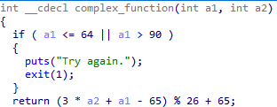
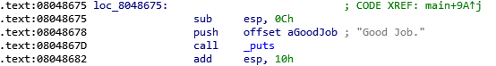
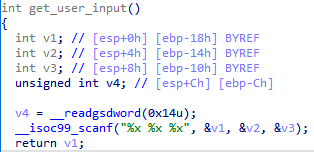
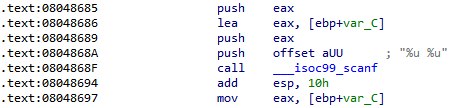

# 핵린이의 angr 정복기 - (3) angr_ctf part.1


# 이전 글 바로가기

[[Research] 핵린이의 angr 정복기 - (1) 시작](https://hackyboiz.github.io/2021/07/10/j0ker/angr_part1/)

[[Research] 핵린이의 angr 정복기 - (2) Symbolic Execution](https://hackyboiz.github.io/2021/07/21/j0ker/angr_part2/)


# 인사말

안녕하세요. j0ker 입니다!

저번주 Symbolic Execution 공부하다 내상을 입어 좀 쉬고 싶었지만 역시 팀에서는 저를 가만히 두지 않네요. 어딜 가든 막내가 많이 움직여야 사랑받는다는데 저는 딱히 남자들의 사랑을 받고 싶지 않아서 더 가만히 있고 싶었습니다. 근데 그러니까 두세배로 사랑(?) 당하고 있네요 허허 막내가 많이 움직여야 사랑받는다는 것은 다 개뻥입니다. 그냥 가만히 있으세요. 그럼 더 많은 사랑을 받을 수 있습니다(경험담)

하지만 이번주에는 힐링하면서 공부했습니다! 왜냐면 내용이 쉬웠거든요!! 킼킼킼ㅋ


이번주는 [angr_ctf](https://github.com/jakespringer/angr_ctf)에 있는 문제들을 풀어봤습니다! 간단히 설명하면 CTF에 나온 문제들을 풀기 전에 angr에 좀 더 익숙해지기 위한 튜토리얼 같은 문제들이라 생각하시면 됩니다. 아무래도 제 1편이나 2편을 보셨더라도 angr를 바로 써서 CTF 문제를 풀 수 있겠다는 생각이 드시진 않으셨을텐데요. 이 문제들만 푼다면 이제 CTF 문제 푸는 것도 무리가 없어 보입니다!(아마도...) 여러분도 풀어보시면서 저와 같이 핵린이를 탈출해보시죠!(방금 제 머릿속에 해킹으로 세계 정복하는 장면이 지나갔... 읍읍)

문제를 풀기 전에 먼저 angr_ctf를 클론해보시면 많은 폴더들이 있을겁니다. 각문제 별로 소스코드랑 문제들이 들어 있는데 저희는 일일이 컴파일하기 귀찮으니까 dist 폴더에 있는 내용들로 진행하겠습니다. dist 폴더에는 미리 컴파일된 바이너리와 문제용 스크립트들이 존재합니다. 각각 번호로 매칭이 되어 있기 때문에 문제마다 번호에 맞는 파이썬 스크립트를 열어보시면 설명과 함께 문제풀이를 위한 기본적인 스트립트를 제공합니다. 이제 저희가 할일은 그 스크립트들 안에 지워져 있는 부분들을 채워가면 되는거죠!

 

# 00_angr_find

0 번째 문제입니다! 바로 IDA로 까보죠.


호호 별거 없네요. 대충 보면 패스워드를 입력으로 8글자를 받고 `complex_function`이라는 함수에서 이러쿵저러쿵 작업을 한 다음에, "JACEJGCS" 문자열과 비교를 합니다. 그럼 `complex_function`이 뭘 하는지 살펴봅시다.



여기서도 별게 없네요! 파라미터로 전달된 두 값으로 연산을 하고 끝납니다. 근데 이거는 어차피 angr가 알아서 분석해줄테니까 그냥 넘어갑시다!(댕꿀)

그러면 이번에는 scaffold00.py라는 파일을 열어볼게요.

```python
# Before you begin, here are a few notes about these capture-the-flag
# challenges.
#
# Each binary, when run, will ask for a password, which can be entered via stdin
# (typing it into the console.) Many of the levels will accept many different
# passwords. Your goal is to find a single password that works for each binary.
#
# If you enter an incorrect password, the program will print "Try again." If you
# enter a correct password, the program will print "Good Job."
#
# Each challenge will be accompanied by a file like this one, named
# "scaffoldXX.py". It will offer guidance as well as the skeleton of a possible
# solution. You will have to edit each file. In some cases, you will have to
# edit it significantly. While use of these files is recommended, you can write
# a solution without them, if you find that they are too restrictive.
#
# Places in the scaffoldXX.py that require a simple substitution will be marked
# with three question marks (???). Places that require more code will be marked
# with an ellipsis (...). Comments will document any new concepts, but will be
# omitted for concepts that have already been covered (you will need to use
# previous scaffoldXX.py files as a reference to solve the challenges.) If a
# comment documents a part of the code that needs to be changed, it will be
# marked with an exclamation point at the end, on a separate line (!).

import angr
import sys

def main(argv):
  # Create an Angr project.
  # If you want to be able to point to the binary from the command line, you can
  # use argv[1] as the parameter. Then, you can run the script from the command
  # line as follows:
  # python ./scaffold00.py [binary]
  # (!)
  path_to_binary = ???  # :string
  project = angr.Project(path_to_binary)

  # Tell Angr where to start executing (should it start from the main()
  # function or somewhere else?) For now, use the entry_state function
  # to instruct Angr to start from the main() function.
  initial_state = project.factory.entry_state()

  # Create a simulation manager initialized with the starting state. It provides
  # a number of useful tools to search and execute the binary.
  simulation = project.factory.simgr(initial_state)

  # Explore the binary to attempt to find the address that prints "Good Job."
  # You will have to find the address you want to find and insert it here. 
  # This function will keep executing until it either finds a solution or it 
  # has explored every possible path through the executable.
  # (!)
  print_good_address = ???  # :integer (probably in hexadecimal)
  simulation.explore(find=print_good_address)

  # Check that we have found a solution. The simulation.explore() method will
  # set simulation.found to a list of the states that it could find that reach
  # the instruction we asked it to search for. Remember, in Python, if a list
  # is empty, it will be evaluated as false, otherwise true.
  if simulation.found:
    # The explore method stops after it finds a single state that arrives at the
    # target address.
    solution_state = simulation.found[0]그러며

    # Print the string that Angr wrote to stdin to follow solution_state. This 
    # is our solution.
    print solution_state.posix.dumps(sys.stdin.fileno())
  else:
    # If Angr could not find a path that reaches print_good_address, throw an
    # error. Perhaps you mistyped the print_good_address?
    raise Exception('Could not find the solution')

if __name__ == '__main__':
  main(sys.argv)
```

으윽... 영어가 많은 건 좋지 않습니다. 한국어도 잘 못하는 사람한테 영어라니... 가당치도 않죠. 일단 설명은 다 없애고 일일이 보면서 제가 설명해드리겠습니다.

```python
import angr
import sys

def main(argv):
  path_to_binary = ???  # :string
  project = angr.Project(path_to_binary)
  
  initial_state = project.factory.entry_state()
  simulation = project.factory.simgr(initial_state)

  print_good_address = ???  # :integer (probably in hexadecimal)
  simulation.explore(find=print_good_address)

  if simulation.found:
    solution_state = simulation.found[0]
    print solution_state.posix.dumps(sys.stdin.fileno())
  else:
    raise Exception('Could not find the solution')

if __name__ == '__main__':
  main(sys.argv)
```

하... 편-안...

일단 보면 ???라고 되어 있는 곳이 두 군데 있습니다. 이 문제에서는 저 부분만 저희가 따로 작성을 해주면 풀 수 있을듯 합니다.

```python
path_to_binary = ???  # :string
project = angr.Project(path_to_binary)
```

여기에서는 먼저 angr를 시작하는 의미로 프로젝트를 생성해줍니다. 근데 어떤 문제를 풀 것인지 지정을 해줘야겠죠? 하지만 매번 스크립트에 문제 파일 경로를 적어주는건 귀찮으니 인자로 받아 쓰는 걸로 설정해줍니다. `path_to_binary = argv[1]`

```python
initial_state = project.factory.entry_state()
simulation = project.factory.simgr(initial_state)
```

이제 분석을 시작할 부분을 설정해줍니다. 근데 특별한 조건이 없으니 그냥 엔트리포인트부터 시작을 하는게 좋겠죠? `project.factory.entry_state()`를 호출하면 자동으로 엔트리포인트부터 시뮬레이션을 할 수 있게 state 인스턴스를 생성해줍니다. 이 뿐만 아니라 `full_init_state()`를 호출하면 엔트리포인트 이전에 로더에서 하는 작업들, 초기화 함수들까지 시뮬레이션할 수 있는 state를 만들어주기도 하고 `blank_state()`를 호출하면 유저가 마음대로 설정할 수 있는 state, `call_state()`를 호출하면 지정한 주소에서부터 시뮬레이션할 수 있는 state를 만들어줍니다. 이거는 문제 상황에 따라 다르게 설정하면 될거 같습니다.

state를 생성하면 이걸 시뮬레이터에 넣어줍니다. 그럼 시뮬레이터는 "아 이 state를 바탕으로 시뮬레이션 환경을 준비하면 되겠구나"하고 시뮬레이션을 위한 인스턴스를 또 생성하죠.

```python
print_good_address = ???  # :integer (probably in hexadecimal)
simulation.explore(find=print_good_address)
```

이제 도달하고 싶은 주소를 설정해 줍니다. `explore()`에서는 인자로 전달된 조건에 따라 시뮬레이션을 진행하고 조건에 부합하거나 부합하지 않는 state를 찾아내게 됩니다. 인자로 주소를 전달하면 해당 주소로 가는 state를 찾거나 피하고 싶은 주소가 있다면 그 주소를 피해 state를 탐색합니다. 일단 여기에서 우리는 "Good Job"을 출력해주는 주소까지 실행할 수 있는 입력값을 찾아야하기 때문에 find 인자 값으로 해당 주소를 넘겨주기만 하면 됩니다.

다시 IDA로 넘어가서 보면 "Good Job"을 출력해주는 부분은 아래와 같습니다.



뭐 이 부분은 어디든 설정하기만 하면 되겠죠. 저는 `puts`가 실행되는 `0x0804867d`로 설정해보겠습니다.

```python
  if simulation.found:
    solution_state = simulation.found[0]
    print(solution_state.posix.dumps(sys.stdin.fileno()))
  else:
    raise Exception('Could not find the solution')
```

마지막으로 원하는 state를 찾았을 때 출력해줍니다. 이 부분에서 `found`라는 맴버의 타입이 궁금해서 찾아봤는데, angr 공식 문서에는 없더라구요??!?! `angr.state_plugins.posix.SimSystemPosix` 클래스에 dumps라는 메소드가 있어서 그럼 `solution_state`가 `state_plugins` 모듈이고 이거를 멤버로 가지고 있는 클래스가 있나 하다가 그만두었습니다... 너무 방대하더군요. 그래서 이것저것 찾아보다가 일단 이거는 이렇게 사용한다 정도로만 이해하고 넘어가기로 했습니다.

그럼!!! 0번 문제 클리어!!

## sol00.py

```python
import angr
import sys

def main(argv):
  path_to_binary = argv[1]
  project = angr.Project(path_to_binary)

  initial_state = project.factory.entry_state()

  simulation = project.factory.simgr(initial_state)

  print_good_address = 0x0804867d
  simulation.explore(find=print_good_address)

  if simulation.found:
    solution_state = simulation.found[0]

    print(solution_state.posix.dumps(sys.stdin.fileno()))
  else:
    raise Exception('Could not find the solution')

if __name__ == '__main__':
  main(sys.argv)
```

```python
j0ker@angr:~/angr_ctf/dist$ python3 ./sol00.py ./00_angr_find
WARNING | 2021-08-04 06:41:36,295 | angr.storage.memory_mixins.default_filler_mixin | The program is accessing memory or registers with an unspecified value. This could indicate unwanted behavior.
WARNING | 2021-08-04 06:41:36,295 | angr.storage.memory_mixins.default_filler_mixin | angr will cope with this by generating an unconstrained symbolic variable and continuing. You can resolve this by:
WARNING | 2021-08-04 06:41:36,295 | angr.storage.memory_mixins.default_filler_mixin | 1) setting a value to the initial state
WARNING | 2021-08-04 06:41:36,295 | angr.storage.memory_mixins.default_filler_mixin | 2) adding the state option ZERO_FILL_UNCONSTRAINED_{MEMORY,REGISTERS}, to make unknown regions hold null
WARNING | 2021-08-04 06:41:36,295 | angr.storage.memory_mixins.default_filler_mixin | 3) adding the state option SYMBOL_FILL_UNCONSTRAINED_{MEMORY,REGISTERS}, to suppress these messages.
WARNING | 2021-08-04 06:41:36,295 | angr.storage.memory_mixins.default_filler_mixin | Filling register edi with 4 unconstrained bytes referenced from 0x80486b1 (__libc_csu_init+0x1 in 00_angr_find (0x80486b1))
WARNING | 2021-08-04 06:41:36,297 | angr.storage.memory_mixins.default_filler_mixin | Filling register ebx with 4 unconstrained bytes referenced from 0x80486b3 (__libc_csu_init+0x3 in 00_angr_find (0x80486b3))
WARNING | 2021-08-04 06:41:37,976 | angr.storage.memory_mixins.default_filler_mixin | Filling memory at 0x7ffeff60 with 4 unconstrained bytes referenced from 0x8189f50 (strcmp+0x0 in libc.so.6 (0x89f50))
[<SimState @ 0x804867d>]
b'JXWVXRKX'
j0ker@angr:~/angr_ctf/dist$ ./00_angr_find
Enter the password: JXWVXRKX
Good Job.
```

# 01_angr_avoid

이번에는 avoid에 관련된 문제 입니다. 아까 위에서도 `explore()`에서 특정 주소를 찾을 수도 있지만 피할 수 있다고 말씀드렸죠? 그거에 관한 문제입니다.

근데 IDA에 넣어봤더니 헥스레이가 정상적으로 동작하지 않네요. 그래서 함수 목록을 봤더니 `avoid_me`라는 함수를 찾을 수 있었습니다.


사실 안에는 내용이 별로 없습니다. `should_succeed`라는 전역 변수에 0으로 세팅하는데, 이 변수의 크로스 레퍼런스를 확인하면 `maybe_good` 함수에서 이를 사용하는 것을 알 수 있습니다.


보면 `should_succeed`가 0이 아니어야 "Good Job"이 출력되게 되어있네요. 그러면 `avoid_me`를 거치지 않는 실행 경로가 필요하겠습니다.

```python
import angr
import sys

def main(argv):
  path_to_binary = ???
  project = angr.Project(path_to_binary)
  initial_state = project.factory.entry_state()
  simulation = project.factory.simgr(initial_state)

  print_good_address = ???
  will_not_succeed_address = ???
  simulation.explore(find=print_good_address, avoid=will_not_succeed_address)

  if simulation.found:
    solution_state = simulation.found[0]
    print solution_state.posix.dumps(sys.stdin.fileno())
  else:
    raise Exception('Could not find the solution')

if __name__ == '__main__':
  main(sys.argv)
```

main 함수의 앞 부분은 0번 문제와 같이 세팅해주고 그 뒤만 봅시다.

```python
  print_good_address = ???
  will_not_succeed_address = ???
  simulation.explore(find=print_good_address, avoid=will_not_succeed_address)
```

이제 `explore` 함수에 피하기 위한 특정 주소를 지정해 줍니다. 그러면 아까 분석한 `avoid_me` 함수의 주소를 넣고 찾을 주소는 똑같이 "Good Job"을 출력해주는 주소를 넣으면 됩니다.

## sol01.py

```python
import angr
import sys

def main(argv):
  path_to_binary = argv[1]
  project = angr.Project(path_to_binary)
  initial_state = project.factory.entry_state()
  simulation = project.factory.simgr(initial_state)

  print_good_address = 0x080485E5
  will_not_succeed_address = 0x080485A8
  simulation.explore(find=print_good_address, avoid=will_not_succeed_address)

  if simulation.found:
    solution_state = simulation.found[0]
    print(solution_state.posix.dumps(sys.stdin.fileno()))./01
  else:
    raise Exception('Could not find the solution')

if __name__ == '__main__':
  main(sys.argv)
```

```python
j0ker@angr:~/angr_ctf/dist$ python3 sol01.py ./01_angr_avoid
WARNING | 2021-08-04 06:57:26,008 | angr.storage.memory_mixins.default_filler_mixin | The program is accessing memory or registers with an unspecified value. This could indicate unwanted behavior.
WARNING | 2021-08-04 06:57:26,008 | angr.storage.memory_mixins.default_filler_mixin | angr will cope with this by generating an unconstrained symbolic variable and continuing. You can resolve this by:
WARNING | 2021-08-04 06:57:26,008 | angr.storage.memory_mixins.default_filler_mixin | 1) setting a value to the initial state
WARNING | 2021-08-04 06:57:26,008 | angr.storage.memory_mixins.default_filler_mixin | 2) adding the state option ZERO_FILL_UNCONSTRAINED_{MEMORY,REGISTERS}, to make unknown regions hold null
WARNING | 2021-08-04 06:57:26,008 | angr.storage.memory_mixins.default_filler_mixin | 3) adding the state option SYMBOL_FILL_UNCONSTRAINED_{MEMORY,REGISTERS}, to suppress these messages.
WARNING | 2021-08-04 06:57:26,009 | angr.storage.memory_mixins.default_filler_mixin | Filling register edi with 4 unconstrained bytes referenced from 0x80d4591 (__libc_csu_init+0x1 in 01_angr_avoid (0x80d4591))
WARNING | 2021-08-04 06:57:26,010 | angr.storage.memory_mixins.default_filler_mixin | Filling register ebx with 4 unconstrained bytes referenced from 0x80d4593 (__libc_csu_init+0x3 in 01_angr_avoid (0x80d4593))
WARNING | 2021-08-04 06:57:29,577 | angr.storage.memory_mixins.default_filler_mixin | Filling memory at 0x7ffeff3d with 11 unconstrained bytes referenced from 0x818a520 (strncmp+0x0 in libc.so.6 (0x8a520))
WARNING | 2021-08-04 06:57:29,577 | angr.storage.memory_mixins.default_filler_mixin | Filling memory at 0x7ffeff60 with 4 unconstrained bytes referenced from 0x818a520 (strncmp+0x0 in libc.so.6 (0x8a520))
b'HUJOZMYS'
j0ker@angr:~/angr_ctf/dist$ ./01_angr_avoid
Enter the password: HUJOZMYS
Good Job.
```

# 02_angr_find_condition


음.... 뭐지... 의도가 뭐지... 문제만 보고 모르겠어서 그냥 1번 문제에 주소만 바꿔 풀어 봤습니다 ㅋㅋㅋ 근데... 풀림!!!

뭐야 뭔데 왜 풀리는건데 ㅋㅋㅋㅋㅋ 그래서 파이썬 코드를 보았죠.

```python
import angr
import sys

def main(argv):
  path_to_binary = argv[1]
  project = angr.Project(path_to_binary)
  initial_state = project.factory.entry_state()
  simulation = project.factory.simgr(initial_state)

  def is_successful(state):
    stdout_output = state.posix.dumps(sys.stdout.fileno())
    return ???  # :boolean

  def should_abort(state):
    stdout_output = state.posix.dumps(sys.stdout.fileno())
    return ???  # :boolean

  simulation.explore(find=is_successful, avoid=should_abort)

  if simulation.found:
    solution_state = simulation.found[0]
    print solution_state.posix.dumps(sys.stdin.fileno())
  else:
    raise Exception('Could not find the solution')

if __name__ == '__main__':
  main(sys.argv)
```

흠... 이번에는 `explore()`의 인자로 주소값이 아니라 함수가 전달됩니다. 그리고 문제에서는 특정 주소를 못 찾을 수도 있으니 출력된 문자열을 통해 찾아야하는 컨데션을 찾으라네요. 네. 지금까지 해왔던 것처럼 "Good Job"을 출력하는 state를 찾아야하는 것은 같지만 이를 무엇으로 판단하느냐가 달라진 것입니다. 그러면 `stdout_output`에 "Good Job"이라는 문자열이 들어가 있는지를 판단하는 논리식을 넣으면 되겠네요.

```python
return ( "Good Job" in stdout_output )
```

좋아. 매우 깔끔하군.

이라고 생각하는 찰나 제대로 실행되지 않습니다. 하아... 역시 인생은 제대로 되는게 없습니다.

근데 보니까 `stdout_output`이 바이트 문자열이더라구요? 그래서 조금 바꿔주었습니다.

```python
return ( "Good Job" in stdout_output.decode('ascii') )
```

가릿. 이렇게 하면 2번 문제도 쓱-싹 클리어~

## sol02.py

```python
import angr
import sys

def main(argv):
  path_to_binary = argv[1]
  project = angr.Project(path_to_binary)
  initial_state = project.factory.entry_state()
  simulation = project.factory.simgr(initial_state)

  def is_successful(state):
    stdout_output = state.posix.dumps(sys.stdout.fileno())
    print(stdout_output)

    return ( "Good Job" in stdout_output.decode('ascii') )

  def should_abort(state):
    stdout_output = state.posix.dumps(sys.stdout.fileno())
    print(stdout_output)
    return ( "Try again." in stdout_output.decode('ascii') )

  simulation.explore(find=is_successful, avoid=should_abort)

  if simulation.found:
    solution_state = simulation.found[0]
    print(solution_state.posix.dumps(sys.stdin.fileno()))
  else:
    raise Exception('Could not find the solution')

if __name__ == '__main__':
  main(sys.argv)
```

```python
j0ker@angr:~/angr_ctf/dist$ python3 sol02.py ./02_angr_find_condition
WARNING | 2021-08-04 07:13:57,226 | angr.storage.memory_mixins.default_filler_mixin | The program is accessing memory or registers with an unspecified value. This could indicate unwanted behavior.
WARNING | 2021-08-04 07:13:57,226 | angr.storage.memory_mixins.default_filler_mixin | angr will cope with this by generating an unconstrained symbolic variable and continuing. You can resolve this by:
WARNING | 2021-08-04 07:13:57,226 | angr.storage.memory_mixins.default_filler_mixin | 1) setting a value to the initial state
WARNING | 2021-08-04 07:13:57,226 | angr.storage.memory_mixins.default_filler_mixin | 2) adding the state option ZERO_FILL_UNCONSTRAINED_{MEMORY,REGISTERS}, to make unknown regions hold null
WARNING | 2021-08-04 07:13:57,226 | angr.storage.memory_mixins.default_filler_mixin | 3) adding the state option SYMBOL_FILL_UNCONSTRAINED_{MEMORY,REGISTERS}, to suppress these messages.
WARNING | 2021-08-04 07:13:57,227 | angr.storage.memory_mixins.default_filler_mixin | Filling register edi with 4 unconstrained bytes referenced from 0x804d291 (__libc_csu_init+0x1 in 02_angr_find_condition (0x804d291))
WARNING | 2021-08-04 07:13:57,228 | angr.storage.memory_mixins.default_filler_mixin | Filling register ebx with 4 unconstrained bytes referenced from 0x804d293 (__libc_csu_init+0x3 in 02_angr_find_condition (0x804d293))
WARNING | 2021-08-04 07:13:58,865 | angr.storage.memory_mixins.default_filler_mixin | Filling memory at 0x7ffeff2d with 11 unconstrained bytes referenced from 0x8189f50 (strcmp+0x0 in libc.so.6 (0x89f50))
WARNING | 2021-08-04 07:13:58,865 | angr.storage.memory_mixins.default_filler_mixin | Filling memory at 0x7ffeff50 with 4 unconstrained bytes referenced from 0x8189f50 (strcmp+0x0 in libc.so.6 (0x89f50))
b'HETOBRCU'
j0ker@angr:~/angr_ctf/dist$ ./02_angr_find_condition
Enter the password: HETOBRCU
Good Job.
```

# 03_angr_symbolic_registers


음... 이번에는 특이하게 레지스터들이 변수로 사용되는게 눈에 띄네요. 그리고 인풋도 좀 다르게 받는거 같은데... `get_user_input()`을 함 보겠습니다.



이번에는 앞에와는 달리 인풋을 3개를 받습니다. 하지만 angr에서는 `scanf`를 통해 인풋 여러개 받는것을 인식하지 못한다고? 합니다.

그렇다면 어떻게 해야하냐? 일단 원래 지금까지는 시뮬레이션을 엔트리포인트부터 진행했었죠. 이거를 `scanf` 함수 이후로 설정하고 인자가 저장되는 곳을 심볼릭 변수로 선언해야합니다. 코드를 보죠.

```python
import angr
import claripy
import sys

def main(argv):
  path_to_binary = argv[1]
  project = angr.Project(path_to_binary)

  start_address = ???  # :integer (probably hexadecimal)
  initial_state = project.factory.blank_state(addr=start_address)

  password0_size_in_bits = ???  # :integer
  password0 = claripy.BVS('password0', password0_size_in_bits)
  ...

  initial_state.regs.??? = password0
  ...

  simulation = project.factory.simgr(initial_state)

  def is_successful(state):
    stdout_output = state.posix.dumps(sys.stdout.fileno())
    return ???

  def should_abort(state):
    stdout_output = state.posix.dumps(sys.stdout.fileno())
    return ???

  simulation.explore(find=is_successful, avoid=should_abort)

  if simulation.found:
    solution_state = simulation.found[0]

    solution0 = solution_state.se.eval(password0)
    ...

    solution = ???  # :string
    print solution
  else:
    raise Exception('Could not find the solution')

if __name__ == '__main__':
  main(sys.argv)
```

먼저 시뮬레이션을 시작할 주소부터 보겠습니다.

```python
  start_address = 0x08048980  # :integer (probably hexadecimal)
  initial_state = project.factory.blank_state(addr=start_address)
```

아까 말씀드렸다시피 `scanf` 이후로 설정해야하는데, 메인함수에 있는게 아니라 `get_user_input`에 있었죠. 그래서 저는 메인 함수에 `get_user_input` 이후로 설정했습니다. 굳이 `get_user_input` 안에 있는 내용은 시뮬레이션할 필요는 없으니까요.

```python
  password0_size_in_bits = 32  # :integer
  password0 = claripy.BVS('password0', password0_size_in_bits)
  password1_size_in_bits = 32  # :integer
  password1 = claripy.BVS('password1', password1_size_in_bits)
  password2_size_in_bits = 32  # :integer
  password2 = claripy.BVS('password2', password2_size_in_bits)
```

이제 심볼릭 변수들을 초기화해 줍니다. 그냥 선언만 해주는 거라고 생각하시면 됩니다. angr에서는 해당 변수의 type이 뭔지 신경 쓰지 않기 때문에 변수의 크기만 지정해주면 됩니다. 여기에서는 레지스트리에 변수를 저장하고 32비트 프로그램이니까 32로 설정하고 3개의 심볼릭 변수를 설정해 줍니다.

```python
  initial_state.regs.eax = password0
  initial_state.regs.ebx = password1
  initial_state.regs.edx = password2
```

이제 심볼릭 변수를 state에 적용을 해주어야 합니다. 우리가  추적할 심볼릭 변수들은 레지스터에 저장되고 메인 함수를 보면 각각 eax, ebx, edx에 저장되기 때문에 각각 선언한 심볼릭 변수를 대입해줍니다.

그리고 마지막으로 결과값들을 모두 출력해주어야 하는데 위 예시 포맷으로 각각 hex 포맷으로 출력을 해주기만 하면 아~~~~~주 쉽게 문제를 풀수 있습니다!

```python
    solution0 = solution_state.se.eval(password0)
    solution1 = solution_state.se.eval(password1)
    solution2 = solution_state.se.eval(password2)
    
    solution = '{} {} {}'.format(hex(solution0), hex(solution1), hex(solution2))  # :string
    print(solution) 
```

## sol03.py

```python
import angr
import claripy
import sys

def main(argv):
  path_to_binary = argv[1]
  project = angr.Project(path_to_binary)

  start_address = 0x08048980  # :integer (probably hexadecimal)
  initial_state = project.factory.blank_state(addr=start_address)

  password0_size_in_bits = 32  # :integer
  password0 = claripy.BVS('password0', password0_size_in_bits)
  password1_size_in_bits = 32  # :integer
  password1 = claripy.BVS('password1', password1_size_in_bits)
  password2_size_in_bits = 32  # :integer
  password2 = claripy.BVS('password2', password2_size_in_bits)
  
  initial_state.regs.eax = password0
  initial_state.regs.ebx = password1
  initial_state.regs.edx = password2

  simulation = project.factory.simgr(initial_state)

  def is_successful(state):
    stdout_output = state.posix.dumps(sys.stdout.fileno())
    return ('Good Job' in stdout_output.decode('ascii'))

  def should_abort(state):
    stdout_output = state.posix.dumps(sys.stdout.fileno())
    return ('Try again' in stdout_output.decode('ascii'))

  simulation.explore(find=is_successful, avoid=should_abort)

  if simulation.found:
    solution_state = simulation.found[0]

    solution0 = solution_state.se.eval(password0)
    solution1 = solution_state.se.eval(password1)
    solution2 = solution_state.se.eval(password2)
    
    solution = '{} {} {}'.format(hex(solution0), hex(solution1), hex(solution2))  # :string
    print(solution)
  else:
    raise Exception('Could not find the solution')

if __name__ == '__main__':
  main(sys.argv)
```

```python
j0ker@angr:~/angr_ctf/dist$ python3 sol03.py ./03_angr_symbolic_registers
WARNING | 2021-08-04 07:44:13,245 | angr.storage.memory_mixins.default_filler_mixin | The program is accessing memory or registers with an unspecified value. This could indicate unwanted behavior.
WARNING | 2021-08-04 07:44:13,246 | angr.storage.memory_mixins.default_filler_mixin | angr will cope with this by generating an unconstrained symbolic variable and continuing. You can resolve this by:
WARNING | 2021-08-04 07:44:13,246 | angr.storage.memory_mixins.default_filler_mixin | 1) setting a value to the initial state
WARNING | 2021-08-04 07:44:13,246 | angr.storage.memory_mixins.default_filler_mixin | 2) adding the state option ZERO_FILL_UNCONSTRAINED_{MEMORY,REGISTERS}, to make unknown regions hold null
WARNING | 2021-08-04 07:44:13,246 | angr.storage.memory_mixins.default_filler_mixin | 3) adding the state option SYMBOL_FILL_UNCONSTRAINED_{MEMORY,REGISTERS}, to suppress these messages.
WARNING | 2021-08-04 07:44:13,246 | angr.storage.memory_mixins.default_filler_mixin | Filling register ebp with 4 unconstrained bytes referenced from 0x8048980 (main+0x26 in 03_angr_symbolic_registers (0x8048980))
CRITICAL | 2021-08-04 07:44:14,105 | angr.sim_state | The name state.se is deprecated; please use state.solver.
0xb9ffd04e 0xccf63fe8 0x8fd4d959
j0ker@angr:~/angr_ctf/dist$ ./03_angr_symbolic_registers
Enter the password: 0xb9ffd04e 0xccf63fe8 0x8fd4d959
Good Job.
```

# 04_angr_symbolic_stack


자 이번에는 입력값들이 스택에 저장되네요. 그럼 위와 비슷하게 심볼릭 변수들을 initial state에 스택에 넣어주면 되겠습니다. 근데 state에는 프로그램이 실행하는 것 처럼 스택 주소를 가지고 있지 않을텐데... 이게 문제네요!

일단 먼저 앞에 문제처럼 시뮬레이션 시작 주소는 `scanf` 이후가 되어야 할거고요.... 그 뒤로는 뭘 해야하지... 이럴 땐 코드를 봅시다!

```python
import angr
import claripy
import sys

def main(argv):
  path_to_binary = argv[1]
  project = angr.Project(path_to_binary)

  start_address = ???
  initial_state = project.factory.blank_state(addr=start_address)
  initial_state.regs.ebp = initial_state.regs.esp

  password0 = claripy.BVS('password0', ???)
  ...

  padding_length_in_bytes = ???  # :integer
  initial_state.regs.esp -= padding_length_in_bytes

  initial_state.stack_push(???)  # :bitvector (claripy.BVS, claripy.BVV, claripy.BV)
  ...

  simulation = project.factory.simgr(initial_state)

  def is_successful(state):
    stdout_output = state.posix.dumps(sys.stdout.fileno())
    return ???

  def should_abort(state):
    stdout_output = state.posix.dumps(sys.stdout.fileno())
    return ???

  simulation.explore(find=is_successful, avoid=should_abort)

  if simulation.found:
    solution_state = simulation.found[0]

    solution0 = solution_state.se.eval(password0)
    ...

    solution = ???
    print solution
  else:
    raise Exception('Could not find the solution')

if __name__ == '__main__':
  main(sys.argv)
```

일단 먼저 시작 주소를 지정해보겠습니다. 근데 이전까지는 그냥 `scanf` 이후 어디든 상관없겠지라는 마인드로 대충 지정했지만 이번에는 좀만 자세히 보겠습니다.



`scanf` 바로 뒤의 인스트럭션을 보면 esp에서 0x10을 더해줍니다. 일단 initial state에 스택 변수를 설정해야할 것을 알았고, 스택 변수는 대부분 esp나 ebp로 조작하기 때문에 일단 이 부분은 찜찜하니 `add esp, 0x10` 이부분은 제외하고 바로 뒤부터 시뮬레이션을 시작하도록 설정을 해줍니다.

그리고 이제 스택에 대한 환경 세팅을 해줍니다. 이전에도 스택에 입력값을 저장하는 문제들이 있었지만 입력값을 하나만 받아서 엔트리포인트부터 시뮬레이션을 하면 문제 없이 angr가 알아서 변수가 스택 어디에 위치해 있는지 찾을 수 있었습니다. 하지만 지금은 그런 과정을 뛰어넘었기 때문에 initial state에서 스택 상황을 설정해줄 필요가 있습니다. 일단 먼저 스택 프레임을 생성할 때처럼 esp를 ebp에 대입하고 심볼릭 변수들을 선언해줍니다.

```python
  initial_state.regs.ebp = initial_state.regs.esp

  password0 = claripy.BVS('password0', 32)
  password1 = claripy.BVS('password1', 32)
```

그런 다음 IDA로 스택의 크기와 변수의 위치들을 파악합니다.


일단 스택 프레임의 크기는 0x18입니다. 그리고 변수들이 `ebp-0xC`, `ebp-0x10`에 위치하는 것을 볼 수 있죠. 그렇다면 변수 하나당 4바이트이기 때문에 ebp에서 ebp-0x8까지는 추적할 필요가 없는 스택 변수들이네요! 그럼 이제 스택을 만들어보죠!

```python
  padding_length_in_bytes = 8  # :integer
  initial_state.regs.esp -= padding_length_in_bytes

  initial_state.stack_push(password0)  # :bitvector (claripy.BVS, claripy.BVV, claripy.BV)
  initial_state.stack_push(password1)  # :bitvector (claripy.BVS, claripy.BVV, claripy.BV)

```

먼저 8바이트는 의미가 없으니 esp에서 그만큼 빼줍니다. 그리고 그 뒤에 우리가 설정한 심볼릭 변수들을 push해줍니다. 그러면 얼추 일단 우리가 추적할 심볼릭 변수까지 설정했으니 나머지는 angr한테 맡겨보죠!

## sol04.py

```python
import angr
import claripy
import sys

def main(argv):
  path_to_binary = argv[1]
  project = angr.Project(path_to_binary)

  start_address = 0x08048697 # after add esp, 0x10
  initial_state = project.factory.blank_state(addr=start_address)

  initial_state.regs.ebp = initial_state.regs.esp

  password0 = claripy.BVS('password0', 32)
  password1 = claripy.BVS('password1', 32)

  padding_length_in_bytes = 8  # :integer
  initial_state.regs.esp -= padding_length_in_bytes

  initial_state.stack_push(password0)  # :bitvector (claripy.BVS, claripy.BVV, claripy.BV)
  initial_state.stack_push(password1)  # :bitvector (claripy.BVS, claripy.BVV, claripy.BV)

  simulation = project.factory.simgr(initial_state)

  def is_successful(state):
    stdout_output = state.posix.dumps(sys.stdout.fileno())
    return ('Good Job' in stdout_output.decode('ascii'))

  def should_abort(state):
    stdout_output = state.posix.dumps(sys.stdout.fileno())
    return ('Try again' in stdout_output.decode('ascii'))

  simulation.explore(find=is_successful, avoid=should_abort)

  if simulation.found:
    solution_state = simulation.found[0]

    solution0 = solution_state.se.eval(password0)
    solution1 = solution_state.se.eval(password1)
    
    solution = '{} {}'.format(solution0, solution1)
    print(solution)
  else:
    raise Exception('Could not find the solution')

if __name__ == '__main__':
  main(sys.argv)
```

```python
j0ker@angr:~/angr_ctf/dist$ python3 ./sol04.py ./04_angr_symbolic_stack
CRITICAL | 2021-08-04 08:21:43,212 | angr.sim_state | The name state.se is deprecated; please use state.solver.
1704280884 2382341151
j0ker@angr:~/angr_ctf/dist$ ./04_angr_symbolic_stack
Enter the password: 1704280884 2382341151
Good Job.
```

# 05_angr_symbolic_memory


후... 이번에는 딱 봐도 전역변수에다 심볼릭 변수를 설정하는게 문제겠네요. 코드에 있는 설명을 볼 필요도 없을거 같습니다 ㅋㅋㅋㅋㅋ(이쯤되면 눈감고도 풀 수 있을듯 ㅇㅈㄹ)

```python
import angr
import claripy
import sys

def main(argv):
  path_to_binary = argv[1]
  project = angr.Project(path_to_binary)

  start_address = ???
  initial_state = project.factory.blank_state(addr=start_address)

  password0 = claripy.BVS('password0', ???)
  ...

  password0_address = ???
  initial_state.memory.store(password0_address, password0)
  ...

  simulation = project.factory.simgr(initial_state)

  def is_successful(state):
    stdout_output = state.posix.dumps(sys.stdout.fileno())
    return ???

  def should_abort(state):
    stdout_output = state.posix.dumps(sys.stdout.fileno())
    return ???

  simulation.explore(find=is_successful, avoid=should_abort)

  if simulation.found:
    solution_state = simulation.found[0]

    solution0 = solution_state.se.eval(password0,cast_to=str)
    ...
    solution = ???

    print solution
  else:
    raise Exception('Could not find the solution')

if __name__ == '__main__':
  main(sys.argv)
```

일단 시뮬레이션 시작 주소는 이전과 같이 `scanf` 이후로 설정합니다. 이번에는 스택에 심볼릭 변수가 존재하지 않으니 대충 뒤에 있는 주소로 설정해줍니다. 그리고 앞에서와 같이 심볼릭 변수를 선언해주면 되는데, 입력을 하나당 8바이트를 받으니까 크기를 64비트로 설정해줍니다.

```python
  password0_address = 0x0A1BA1C0
  initial_state.memory.store(password0_address, password0)
  password1_address = 0xA1BA1C8
  initial_state.memory.store(password1_address, password1)
  password2_address = 0xA1BA1D0
  initial_state.memory.store(password2_address, password2)
  password3_address = 0xA1BA1D8
  initial_state.memory.store(password3_address, password3)
```

앞에서 레지스터에 심볼릭 변수를 선언할 때는 `initial_state.regs.eax` 이런식으로 설정을 했었죠. 이번에는 메모리입니다! 메모리는 주소와 심볼릭 변수를 `store` 메소드에 인자로 전달하면 설정할 수 있습니다. 위에서 IDA로 확인할 수 있는 전역변수들의 주소를 하나하나 매핑을 해줍니다.

그리고 마지막에 출력을 해야하는데... 원래 코드에서는 `solution0 = solution_state.se.eval(password0,cast_to=str)` 으로 되어 있는데요. 이게 이대로 쓰면 에러가 발생합니다... 왜인지는 모르겠는데 문자열로의 캐스팅을 지원을 안한다는데.... 잘 모르겠네요. 혹시 해결하신 분이 계시다면 댓글로 남겨주시면 감사하겠습니다! 저 같은 경우는 문자열로 캐스팅하지 않고 그냥 바이트로 캐스팅했습니다. 그럼 이 문제도 끝!

## sol05.py

```python
import angr
import claripy
import sys

def main(argv):
  path_to_binary = argv[1]
  project = angr.Project(path_to_binary)

  start_address = 0x080485FE
  initial_state = project.factory.blank_state(addr=start_address)

  password0 = claripy.BVS('password0', 64)
  password1 = claripy.BVS('password1', 64)
  password2 = claripy.BVS('password2', 64)
  password3 = claripy.BVS('password3', 64)

  password0_address = 0x0A1BA1C0
  initial_state.memory.store(password0_address, password0)
  password1_address = 0xA1BA1C8
  initial_state.memory.store(password1_address, password1)
  password2_address = 0xA1BA1D0
  initial_state.memory.store(password2_address, password2)
  password3_address = 0xA1BA1D8
  initial_state.memory.store(password3_address, password3)

  simulation = project.factory.simgr(initial_state)

  def is_successful(state):
    stdout_output = state.posix.dumps(sys.stdout.fileno())
    return ('Good Job' in stdout_output.decode('ascii'))

  def should_abort(state):
    stdout_output = state.posix.dumps(sys.stdout.fileno())
    return ('Try again' in stdout_output.decode('ascii'))

  simulation.explore(find=is_successful, avoid=should_abort)

  if simulation.found:
    solution_state = simulation.found[0]

    solution0 = solution_state.se.eval(password0, cast_to=bytes)
    solution1 = solution_state.se.eval(password1, cast_to=bytes)
    solution2 = solution_state.se.eval(password2, cast_to=bytes)
    solution3 = solution_state.se.eval(password3, cast_to=bytes)
    
    solution = '{} {} {} {}'.format(solution0, solution1, solution2, solution3)

    print(solution)
  else:
    raise Exception('Could not find the solution')

if __name__ == '__main__':
  main(sys.argv)
```

```python
j0ker@angr:~/angr_ctf/dist$ python3 ./sol05.py ./05_angr_symbolic_memory
WARNING | 2021-08-04 08:36:25,179 | angr.storage.memory_mixins.default_filler_mixin | The program is accessing memory or registers with an unspecified value. This could indicate unwanted behavior.
WARNING | 2021-08-04 08:36:25,179 | angr.storage.memory_mixins.default_filler_mixin | angr will cope with this by generating an unconstrained symbolic variable and continuing. You can resolve this by:
WARNING | 2021-08-04 08:36:25,179 | angr.storage.memory_mixins.default_filler_mixin | 1) setting a value to the initial state
WARNING | 2021-08-04 08:36:25,179 | angr.storage.memory_mixins.default_filler_mixin | 2) adding the state option ZERO_FILL_UNCONSTRAINED_{MEMORY,REGISTERS}, to make unknown regions hold null
WARNING | 2021-08-04 08:36:25,179 | angr.storage.memory_mixins.default_filler_mixin | 3) adding the state option SYMBOL_FILL_UNCONSTRAINED_{MEMORY,REGISTERS}, to suppress these messages.
WARNING | 2021-08-04 08:36:25,180 | angr.storage.memory_mixins.default_filler_mixin | Filling register ebp with 4 unconstrained bytes referenced from 0x8048601 (main+0x59 in 05_angr_symbolic_memory (0x8048601))
CRITICAL | 2021-08-04 08:36:33,925 | angr.sim_state | The name state.se is deprecated; please use state.solver.
b'NAXTHGNR' b'JVSFTPWE' b'LMGAUHWC' b'XMDCPALU'
j0ker@angr:~/angr_ctf/dist$ ./05_angr_symbolic_memory
Enter the password: NAXTHGNR JVSFTPWE LMGAUHWC XMDCPALU
Good Job.
```

# 마무리

일단 오늘은 간단하게 튜토리얼 문제들을 풀어봤습니다. 글에 글씨는 많은데 아무래도 코드가 많아서 스압이 좀... 하하 그래서 이만 끊으려고 합니다 ^^

일단 팀장님이 부상 중이시라 남는 날짜에 제 글을 또 올려보도록 하겠습니다. 어차피 남은 문제들도 후딱 풀 수 있는 문제들이니까 빠른 템포로 진행해보겠습니다.(아 근데 이번 글 쓰면서 느낀게 문제 푸는 것보다 글 쓰는 시간이 더 오래 걸리는듯...) 얼른 CTF 문제도 풀어야죠! 그럼 다음 편으로 돌아오겠습니다!

조-바!(조커 바이라는 뜻)


> 퇴근길에 담배 한대 ㅆㅅㅌㅊ