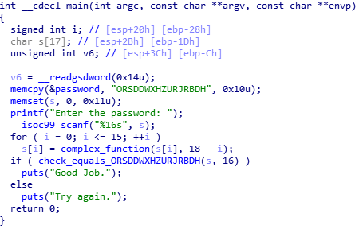
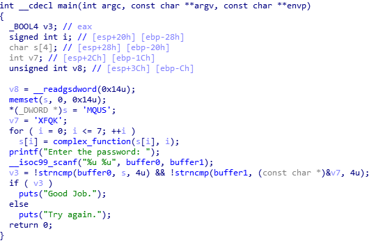
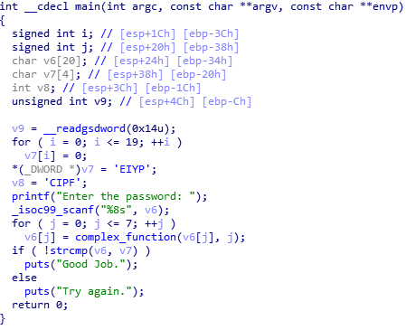
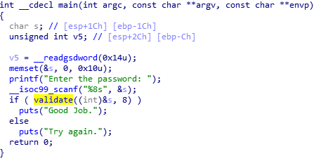
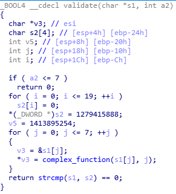

# 핵린이의 angr 정복기 - (5) angr_ctf part.3


# 이전 글 바로가기

[[Research] 핵린이의 angr 정복기 - (1) 시작](https://hackyboiz.github.io/2021/07/10/j0ker/angr_part1/)

[[Research] 핵린이의 angr 정복기 - (2) Symbolic Execution](https://hackyboiz.github.io/2021/07/21/j0ker/angr_part2/)

[[Research] 핵린이의 angr 정복기 - (3) angr_ctf part.1](https://hackyboiz.github.io/2021/08/04/j0ker/angr_part3/)

[[Research] 핵린이의 angr 정복기 - (4) angr_ctf part.2](https://hackyboiz.github.io/2021/08/15/j0ker/angr_part4/)

[Research] 핵린이의 angr 정복기 - (5) angr_ctf part.3 ← Here!

# 인사말

안녕하세요. j0ker 입니다! 원래 angr 시리즈 자체를 4편까지만 하려고 했는데 angr_ctf만 세 편째 다루고 있군요. 하지만 아직 끝이 아닙니다. angr_ctf는 다음 글에서 끝납니다. 하하 물론 angr_ctf가 끝난다고 해서 angr 시리즈가 끝나는 것은 아닙니다. 아직 리얼 CTF 문제는 풀지도 못했으니까요 ㅠㅠ 이쯤되니까 저도 이 시리즈가 언제 끝날것인지 궁금해집니다. 그래도 묵묵히 공부하다보면 나아지겠죠? 하하

# 10_angr_simprocedures



이번 문제는 프로시져를 시뮬레이션하는 문제네요. 앞에서 풀었던 문제들과 상당히 유사한데요. 이 망할 `check_equals_` 함수가 계속해서 나오고 있습니다. 이번 문제에서 시뮬레이션 할 것이 있다면 또 이 함수겠죠. 일단 함수를 시뮬레이팅하기 위해서 클래스를 제작해야합니다.

```python
  class ReplacementCheckEquals(angr.SimProcedure):

    def run(self, to_check, length):
      user_input_buffer_address = to_check
      user_input_buffer_length = length

      user_input_string = self.state.memory.load(
        user_input_buffer_address,
        user_input_buffer_length
      )

      check_against_string = 'ORSDDWXHZURJRBDH'
      
      return claripy.If(user_input_string == check_against_string, 
        claripy.BVV(1,32), 
        claripy.BVV(0, 32)
        )
```

`angr.SimProcedure`에서 상속을 받아와 클래스를 생성합니다. 아마 포맷으로는 그냥 `run` 메소드만 만들어주면 되는 듯 합니다. `run` 메소드를 만들어주면 시뮬레이션 함수를 분석하기 시작할 때 우리가 선언한 메소드를 호출하게 되겠죠. `run` 메소드의 인자는 `check_equals_` 함수와 똑같이 설정해줍니다. 그런 다음, 인자로 받은 변수에 있는 내용을 가지고 온 다음, `clarity.If`를 통해 비교문을 설정하고 참/거짓일 때 반환할 내용을 인자로 같이 주게 됩니다. 여기서 주의해야할 점은 반환값을 일단적인 논리변수가 아니라 비트벡터로 반환해야한다는 점입니다. 반환하는 값은 심볼릭 변수가 아니기 때문에 `BVV`로 생성해서 반환합니다.

```python
  check_equals_symbol = 'check_equals_ORSDDWXHZURJRBDH' # :string
  project.hook_symbol(check_equals_symbol, ReplacementCheckEquals())
```

시뮬레이션할 클래스를 생성해주면 어느시점에서 후킹을 할지 지정해 줍니다. 9번 문제와는 다르게 `hook` 함수를 사용해서 특정 주소에 후킹을 하는 것이 아니라, 특정 심볼의 함수를 분석하기 시작하면 그 함수를 후킹해서 우리가 만든 클래스의 인스턴스를 활용하는 듯 합니다. 이렇게만 설정해주면 다른 부분은 앞 문제들과 같습니다!

## sol10.py

```python
import angr
import claripy
import sys

def main(argv):
  path_to_binary = argv[1]
  project = angr.Project(path_to_binary)

  initial_state = project.factory.entry_state()

  class ReplacementCheckEquals(angr.SimProcedure):

    def run(self, to_check, length):
      user_input_buffer_address = to_check
      user_input_buffer_length = length

      user_input_string = self.state.memory.load(
        user_input_buffer_address,
        user_input_buffer_length
      )

      check_against_string = 'ORSDDWXHZURJRBDH'
      
      return claripy.If(user_input_string == check_against_string, 
        claripy.BVV(1,32), 
        claripy.BVV(0, 32)
        )

  check_equals_symbol = 'check_equals_ORSDDWXHZURJRBDH' # :string
  project.hook_symbol(check_equals_symbol, ReplacementCheckEquals())

  simulation = project.factory.simgr(initial_state)

  def is_successful(state):
    stdout_output = state.posix.dumps(sys.stdout.fileno())
    return ('Good Job' in stdout_output.decode('ascii'))

  def should_abort(state):
    stdout_output = state.posix.dumps(sys.stdout.fileno())
    return ('Try again' in stdout_output.decode('ascii'))

  simulation.explore(find=is_successful, avoid=should_abort)

  if simulation.found:
    solution_state = simulation.found[0]

    solution = solution_state.posix.dumps(sys.stdin.fileno())
    print(solution)
  else:
    raise Exception('Could not find the solution')

if __name__ == '__main__':
  main(sys.argv)
```

```python
j0ker@angr:~/angr_ctf/dist$ python3 sol10.py 10_angr_simprocedures 
WARNING | 2021-08-17 12:26:50,202 | angr.storage.memory_mixins.default_filler_mixin | The program is accessing memory or registers with an unspecified value. This could indicate unwanted behavior.
WARNING | 2021-08-17 12:26:50,202 | angr.storage.memory_mixins.default_filler_mixin | angr will cope with this by generating an unconstrained symbolic variable and continuing. You can resolve this by:
WARNING | 2021-08-17 12:26:50,202 | angr.storage.memory_mixins.default_filler_mixin | 1) setting a value to the initial state
WARNING | 2021-08-17 12:26:50,202 | angr.storage.memory_mixins.default_filler_mixin | 2) adding the state option ZERO_FILL_UNCONSTRAINED_{MEMORY,REGISTERS}, to make unknown regions hold null
WARNING | 2021-08-17 12:26:50,202 | angr.storage.memory_mixins.default_filler_mixin | 3) adding the state option SYMBOL_FILL_UNCONSTRAINED_{MEMORY,REGISTERS}, to suppress these messages.
WARNING | 2021-08-17 12:26:50,202 | angr.storage.memory_mixins.default_filler_mixin | Filling register edi with 4 unconstrained bytes referenced from 0x804a9b1 (__libc_csu_init+0x1 in 10_angr_simprocedures (0x804a9b1))
WARNING | 2021-08-17 12:26:50,203 | angr.storage.memory_mixins.default_filler_mixin | Filling register ebx with 4 unconstrained bytes referenced from 0x804a9b3 (__libc_csu_init+0x3 in 10_angr_simprocedures (0x804a9b3))
WARNING | 2021-08-17 12:26:52,183 | claripy.ast.bv | BVV value is being coerced from a unicode string, encoding as utf-8
b'MSWKNJNAVTTOZMRY'
j0ker@angr:~/angr_ctf/dist$ ./10_angr_simprocedures 
Enter the password: MSWKNJNAVTTOZMRY
Good Job.
```

# 11_angr_sim_scanf



이번에는 `scanf`를 시뮬레이션하는 문제입니다. 앞에 문제를 비슷하게 활용할 수 있는거 같네요. 이번 문제에서는 `check_equals_` 함수가 나오지 않으니 딱 `scanf`만 시뮬레이션하면 될듯 합니다.(근데 이거 그냥 심볼릭 변수 두개 선언하고 `scanf` 뒤에서 분석 시작하면 되는거 아닌가...?라는 문제 출제자에 의도에 반하는 생각을 해봤습니다 ㅎ) 그래도 앞에서 한번 해봤으니 좀 쉽겠네요!

```python
  class ReplacementScanf(angr.SimProcedure):

    def run(self, format_string, scanf0_address, scanf1_address):
      scanf0 = claripy.BVS('scanf0', 32)
      scanf1 = claripy.BVS('scanf1', 32)
      
      self.state.memory.store(scanf0_address, scanf0, endness=project.arch.memory_endness)
      self.state.memory.store(scanf1_address, scanf1, endness=project.arch.memory_endness)

      self.state.globals['solution0'] = scanf0
      self.state.globals['solution1'] = scanf1

```

위 문제와 똑같이 클래스를 만들어주고 심볼릭 변수 두개를 지정해줍니다. 여기에서 메모리에 심볼릭 변수를 저장할 때 `endness`라는 인자가 하나 더 들어가는데, 이는 엔디안을 지정하는 인자입니다. `memory_endness`는 현재 지금 분석하는 바이너리에서 사용하는 엔디안을 사용한다는 의미입니다. 여기에서는 리틀 엔디안을 사용하겠죠. 그 외에도 `archinfo`를 `import`하고 `archinfo.arch.Endness`를 사용하면 직접 엔디안을 설정해줄 수 있습니다.

```python
archinfo.arch.Endness.LE : 리틀엔디안
archinfo.arch.Endness.BE : 빅엔디안
archinfo.arch.Endness.BE : 미들엔디안
```

그리고 각각 `buffer0`, `buffer1`의 주소에 저장한 다음 `globals`라는 딕셔너리에 저장합니다. [angr 공식 문서](https://docs.angr.io/extending-angr/simprocedures)에 따르면 `state.globals`에는 해당 `state`의 분석에 필요한 정보들이 저장되어 있다고 합니다. 뭔가 설명에서는 제대로 알지 않으면 안에 있는 내용을 절대 건드리지 말라길래(또 이런거 보면 건드려보고 싶잖아?) 뭐가 있는지만 봤습니다. 그런데...

```python
{'state': None, '_backer': {'solution0': <BV32 scanf0_9_32>, 'solution1': <BV32 scanf1_10_32>}}
```

???? 뭐가 없는데???

암튼 위처럼 인풋 받는 내용을 메모리에 써주기만 하면 앞에 문제와 크게 다를거 없이 문제를 풀 수 있습니다.

## sol11.py

```python
import angr
import claripy
import sys

def main(argv):
  path_to_binary = argv[1]
  project = angr.Project(path_to_binary)

  initial_state = project.factory.entry_state()

  class ReplacementScanf(angr.SimProcedure):

    def run(self, format_string, scanf0_address, scanf1_address):
      scanf0 = claripy.BVS('scanf0', 32)
      scanf1 = claripy.BVS('scanf1', 32)
      
      self.state.memory.store(scanf0_address, scanf0, endness=project.arch.memory_endness)
      self.state.memory.store(scanf1_address, scanf1, endness=project.arch.memory_endness)

      self.state.globals['solution0'] = scanf0
      self.state.globals['solution1'] = scanf1

  scanf_symbol = '__isoc99_scanf'
  project.hook_symbol(scanf_symbol, ReplacementScanf())

  simulation = project.factory.simgr(initial_state)

  def is_successful(state):
    stdout_output = state.posix.dumps(sys.stdout.fileno())
    return ('Good Job' in stdout_output.decode('ascii'))

  def should_abort(state):
    stdout_output = state.posix.dumps(sys.stdout.fileno())
    return ('Try again' in stdout_output.decode('ascii'))

  simulation.explore(find=is_successful, avoid=should_abort)

  if simulation.found:
    solution_state = simulation.found[0]

    stored_solutions0 = solution_state.globals['solution0']
    stored_solutions1 = solution_state.globals['solution1']

    print(solution_state.se.eval(stored_solutions0, cast_to=int))
    print(solution_state.se.eval(stored_solutions1, cast_to=int))
  else:
    raise Exception('Could not find the solution')

if __name__ == '__main__':
  main(sys.argv)
```

```python
j0ker@angr:~/angr_ctf/dist$ python3 sol11.py 11_angr_sim_scanf 
WARNING | 2021-08-17 13:11:58,888 | angr.project | Address is already hooked, during hook(0x8154e80, <SimProcedure ReplacementScanf>). Re-hooking.
WARNING | 2021-08-17 13:11:58,967 | angr.storage.memory_mixins.default_filler_mixin | The program is accessing memory or registers with an unspecified value. This could indicate unwanted behavior.
WARNING | 2021-08-17 13:11:58,967 | angr.storage.memory_mixins.default_filler_mixin | angr will cope with this by generating an unconstrained symbolic variable and continuing. You can resolve this by:
WARNING | 2021-08-17 13:11:58,967 | angr.storage.memory_mixins.default_filler_mixin | 1) setting a value to the initial state
WARNING | 2021-08-17 13:11:58,967 | angr.storage.memory_mixins.default_filler_mixin | 2) adding the state option ZERO_FILL_UNCONSTRAINED_{MEMORY,REGISTERS}, to make unknown regions hold null
WARNING | 2021-08-17 13:11:58,967 | angr.storage.memory_mixins.default_filler_mixin | 3) adding the state option SYMBOL_FILL_UNCONSTRAINED_{MEMORY,REGISTERS}, to suppress these messages.
WARNING | 2021-08-17 13:11:58,967 | angr.storage.memory_mixins.default_filler_mixin | Filling register edi with 4 unconstrained bytes referenced from 0x804fcd1 (__libc_csu_init+0x1 in 11_angr_sim_scanf (0x804fcd1))
WARNING | 2021-08-17 13:11:58,968 | angr.storage.memory_mixins.default_filler_mixin | Filling register ebx with 4 unconstrained bytes referenced from 0x804fcd3 (__libc_csu_init+0x3 in 11_angr_sim_scanf (0x804fcd3))
WARNING | 2021-08-17 13:11:59,214 | angr.storage.memory_mixins.default_filler_mixin | Filling memory at 0x7ffeff60 with 4 unconstrained bytes referenced from 0x818a520 (strncmp+0x0 in libc.so.6 (0x8a520))
CRITICAL | 2021-08-17 13:11:59,470 | angr.sim_state | The name state.se is deprecated; please use state.solver.
1448564819
1398294103
j0ker@angr:~/angr_ctf/dist$ ./11_angr_sim_scanf 
Enter the password: 1448564819 1398294103
Good Job.
```

# 12_angr_veritesting

`veritesting`이 뭐지... 몰라서 일단 검색을 해봤습니다.


논문이라니... 끄겠습니다. 바이너리를 봅시다.


흠 뭔가 변수가 많고 `scanf`에 인자가 많은게 좀 이상하군요. 근데 `scanf`로는 32바이트 문자열 밖에 안 받는데 말이지... 크게 뭐가 없는거 같아서 옛날코드를 살짝만 바꿔서 해봤습니다.

```python
j0ker@angr:~/angr_ctf/dist$ python3 sol12.py 12_angr_veritesting 
WARNING | 2021-08-17 13:35:56,774 | angr.storage.memory_mixins.default_filler_mixin | The program is accessing memory or registers with an unspecified value. This could indicate unwanted behavior.
WARNING | 2021-08-17 13:35:56,775 | angr.storage.memory_mixins.default_filler_mixin | angr will cope with this by generating an unconstrained symbolic variable and continuing. You can resolve this by:
WARNING | 2021-08-17 13:35:56,775 | angr.storage.memory_mixins.default_filler_mixin | 1) setting a value to the initial state
WARNING | 2021-08-17 13:35:56,775 | angr.storage.memory_mixins.default_filler_mixin | 2) adding the state option ZERO_FILL_UNCONSTRAINED_{MEMORY,REGISTERS}, to make unknown regions hold null
WARNING | 2021-08-17 13:35:56,775 | angr.storage.memory_mixins.default_filler_mixin | 3) adding the state option SYMBOL_FILL_UNCONSTRAINED_{MEMORY,REGISTERS}, to suppress these messages.
WARNING | 2021-08-17 13:35:56,775 | angr.storage.memory_mixins.default_filler_mixin | Filling register edi with 4 unconstrained bytes referenced from 0x80486c1 (__libc_csu_init+0x1 in 12_angr_veritesting (0x80486c1))
WARNING | 2021-08-17 13:35:56,776 | angr.storage.memory_mixins.default_filler_mixin | Filling register ebx with 4 unconstrained bytes referenced from 0x80486c3 (__libc_csu_init+0x3 in 12_angr_veritesting (0x80486c3))
```

근데 좀 기다려도 풀리지가 않다라고요. 출제자의 의도를 모르겠으니 문제 스크립트를 봅시다.

```python
# When you construct a simulation manager, you will want to enable Veritesting:
# project.factory.simgr(initial_state, veritesting=True)
# Hint: use one of the first few levels' solutions as a reference.
```

하... 코드도 없고 달랑 세 줄이라니... 암튼 앞에 문제들에 있는 코드에 인자하나만 바꿔주면 되는듯 합니다. 아니 그래서 `veritesting`이 뭔데?? 역시 일단 공식 문서부터 찾아봤습니다.


하... 결국 그 논문이군요... ㅠㅠ 논문은 피하려고 했는데...

네... 이 부분은 담에 제가 읽고 정리해서 올리도록 하겠습니다... 허허 후킹 동작원리도 해야하는데 더 해야할 내용만 많아지는 느낌이랄까...(이왕 이렇게 되는김에 시리즈 10편까지 찍어봐?!)

## sol12.py

```python
import angr
import sys


def main(argv):

	proj = angr.Project(argv[1])
	initial_state = proj.factory.entry_state()

	simulation = proj.factory.simgr(initial_state, veritesting=True)

	def find(state):
		stdout_output = state.posix.dumps(sys.stdout.fileno())
		return ("Good Job" in stdout_output.decode('ascii'))

	def abort(state):
		stdout_output = state.posix.dumps(sys.stdout.fileno())
		return ("Try again" in stdout_output.decode('ascii'))


	simulation.explore(find=find, avoid=abort)

	if simulation.found:
		solution_state = simulation.found[0]
		soltion = solution_state.posix.dumps(sys.stdin.fileno())
		print(soltion)

	else:
		raise Exception('Nonononono')


if __name__ == '__main__':
	main(sys.argv)
```

```python
j0ker@angr:~/angr_ctf/dist$ python3 sol12.py 12_angr_veritesting 
WARNING | 2021-08-17 13:39:00,061 | angr.storage.memory_mixins.default_filler_mixin | The program is accessing memory or registers with an unspecified value. This could indicate unwanted behavior.
WARNING | 2021-08-17 13:39:00,061 | angr.storage.memory_mixins.default_filler_mixin | angr will cope with this by generating an unconstrained symbolic variable and continuing. You can resolve this by:
WARNING | 2021-08-17 13:39:00,061 | angr.storage.memory_mixins.default_filler_mixin | 1) setting a value to the initial state
WARNING | 2021-08-17 13:39:00,061 | angr.storage.memory_mixins.default_filler_mixin | 2) adding the state option ZERO_FILL_UNCONSTRAINED_{MEMORY,REGISTERS}, to make unknown regions hold null
WARNING | 2021-08-17 13:39:00,061 | angr.storage.memory_mixins.default_filler_mixin | 3) adding the state option SYMBOL_FILL_UNCONSTRAINED_{MEMORY,REGISTERS}, to suppress these messages.
WARNING | 2021-08-17 13:39:00,061 | angr.storage.memory_mixins.default_filler_mixin | Filling register edi with 4 unconstrained bytes referenced from 0x80486c1 (__libc_csu_init+0x1 in 12_angr_veritesting (0x80486c1))
WARNING | 2021-08-17 13:39:00,062 | angr.storage.memory_mixins.default_filler_mixin | Filling register ebx with 4 unconstrained bytes referenced from 0x80486c3 (__libc_csu_init+0x3 in 12_angr_veritesting (0x80486c3))
WARNING | 2021-08-17 13:39:00,073 | angr.storage.memory_mixins.default_filler_mixin | Filling register es with 4 unconstrained bytes referenced from 0x0 (not part of a loaded object)
WARNING | 2021-08-17 13:39:00,073 | angr.storage.memory_mixins.default_filler_mixin | Filling register gs with 4 unconstrained bytes referenced from 0x0 (not part of a loaded object)
Deprecation warning: Use self.model.get_any_node() instead of get_any_node
WARNING | 2021-08-17 13:39:00,103 | angr.storage.memory_mixins.default_filler_mixin | Filling register es with 4 unconstrained bytes referenced from 0x0 (not part of a loaded object)
WARNING | 2021-08-17 13:39:00,103 | angr.storage.memory_mixins.default_filler_mixin | Filling register gs with 4 unconstrained bytes referenced from 0x0 (not part of a loaded object)
WARNING | 2021-08-17 13:39:00,155 | angr.storage.memory_mixins.default_filler_mixin | Filling register es with 4 unconstrained bytes referenced from 0x0 (not part of a loaded object)
WARNING | 2021-08-17 13:39:00,155 | angr.storage.memory_mixins.default_filler_mixin | Filling register gs with 4 unconstrained bytes referenced from 0x0 (not part of a loaded object)
WARNING | 2021-08-17 13:39:00,171 | angr.storage.memory_mixins.default_filler_mixin | Filling register es with 4 unconstrained bytes referenced from 0x0 (not part of a loaded object)
WARNING | 2021-08-17 13:39:00,172 | angr.storage.memory_mixins.default_filler_mixin | Filling register gs with 4 unconstrained bytes referenced from 0x0 (not part of a loaded object)
WARNING | 2021-08-17 13:39:00,204 | angr.storage.memory_mixins.default_filler_mixin | Filling register es with 4 unconstrained bytes referenced from 0x0 (not part of a loaded object)
WARNING | 2021-08-17 13:39:00,204 | angr.storage.memory_mixins.default_filler_mixin | Filling register gs with 4 unconstrained bytes referenced from 0x0 (not part of a loaded object)
WARNING | 2021-08-17 13:39:00,354 | angr.storage.memory_mixins.default_filler_mixin | Filling register es with 4 unconstrained bytes referenced from 0x0 (not part of a loaded object)
WARNING | 2021-08-17 13:39:00,354 | angr.storage.memory_mixins.default_filler_mixin | Filling register gs with 4 unconstrained bytes referenced from 0x0 (not part of a loaded object)
WARNING | 2021-08-17 13:39:00,451 | angr.storage.memory_mixins.default_filler_mixin | Filling register es with 4 unconstrained bytes referenced from 0x0 (not part of a loaded object)
WARNING | 2021-08-17 13:39:00,452 | angr.storage.memory_mixins.default_filler_mixin | Filling register gs with 4 unconstrained bytes referenced from 0x0 (not part of a loaded object)
WARNING | 2021-08-17 13:39:00,490 | angr.storage.memory_mixins.default_filler_mixin | Filling register es with 4 unconstrained bytes referenced from 0x0 (not part of a loaded object)
WARNING | 2021-08-17 13:39:00,491 | angr.storage.memory_mixins.default_filler_mixin | Filling register gs with 4 unconstrained bytes referenced from 0x0 (not part of a loaded object)
WARNING | 2021-08-17 13:39:00,605 | angr.sim_manager | Cannot find states with common history line to merge. Fall back to the naive merging strategy and merge all states.
WARNING | 2021-08-17 13:39:01,222 | angr.sim_manager | Cannot find states with common history line to merge. Fall back to the naive merging strategy and merge all states.
WARNING | 2021-08-17 13:39:01,812 | angr.sim_manager | Cannot find states with common history line to merge. Fall back to the naive merging strategy and merge all states.
WARNING | 2021-08-17 13:39:02,404 | angr.sim_manager | Cannot find states with common history line to merge. Fall back to the naive merging strategy and merge all states.
WARNING | 2021-08-17 13:39:03,022 | angr.sim_manager | Cannot find states with common history line to merge. Fall back to the naive merging strategy and merge all states.
WARNING | 2021-08-17 13:39:03,629 | angr.sim_manager | Cannot find states with common history line to merge. Fall back to the naive merging strategy and merge all states.
WARNING | 2021-08-17 13:39:04,243 | angr.sim_manager | Cannot find states with common history line to merge. Fall back to the naive merging strategy and merge all states.
WARNING | 2021-08-17 13:39:04,888 | angr.sim_manager | Cannot find states with common history line to merge. Fall back to the naive merging strategy and merge all states.
WARNING | 2021-08-17 13:39:05,521 | angr.sim_manager | Cannot find states with common history line to merge. Fall back to the naive merging strategy and merge all states.
WARNING | 2021-08-17 13:39:06,159 | angr.sim_manager | Cannot find states with common history line to merge. Fall back to the naive merging strategy and merge all states.
WARNING | 2021-08-17 13:39:06,803 | angr.sim_manager | Cannot find states with common history line to merge. Fall back to the naive merging strategy and merge all states.
WARNING | 2021-08-17 13:39:07,440 | angr.sim_manager | Cannot find states with common history line to merge. Fall back to the naive merging strategy and merge all states.
WARNING | 2021-08-17 13:39:08,086 | angr.sim_manager | Cannot find states with common history line to merge. Fall back to the naive merging strategy and merge all states.
WARNING | 2021-08-17 13:39:08,736 | angr.sim_manager | Cannot find states with common history line to merge. Fall back to the naive merging strategy and merge all states.
WARNING | 2021-08-17 13:39:09,409 | angr.sim_manager | Cannot find states with common history line to merge. Fall back to the naive merging strategy and merge all states.
WARNING | 2021-08-17 13:39:10,083 | angr.sim_manager | Cannot find states with common history line to merge. Fall back to the naive merging strategy and merge all states.
WARNING | 2021-08-17 13:39:10,769 | angr.sim_manager | Cannot find states with common history line to merge. Fall back to the naive merging strategy and merge all states.
WARNING | 2021-08-17 13:39:11,457 | angr.sim_manager | Cannot find states with common history line to merge. Fall back to the naive merging strategy and merge all states.
WARNING | 2021-08-17 13:39:12,212 | angr.sim_manager | Cannot find states with common history line to merge. Fall back to the naive merging strategy and merge all states.
WARNING | 2021-08-17 13:39:12,922 | angr.sim_manager | Cannot find states with common history line to merge. Fall back to the naive merging strategy and merge all states.
WARNING | 2021-08-17 13:39:13,635 | angr.sim_manager | Cannot find states with common history line to merge. Fall back to the naive merging strategy and merge all states.
WARNING | 2021-08-17 13:39:14,353 | angr.sim_manager | Cannot find states with common history line to merge. Fall back to the naive merging strategy and merge all states.
WARNING | 2021-08-17 13:39:15,082 | angr.sim_manager | Cannot find states with common history line to merge. Fall back to the naive merging strategy and merge all states.
WARNING | 2021-08-17 13:39:15,816 | angr.sim_manager | Cannot find states with common history line to merge. Fall back to the naive merging strategy and merge all states.
WARNING | 2021-08-17 13:39:16,563 | angr.sim_manager | Cannot find states with common history line to merge. Fall back to the naive merging strategy and merge all states.
WARNING | 2021-08-17 13:39:17,317 | angr.sim_manager | Cannot find states with common history line to merge. Fall back to the naive merging strategy and merge all states.
WARNING | 2021-08-17 13:39:18,089 | angr.sim_manager | Cannot find states with common history line to merge. Fall back to the naive merging strategy and merge all states.
WARNING | 2021-08-17 13:39:18,864 | angr.sim_manager | Cannot find states with common history line to merge. Fall back to the naive merging strategy and merge all states.
WARNING | 2021-08-17 13:39:19,664 | angr.sim_manager | Cannot find states with common history line to merge. Fall back to the naive merging strategy and merge all states.
WARNING | 2021-08-17 13:39:20,468 | angr.sim_manager | Cannot find states with common history line to merge. Fall back to the naive merging strategy and merge all states.
WARNING | 2021-08-17 13:39:21,297 | angr.sim_manager | Cannot find states with common history line to merge. Fall back to the naive merging strategy and merge all states.
WARNING | 2021-08-17 13:39:22,129 | angr.sim_manager | Cannot find states with common history line to merge. Fall back to the naive merging strategy and merge all states.
b'OQSUWYACEGIKMOQSUWYACEGIKMOQSUWY'
j0ker@angr:~/angr_ctf/dist$ ./12_angr_veritesting 
Enter the password: OQSUWYACEGIKMOQSUWYACEGIKMOQSUWY
Good Job.
```

# 13_angr_static_binary



이번 문제는 얼핏 보기에는 특별한게 없어보이지만 static하게 컴파일되어 있습니다. 이 말은 무엇이냐? 그냥 분석을 돌렸다가는 메모리가 터져버린다는 얘기죠. 사실 제가 지금 사용하는 서버는 fandu님이 빌려주신 서버라 터지든 말든 크게 상관은 안하지만 터지면 처맞을거란 거는 확실히 알고 있죠. 그러니까 사리겠습니다.

근데 모든 함수들에 대해 제가 직접 하나하나 다 함수 만들어서 후킹할 수는 없겠죠? angr에서는 이런 표준 라이브러리에 있는 함수들은 구현해놨습니다. 땡큐!

angr 레포에서 procedure로 들어가면 엄청 많은 함수들이 구현되어 있습니다.


몰랐는데 angr가 자바도 지원하나 보네요? 제 평생 자바 어플리케이션을 분석할 일이 없으니 보지 않겠습니다.(제발 자바는 보지 않게 해주세요 ㅠㅠ) 암튼 윈도우도 지원하니 나중에 요긴하게 써먹을 수 있을거 같습니다.

일단 이걸로 라이브러리 함수들은 해결할 수 있을듯 합니다. 문제 스크립트에서는 바이너리 실행환경 세팅에 사용되는 `__libc_start_main`도 후킹해줘야 한다네요. 

```python
  project.hook_symbol('__isoc99_scanf', angr.SIM_PROCEDURES['libc']['scanf']())
  project.hook_symbol('printf', angr.SIM_PROCEDURES['libc']['printf']())
  project.hook_symbol('strcmp', angr.SIM_PROCEDURES['libc']['strcmp']())
  project.hook_symbol('puts', angr.SIM_PROCEDURES['libc']['puts']())
  project.hook_symbol('__libc_start_main', angr.SIM_PROCEDURES['glibc']['__libc_start_main']())
```

첨에는 문제 안보고 `scanf`는 직접 클래스 만들어줬는데, 나중에 보니까 인자가 하나여서 삽질 좀 했네요. 이렇게만 설정해주면 이 문제도 끝!

## sol13.py

```python
import angr
import claripy
import sys

def main(argv):
  path_to_binary = argv[1]
  project = angr.Project(path_to_binary)

  initial_state = project.factory.entry_state()

  project.hook_symbol('__isoc99_scanf', angr.SIM_PROCEDURES['libc']['scanf']())
  project.hook_symbol('printf', angr.SIM_PROCEDURES['libc']['printf']())
  project.hook_symbol('strcmp', angr.SIM_PROCEDURES['libc']['strcmp']())
  project.hook_symbol('puts', angr.SIM_PROCEDURES['libc']['puts']())
  project.hook_symbol('__libc_start_main', angr.SIM_PROCEDURES['glibc']['__libc_start_main']())

  simulation = project.factory.simgr(initial_state)

  def is_successful(state):
    stdout_output = state.posix.dumps(sys.stdout.fileno())
    return ('Good Job' in stdout_output.decode('ascii'))

  def should_abort(state):
    stdout_output = state.posix.dumps(sys.stdout.fileno())
    return ('Try again' in stdout_output.decode('ascii'))

  simulation.explore(find=is_successful, avoid=should_abort)

  if simulation.found:
    solution_state = simulation.found[0]
    print(solution_state.posix.dumps(sys.stdin.fileno()))
  else:
    raise Exception('Could not find the solution')

if __name__ == '__main__':
  main(sys.argv)
```

```python
j0ker@angr:~/angr_ctf/dist$ python3 sol13.py 13_angr_static_binary 
WARNING | 2021-08-18 05:03:23,390 | angr.storage.memory_mixins.default_filler_mixin | The program is accessing memory or registers with an unspecified value. This could indicate unwanted behavior.
WARNING | 2021-08-18 05:03:23,390 | angr.storage.memory_mixins.default_filler_mixin | angr will cope with this by generating an unconstrained symbolic variable and continuing. You can resolve this by:
WARNING | 2021-08-18 05:03:23,390 | angr.storage.memory_mixins.default_filler_mixin | 1) setting a value to the initial state
WARNING | 2021-08-18 05:03:23,390 | angr.storage.memory_mixins.default_filler_mixin | 2) adding the state option ZERO_FILL_UNCONSTRAINED_{MEMORY,REGISTERS}, to make unknown regions hold null
WARNING | 2021-08-18 05:03:23,390 | angr.storage.memory_mixins.default_filler_mixin | 3) adding the state option SYMBOL_FILL_UNCONSTRAINED_{MEMORY,REGISTERS}, to suppress these messages.
WARNING | 2021-08-18 05:03:23,390 | angr.storage.memory_mixins.default_filler_mixin | Filling register edi with 4 unconstrained bytes referenced from 0x8049446 (__libc_csu_init+0x6 in 13_angr_static_binary (0x8049446))
WARNING | 2021-08-18 05:03:23,391 | angr.storage.memory_mixins.default_filler_mixin | Filling register ebx with 4 unconstrained bytes referenced from 0x804944e (__libc_csu_init+0xe in 13_angr_static_binary (0x804944e))
b'PNMXNMUD'
j0ker@angr:~/angr_ctf/dist$ ./13_angr_static_binary 
Enter the password: PNMXNMUD
Good Job.
```

# 14_angr_shared_library



이번 문제는 뭔가 받은 인풋으로 뭘 하는 부분이 없네요. `validate` 함수를 보면 다른 곳에서 import를 해오는 함수인데, 어디에서 import를 해오는지 알 수 없습니다.


그럼 문제 스크립트를 봐야죠. 일단 먼저 이 문제는 `lib14_angr_shared_library.so`를 사용한다고 합니다. 네. 문제 이름이 `shared_library`인 만큼 이 라이브러리를 분석하는 문제 입니다. 일단 실행을 해봐야하는데, 일단 실행하기 전에 환경변수를 아래와 같이 설정하고 실행해야 합니다.

```bash
export LD_LIBRARY_PATH=$LD_LIBRARY_PATH:/home/j0ker/angr_ctf/dist
```

잘 실행되는 것을 확인했으면 `validate` 함수를 분석해봅시다.



내용은 다른 문제들과 비슷합니다. 이제 angr로 이 함수를 분석해보죠.

```python
  base = 0x0
  project = angr.Project(path_to_binary, load_options={ 
    'main_opts' : { 
      'custom_base_addr' : base 
    } 
  })
```

먼저 프로젝트를 생성해줍니다. 근데 평소와는 다르게 `load_options` 인자를 설정해줍니다. 이거는 로드할 바이너리의 베이스 어드레스를 설정해주는 옵션입니다. 우리가 분석할 라이브러리의 베이스 어드레스는 0이니 0으로 설정해줍니다.

```python
  password = claripy.BVS('password', 64)
  validate_function_address = 0x6D7
  length = claripy.BVV(8, 32)
  initial_state = project.factory.call_state(validate_function_address, password, length)
```

`validate` 함수의 인자를 보면 우리의 인풋은 첫 번째 인자로, 두 번째 인자로는 길이가 들어갑니다. 따라서 심볼릭 변수를 하나 생성하고 분석할 함수의 주소, 길이를 `call_state`의 인자로 넣어줍니다. 그렇다면 angr에서는 지정한 함수가 호출되는 시점인 것처럼 분석을 해줍니다.

그리고 문제 스크립트에서는 후킹을 쓰는 것과 안쓰는 것 두 가지 풀이가 있다고 합니다. 그럼 또 둘 다 해봐야겠죠? 일단 먼저 후킹을 쓰지 않고 풀어보겠습니다.

제가 생각했던거는 8번 문제와 같이 솔루션을 찾았을 때 제약조건을 추가하는 방식입니다. 함수가 끝나면 마지막에 `strcmp(s1, s2) == 0`의 결과물을 반환하는데, 문자열이 같으면 1이고 틀리면 0이겠죠? 그래서 저는 반환값이 0이 아니도록 제약 조건을 추가했습니다.

```python
  if simulation.found:
    solution_state = simulation.found[0]
    solution_state.add_constraints(solution_state.regs.eax != 0)

    solution = solution_state.se.eval(password, cast_to=bytes)
    print(solution)
  else:
    raise Exception('Could not find the solution')
```

후킹을 안 쓰고 하는 방법은 이게 끝!

이제 후킹을 사용해서 해보겠습니다. 그럼 일단 어디에 후킹을 걸까요? 일단 반환값이 `eax`에 세팅이 되어야 하니까 `ret`을 하기 바로 전 주소인 `0x782`에 후킹을 걸도록 하겠습니다. 

```python
  @project.hook(0x782, length=1)
  def add_constraints(state):
    state.add_constraints(state.regs.eax != 0)
```

앞에 문제와 같이 데코레이터로 후킹을 걸어주고 밑에 함수에서는 간단하게 위에와 같이 제약조건만 걸어주었습니다. 그러면 이 문제도 끝!

## sol14.py

### without hook

```python
import angr
import claripy
import sys

def main(argv):
  path_to_binary = argv[1]

  base = 0x0
  project = angr.Project(path_to_binary, load_options={ 
    'main_opts' : { 
      'custom_base_addr' : base 
    } 
  })

  password = claripy.BVS('password', 64)

  validate_function_address = 0x6D7
  length = claripy.BVV(8, 32)
  initial_state = project.factory.call_state(validate_function_address, password, length)

  simulation = project.factory.simgr(initial_state)

  success_address = 0x783
  simulation.explore(find=success_address)

  if simulation.found:
    solution_state = simulation.found[0]

    solution_state.add_constraints(solution_state.regs.eax != 0)
  
    solution = solution_state.se.eval(password, cast_to=bytes)
    print(solution)
  else:
    raise Exception('Could not find the solution')

if __name__ == '__main__':
  main(sys.argv) 
```

### with hook

```python
import angr
import claripy
import sys

def main(argv):
  path_to_binary = argv[1]

  base = 0x0
  project = angr.Project(path_to_binary, load_options={ 
    'main_opts' : { 
      'custom_base_addr' : base 
    } 
  })

  password = claripy.BVS('password', 64)

  validate_function_address = 0x6D7
  length = claripy.BVV(8, 32)
  initial_state = project.factory.call_state(validate_function_address, password, length)

  @project.hook(0x782, length=1)
  def add_constraints(state):
    state.add_constraints(state.regs.eax != 0)

  simulation = project.factory.simgr(initial_state)

  success_address = 0x783
  simulation.explore(find=success_address)

  if simulation.found:
    solution_state = simulation.found[0]

    solution = solution_state.se.eval(password, cast_to=bytes)
    print(solution)
  else:
    raise Exception('Could not find the solution')

if __name__ == '__main__':
  main(sys.argv)
```

```python
j0ker@angr:~/angr_ctf/dist$ python3 sol14.py lib14_angr_shared_library.so 
CRITICAL | 2021-08-18 13:01:41,679 | cle.backends | Deprecation warning: the custom_base_addr parameter has been renamed to base_addr
WARNING | 2021-08-18 13:01:41,956 | angr.storage.memory_mixins.default_filler_mixin | The program is accessing memory or registers with an unspecified value. This could indicate unwanted behavior.
WARNING | 2021-08-18 13:01:41,956 | angr.storage.memory_mixins.default_filler_mixin | angr will cope with this by generating an unconstrained symbolic variable and continuing. You can resolve this by:
WARNING | 2021-08-18 13:01:41,956 | angr.storage.memory_mixins.default_filler_mixin | 1) setting a value to the initial state
WARNING | 2021-08-18 13:01:41,956 | angr.storage.memory_mixins.default_filler_mixin | 2) adding the state option ZERO_FILL_UNCONSTRAINED_{MEMORY,REGISTERS}, to make unknown regions hold null
WARNING | 2021-08-18 13:01:41,956 | angr.storage.memory_mixins.default_filler_mixin | 3) adding the state option SYMBOL_FILL_UNCONSTRAINED_{MEMORY,REGISTERS}, to suppress these messages.
WARNING | 2021-08-18 13:01:41,956 | angr.storage.memory_mixins.default_filler_mixin | Filling register ebp with 4 unconstrained bytes referenced from 0x6d7 (validate+0x0 in lib14_angr_shared_library.so (0x6d7))
WARNING | 2021-08-18 13:01:41,957 | angr.storage.memory_mixins.default_filler_mixin | Filling register esi with 4 unconstrained bytes referenced from 0x6da (validate+0x3 in lib14_angr_shared_library.so (0x6da))
WARNING | 2021-08-18 13:01:41,958 | angr.storage.memory_mixins.default_filler_mixin | Filling register ebx with 4 unconstrained bytes referenced from 0x6db (validate+0x4 in lib14_angr_shared_library.so (0x6db))
WARNING | 2021-08-18 13:01:43,026 | angr.storage.memory_mixins.default_filler_mixin | Filling memory at 0x7fff0000 with 121 unconstrained bytes referenced from 0x189f50 (strcmp+0x0 in libc.so.6 (0x89f50))
CRITICAL | 2021-08-18 13:01:43,333 | angr.sim_state | The name state.se is deprecated; please use state.solver.
b'PGXSNWTS'
j0ker@angr:~/angr_ctf/dist$ ./14_angr_shared_library 
Enter the password: PGXSNWTS
Good Job.
```

# 마무리

이제 5편이 끝났습니다. angr_ctf도 거의 막바지네요. 이제 남은 부분은 익스하는 부분입니다. 이제 이거만 끝나면 정말 CTF 문제를 풀어볼 수 있겠네요. veritesting이나 후킹도 더 알아봐야 하지만 이거는 틈틈히 공부하면서 정리해보도록 하겠습니다.

태풍이 올라오고 있습니다... 그리고 저는 지금 사무실에 갇혀있구요..(글 작성 시점) 하하 집 어케 가지...