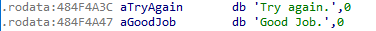
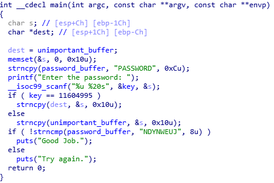
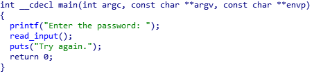

# 이전 글 바로가기

[[Research] 핵린이의 angr 정복기 - (1) 시작](https://hackyboiz.github.io/2021/07/10/j0ker/angr_part1/)

[[Research] 핵린이의 angr 정복기 - (2) Symbolic Execution](https://hackyboiz.github.io/2021/07/21/j0ker/angr_part2/)

[[Research] 핵린이의 angr 정복기 - (3) angr_ctf part.1](https://hackyboiz.github.io/2021/08/04/j0ker/angr_part3/)

[[Research] 핵린이의 angr 정복기 - (4) angr_ctf part.2](https://hackyboiz.github.io/2021/08/15/j0ker/angr_part4/)

[[Research] 핵린이의 angr 정복기 - (5) angr_ctf part.3](https://hackyboiz.github.io/2021/08/25/j0ker/angr_part5/)

[Research] 핵린이의 angr 정복기 - (6) angr_ctf part.4 ← Here!

# 인사말

안녕하세요. j0ker 입니다!  여러분들 잘 따라 오고 계신가요? 아니면 저보다도 앞서나가고 계실지도... 드디어 오늘로 angr_ctf가 마무리 됩니다. 하하 오늘은 이제 3문제만 보면 됩니다! angr로 익스플로잇하는 걸 찍먹해볼건데요. 후딱 보시죠!

# 15_angr_arbitrary_read

이 문제는 특정 메모리를 읽어야하는 문제인듯 싶습니다.


바이너리를 살펴보면 키값과 문자열 이 두 개의 인풋을 받습니다. 키값을 통해 어느 `puts`에서 출력을 할것인지, 또 무엇을 출력할 것인지를 결정하게 되죠. 그렇다면 이 문제는 저 중간에 있는 `puts`로 직접 `Good Job`을 출력하면 되겠네요.



일단 `Good Job`의 주소는 알았습니다. 그럼 이제 대략적인 시나리오를 세워보죠.

먼저 첫번째 인풋인 키값은 무조건 `0x27dfb7c`가 되어야겠죠. 그리고 두 번째 인풋은 20바이트까지 입력이 가능한 것을 확인할 수 있습니다. 두 번재 인풋은 `v4`에 저장되고 `v4`의 위치는 `ebp-0x1C`입니다. 그리고 `s`를 출력하는데, `s`의 위치는 `ebp-0xC`죠. 그러면 `v4`와 `s`의 주소 차이는 0x10이고 두번째 인풋은 20바이트 입력이 가능하니까 `s`를 모두 덮을 수 있게 됩니다. 그리고 `s`의 주소를 `Good Job`의 주소로 바꾸기만 하면 되겠네요!

일단 먼저 `scanf`를 후킹해줍니다.

```python
  class ReplacementScanf(angr.SimProcedure):
    
    def run(self, format_string, scanf0_address, scanf1_address):
      scanf0 = claripy.BVS('scanf0', 32)
      scanf1 = claripy.BVS('scanf1', 20*8)

      for char in scanf1.chop(bits=8):
        self.state.add_constraints(char >= 0x21, char <= 0x7e)
      
      self.state.memory.store(scanf0_address, scanf0, endness=project.arch.memory_endness)
      self.state.memory.store(scanf1_address, scanf1, endness=archinfo.arch.Endness.BE)
      
      self.state.globals['solution0'] = scanf0
      self.state.globals['solution1'] = scanf1
      
  scanf_symbol = '__isoc99_scanf'
  project.hook_symbol(scanf_symbol, ReplacementScanf())
```

먼저 인풋값의 크기에 맞춰 심볼릭 변수를 생성해줍니다. 그런 다음, 두 번째 입력값의 각각의 바이트가 문자일 수 있도록 조건제약을 설정해 줍니다. 여기에서 `chop(bits=n)`은 심볼릭 변수를 지정한 비트 크기로 나눠주는 메소드입니다. 비트벡터에 있는 데이터는 비트 단위로 저장되기 때문에 이를 8비트, 즉 1바이트로 나눈 다음 바이트 별로 조건 제약을 걸 수 있습니다. 그런 다음에는 각각의 심볼릭 변수를 메모리에 저장해줍니다. 이 때 주의해야할 점은 인티저 데이터는 보통 리틀엔디안으로 읽기 때문에 메모리의 엔디안 그래도 설정해줘도 되지만, 문자열 같은 경우 이렇게 하면 데이터가 역순으로 읽히기 때문에 위와 같이 빅엔디안으로 설정해도 되고 아예 인자를 안주어도 됩니다.

```python
  def check_puts(state):
    puts_parameter = state.memory.load(state.regs.esp+4, 4, endness=project.arch.memory_endness)

    if state.se.symbolic(puts_parameter):
      good_job_string_address = 0x484F4A47

      is_vulnerable_expression = puts_parameter == good_job_string_address

      copied_state = state.copy()

      copied_state.add_constraints(is_vulnerable_expression)

      if copied_state.satisfiable():
        state.add_constraints(is_vulnerable_expression)
        return True
      else:
        return False
    else:
      return False
```

`scanf` 후킹을 하고 나면 이제 `puts` 함수의 인자를 검사하는 함수를 만들어 줍니다. 일단 `puts`가 호출되면 인자는 `esp+4`에 위치하기 때문에 이 위치부터 4바이트를 읽어옵니다. 그리고 만약 해당 변수가 심볼릭 변수로 사용자 인풋에 따라 바뀐다면 해당 값이 `Good Job` 문자열의 주소인지를 체크하는 조건제약을 추가합니다. 그리고 해당 조건제약에 만족하는 state가 존재한다면 확정적으로 조건제약을 추가해줍니다.

```python
  def is_successful(state):
    puts_address = 0x08048370
    if state.addr == puts_address:
      return check_puts(state)
    else:
      return False

  simulation.explore(find=is_successful)
```

그리고 중간에 있는 `puts`에 도달했을 때 위에서 만든 `check_puts`함수를 통해 인자를 확인할 수 있도록 설정해 줍니다. 그러면 끝!

## sol15.py

```python
import angr
import claripy
import sys
import archinfo

def main(argv):
  path_to_binary = argv[1]
  project = angr.Project(path_to_binary)

  initial_state = project.factory.entry_state()

  class ReplacementScanf(angr.SimProcedure):
    def run(self, format_string, scanf0_address, scanf1_address):
      scanf0 = claripy.BVS('scanf0', 32)
      scanf1 = claripy.BVS('scanf1', 20*8)

      for char in scanf1.chop(bits=8):
        self.state.add_constraints(char >= 0x21, char <= 0x7e)
      
      self.state.memory.store(scanf0_address, scanf0, endness=project.arch.memory_endness)
      self.state.memory.store(scanf1_address, scanf1, endness=archinfo.arch.Endness.BE)
  
      self.state.globals['solution0'] = scanf0
      self.state.globals['solution1'] = scanf1
  
  scanf_symbol = '__isoc99_scanf'
  project.hook_symbol(scanf_symbol, ReplacementScanf())

  def check_puts(state):
    puts_parameter = state.memory.load(state.regs.esp+4, 4, endness=project.arch.memory_endness)

    if state.se.symbolic(puts_parameter):
      good_job_string_address = 0x484F4A47

      is_vulnerable_expression = puts_parameter == good_job_string_address

      copied_state = state.copy()

      copied_state.add_constraints(is_vulnerable_expression)

      if copied_state.satisfiable():
        state.add_constraints(is_vulnerable_expression)
        return True
      else:
        return False
    else:
      return False

  simulation = project.factory.simgr(initial_state)

  def is_successful(state):
    puts_address = 0x08048370
    if state.addr == puts_address:
      return check_puts(state)
    else:
      return False

  simulation.explore(find=is_successful)

  if simulation.found:
    solution_state = simulation.found[0]

    solution0 = solution_state.se.eval(solution_state.globals['solution0'], cast_to=int)
    solution1 = solution_state.se.eval(solution_state.globals['solution1'], cast_to=bytes)
    print('{} {}'.format(solution0, solution1))
    
  else:
    raise Exception('Could not find the solution')

if __name__ == '__main__':
  main(sys.argv)
```

```python
j0ker@angr:~/angr_ctf/dist$ python3 sol15.py 15_angr_arbitrary_read 
WARNING | 2021-08-19 13:02:28,781 | angr.project | Address is already hooked, during hook(0x48554e80, <SimProcedure ReplacementScanf>). Re-hooking.
WARNING | 2021-08-19 13:02:28,862 | angr.storage.memory_mixins.default_filler_mixin | The program is accessing memory or registers with an unspecified value. This could indicate unwanted behavior.
WARNING | 2021-08-19 13:02:28,863 | angr.storage.memory_mixins.default_filler_mixin | angr will cope with this by generating an unconstrained symbolic variable and continuing. You can resolve this by:
WARNING | 2021-08-19 13:02:28,863 | angr.storage.memory_mixins.default_filler_mixin | 1) setting a value to the initial state
WARNING | 2021-08-19 13:02:28,863 | angr.storage.memory_mixins.default_filler_mixin | 2) adding the state option ZERO_FILL_UNCONSTRAINED_{MEMORY,REGISTERS}, to make unknown regions hold null
WARNING | 2021-08-19 13:02:28,863 | angr.storage.memory_mixins.default_filler_mixin | 3) adding the state option SYMBOL_FILL_UNCONSTRAINED_{MEMORY,REGISTERS}, to suppress these messages.
WARNING | 2021-08-19 13:02:28,863 | angr.storage.memory_mixins.default_filler_mixin | Filling register edi with 4 unconstrained bytes referenced from 0x8048571 (__libc_csu_init+0x1 in 15_angr_arbitrary_read (0x8048571))
WARNING | 2021-08-19 13:02:28,864 | angr.storage.memory_mixins.default_filler_mixin | Filling register ebx with 4 unconstrained bytes referenced from 0x8048573 (__libc_csu_init+0x3 in 15_angr_arbitrary_read (0x8048573))
CRITICAL | 2021-08-19 13:02:29,011 | angr.sim_state | The name state.se is deprecated; please use state.solver.
41810812 b'$"(!!0"00(((0000GJOH'
j0ker@angr:~/angr_ctf/dist$ ./15_angr_arbitrary_read 
Enter the password: 41810812 $"(!!0"00(((0000GJOH
Good Job.
```

# 16_angr_arbitrary_write



이번에는 어디에 뭘 쓰는 문제인듯 싶습니다. 문제를 보면 일단 두 개의 인풋을 받구요.(또 `scanf`는 후킹해줘야 겠네...) 첫 번째 인풋은 여전히 키고 두 번째 인풋은 버퍼로 20바이트를 받습니다. 그리고 `s`와 `dest`의 주소 차이를 보면 여전히 0x10만큼 차이가 아니까 마지막 4바이트로 `dest`를 덮을 수 있습니다. 그리고 그 뒤에 분기문에서는 두 개의 `strncpy`가 있는데, 키가 맞으면 `dest`에 복사하고 키가 틀리면 `unimportant_buffer`에 복사를 합니다. 역시 이 문제는 `dest`를 덮은 다음 원하는 곳에 쓰는 문제이군요. 마지막에는 `strncmp`를 통해 `password_buffer`가 특정 문자열과 같은 지를 비교합니다. 그렇다면 우리는 `dest`를 `password_buffer`의 주소로 덮고 거기에 저 문자열을 쓰면 될듯 합니다.

이제 코드를 짜보도록 하겠습니다. `scanf`를 후킹하는 부분은 앞에 문제와 같으니 건너뛰기로 하구요. `strncpy`를 체크하는 부분을 짜보도록 하겠습니다.

```python
  def check_strncpy(state):
    strncpy_src = state.memory.load(state.regs.esp+8, 4, endness=project.arch.memory_endness)
    strncpy_dest = state.memory.load(state.regs.esp+4, 4, endness=project.arch.memory_endness)
    strncpy_len = state.memory.load(state.regs.esp+12, 4, endness=project.arch.memory_endness)

    src_contents = state.memory.load(strncpy_src, 16)

    if state.se.symbolic(src_contents) and state.se.symbolic(strncpy_dest):
      password_string = 'NDYNWEUJ'
      buffer_address = 0x57584344

      does_src_hold_password = src_contents[:64] == password_string
      
      does_dest_equal_buffer_address = strncpy_dest == buffer_address

      if state.satisfiable(extra_constraints=(does_src_hold_password, does_dest_equal_buffer_address)):
        state.add_constraints(does_src_hold_password, does_dest_equal_buffer_address)
        return True
      else:
        return False
    else:
      return False
```

일단 각각의 인자들을 로드합니다. `strncpy`의 인자 순서에 따라 스택에 차곡차곡 쌓이니 그 오프셋에 맞춰 메모리에서 값들을 로드해줍니다. 그리고 `src`의 주소에서 다시 문자열 16바이트를 가져와 해당 문자열과 `dest`의 주소가 심볼릭 변수인지를 확인합니다. 그런 다음 우리가 비교해야할 문자열과 덮어야할 버퍼의 주소를 설정합니다. 앞서 얘기했듯이 비트벡터는 비트 단위로 데이터가 저장되어 있기 때문에 `src`에 있는 데이터를 읽어들일 때는 인덱스를 비트 단위로 설정해주어야합니다. 따라서 읽어온 16바이트 중에 앞 8바이트를 가져와야할 때에는 `src_contents[:64]` 형식으로 불러와야 합니다. 그리고 우리가 입력한 문자열 중 앞 8바이트가 최종적으로 맞춰야할 문자열이 맞는지를 비교하는 조건제약문과 `dest`의 주소가 `password_buffer`의 주소가 맞는지 비교하는 조건제약문들을 설정해줍니다.

```python
  def is_successful(state):
    strncpy_address = 0x08048410
    if state.addr == strncpy_address:
      return check_strncpy(state)
    else:
      return False
```

그리고 앞에서 해주었던 것처럼 `strncpy`가 호출될 때 위 체크 함수를 실행할 수 있도록 설정하면 끝!

## sol16.py

```python
import angr
import claripy
import sys

def main(argv):
  path_to_binary = argv[1]
  project = angr.Project(path_to_binary)

  initial_state = project.factory.entry_state()

  class ReplacementScanf(angr.SimProcedure):
    def run(self, format_string, scanf0_address, scanf1_address):
      scanf0 = claripy.BVS('scanf0', 32)
      
      scanf1 = claripy.BVS('scanf1', 8*20)

      for char in scanf1.chop(bits=8):
        self.state.add_constraints(char >= 0x21, char <= 0x7e)

      
      self.state.memory.store(scanf0_address, scanf0, endness=project.arch.memory_endness)
      self.state.memory.store(scanf1_address, scanf1)
      

      self.state.globals['solutions0'] = scanf0
      self.state.globals['solutions1'] = scanf1

  scanf_symbol = '__isoc99_scanf'  # :string
  project.hook_symbol(scanf_symbol, ReplacementScanf())

  def check_strncpy(state):
    strncpy_src = state.memory.load(state.regs.esp+8, 4, endness=project.arch.memory_endness)
    strncpy_dest = state.memory.load(state.regs.esp+4, 4, endness=project.arch.memory_endness)
    strncpy_len = state.memory.load(state.regs.esp+12, 4, endness=project.arch.memory_endness)

    src_contents = state.memory.load(strncpy_src, 16)

    if state.se.symbolic(src_contents) and state.se.symbolic(strncpy_dest):
      password_string = 'NDYNWEUJ'
      buffer_address = 0x57584344

      does_src_hold_password = src_contents[:64] == password_string
      
      does_dest_equal_buffer_address = strncpy_dest == buffer_address

      if state.satisfiable(extra_constraints=(does_src_hold_password, does_dest_equal_buffer_address)):
        state.add_constraints(does_src_hold_password, does_dest_equal_buffer_address)
        return True
      else:
        return False
    else:
      return False

  simulation = project.factory.simgr(initial_state)

  def is_successful(state):
    strncpy_address = 0x08048410
    if state.addr == strncpy_address:
      return check_strncpy(state)
    else:
      return False

  simulation.explore(find=is_successful)

  if simulation.found:
    solution_state = simulation.found[0]

    solution0 = solution_state.se.eval(solution_state.globals['solutions0'], cast_to=int)
    solution1 = solution_state.se.eval(solution_state.globals['solutions1'], cast_to=bytes)
    print('{} {}'.format(solution0, solution1))
  else:
    raise Exception('Could not find the solution')

if __name__ == '__main__':
  main(sys.argv)
```

```python
j0ker@angr:~/angr_ctf/dist$ python3 sol16.py 16_angr_arbitrary_write 
WARNING | 2021-08-19 14:01:34,776 | angr.project | Address is already hooked, during hook(0x57654e80, <SimProcedure ReplacementScanf>). Re-hooking.
WARNING | 2021-08-19 14:01:34,856 | angr.storage.memory_mixins.default_filler_mixin | The program is accessing memory or registers with an unspecified value. This could indicate unwanted behavior.
WARNING | 2021-08-19 14:01:34,856 | angr.storage.memory_mixins.default_filler_mixin | angr will cope with this by generating an unconstrained symbolic variable and continuing. You can resolve this by:
WARNING | 2021-08-19 14:01:34,856 | angr.storage.memory_mixins.default_filler_mixin | 1) setting a value to the initial state
WARNING | 2021-08-19 14:01:34,856 | angr.storage.memory_mixins.default_filler_mixin | 2) adding the state option ZERO_FILL_UNCONSTRAINED_{MEMORY,REGISTERS}, to make unknown regions hold null
WARNING | 2021-08-19 14:01:34,856 | angr.storage.memory_mixins.default_filler_mixin | 3) adding the state option SYMBOL_FILL_UNCONSTRAINED_{MEMORY,REGISTERS}, to suppress these messages.
WARNING | 2021-08-19 14:01:34,857 | angr.storage.memory_mixins.default_filler_mixin | Filling register edi with 4 unconstrained bytes referenced from 0x8048681 (__libc_csu_init+0x1 in 16_angr_arbitrary_write (0x8048681))
WARNING | 2021-08-19 14:01:34,857 | angr.storage.memory_mixins.default_filler_mixin | Filling register ebx with 4 unconstrained bytes referenced from 0x8048683 (__libc_csu_init+0x3 in 16_angr_arbitrary_write (0x8048683))
CRITICAL | 2021-08-19 14:01:34,909 | angr.sim_state | The name state.se is deprecated; please use state.solver.
WARNING | 2021-08-19 14:01:35,024 | claripy.ast.bv | BVV value is being coerced from a unicode string, encoding as utf-8
11604995 b'NDYNWEUJ@@@@@@@@DCXW'
j0ker@angr:~/angr_ctf/dist$ ./16_angr_arbitrary_write 
Enter the password: 11604995 NDYNWEUJ@@@@@@@@DCXW
Good Job.
```

# 17_angr_arbitrary_jump

이제 드디어 마지막 문제입니다! 마지막 문제인 만큼 그리고 이름도 `jump`인 만큼 실행흐름을 바꿀 수 있게 하는 문제일거 같군요!




문제는 매우 간단한 버퍼 오버플로우 문제입니다. 그냥 `scanf`에서 버퍼 오버플로우를 일으켜 익스를 하면 되겠죠. 그렇다면 조건 제약을 어떻게 할 지가 문제이겠네요.

일단 eip에 조건 제약을 걸어볼 수 있을듯 합니다. 근데 어디로 조건제약을 걸 것인지가 문제인데 함수 리스트를 보면 `print_good`이라는 함수가 존재합니다. 그래서 마냥 eip에 조건제약만 걸어주면 되겠네? 라고 생각하고 문제 스크립트를 열었더니 생각보다 복잡했습니다.

```python
  project = angr.Project(path_to_binary)

  initial_state = project.factory.entry_state() 

  simulation = project.factory.simgr(initial_state, save_unconstrained=True)
```

먼저 시뮬레이션 메니저를 설정할 때 `save_unconstrained` 옵션을 활성화해줍니다. 이는 unconstrained한 state를 저장해 주는 옵션입니다. 즉 eip를 컨트롤하는 것과 같이 제약조건이 없어 어떠한 값이든 흐름이 이어질 수 있는 경우가 unconstrained한 state입니다. 이 문제에서는 이런 unconstrained한 state에서 우리가 활용할 수 있는 state를 찾아야 합니다.

```python
  solution_state = None
  def has_found_solution():
    return solution_state is not None

  def has_unconstrained():
    return len(simulation.unconstrained) > 0

  def has_active():
    return len(simulation.active) > 0

  while (has_active() or has_unconstrained()) and (not has_found_solution()):
    for unconstrained_state in simulation.unconstrained:
      eip = unconstrained_state.regs.eip

      if unconstrained_state.satisfiable(extra_constraints=(eip == 0x42585249)):
        solution_state = unconstrained_state

        solution_state.add_constraints(solution_state.regs.eip == 0x42585249)

        break

    simulation.drop(stash='unconstrained')

    simulation.step()
```

unconstrained한 state는 한두개가 아니겠죠? 그렇기 때문에 이 모든 state를 훑어봐야 합니다. 뭐 하나쯤은 익스할 수 있는 state가 있겠지... 일단 state에 eip가 우리가 원하는 `Good Job`을 출력할 수 있는 `print_good` 함수의 주소로 바뀔 수 있는지 조건제약을 추가합니다. 그리고 해당 state가 이 조건제약을 만족하는지 확인하고 만족하지 못한다면 계속 루프를 돌며 확인하고 찾았다면 그 즉시 루프를 탈출해 나머지 unconstrained한 state를 모두 버립니다.

```python
  if solution_state:
    for byte in solution_state.posix.files[sys.stdin.fileno()].all_bytes().chop(bits=8):
      solution_state.add_constraints(byte >= 0x41, byte <= 0x5A)
```

조건제약에 부합하는 state를 찾으면 이제 출력값에 대한 조건제약을 추가해줍니다. 조건 제약은 앞에와 같은데 심볼릭 변수를 도출하는 부분이 다르네요. 그리고 나서 코드를 돌려봅니다! 하지만...

```python
File "sol17.py", line 111, in <module>
    main(sys.argv)
  File "sol17.py", line 79, in main
    if unconstrained_state.satisfiable(extra_constraints=(eip == 0x42585249)):
  File "/home/j0ker/.local/lib/python3.8/site-packages/angr/sim_state.py", line 566, in satisfiable
    return self.solver.satisfiable(**kwargs)
  File "/home/j0ker/.local/lib/python3.8/site-packages/angr/state_plugins/sim_action_object.py", line 57, in ast_stripper
    return f(*new_args, **new_kwargs)
  File "/home/j0ker/.local/lib/python3.8/site-packages/angr/state_plugins/solver.py", line 89, in wrapped_f
    return f(*args, **kwargs)
  File "/home/j0ker/.local/lib/python3.8/site-packages/angr/state_plugins/solver.py", line 651, in satisfiable
    return self._solver.satisfiable(extra_constraints=self._adjust_constraint_list(extra_constraints), exact=exact)
  File "/home/j0ker/.local/lib/python3.8/site-packages/claripy/frontend_mixins/constraint_filter_mixin.py", line 33, in satisfiable
    ec = self._constraint_filter(extra_constraints)
  File "/home/j0ker/.local/lib/python3.8/site-packages/claripy/frontend_mixins/constraint_filter_mixin.py", line 4, in _constraint_filter
    raise ClaripyValueError("The extra_constraints argument should be a list of constraints.")
claripy.errors.ClaripyValueError: The extra_constraints argument should be a list of constraints.
```

??? 

`(eip == 0x42585249)` 이 부분이 리스트여야 하네요. 이거는 간단하게 `[eip == 0x42585249]` 이렇게 바꿔서 다시 돌려봅니다. 그러면!!!

```python
Traceback (most recent call last):
  File "sol17.py", line 111, in <module>
    main(sys.argv)
  File "sol17.py", line 97, in main
    for byte in solution_state.posix.files[sys.stdin.fileno()].all_bytes().chop(bits=8):
AttributeError: 'SimSystemPosix' object has no attribute 'files'
```

?????!?!?!?!?!!!?! 하... 그만 좀.... 왜 또 없는건데...

해답은 아래 링크에서 찾을 수 있었습니다...

[posix.files[0] is now removed but still in example #1186](https://github.com/angr/angr/issues/1186)

`posix.files`가 없어졌다는 군요. 그럼 입력값 해답을 어떻게 가져오냐? `posix.stdin.content[0][0]` 이렇게 접근하면 된다고 합니다. 하하... 이것도 나름 삽질 좀 했네요.

암튼 이것만 수정하면 진짜 끝!

## sol17.py

```python
import angr
import claripy
import sys

def main(argv):
  path_to_binary = argv[1]
  project = angr.Project(path_to_binary)

  initial_state = project.factory.entry_state() 

  simulation = project.factory.simgr(initial_state, save_unconstrained=True)

  solution_state = None
  def has_found_solution():
    return solution_state is not None

  def has_unconstrained():
    return len(simulation.unconstrained) > 0

  def has_active():
    return len(simulation.active) > 0

  while (has_active() or has_unconstrained()) and (not has_found_solution()):
    for unconstrained_state in simulation.unconstrained:
      eip = unconstrained_state.regs.eip

      if unconstrained_state.satisfiable(extra_constraints=[eip == 0x42585249]):
        solution_state = unconstrained_state

        solution_state.add_constraints(solution_state.regs.eip == 0x42585249)

        break

    simulation.drop(stash='unconstrained')

    simulation.step()

  if solution_state:
    print(solution_state.posix.stdin.content[0][0])
    for byte in solution_state.posix.stdin.content[0][0].chop(bits=8):
      solution_state.add_constraints(byte >= 0x41, byte <= 0x5A)

    solution = solution_state.posix.dumps(sys.stdin.fileno())

    
    print(solution)
  else:
    raise Exception('Could not find the solution')

if __name__ == '__main__':
  main(sys.argv)
```

```python
j0ker@angr:~/angr_ctf/dist$ python3 sol17.py 17_angr_arbitrary_jump
WARNING | 2021-08-23 06:37:35,025 | angr.storage.memory_mixins.default_filler_mixin | The program is accessing memory or registers with an unspecified value. This could indicate unwanted behavior.
WARNING | 2021-08-23 06:37:35,026 | angr.storage.memory_mixins.default_filler_mixin | angr will cope with this by generating an unconstrained symbolic variable and continuing. You can resolve this by:
WARNING | 2021-08-23 06:37:35,026 | angr.storage.memory_mixins.default_filler_mixin | 1) setting a value to the initial state
WARNING | 2021-08-23 06:37:35,026 | angr.storage.memory_mixins.default_filler_mixin | 2) adding the state option ZERO_FILL_UNCONSTRAINED_{MEMORY,REGISTERS}, to make unknown regions hold null
WARNING | 2021-08-23 06:37:35,026 | angr.storage.memory_mixins.default_filler_mixin | 3) adding the state option SYMBOL_FILL_UNCONSTRAINED_{MEMORY,REGISTERS}, to suppress these messages.
WARNING | 2021-08-23 06:37:35,026 | angr.storage.memory_mixins.default_filler_mixin | Filling register edi with 4 unconstrained bytes referenced from 0x425852d1 (__libc_csu_init+0x1 in 17_angr_arbitrary_jump (0x425852d1))
WARNING | 2021-08-23 06:37:35,028 | angr.storage.memory_mixins.default_filler_mixin | Filling register ebx with 4 unconstrained bytes referenced from 0x425852d3 (__libc_csu_init+0x3 in 17_angr_arbitrary_jump (0x425852d3))
WARNING | 2021-08-23 06:37:36,171 | angr.engines.successors | Exit state has over 256 possible solutions. Likely unconstrained; skipping. <BV32 Reverse(packet_0_stdin_9_480[191:160])>
<BV480 packet_0_stdin_9_480>
b'AABBAAAAAABABBAABBAAABABAAAABBBBABAAIRXBAAAAAAAAAAAAAAAAAAAA'
j0ker@angr:~/angr_ctf/dist$ ./17_angr_arbitrary_jump
Enter the password: AABBAAAAAABABBAABBAAABABAAAABBBBABAAIRXBAAAAAAAAAAAAAAAAAAAA
Good Job.
```

# 마무리

하 드디어 길고 길었던 angr_ctf가 끝났습니다! 


> 웃는게 웃는게 아니야...

이제 시작입니다. CTF 문제도 풀어야하고 자동으로 익스할 수 있는것도 만들어보고 제로데이도 찾아야하는데... 이제 막 발걸음을 땐 느낌입니다. 일단 CTF 문제 10개를 푸는게 목표이기는 한데.... 이거는 풀면서 다시 고민해보도록 하겠습니다.

그럼 조-바~