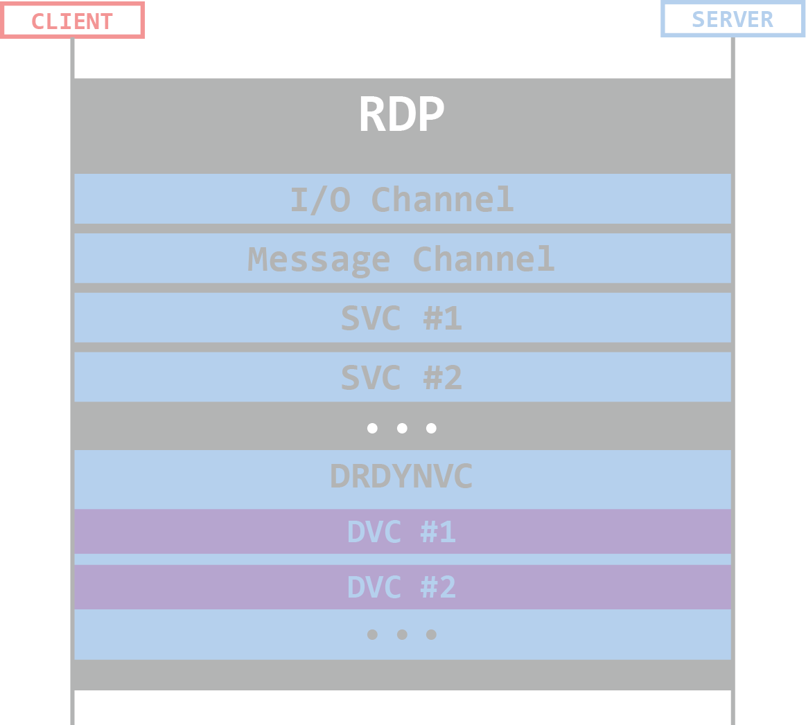
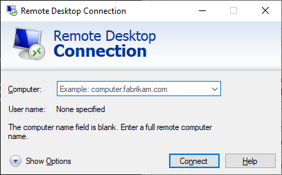
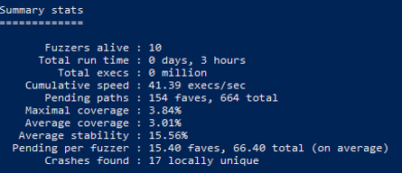

원문 링크 : [https://www.cyberark.com/resources/threat-research-blog/fuzzing-rdp-holding-the-stick-at-both-ends](https://www.cyberark.com/resources/threat-research-blog/fuzzing-rdp-holding-the-stick-at-both-ends)

안녕하세요. j0ker입니다! 오늘은 오랜만에 번역글을 가져와봤습니다. 평소에 퍼징에 대해서도 관심이 많았고 파일 퍼징만 해봤지 네트워크 퍼징은 안해봤었는데 괜찮은 글이 있어서 번역해봅니다. 의역을 많이 했는데 오타나 번역이 어색한 부분은 댓글로 지적해주세요. 혹시나 번역해줬으면 하는 글이 있다면 추천 부탁드립니다! 최대한 빨리 해볼게요!

---

# 인사말

이 포스트에서는 우리가 Windows RDP 클라이언트와 서버들을 퍼징하면서 겪은 내용들과 그 결과에 대해 다룰 예정입니다.

보안 커뮤니티는 Microsoft의 Remote Desktop Protocol(RDP)를 예전부터 관심있게 지켜봐왔습니다. 2019년에는 [몇 백만대에 접근할 수 있는 크리티컬한 취약점](https://www.bankinfosecurity.com/top-ransomware-attack-vectors-rdp-drive-by-phishing-a-14353)들이 발견되었고, 이 취약점들은 팬대믹 시기에 맞춰 재택근무를 하는 회사들에게는 몇 배로 더 큰 위협으로 다가왔습니다.

사실 저희가 프로젝트를 처음 시작할 때에는 VM에 관련된 내용에 관심을 가지고 있었습니다. 하지만 Azure의 Windows 머신 혹은 Hyper-V 가상머신에 접속할 때 RDP를 주로 사용하기 때문에, RDP에 눈을 돌리게 되었습니다.

저희는 다른 성공적인 프로젝트들과 똑같이 처음에는 구글링을 하다가 [박천성님, 장진영님, 김승주님, 이기택님의 RDP fuzzing에 관련된 BlackHat Europe 2019 발표](https://www.youtube.com/watch?v=dGLrK8tUAFs)를 접하게 되었습니다. 발표자들은 그렇게 빠르지 않은 퍼저를 활용했음에도 불구하고 몇 시간만에 여러 취약점들을 찾았습니다. 따라서 우리는 그들의 연구를 기반으로 퍼징 기능을 확장하고 퍼포먼스를 개선하여 RDP에서 Remote Code Execution(RCE) 취약점을 찾기로 결정하였습니다. 

불행히도(혹은 운이 좋게도, 보는 시각에 따라 다를 수 있음), 모든 퍼징 프로젝트의 결과물들이 크리티컬한 것은 아닙니다([Survivorship Bias](https://en.wikipedia.org/wiki/Survivorship_bias) 참고). 아직 RDP RCE를 찾지 못했지만 여러 버그들을 찾았고 프로토콜과 구성 그리고 퍼징 프로세스 및 툴을 이해하게 되었습니다. 우리가 만든 퍼징 인프라는 다른 타겟들을 퍼징할 수 있을 정도록 제네럴하게 만들어졌습니다.

이 포스트에서는 앞에서 언급한 모든 내용들의 프로세스에 대해 공유하려고 합니다. 먼저 RDP에 대해서 간단히 알아보고 퍼징을 어떻게 했는지, 어떤 문제점들을 해쳐나갔는지 그리고 마지막으로 이러한 과정들에서 발견하게된 버그들에 대해서 얘기해 보고자 합니다.

# RDP Overview

Remote Desktop Protocol은 Windows 머신에 접속할 때 많이 사용됩니다. 최근 Malwaretech는 RDP를 두고 "프로토콜들을 위한 프로토콜"이라고 표현했습니다. RDP는 모든 커넥션을 조작하여 여러 채널 동시접속을 지원하고 서로 다른 동작을 할 수 있도록 지원합니다. 이 말은 즉슨, 각각의 채널들은 각자 데이터, 임의 정의 구조체 그리고 데이터 플로우를 알아서 핸들링한다는 의미입니다. 이는 근본적으로 RDP가 여러 프로토콜을 지원한다는 의미가 됩니다.



> RDP 연결 시의 채널들

RDP 패널은 정적일 수 있고 동적일 수 있습니다. 이 둘의 차이점에 대해서는 글의 요지에서 벗어나기 때문에 얘기하지 않도록 하겠습니다. 만약 RDP의 내부 동작 방식에 대해 좀 더 알고 싶으시다면, [이 글](https://www.cyberark.com/resources/threat-research-blog/explain-like-i-m-5-remote-desktop-protocol-rdp)을 읽으시는걸 추천드려요. 반면에 퍼징 과정에 대해서 좀 더 알고 싶으셨다면 제대로 찾아오셨습니다. 들어갈게요.

# Challenges in RDP Fuzzing

일반적인 퍼징에서는 파일 혹은 스트림으로 되어 있는 인풋 데이터를 퍼저에서 생성하고 이를 읽어들이는 프로그램이 존재합니다. 해당 프로그램 데이터를 덤겨받아 처리하고 퍼저가 이 과정의 코드 커버리지를 모니터링 합니다. 측정한 커버리지를 바탕으로 퍼저는 다시 인풋을 변조하고 변조된 인풋을 프로그램에 전달하는 과정을 반복합니다.

RDP 퍼징은 RDP 연결이 항상 존재하기 때문에 이와는 사뭇 다릅니다. 퍼저가 프로그램에 넣는 인풋은 커넥션의 특정 채널(퍼징 과정에서도 활성화되어 있음)의 최상위에서 Protocol Data Unit(PDU)로써 보내집니다. 앞에서 안급했던 것처럼, 모든 채널은 각자 프로토콜이 존재하기 때문에 모든 채널에 퍼징을 진행해야 합니다. 이러한 이유 때문에 아래와 같은 첼린지들이 발생합니다.(이는 다른 네트워크/프로토콜 퍼저들에게도 해당될 수 있음)

- Client-Server architecture : 전통적인 퍼징에서 퍼저는 심플하게 타겟 프로그램을 실행하고 인풋을 넣는 역할만 한다. 하지만 클라이언트-서버 구조에서는 타겟 프로그램이 한 쪽에서 실행되고 있고 인풋은 다른 한쪽에서 생성되어 전달된다. RDP의 경우, 대부분 양쪽은 다른 머신(클라이언트와 서버 의미)이다.
- Statefulness : RDP는 상태 기반 프로토콜(연결 상태가 지속되는? 같은 의미인거 같네요)입니다. 이 말은 퍼퍼징을 하는 와중에도 연결 상태를 고려해야한다는 것입니다. 이는 퍼정 안정성에 심각한 영향을 줄 수 있습니다.
  - 퍼징 과정에서의 안정성은 보통 일관성, 즉 동일한 인풋을 넣으면 동일한 코드 경로를 생성한다는 것을 의미합니다.
- Multi-input fuzzing : 만약 파일을 인풋으로 받는 타겟 프로그램을 퍼징할 경우(file-format fuzzing), 타겟에 전달되는 퍼저의 인풋은 하나의 파일 안에 모두 담겨져 있습니다. 반대로, 프로토콜을 퍼징할 때에는 새로운 코드 경로를 발굴해내기 위해 여러 연속적인 메시지를 보내야할 수도 있습니다.
- Finding the target code : coverage-guided fuzzing을 사용할 때는 일반적으로 인풋을 핸들링하는 타겟 함수 같이 코드 커버리지 측정 시작 지점을 퍼저에게 알려줘야 합니다. RDP에는 동작에 관여하는 컴포넌트들이 매우 많습니다. 따라서 정확한 지점을 지정하는게 생각보다 어렵울 수 있습니다.

이렇게 4 가지가 저희가 프로젝트를 시작할 때 예상했던 챌린지들입니다. 다음 섹션에서는 우리가 이 챌린지들과 추후에 발생한 또 하나의 챌린지를 어떻게 해결했는지에 대해 다룰 예정입니다.

# Techincal Details : The Challenges and How to Overcome Them

이 섹션에서는 우리의 개발 세부 내용과 마주치게된 챌린지들에 대해 다루려고 합니다. 또한 우리가 퍼징 셋업을 갖추기 위해 어떻게 대처했는 지에 대해서도 얘기해볼게요. 이 [레포](https://github.com/cyberark/rdpfuzz)에 들어가시면 우리가 이 프로젝트를 진행하면서 작성한 코드들이 모두 들어있습니다. 혹시 이 쪽에 관심이 있다면, 처음 시작할 때 많은 도움이 될겁니다.

## Client-Server Architecture

이 프로젝트에서 우리는 Windows의 RDP 서버와 클라이언트 모두를 퍼징하고 싶었습니다. RDP 서버를 퍼징하고자 하는 목표는 명확합니다. 공격자가 이를 이용해 Windows 서버를 원격에서 공격해 접근 권한을 얻을 수 있기 때문이죠. RDP 클라이언트를 퍼징하고자 했던 이유는 좀 다릅니다. 만약 공격자가 이미 서버를 탈취했다면 그들은 익스플로잇을 준비하고 클라이언트가 접속하기만을 기다릴 수 있기 때문이죠. 피해자가 접속하면 공격자는 클라이언트를 공격해 피해자의 머신을 장악할 수 있습니다. 예를 들어, 관리자가 그들이 관리하는 서버에 접속하면 이런 상황이 발생할 수 있고, Hyper-V가 가상머신을 접속할 때 RDP를 사용하기 때문에 VM Escape에도 활용될 수 있습니다.

RDP 퍼저는 다음과 같은 컴포넌트로 구성됩니다.

- Instrumentation engine : 코드 커버리지를 측정하고 크래시를 탐지합니다.
- Mutation engine : 새로운 인풋을 생성합니다.
- Input sender : 적절할 타겟 채널에게 퍼저에서 생성된 테스트 케이스를 전송합니다.
- Target binary : intrumentation engine에 의해 트래킹됩니다.

아마 상상되시겠지만, 서버와 클라이언트 대상의 퍼징 셋업은 좀 다르지만 몇 가지 유사점이 있습니다. 이 부분부터 보시죠.


> 기본적인 퍼징 셋업(클라이언트와 서버 모두)

타겟 부분의 구성은 다음과 같습니다.

- Fuzzer : 커스텀 afl-fuzz.exe
- Instrumentation engine : in-app instrumentation 모드의 DynamoRIO를 사용한 커스텀 winafl.dll
  - 커스텀 빌드에서 WinAFL과 DynamoRIO에 추가된 기능에 대해서는 다음 섹션을 참고해 주세요.
- Inputs(혹은 test cases) : 타겟과 인풋 센더 사이에 공유되는 디렉토리 안 임시 파일에 쓰이는 변조된 PDU들

인풋 센더에는 하나의 컴포넌트만 존재합니다.

- Agent : 임시 파일들을 읽고 타겟 패널에 인풋들을 전달

이런 세팅을 한 이유는 간단합니다. 우리는 퍼징 인풋을 가상환경을 대상으로 하는 것이 아닌 "라이브"한 RDP 연결 상태에서 진행하고 싶었습니다.

따라서 우리는 인풋 생성 부분을 타겟에 전달하는 부분과 분리시켜 타겟이 인풋을 처리하기 전에 RDP 한쪽에서부터 다른 한쪽인 타겟에게까지 전달 될 수 있도록 했습니다. 추가적으로 우리는 WinAFL의 in-app instrumentation mode를 사용하여 일반적인 실행 흐름에 영향을 주지 않도록 했습니다.

Coverage-guided fuzzing이 동작하기 위해서는 입력과 입력으로 인해 트리거된 코드 경로가 일대일 대응이 되어야 합니다. 이렇게 하기 위해서 우리는 퍼저의 PDU들과 일반적인 PDU들을 구분하고 퍼저의 PDU들의 코드 경로만 트래킹하는 "background fuzzing"을 개발하였습니다. 우리는 연결 상태에서의 랜덤한 PDU가 아니라 퍼저에서 생성한 PDU들에 대한 코드 커버리지만 트래킹하기를 원했기 때문에 이는 중요한 작업이었습니다.

이해를 돕기 위해서 RDP 서버에서 클라이언트로 오디오를 리다이렉트하는 RDPSND 가상 채널을 퍼징할 때 어떤지 한번 보겠습니다. [공식 문서](https://docs.microsoft.com/en-us/openspecs/windows_protocols/ms-rdpea/bea2d5cf-e3b9-4419-92e5-0e074ff9bc5b)에 따르면 PDU 음답의 첫 번째 바이트는 메시지의 타입을 의미합니다.


`msgType` 필드에서 지원하는 값은 0x01 ~ 0x0D 입니다.여기에서는 첫 바이트의 최상위 비트를 다음과 같은 방식으로 퍼징 마커로 사용할 수 있습니다.  

- 에이전트에서 PDU를 보낼 때 첫 바이트의 최상위 비트를 조작합니다.
- WinAFL에서는 메시지를 핸들링하기 전에 최상위 비트를 체크합니다. 만약 해당 비트가 활성화되어 있다면(값이 있다면), WinAFL은 해당 비트를 다시 비활성화하고 해당 메시지의 코드 커버리지를 측정합니다. 만약 해당 비트가 비활성화되어 있다면 메시지를 무시하고 코드 커버리지를 측정합니다.

여기까지 클라이언트와 서버 셋업의 비슷한 점들에 대해서 알아봤습니다. 그럼 이제 다른 점들을 보죠. 클라이언트를 먼저 봅시다.

## Client Fuzzing Setup

Windwos RDP client는 mstsc.exe입니다. 그러나 가상 채널 데이터를 처리하는 대부분의 로직은 mstscax.dll에 들어있습니다.

Hyper-V 가상 머신의 원격 접근 클라이언트인 vmconnect.exe도 똑같이 mstscax.dll에 코어 기능들이 들어가 있습니다.



> Windows RDP Client

단순성과 효율성을 위 클라이언트와 서버(타겟과 에이전트)를 같은 머신에서 실행합니다.(클라이언트가 localhost/127.0.0.1에 접속) 또한 병령 퍼징을 할 수 잇게 mimikatz를 사용하여 여러 RDP 연결을 허용하도록 서버를 패치하였습니다.


클라이언트 퍼징을 위한 셋업 구성은 다음과 같습니다.

- Target : mstsc.exe와 타겟 모듈인 mstscax.dll
- Instrumentation : 클라이언트 프로세스를 생성하는 DynamoRIO와 코드커버리지는 전달하는 DynamoRIO 클라이언트인 winafl.dll
- Mutation engine : 같은 머신에서 동작하고 파일에 새로운 테스트 케이스를 쓰는 AFL-Fuzzer
- Input sender : 서버에 대한 핸들을 오픈하고 선택된 가상 채널로 PDU를 전달하는 RDPFuzzAgent. 이 에이전트는 AFL-Fuzz에서 생성하는 파일으로부터 읽어오는 테스트 케이스들을 타켓 채널에 전달합니다.

이렇게 구성함으로써 우리는 초당 50 ~ 100 번 실행이라는 속도를 낼 수 있었습니다. 그렇게 빠른 속도는 아니지만 앞서 언급한 연구에서의 속도보다는 빨랐기 때문에 우리는 만족했습니다.

## Server Fuzzing Setup

RDP 서버의 메인 로직을 담고 있는 타겟 바이너리를 찾기 위해서 잠깐 `Remote Desktop Service` 서비스를 훑고 가겠습니다.

```powershell
PS C:\> gci HKLM:\SYSTEM\CurrentControlSet\Services\$((Get-Service -Name "Remote Desktop Services").Name)
    Hive: HKEY_LOCAL_MACHINE\SYSTEM\CurrentControlSet\Services\TermService
Name                           Property
----                           --------
Parameters                     ServiceDll             : C:\Windows\System32\termsrv.dll
. . .
```

RDP 서버의 메인 로직은 termsrv.dll에 들어 있는데, 이 dll은 아래와 같은 커맨드 라인으로 svchost.exe에 로드됩니다.

```
C:\Windows\System32\svchost.exe -k NetworkService -s TermService
```

서버 퍼징 방법은 처음에는 클라이언트와 유사했습니다. `TermService`의 여러 인스턴스를 실행하는 같은 머신에서 여러 인스턴스를 병렬적으로 퍼징하는 것이었죠. 하지만 Windows에서 이를 지원하지 않아서 꽤나 큰 챌린지가 되었습니다. 우리는 이를 고치기 위해 노력했지만 `termsrv.dll`에서 `TermService`와 레지스트리 키들을 가리키는 하드코딩된 문자열들을 발견하였고, 따라서 그냥 여러 VM을 활용해 서버를 병렬 퍼징하는 것으로 결정했습니다.

클라이언트 퍼징 셋업에서 우리는 서버 사이드 API를 활용해 [`WTSVirtualChannelWrite()`](https://docs.microsoft.com/en-us/windows/win32/api/wtsapi32/nf-wtsapi32-wtsvirtualchannelwrite) 함수를 호출하여 퍼징 인풋을 타겟에게 전송했습니다. 하지만 RDP 연결 상황에서 서버로 인풋을 전달할 수 있는 API는 찾지 못하였죠. 이로 인해 저희는 커스텀한 [FreeRDP](https://www.freerdp.com/)(인시있는 오픈소스 RDP 클라이언트죠)를 활용해 우분투 머신에서 서버로 인풋을 전달하는 방법을 선택했습니다. 이런 방법은 이상적인 퍼징 셋업이 아니고 이런 제약조건 때문에 서버 퍼징 스피드가 클라이언트 퍼징 스피드의 1/10 정도되는 결과를 낳게 됩니다.



> 서버 퍼징 상황

서버 퍼징 셋업은 다음과 같습니다.


- Target : 퍼징할 채널에 따라 달라집니다. tarmsrv.dll, audiodg.exe, rdpinput.exe 등이 있습니다.(다음 섹션에 있는 "Locating the relevant code" 부분을 참고해주세요. 각 채널의 타겟을 어떻게 찾을 수 있는지 이해하실 수 있습니다.)
- Instrumentation : 이런 셋업에서는 퍼저가 타겟 프로세스의 초기화를 제어할 수 없습니다. 따라서 저희는 코드 커버리지를 측정하기 위해서 실행되고 있는 타겟을 instrument할 수 밖에 없었습니다. 그래서 WinAFL을 선택하게 되었고 확장성과 안정성을 위해 DynamoRIO를 활용하게 되었습니다.
- DynamoRIO : DynamoRIO는 프로세스 밖에서 프로세스에 attach하는 것을 지원하지 않습니다. 따라서 우리는 이 [pull request](https://github.com/DynamoRIO/dynamorio/pull/3328)를 수정 및 개발하였고 이를 WinAFL에 붙여 활용했습니다.
- Mutation engine : Windows 머신에서 동작하고 공유 폴더에 있는 파일에 새로운 테스트 케이스를 쓰는 AFL-Fuzzer
- Input sender : Windows 머신에 있는 서버에 연결하는 FreeRDP로 공유 폴더에 있는 새로운 테스트 케이스들을 모니터링하고 타겟 RDP 채널에 전송