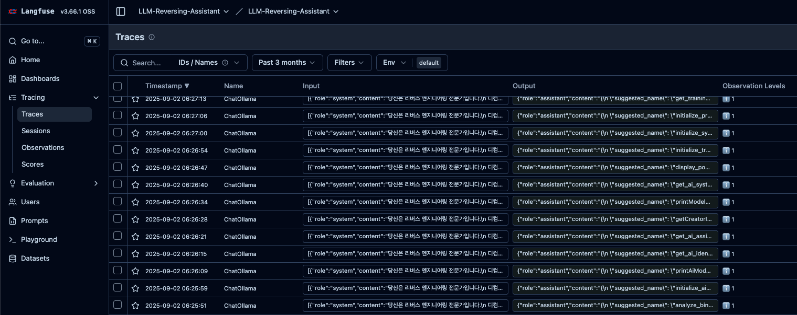

# 0. What happened…

Haha, it's j0ker! Why's it been so long since I last wrote? When was my last post… Ah, August… Haha… Please save me… Next time I'll try to write something more interesting…


Today, unlike my previous research posts, I'd like to briefly discuss a project I developed.

On August 30th, the 31st Hacking Camp took place. About two weeks prior, I suddenly received a call from the organizers...


Well... the original presenter suddenly contacted us saying they couldn't make it, so we had to find a replacement. I was planning to go on the second day, listen to the mentee presentations, and then grab drinks with the organizers in the evening... but I ended up giving the presentation lol. So I prepared for it and had about a week to spare... but I'm a pro at creating work for myself, so I wanted to do something extra.

# 1. Planning Begins

To give a quick update, I recently co-founded a startup called L0ch and Hacky-AI, where we're developing security solutions. (If you're interested, please visit our [website](https://hacky-ai.com/)!) I believe the most crucial aspect of running a startup is identifying customer problems and proposing solutions. There are plenty of other things to worry about too... Anyway, that's why I thought, “Why not create something simple that people attending presentations need?”

Since I'm also building solutions, I've become very interested in development using AI services. At this point, the things I wanted to stick to as much as possible were:

1. Don't write the code myself; let the AI services write it all.
2. We only have a week, so just make it work.
3. Build a service people actually need.

Hacking Camp runs a CTF on the first evening. My assumption was that most participants were just starting out with hacking and probably weren't very familiar with reverse engineering yet! So, wouldn't it be great to develop a reverse engineering assistant tool? I figured I could probably build something like that by investing about three days on my own. (But this was arrogance.) More specifically, I thought I could use an LLM to rename variables and functions to more readable names, and even analyze function contents with an LLM to add comments. (It's been over a year since I last opened IDA, so I realized while building this that such tools already exist as open source... haha. Well, the point was for me to try building a service anyway.)

A simplified service flowchart would look like this:

```
┌─────────────────┐                ┌─────────────────┐                ┌─────────────────┐
│   IDA Pro       │◄──────────────►│   FastAPI       │◄──────────────►│   Ollama        │
│   플러그인        │                │   서버           │                │   LLM 서버       │
│ (Python)        │                │ (Python)        │                │                 │
└─────────────────┘                └─────────────────┘                └─────────────────┘
                                            │                                   │
                                            ▼                                   ▼
                                    ┌─────────────────┐               ┌─────────────────┐ 
                                    │   Supabase      │               │   Langfuse      │
                                    │   데이터베이스     │               │   모니터링         │
                                    └─────────────────┘               └─────────────────┘

```

# 2. Ollama Server

First, you might wonder why I'm not using a commercial service. After all, there are so many great models like Gemini and ChatGPT. My personal view is that “a small open-source model is sufficient for this service.” Before starting this venture, I used open-source models for projects at my previous company. Even now, while conducting research, I've tested various open-source models to build an on-premises environment. Unfortunately, performance limitations prevent me from testing larger models yet ㅠㅠ

The device I currently use at home for LLM inference is a Mac mini. It has an M4 Pro chip and 64GB of RAM. I set up an Ollama server on it and served models. If you visit the [Ollama homepage](https://ollama.com/search), you'll find many models that can be utilized within 64GB of RAM.


Among the most popular models like GPT-OSS and DeepSeek, I tend to prefer models around 32B in size that are quantized to Q8. To give a simple reason:

- While 70B Q4 models (about 40G when downloaded) can run on 64GB RAM, these 70B models were already somewhat outdated at the time. I also thought it would be better to use a smaller model, considering the need to reserve space for the context window when processing long functions.
- Around mid-August, some hot new models emerged that were smaller yet performed well. For gpt-oss, there was a 20B MoE model, and qwen3 had 32B and 30B MoE models. These models seemed to deliver performance comparable to the latest ChatGPT 4o or slightly better.
- Beyond these, I also tested smaller models like Phi4 14B and Gemma 27B using several pre-set prompts I had prepared to evaluate their performance.

After multiple tests, I decided to use the “qwen3:30b-a3b-instruct-2507-q8_0” model.

1. As expected, the MoE model is significantly faster at inference than the standard model. The Qwen3 32B q8 model achieved about 7 TPS, while the Qwen 30B MoE model reached up to 45 TPS. I felt this was sufficient for a small-scale service.
    
    ```
    total duration:       54.782917709s
    load duration:        83.491792ms
    prompt eval count:    2649 token(s)
    prompt eval duration: 4.376536583s
    prompt eval rate:     605.27 tokens/s
    eval count:           2293 token(s)
    eval duration:        49.986260996s
    eval rate:            45.87 tokens/s
    ```
    
2. The reason we did not use the reasoning model qwen3:30b-a3b-thinking-2507 was that a bug where reasoning failed to complete consistently appeared during prompt testing. Since the model had only recently been released at the time, we simply decided not to use it.
3. The reason for not using other Reasoning models was that they took significantly longer to complete outputs. While the instruct model could produce most outputs within 2 minutes, enabling Reasoning added an extra 1-2 minutes. Additionally, performance was sufficient even without Reasoning.
4. Using smaller models required additional work, meaning their single-batch analysis performance was inferior. For the Phi4 14B model, while performance was sufficient, using the FP16 model was necessary to achieve usable performance levels. However, the reasoning time was too long for practical use. Beyond this, we determined that utilizing models like Qwen3 14B, 8B, Gemma 27B, and Deepseek 14B effectively would require significantly more prompt engineering effort.
5. Considering various factors like speed, performance, and memory, we determined that using the “qwen3:30b-a3b-instruct-2507-q8_0” model was the most suitable choice.

With the model selected, simply set the environment variables and run the server using the `ollama serve` command—that's all it takes to get ready!

# 2. Prompt Logging with Langfuse

You might be thinking, “Can't we just use LangSmith?” I agree, but... since we tested it during the solution development process while considering on-premises deployment, I decided to give Langfuse a try this time.

Installing Langfuse on the server isn't difficult. Just grab it from the repository and deploy it via Docker. Then, register Langfuse's callback handler in Langchain, and request logging will start as shown below.



Logging allows you to verify whether responses to requests were sent correctly and check the quality of those responses. Based on this information, you can refine prompts or execution chains.

And! You can also detect incoming attacks lol


As shown above, we also detected prompt injection attacks being launched. You worked hard until dawn... Unfortunately, it seems you weren't able to obtain the information you wanted.

# 3. Lovable + Supabase

Originally, our website was developed using Base44. Yes, that's the service [acquired by Wix for $80M a few months ago](https://techcrunch.com/2025/06/18/6-month-old-solo-owned-vibe-coder-base44-sells-to-wix-for-80m-cash/). I tried it after reading this article too. It was fine for developing simple landing pages, but problems started piling up after adding login functionality. It was especially terrible when developing features that utilized the database.

So, while searching for alternatives at the time, I heard that “Lovable is a hot service these days” and decided to give it a try. I first cloned the webpage I had previously developed exactly as it was, then started developing the login feature. To store user information, I connected it to Supabase. 


Unlike Base44, it integrates directly with Supabase, makes database management easier, and seems to have many advantages overall. Of course, it might struggle to handle large-scale customers (my wallet, that is). Once you set up this integration and create the login button…


Yeah... it wasn't exactly easy, but I did manage to succeed after a few tries. After logging in, there should be a dashboard, right? I'll create it by writing the prompt well. 


Of course, it doesn't get cleanly developed with just that one prompt. If it had worked in one go, I'd be out buying Lovable stock right now.

Anyway, there were still plenty of issues. While it generates API keys randomly just fine, it saves them to Supabase with parts of the key masked (***), or arbitrarily removes buttons, and so on—there were a bunch of minor details to worry about. So I decided to narrow the scope of the features to implement. Originally, I wanted to add fun elements like a weekly Top 5 usage list... but it required more prompting than expected, so I decided to skip it for now.


After about four hours of hard work, I managed to implement all the essential features. If I had developed it myself with my limited web development skills, it would have taken a week. Using AI services these days is definitely more advantageous.

I'll wrap things up here for today. Next time, I'll cover the rest of the development process and what happened at the presentation site. Until then... wish me luck staying alive... Bye!