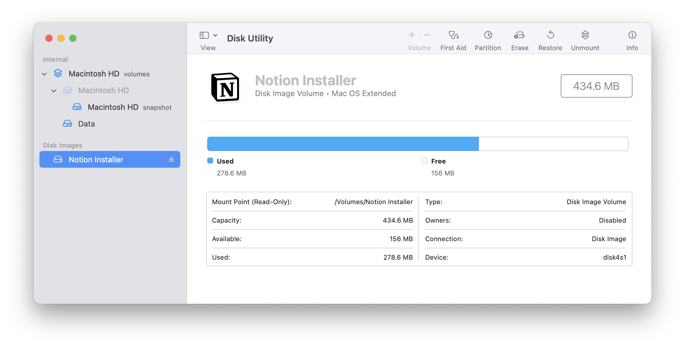

## Prologue


안녕하세요, 저는 macOS의 Disk Utility에서 발생한 CVE-2024-54489 취약점에 관한 글을 작성하게 된 ji9umi입니다!

본 취약점은 macOS Ventura 13.7.2, Sonoma 14.7.2, Sequoia 15.2에서 패치가 진행되었으며 글을 작성하고 있는 현재(2025-08-25)까지도 **Apple 보안 업데이트** 외에 추가적으로 공개된 정보는 없는 상황입니다.

이 글에서는 공개된 패치 정보를 바탕으로 취약점 원인 분석부터 익스플로잇 개발까지 관련된 내용을 다루고자 합니다.

## 1. Background

### 1.1. About Disk Utility

취약점에 관한 내용을 다루기 이전에 **Disk Utility가 무엇인지** 간단하게 살펴보는 시간을 가져보았습니다. Disk Utility는 macOS에서 제공하는 시스템 유틸리티로 Windows의 디스크 관리와 같이 디스크 파티션 관리, 검사 및 장착/해제 등의 역할을 수행합니다.

여기서 Windows와 다른 macOS의 특징 중 하나는 `.dmg` 파일을 다루기 위한 추가적인 기능이 존재한다는 점입니다.

### 1.2. Patch Analysis

Apple에서 공개하는 보안 업데이트 내용을 살펴보면 해당 취약점의 impact와 description을 통해 대략적인 정보를 수집할 수 있습니다. 이번 취약점의 경우 다음과 같습니다:

> *Impact: Running a mount command may unexpectedly execute arbitrary code
Description: A path handling issue was addressed with improved validation.*
> 

공개된 내용을 조합하면 사용자가 디스크를  마운트하는 과정에서 경로를 다루는 로직 중 미흡한 부분이 존재하였고 이를 악용할 경우 임의 코드 실행으로 이어질 수 있다고 볼 수 있습니다. 따라서 취약점을 트리거하기 위해서는 사용자가 직접 마운트를 진행하거나 macOS에 신규 저장장치가 감지되었을 때 가능할 것으로 예상됩니다.

Disk Utility의 정보를 간략하게 알아볼 때 `.dmg` 파일에 관한 이야기를 잠깐 했었는데요, 이는 앱스토어가 아닌 외부에서 배포되는 3rd party 애플리케이션을 받을 때 종종 확인할 수 있습니다. 

```cpp
% file Notion-4.18.0-arm64.dmg
Notion-4.18.0-arm64.dmg: lzfse encoded, lzvn compressed
```

파일을 내려받은 뒤 실행시키면 자동으로 볼륨에 마운트 되고 내부 구현에 따라 알맞은 방식으로 애플리케이션의 설치가 진행됩니다. 만약 이때 취약점이 발생한다면 공격자가 악의적인 설치 파일을 유포하는 것으로 원격 코드 실행 또한 가능할 것입니다.



## 2. Root Cause Analysis

대략적으로 취약점의 발생 원인은 알 수 있으나 실제로 마운트 동작이 수행되는 이벤트는 여러 경우가 존재합니다. 위 내용에서 언급하였듯 외부 저장장치가 연결되거나 애플리케이션의 설치를 위해 디스크 이미지를 다루는 경우 뿐만 아니라, 새로운 디스크 이미지를 생성하는 경우에도 완료 이후 자동으로 마운트 되는 등 연관된 동작으로 인해 호출되는 상황도 존재합니다.

모든 컴포넌트를 분석하기에는 많은 시간이 소요되기 때문에 분석 범위를 좁히기 위한 방법으로 **패치 비교 분석**을 진행하였습니다.

### 2.1. Patch Diffing

분석에 활용할 수 있는 다양한 조합이 존재하지만, 이 글에서는 Binary Ninja + BinExport + BinDiff 조합으로 진행하였습니다.

패치를 통해 확인 가능한 취약점 발생 위치는 Disk Utility이기 때문에 해당되는 애플리케이션 분석을 1순위로 진행하였습니다. 실행 파일의 경우 `/System/Applications/Utilities/Disk\ Utility.app/Contents/MacOS/Disk\ Utility` 경로에서 확보할 수 있습니다. 비교 분석을 위해 패치 적용 이전과 이후 버전에 해당되는 13.7.1과 13.7.2 버전에서 동일한 파일을 추출하였습니다.

```bash
% file /System/Applications/Utilities/Disk\ Utility.app/Contents/MacOS/Disk\ Utility
/System/Applications/Utilities/Disk Utility.app/Contents/MacOS/Disk Utility: Mach-O universal binary with 2 architectures: [x86_64:Mach-O 64-bit executable x86_64] [arm64e]
/System/Applications/Utilities/Disk Utility.app/Contents/MacOS/Disk Utility (for architecture x86_64):	Mach-O 64-bit executable x86_64
/System/Applications/Utilities/Disk Utility.app/Contents/MacOS/Disk Utility (for architecture arm64e):	Mach-O 64-bit executable arm64e
```

대상 실행 파일을 Binary Ninja에 불러온 뒤 BinExport로 추출한 각 파일을 BinDiff를 통해 비교하였습니다.


위 이미지는 BinDiff 실행 결과로 모든 함수의 유사도가 1.0 즉, **Matched Functions**으로 분류되는 것을 확인할 수 있습니다. 이를 해석하면 실행 파일 내에서 변경된 사항을 특정할 수 없다는 것인데, 이전 하루한줄에서 다룬 [CVE-2025-31200](https://hackyboiz.github.io/2025/08/26/ji9umi/2025-08-26/)의 경우에도 패치 내역에서는 **CoreAudio**로 표기되어 있으나 실제로는 그 하위 집합에 포함되는 **AudioToolBox**에서 조치가 이루어진 사례를 확인할 수 있습니다.

그렇기에 이번 취약점도 Disk Utility와 관련된 구성 요소에서 취약점이 발생할 가능성을 염두하고 추가적인 분석을 진행하였습니다. CVE-2025-31200의 분석 과정을 다시 한번 살펴보면 패치 내역을 비교하기 위해 `ipsw diff` 명령의 결과를 활용하였는데, 현재 테스트 환경을 구축한 13.7.1과 13.7.2의 경우 IPSW 형식으로 배포되지 않습니다.

IPSW는 iPhone, iPad 등에서 오랫동안 사용되어온 형식이지만 Intel CPU를 사용하는 Macbook은 이를 지원하지 않았고 Apple Silicon 칩셋 이후부터 지원을 시작하였습니다. 13.7.1 버전과 13.7.2 버전의 IPSW 파일을 찾지 못한 이유는 Apple Silicon에서 지원하지 않는 버전이기 때문인 것으로 확인됩니다.

또 하나의 특징은 macOS에 기본 설치되는 애플리케이션을 살펴보면 **x86_64와 arm64e를 모두 지원**하기 위한 *Mach-O universal binary*로 구성되어 있다는 점입니다.

```bash
% file /System/Applications/Utilities/Disk\ Utility.app/Contents/MacOS/Disk\ Utility
/System/Applications/Utilities/Disk Utility.app/Contents/MacOS/Disk Utility: Mach-O universal binary with 2 architectures: [x86_64:Mach-O 64-bit executable x86_64] [arm64e]
/System/Applications/Utilities/Disk Utility.app/Contents/MacOS/Disk Utility (for architecture x86_64):	Mach-O 64-bit executable x86_64
/System/Applications/Utilities/Disk Utility.app/Contents/MacOS/Disk Utility (for architecture arm64e):	Mach-O 64-bit executable arm64e
```

위 정보를 종합하여 생각하면 취약점 패치로 인한 변경 내역이 아키텍처에 영향을 받지 않을 것이기 때문에 `ipsw diff` 에서 지원하는 Apple Silicon의 펌웨어가 활용이 가능하다는 결론을 내릴 수 있습니다.

### 2.2. ipsw Diffing

`ipsw diff` 를 이용한 비교 분석은 다음과 같이 진행합니다:

1. 비교 분석할 대상 펌웨어를 내려 받습니다.
2. IPSW 분석을 위한 도구를 설치합니다. 설치 방법은 [Github](https://github.com/blacktop/ipsw)를 참고하여 진행할 수 있습니다.
3. `ipsw diff <source_firmware_1> <source_firmware_2> --output <path> --markdown`
    1. `--output` 옵션을 지정하지 않는 경우 기본적으로 터미널에 비교 결과가 출력됩니다. 

아래는 비교 분석을 진행하여 생성된 결과입니다.

```bash
% ls -l 15_1_1VS15_2/15_1_1_24B91__vs_15_2_24C101/
total 640
drwxr-x---  1382 root  staff   44224 Aug 23 20:33 DYLIBS
drwxr-x---    89 root  staff    2848 Aug 23 20:33 KEXTS
drwxr-x---  1064 root  staff   34048 Aug 23 20:33 MACHOS
-rw-r--r--     1 root  staff  324941 Aug 23 20:33 README.md
```

DYLIBS, KEXTS, MACHOS 3개의 하위 폴더가 생성되며 전체 결과의 요약 파일인 README.md 파일이 존재합니다. README 파일에는 변경 내역에 따라 *NEW, UPDATED, REMOVED* 구분되며 연결되어 있는 파일을 참고하면 보다 자세한 변경 내역을 확인할 수 있습니다.

다만 변경된 내용이 매우 많고 임의로 연관성을 분류하기에 어려운 점이 있다고 판단하여 실제 마운트 과정에서 어떤 식으로 동작하는지 애플리케이션 분석을 진행하였습니다.

### 2.3. Attack Vector

애플리케이션에서 직접 마운트를 수행하는 것 외에도 새로운 디스크 장치가 연결되었을 때, 터미널에서 `hdiutil attach` 명령어를 실행하였을 때에도 마운트가 가능합니다. 처음에는 애플리케이션을 통해 마운트 하는 동작을 중점적으로 분석하였습니다.


MacOS의 경우 기본적으로 화면 우측 상단에 현재 선택된 애플리케이션과 관련된 **도구 모음**을 지원합니다. Disk Utility의 경우 새로운 디스크 이미지 파일을 생성하거나 불러오는 기능 등을 활용할 수 있도록 도와줍니다. 일부 기능은 애플리케이션과 도구 모음 두 곳에 동일한 기능이 구현되어 있는 경우도 존재합니다.


위 사진을 참고하면 mount/unmount 기능도 도구 모음과 애플리케이션 UI 내에 모두 존재 하는 것을 확인할 수 있습니다.

### 2.4. Static Analysis

실행 파일 내에서 도구 모음에 관한 내용은 `SUToolbarController` 클래스를 통해 구현되어 있었습니다.

```objectivec
100034ef6    id -[SUToolbarController toolbarItemWithName:label:image:action:](struct SUToolbarController* self, SEL sel, id toolbarItemWithName, id label, id image, SEL action)
							// ...
1000356dd                if (![obj_3 isEqualToString:strRef_Sidebar_Toolbar_Button])
1000356dd                {
100035bc3                    obj_93 = obj_104;
100035bc9                    id obj_2;
100035bc9                    id obj_95;
100035bc9                    
100035bc9                    if (![obj_3 isEqualToString:strRef_Image_Toolbar_Button])
100035bc9                    {
100036453                        
100036453                        if ([obj_3 isEqualToString:strRef_Mount_Toolbar_Button])
10003645b                        {
10003647f                            id obj_107 = [[clsRef_NSBundle mainBundle] retain];
100036484                            obj_2 = obj_107;
1000364af                            id obj_108 = [[obj_107 localizedStringForKey:@"Mount" value: // If disk can be mounted
1000364af                                &cfstr_ table:0] retain];
1000364bf                            id obj_109 = obj_108;
1000364d3                            id obj_90 = [[clsRef_NSBundle mainBundle] retain];
1000364f4                            id obj_91 = [[obj_90 localizedStringForKey:@"Unmount" value: // if disk can be unmounted
1000364f4                                &cfstr_ table:0] retain];
1000364fc                            id obj_99 = obj_91;
10003651d                            int64_t obj_92 = [[clsRef_NSArray arrayWithObjects:
10003651d                                &obj_109 count:2] retain];
100036533                            [var_78 _setAllPossibleLabelsToFit:obj_92];
100036540                            obj_93 = obj_104;
100036544                            [obj_92 release];
10003654a                            [obj_91 release];
100036550                            [obj_90 release];
100036553                            obj_95 = obj_108;
10003655a                            self_1 = self;
10003655a                            goto label_10003655e;
10003645b                        }
10003645b                        
10003656a                        self_1 = self;
100035bc9                    }
								// ...
```

`-[SUToolbarController toolbarItemWithName:label:image:action:]` 메서드를 분석하면 선택된 disk의 현재 상태에 따라 보여지는 문자열을 변경하기 위한 코드가 구현되어 있는 점을 확인할 수 있습니다.

해당 메서드의 caller는 `-[SUToolbarController toolbar:itemForItemIdentifier:willBeInsertedIntoToolbar:]` 메서드로 이후 호출되는 메서드의 action 인자의 값을  `@selector(mountOrUnmountClicked:)` 로 넘겨주게 됩니다.

```objectivec
100034584    id -[SUToolbarController toolbar:itemForItemIdentifier:willBeInsertedIntoToolbar:](struct SUToolbarController* self, SEL sel, id toolbar, id itemForItemIdentifier, char willBeInsertedIntoToolbar)
							// ...
100034d4f                else
100034d4f                {
100034d55                    int64_t strRef_Mount_Toolbar_Button_1 = strRef_Mount_Toolbar_Button;
100034d76                    id obj_10 = [[clsRef_NSBundle mainBundle] retain];
100034d9e                    int64_t obj_11 = [[obj_10 localizedStringForKey:@"Mount" value:
100034d9e                        &cfstr_ table:0] retain];
100034dc0                    int64_t obj_12 =
100034dc0                        [[clsRef_NSImage _imageWithSystemSymbolName:@"mount"] retain];
100034ded                    r14 = [[self toolbarItemWithName:strRef_Mount_Toolbar_Button_1 label:
100034ded                        obj_11 image:obj_12 action:@selector(mountOrUnmountClicked:)] retain];  // <-- Set action selector
100034dfa                    [obj_12 release];
100034dff                    [obj_11 release];
100034e04                    [obj_10 release];
100034e20                    id obj_13 = [[clsRef_NSBundle mainBundle] retain];
100034e4f                    int64_t obj_14 = [[obj_13 localizedStringForKey:@"Mount/Unmount" value:
100034e4f                        &cfstr_ table:0] retain];
100034e64                    [r14 setPaletteLabel:obj_14];
100034737                    [obj_14 release];
10003473c                    [obj_13 release];
100034d4f                }
								// ...
```

Objective-C에서 selector는 특정 메서드를 식별하기 위한 식별자이기 때문에 디컴파일된 메서드 이름에서 검색이 가능합니다. 메서드 목록에서 검색한 결과 `-[SUISidebarController mountOrUnmountClicked:]` 과 `-[SUSharedActionController mountOrUnmountClicked:]` 메서드를 발견할 수 있었습니다. 그러나 현재 분석 중인 대상은 sidebar의 기능이 아닌 toolbar의 기능이므로 `-[SUSharedActionController mountOrUnmountClicked:]` 를 기준으로 진행하였습니다.

```objectivec
10004d2f6    void -[SUSharedActionController mountOrUnmountClicked:](struct SUSharedActionController* self, SEL sel, id mountOrUnmountClicked)

10004d2f6    {
10004d2f6        id rax_1 = [[self representedDisk] retain];
10004d32c        [self performMountOrUnmount:rax_1];
10004d33c        /* tailcall */
10004d33c        return [rax_1 release];
10004d2f6    }
```

이 메서드에서는 선택된 디스크 정보를 받아와 `-[SUSharedActionController performMountOrUnmount]` 의 인자로 넘겨줍니다. 이 시점까지는 mount/unmount 중 어떤 동작을 수행할지 확정되지 않은 상태로 이후 호출되는 메서드에서 이를 결정하게 됩니다.

```objectivec
10004d22c    void -[SUSharedActionController performMountOrUnmount:](struct SUSharedActionController* self, SEL sel, id performMountOrUnmount)

10004d22c    {
10004d22c        id rax = [performMountOrUnmount retain];
10004d269        uint8_t** const rcx = &selRef_performUnmount:;  // <-- Set selector as Unmount
10004d269        
10004d270        if (![self _diskCanBeUnmounted:rax])
10004d270            rcx = &selRef_performMountOrUnlock:;        // <-- Set selector as Mount or Unlock
10004d270        
10004d27d        _objc_msgSend(self, *(uint64_t*)rcx);
10004d28b        /* tailcall */
10004d28b        return [rax release];
10004d22c    }
```

`-[SUSharedActionController performMountOrUnmount:]` 메서드를 살펴보면 인자로 전달받은 disk가 unmount 될 수 있는 상태가 아닌 경우 즉, 아직 장착되지 않은 상황은 다음에 수행할 동작을 `performMountOrUnlock:` 으로 지정하며 그 반대의 상황에서는 `performUnmount:` 로 지정합니다.

```objectivec
10004cff4    void -[SUSharedActionController performMountOrUnlock:](struct SUSharedActionController* self, SEL sel, id performMountOrUnlock)

10004cff4    {
10004cff4        int64_t rax = *(uint64_t*)___stack_chk_guard;
10004d020        id obj = [performMountOrUnlock retain];
10004d040        id obj_1 = [[obj type] retain];
10004d05c        char rax_2 = [obj_1 isEqualToString:*(uint64_t*)_kSKDiskTypeAPFSContainer];
10004d065        [obj_1 release];
10004d065        
10004d06e        if (!rax_2)
10004d06e        {
10004d1d2            char* cmd_1;
10004d1d2            
10004d1da            if (![obj isLocked])
10004d1e5                cmd_1 = @selector(performMount:);    // <-- Do Mount
10004d1da            else
10004d1dc                cmd_1 = @selector(performUnlock:);   // <-- Do Unlock
10004d1dc            
10004d1f6            _objc_msgSend(self, cmd_1);
								// ...
```

최종적으로는 `performMount:` 와 `performUnlock:` 으로 분기하여 각 동작을 수행할 수 있도록 합니다. `-[SUSharedActionController performMount:]` 메서드의 경우 아래와 같이 *NSConcreteStackBlock*을 생성하고 이를 *completion block* 인자로 하는 `mountWithCompletionBlock:` 메서드를 호출합니다.

```objectivec
10004d38e    void -[SUSharedActionController performMount:](struct SUSharedActionController* self, SEL sel, id performMount)

10004d38e    {
10004d38e        id obj = [performMount retain];
10004d3b3        struct Block_literal_10004d3b3 stack_block_var_48;
10004d3b3        stack_block_var_48.isa = __NSConcreteStackBlock;
10004d3bb        stack_block_var_48.flags = 0xc2000000;
10004d3bb        stack_block_var_48.reserved = 0;
10004d3c6        stack_block_var_48.invoke = sub_10004d415_block_invoke;
10004d3d1        stack_block_var_48.descriptor = &block_descriptor_1000f5670;
10004d3d5        stack_block_var_48.strong_ptr_20 = obj;
10004d3e3        id obj_1 = [obj retain];
10004d3f2        [obj_1 mountWithCompletionBlock:&stack_block_var_48];
10004d403        [stack_block_var_48.strong_ptr_20 release];
10004d408        [obj_1 release];
10004d38e    }
```

이제까지 봐온 코드와는 다르게 메서드 호출 시 참조되는 instance가 `obj_1` 으로, 해당 인자를 최초로 넘겨주는 위치는 `-[SUSharedActionController mountButtonClicked:]` 메서드이며 getter를 통해 `SUSharedActionController` 구조체의 `representedDisk` 멤버를 가져옵니다.

```objectivec
struct SUSharedActionController
{
    char _volumeGroupRepresented;
    char _lockControls;
    SKDisk* _representedDisk;
// ...
}
```

이는 SKDisk 구조체의 포인터 값으로 실제 구현은 **StorageKit.framework**에서 확인할 수 있습니다. 따라서 `[obj_1 mountWithCompletionBlock:]` 메서드는 StorageKit에서 추가적인 분석을 진행할 수 있습니다.

다른 방식으로는 도구 모음의 “File → Open Disk Image” 메뉴를 통해서 마운트 하는 방법도 가능한데 이 경우 `-[SUSharedActionController openDmg:]` → `sub_10004ca6b_block_invoke()` → `sub_10004cb4e_block_invoke()` → `+[SUUtilities mountDiskImageAtPath:visible:readOnly:]` 순서로 진행됩니다.

```objectivec
1000645df    id +[SUUtilities mountDiskImageAtPath:visible:readOnly:](struct SUUtilities* self, SEL sel, id mountDiskImageAtPath, char visible, char only)

1000645df    {
1000645df        struct objc_class_t* clsRef_NSDictionary_1 = clsRef_NSDictionary;
10006461c        id obj = [[clsRef_NSURL fileURLWithPath:mountDiskImageAtPath] retain];
100064641        id obj_1 = [[clsRef_NSNumber numberWithBool:1] retain];
10006465f        id obj_2 = [[clsRef_NSNumber numberWithBool:1] retain];
10006467a        id obj_3 = [[clsRef_NSNumber numberWithBool:(uint64_t)only] retain];
100064698        id obj_4 = [[clsRef_NSNumber numberWithBool:0] retain];
1000647de        // ...
1000647de        if (!_DIHLDiskImageAttach(obj_14, 0, 0, &var_60))    // <-- Attach here!
								 // ...
```

코드를 확인해보면 마운트 할 파일의 위치를 가져와 최종적으로 `_DIHLDiskImageAttach()` 메서드를 호출합니다. 해당 메서드의 구현 또한 **DiskImages.framework**에 존재하기 때문에 분석을 위해서는 dyld_shared_cache의 확인이 필요합니다.

## Next up

다음 글에서는 dyld_shared_cache의 분석 방법과 실제 root cause를 확인하는 것을 목표로 진행할 것 입니다. 또한 애플에서 공개하는 패치노트 특성 상 이와 같은 케이스가 다수 있을 것이기 때문에 기회가 된다면 시행착오에 관한 내용도 담아보려고 합니다.


## Reference
- Prologue
    - https://support.apple.com/en-us/121842
    - https://support.apple.com/en-us/121840
    - https://support.apple.com/en-us/121839
- Background
    - patch analysis
        - https://en.wikipedia.org/wiki/Apple_Disk_Image
- Root Cause Analysis
    - patch diffing
        - https://docs.binary.ninja/guide/binexport.html
        - https://hackyboiz.github.io/2025/08/26/ji9umi/2025-08-26/
    - ipsw diffing
        - https://ipsw.me/Mac15,6
        - https://github.com/blacktop/ipsw