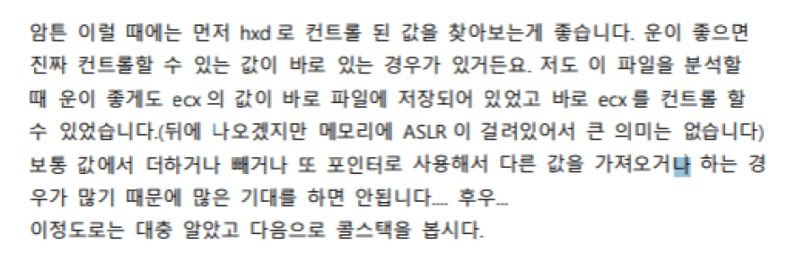
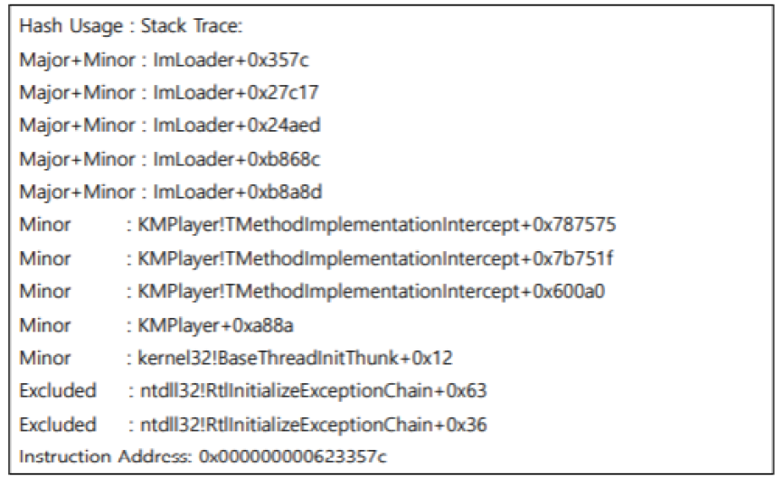
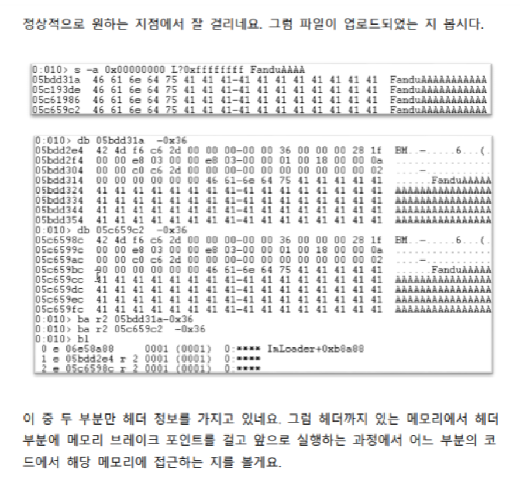
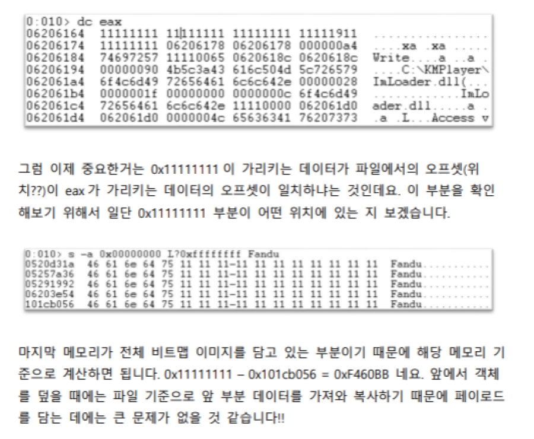

[Research] 버그헌팅 튜토리얼을 보고 공부하던 도중 궁금했던 점과 답변으로 새로 알게 된 점을 정리해보았습니다.

# 버그헌팅 튜토리얼 보러가기

[버그헌팅 튜토리얼 Part 1](https://hackyboiz.github.io/2021/03/07/l0ch/bughunting-tutorial/)

[버그헌팅 튜토리얼 Part 2](https://hackyboiz.github.io/2021/03/17/l0ch/bughunting-tutorials-part2/)

[버그헌팅 튜토리얼 Part 3](https://hackyboiz.github.io/2021/03/24/l0ch/bughunting-tutorials-part3/)

[버그헌팅 튜토리얼 Part 4](https://hackyboiz.github.io/2021/03/24/l0ch/bughunting-tutorials-part4/)

# Q1. 퍼징 이전 시드파일을 수정하는 이유

1. 추후 크래쉬 분석시에 내 파일이 **어디에 로드 되었는지 확인**하기 편한 이유
   * 디버거를 사용하여 string search를 통해 특정 문자열을 검색하게 되면 내가 수정한 데이터가 메모리의 어느 위치에 올라가는지 편하게 확인할 수 있습니다.
2. 또 마지막 부분에 넣을 경우 **끝까지 다 로드되었는지도 알기 쉽다.** 라고 언급되어있는데, 로드라는 개념이 어떤 것인지? (프로그램에 로드? 시드파일이 퍼저에 로드?) 
   * 이미지 파일이 프로그램에 로드되는 것을 말합니다.
3. 시드파일이 끝까지 다 로드되지 않는 경우도 있는지?
   * 프로그램마다 시드파일을 로드하는 방법에 따라 다릅니다.

# Q2. ECX 값이 파일에 저장

1. ecx 값이 파일에 저장되어 있는 것을 무엇을 보고 판단할 수 있는지

2. ecx 값을 컨트롤 할 수 있는지 는 어떻게 알 수 있는지

3. 또 ecx값이 파일에 저장되어있다는 것이 어떤 의미인지
4. ecx값이 컨트롤 할 수 있다면 어떤 동작이 가능한지 

- 헥스 에디터 프로그램을 이용해서 파일에다 문자열 패턴을 생성한 다시 파일을 로드 시키면 ecx값이 패턴대로 들어가 있다면 컨트롤을 쉽게 할 수 있습니다.
- 제가 알기로는 ecx 레지스터는 명령어 사용시 반복 카운터의 역할을 하는 레지스터로 알고있는데, 코드 실행의 흐름을 조절할 수 있는 eip, esp, ebp 레지스터가 아닌 ecx 레지스터에 담긴 값을 컨트롤 할 수 있을때도 익스플로잇이 어떤 원리로 가능한 것인지 잘 이해가 가지 않습니다.
  * call ecx 같은 명령어로 되어 있다면 eip가 ecx 레지스터로 바뀌기 때문에 코드의 흐름을 마음대로 변경할 수 있습니다. 

# Q3. Windbg에서 콜스택 보는법

1. Windbg에서 나타는 `IMLodader + 0x357c`와 같은 값이 어떤 것을 의미하는건지? (함수 시작부분? 함수내의 인스트럭션 주소? 분기할때의 그 주소?)
   * 함수내에서 다른 함수를 호출하게 되면 다음 실행 명령어의 주소를 스택에 저장하게 되는데 호출한 함수가 끝난 뒤 다시 돌아오기 위해 사용되는 값입니다.
2. 콜스택 분석을 통해서 확인할 수 있는 정보 혹은 확인해야 하는 정보는 무엇인지?
   * 콜스택을 사용하면 크래쉬 발생 지점 이전에 어디서 파일이 로드되는지 등 정보를 확인할 수 있습니다.
3. 콜스택이 깨져있는지 여부를 판단할 수 있는 방법
   * 대체로 Warning이라고 알려주며 스택이 오염되어 kb 명령어 입력 시 이상하게 떠 있는 경우 등 판단이 가능합니다.

# Q4. 리버싱 시에 비트맵 부분을 모두 0x41로 바꾸는 이유

1. 비트맵 부분을 모두 0x41로 바꾼 다음 다시 디버거로 확인하신다고 하셨는데, 그러면은 크래시 발생을 유발했던 뮤테이트 된 부분은 그대로 두고 나머지 부분을 전체로 0x41로 채운 것인가요?
   * 헤더는 크래쉬가 발생한 헤더 그대로 두고 나머지 내용을 0x41로 채웁니다.

2. 어떠한 정보를 알아내기 위해서 0x41로 전부 바꾼뒤에 다시 실행을 시키는 것인지? (eax값을 확인하기 위해서..? 값이 0x41로 바뀌는 레지스터를 확인하기 위해서...? 제가 나름대로 내린 결론은, 크래쉬 발생하는 시점에 사용자가 의도적으로 바꾼 정보(여기서는 비트맵 정보)로 말미암아 영향을 받게 되는 부분을 찾아내기 위함인데 이렇게 이해해도 될지? 
   * 맞습니다.

# Q5. 파일이 로드된 위치
1. 파일이 로드 된다는 개념? (프로그램에 특정한 인풋 파일을 실행시키면 해당 파일이 메모리상에 로드가 되는 것을 의미??) 
   * 말 그대로 이미지 뷰어는 이미지를 보기위한 프로그램이므로 우리가 보길 원하는 파일을 뷰어 프로그램에 올려 실행시키는 것입니다.

2. 만약 그렇다면, 또한 이 **파일이 메모리 상에 로드된 위치를 알아야하는 이유**를 잘 모르겠습니다. 추후에 이 곳에서 레지스터와 값을 주고받는 위치를 알기위해서라는 것은 알겠는데, 그로 말미암아 할 수 있는 일 (익스? 취약점 분석..?) 이 무엇인지 잘 감이 잡히지 않습니다.
   * 변형된 헤더에 의해 정상적인 크기보다 더 큰 값을 메모리에 로드시키게 되면 프로그램이 나중에 사용하게 될 값을 특정한 값으로 덮게되어 프로그램의 흐름을 조작해 익스플로잇을 할 수 있게 됩니다. 그리고 제일 중요한 이유는 보고서를 자세하게 작성해야하기 때문에 취약점의 증명을 위해 꼭 알아야 합니다!

# Q6. 윈디버거에서 WARNING

- 윈디버거에서 WARNING은 콜스택이 깨진 것을 알려준다고 알고 있는데, 이게 잘못되어서 못보여주는 경우 윈디버거에서 아래쪽에 나와있는 정보들도 신뢰할 수 없는 것인지? 아니면 WARNING을 기준으로 위쪽을 신뢰할 수 없는 것인가요 전부다 신뢰할 수 없는 것인지?
  - 케이스마다 다릅니다.

# Q7. 분석 시작 지점 찾기

- **시드파일에서 뮤테이션된 부분을 보고, 프로그램 내에서 그 부분을 처리하는 부분을 찾아야 한다는 것**은 이해가 가는데. 이를 어떻게 찾아야 하는지??
  * 방법은 다양합니다. 탑-다운 방식으로 처음부터 쭉 실행하면서 찾는 방식과 바텀-업 방식으로 크래쉬 지점부터 타고 올라가는 방식이 있는데, 함수 하나씩 거칠때마다 Q1-1에서 말한 string search를 통해 메모리에 로드 되었는지 확인해보면 어느지점에서 메모리에 로드 되고, 해당 부분을 처리하는지 확인할 수 있습니다.
- BM 이라는 문자열이 있는지 찾아보거나, 콜스택이 있으면 하나하나 보지 않아도 되는 이유, 아래 사진에서 이중에 아무거나 보는 이유..(`InLoader+0x2590`가 무엇을 뜻하는 건지.. ub로 그 주변 유요한 리턴어드레스를 찾는 이유..) 조차 잘 모르겠습니다.
  - 'BM'이라는 문자열을 찾는 이유는 dib 파일의 시그니처가 'BM'이기 때문입니다. 프로그램에 파일을 처음 로드시킬 때 파일 시그니처를 비교하여 각 파일에 알맞은 루틴을 실행하는데 아이다에서 문자열을 검색했을 때 'BM'이 있으면 그 부분부터 분석하면 됩니다. 없으면 손수 찾아야겠죠.
  - 콜스택이 제대로 나오면 파일이 로드되는 위치를 쉽게 찾을 수 있습니다.
- 또한 리턴어드레스라면 바로위 인스트럭션이 call이어야 하는데 ret일때 이주소는 우연히 그 모듈을 가리키고 있었던 것 뿐이라고 했는데.. **이 주소가 그 모듈을 가리키고 있다는 것**이 어떤 의미인지 잘 모르겠습니다.
  - Q3-1에서 말했듯이 콜스택은 다른 함수를 호출했을 때 쌓이게 되는데 ret은 함수를 호출하는 것이 아니므로 우연히 스택에 있었던 값이었습니다.

# Q8. 헤더 정보를 가지고 있는 부분

1. 헤더 정보를 가지고 있는 부분이라는게 뭔지 ? (즉, **부분** 이라는 것이 무엇인지 잘 모르겠습니다 특정 모듈? 함수? 인스트럭션?)
   * 말 그대로 이미지 정보를 나타내는 헤더가 담긴 메모리를 말합니다.

2. 또 해당 메모리에 접근하는 여부를 확인하는 방법 (특정 인스트럭션에서 해당하는 주소가 메모리 안에 있는 주소라면 해당 메모리에 접근하는 것이라고 인지하는 것? 이를 위해서 이전에 메모리 주소가 어디부터 어디인지 사전에 찾아내려고 했던 것?? 제가 이해한 것에 확신이 잘 가지 않습니다...)
   * ba 명령어로 메모리 브레이크 포인트를 설정할 수 있는데 r 옵션을 주면 해당 메모리를 읽을 시점에 브레이크 포인트가 걸리게 됩니다.

# Q9. 콜스택을 복구하는 방법
1. 콜스택을 복구하고 천천히 따라가는 과정을 보여주셨으면 좋겠습니다. 어떻게 하신건지 궁금합니다!
   * 질문에 답변하는 필자는 크래쉬 발생 시 함수 프롤로그 시점에 esp를 늘리기전 스택 최상단에 있는 리턴어드레스를 찾아내서 이런 과정을 반복해 콜스택을 복구하는 방법을 사용했습니다.

# Q10. 크래시 분석이후 eip 잡기

1. 크래쉬 분석이후 eip를 잡기 위해서 실행파일 값을 11111111로 수정하는 부분이 있는데, 이때 값을 11111111로 바꿔서 다시 실행한건지? 구체적으로 어떤 작업을 하신건지 여떤 입력 값을 바꾸신 건지
   * 11111111로 바꿔서 다시 실행한 것이 맞습니다.

# Q11. 0x11111111이 가리키는 데이터와 파일에서의 오프셋

1. 0x11111111이 가리키는 데이터란? (파일에서 오프셋이 eax가 가리키는 데이터의 오프셋이 일치하냐..?)
   * Q10-1의 이미지에서 `mov [eax], edx` 과정을 지날때 0x11111111의 주소안에 유효한 값이 들어가 있어야 해당 명령어를 지날 수 있습니다.
2. 또 0x11111111은 그냥 의도적으로 넣은 데이터 인것으로 이해했는데, 이 데이터가 무엇인가를 가리킨다는 것이 어떤 의미인지?
   * Q11-1 답변을 참고하시면 됩니다.
3. 또 이녀석이 가리키는 데이터가 파일에서의 오프셋이 eax가 가리키는 데이터의 오프셋과 일치하는지 여부를 찾는 이유...? 가 무엇인지
   * 오프셋이 다를 경우는 거의 없지만 만약 다를 경우 끔찍한 상황이 발생할 수 있습니다..
4. 0x11111111 - 0x101cb056 와 같은 연산을 하는 이유
   * call [ecx-4]에서 크래쉬가 발생하기 때문에 ecx를 컨트롤 할 수 있는 위치를 알아내기 위함입니다.

