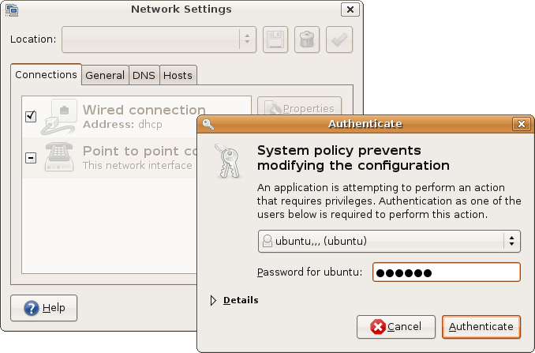

## URL

[CVE-2021-3560 polkit: local privilege escalation using polkit_system_bus_name_get_creds_sync()](https://seclists.org/oss-sec/2021/q2/180)

## Target

- polkit 0.113 ~ 0.118

## Explain
polkit은 Unix 계열 OS(Ubuntu, Fedora 등의 리눅스 배포판)에서 시스템 전반의 인증을 통제하는 프로그램으로, sudo 등 기존 인증 시스템과 달리 느슨한 수준의 인증을 수행해 권한이 없는 프로세스가 권한 있는 계정과 커뮤니케이션을 할 수 있습니다.

> 출처 : [위키백과](https://ko.wikipedia.org/wiki/폴킷)

polkit은  `polkit_system_bus_name_get_creds_sync()` 함수를 사용해 권한이 필요한 작업을 요청하는 프로세스의 uid 및 pid를 가져옵니다. 해당 함수는 요청 프로세스의 고유한 bus name을 [D-bus](https://ko.wikipedia.org/wiki/D-Bus)의 `dbus-daemon`에 전송해 요청 프로세스의 권한을 확인하는데, 권한 상승 취약점은 함수 호출 직전에 요청 프로세스와 `dbus-daemon`의 연결이 끊어질 때 발생합니다. `dbus-daemon`은 연결이 끊어진 프로세스의 bus name이 유효하지 않으므로 error 응답을 보내지만 `polkit_system_bus_name_get_creds_sync()` 함수에서 이를 확인하지 않아 성공적으로 프로세스의 정보를 가져왔다는 의미의 TRUE를 반환합니다. 해당 함수의 호출자 일부는 추가적인 검증 없이 0으로 초기화된 `AsyncGetBusNameCredsData` 구조체를 참조하게 되어 요청 프로세스의 uid를 0으로 생각하고 root 프로세스가 요청한 것으로 작업을 수행합니다.

취약점의 패치 정보는 https://gitlab.freedesktop.org/polkit/polkit/-/commit/a04d13a  에서 확인할 수 있습니다.

