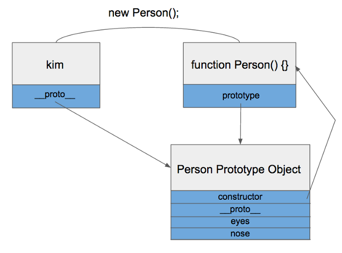

## URL

["A tale of making internet pollution free" - Exploiting Client-Side Prototype Pollution in the wild](https://blog.s1r1us.ninja/research/PP)

## Target

- Node.JS
- JavaScript

## Explain

Prototype Pollution은 [NorthSec 2018에서 공개된 취약점](https://github.com/HoLyVieR/prototype-pollution-nsec18)입니다. JavaScript는 객체의 상속 구현을 위해 Prototype이라는 개념을 사용하고, 객체의 속성을 탐색할때 Prototype을 통해 상속된 객체를 탐색하게 됩니다. 즉 최상의 객체인 Object.prototype에 영향을 주면 모든 객체에 속성이 포함되게 되는데, 이러한 매커니즘을 이용한 공격이 Prototype Pollution입니다.

JavaScript의 모든 객체 생성될때 함수로 정의되어 생성됩니다. 함수를 정의하면 함수만 생성되는 것이 아니고 Prototype Object도 같이 생성됩니다.


그리고 생성된 함수는 `prototype`을 이용해 Prototype Object에 접근이 가능합니다.

모든 객체는 `__proto__` 속성을 가지고 있는데 객체가 생성될 때 조상이었던 함수의 Prototype Object를 가리킵니다.


------



JavaScript에서 객체의 속성을 찾을 때 `__proto__`를 따라가며 탐색하게 됩니다. 최종적으로 최상위 Object Prototype Object에도 정의 되어 있지 않으면 그때 `undefined`를 리턴합니다. 이렇게 `__proto__`속성으로 상위 Object들과 연결 되어 있는 것을 Prototype Chain이라고 합니다. 이 Prototype Chain에 의하여 Object Prototype Object에 정의 되어 있는 속성을 모든 Object에서 참조 할수 있게 되는 것입니다.

`__proto__`에 의한 Prototype Chain을 따라가면 `Object.prototype`에 도달하는 것을 이용해 다른 객체 속성에 영향을 주는 공격을 Prototype Pollution 이라고 합니다.

```jsx
const obj1 = {};
console.log(obj1.__proto__ === Object.prototype); // true
obj1.__proto__.polluted = 1;
const obj2 = {};
console.log(obj2.polluted); // 1
```

위 코드를 보면 `obj1.__proto__`는 `Object.prototype`과 같음을 확인 할 수 있고, `obj1.__proto__.polluted = 1;` 코드로 `Object.prototype`에 `polluted` 속성을 추가하였습니다. 결과적으로는 `Object`를 상속한 `obj2`역시 Prototype chain에 의해 `polluted` 속성을 갖게 됩니다.

Prototype Pollution은 크게 세가지 패턴에서 발생합니다.

1. 속성 부여

   ```jsx
   function isObject(obj) {
     return obj !== null && typeof obj === 'object';
   }
    
   function setValue(obj, key, value) {
     const keylist = key.split('.');
     const e = keylist.shift();
     if (keylist.length > 0) {
       if (!isObject(obj[e])) obj[e] = {};
       setValue(obj[e], keylist.join('.'), value);
     } else {
       obj[key] = value;
       return obj;
     }
   }
    
   const obj1 = {};
   setValue(obj1, "__proto__.polluted", 1);
   const obj2 = {};
   console.log(obj2.polluted); // 1
   ```

2. 객체 병합

   ```jsx
   function merge(a, b) {
     for (let key in b) {
       if (isObject(a[key]) && isObject(b[key])) {
         merge(a[key], b[key]);
       } else {
         a[key] = b[key];
       }
     }
     return a;
   }
    
   const obj1 = {a: 1, b:2};
   const obj2 = JSON.parse('{"__proto__":{"polluted":1}}');
   merge(obj1, obj2);
   const obj3 = {};
   console.log(obj3.polluted); // 1
   ```

3. 객체 복사

   ```jsx
   function clone(obj) {
     return merge({}, obj);
   }
    
   const obj1 = JSON.parse('{"__proto__":{"polluted":1}}');
   const obj2 = clone(obj1);
   const obj3 = {};
   console.log(obj3.polluted); // 1
   ```

Prototype Pollution은 NodeJS에 영향을 끼치며, 대표적으로 [HTML Sanitizer 우회](https://research.securitum.com/prototype-pollution-and-bypassing-client-side-html-sanitizers/), [NodeJS 템플릿 엔진에서의 RCE](https://blog.p6.is/AST-Injection/)가 가능하며 자세한 정보는 [URL](https://blog.s1r1us.ninja/research/PP)에서 확인할 수 있습니다.