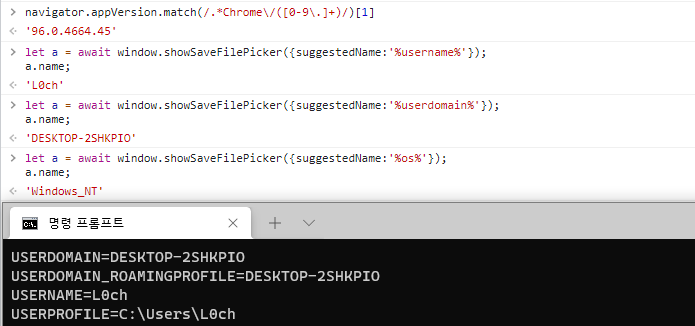

## URL

[CVE-2022-0337-PoC-Google-Chrome-Microsoft-Edge-Opera](https://github.com/Puliczek/CVE-2022-0337-PoC-Google-Chrome-Microsoft-Edge-Opera)

## Target

- Google Chrome 92-96
- Microsoft Edge 92-96
- Opera 78-82

## Explain
Chromium에서 시스템의 환경 변수를 유출할 수 있는 취약점이 발견되었습니다. Windows 환경의 Chromium 기반 브라우저인 Chrome, Edge, Opera가 해당 취약점의 영향을 받는 것으로 알려졌습니다.

취약점은 파일 시스템 액세스 API인 `window.showSaveFilePicker()` 메서드에 존재합니다.`showSaveFilePicker`는 OS 파일 탐색기를 사용하여 파일을 저장하며 `suggestedName` 속성으로 저장할 파일 이름을 설정할 수 있습니다. 이때 `suggestedName` 속성으로 Windows 환경 변수를 설정하면 Windows 파일 시스템에 저장될 때 설정한 환경 변수 값으로 파일 이름이 치환되어 저장되고, 저장된 파일 정보를 브라우저에서 가져올 수 있어 정상적으로는 접근할 수 없는 유저의 환경 변수 값을 해커가 유출할 수 있습니다.

Windows 시스템의 `username` 환경변수 값을 가져오는 PoC는 아래와 같습니다.

```jsx
let a = await window.showSaveFilePicker({suggestedName:'%환경변수명%'});
a.name;
```




Google Chrome 96 버전에서 위와 같이 `username`, `userdomain`, `os` 등 로컬 시스템의 여러 환경 변수 정보를 출력할 수 있습니다.

취약점을 트리거하기 위해서는 브라우저에서 유저 상호작용이 필요하나 Windows의 파일 저장은 수락이 default 값이기 때문에 ENTER를 약 2초동안 누르도록 하는 트릭을 사용하는 것만으로 수십개의 환경 변수를 간단히 유출할 수 있다고 합니다. 

저장된 환경 변수에 따라 해커는 환경 변수에 저장된 AWS, Github 계정 또는 Binance 토큰과 같은 자산 정보에도 접근할 수 있어 높은 심각도의 취약점으로 분류되었으며 제보자는 $10,000 의 리워드를 지급받았습니다.