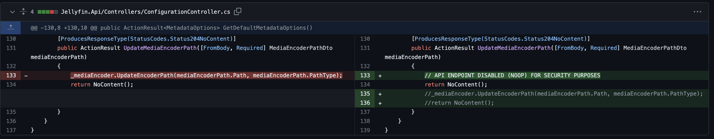

## URL

[GHSL-2023-028: Remote Code Execution in jellyfin - CVE-2023-48702](https://securitylab.github.com/advisories/GHSL-2023-028_jellyfin/)

## Target

- jeyllyfin < 10.8.13

## Explain

지난 12월, jellyfin에서 발견된 원격 코드 실행 취약점에 대한 세부 정보가 공개되었습니다.

jellyfin은 유료로 전환된 Emby Media Server의 마지막 오픈소스 버전 3.5.2의 fork로, 미디어 관리 및 스트리밍을 제어할 수 있는 오픈소스 미디어 시스템입니다. 

공격자는 두 가지 취약점을 결합해 임의 파일 업로드를 통한 원격 코드 실행을 달성할 수 있습니다.

### 1. UNC 경로 전달을 통한 로컬 컨텍스트의 임의 코드 실행

jellyfin의 [/System/MediaEncoder/Path](https://github.com/jellyfin/jellyfin/blob/1c72a8e0068fec8045884fa386a67c90a364ee0a/Jellyfin.Api/Controllers/ConfigurationController.cs#L130) 엔드포인트는 [UpdateEncoderPath()](https://github.com/jellyfin/jellyfin/blob/master/MediaBrowser.MediaEncoding/Encoder/MediaEncoder.cs#L239) →  [ValidateVersion()](https://github.com/jellyfin/jellyfin/blob/master/MediaBrowser.MediaEncoding/Encoder/EncoderValidator.cs#L174) → [GetProcessOutput()](https://github.com/jellyfin/jellyfin/blob/master/MediaBrowser.MediaEncoding/Encoder/EncoderValidator.cs#L554) 호출과정을 통해 `ProcessStartInfo` 함수를 호출합니다. 관리자 권한의 해커는 로컬 컨텍스트에 존재하는 실행 파일 경로를 해당 엔드포인트에 전달하는 것으로 임의 코드 실행이 가능합니다.

### 2. 검증 부족으로 인한 임의 파일 업로드

[/Branding/Splashscreen](https://github.com/jellyfin/jellyfin/blob/1c72a8e0068fec8045884fa386a67c90a364ee0a/Jellyfin.Api/Controllers/ImageController.cs#L1764) 엔드포인트는 요청 헤더의 `Content-Type` 필드로 파일 확장자를 확인해 업로드된 파일의 확장자를 생성하지만 업로드되는 파일 형식에 대한 추가적인 검증이 존재하지 않습니다. 해커는 실행 파일을 업로드하며 요청 헤더에 `image/png`와 같은 확장자를 지정하는 것으로 원격에서 임의의 실행 파일을 업로드할 수 있습니다.

```csharp
/// ImageController.cs

/// request 헤더의 Content-Type 필드에서 파일 확장자를 가져옴
/// 아래 코드 스니펫에서 업로드 파일 형식에 대한 검증이 존재하지 않음
var mimeType = MediaTypeHeaderValue.Parse(Request.ContentType).MediaType;

if (!mimeType.HasValue){
	return BadRequest("Error reading mimetype from uploaded image");
}

var extension = MimeTypes.ToExtension(mimeType.Value);

if (string.IsNullOrEmpty(extension)){
  return BadRequest("Error converting mimetype to an image extension");
}

/// 업로드한 파일명을 "splashscreen-upload + Content-Type 필드에서 지정한 확장자"로 변경
var filePath = Path.Combine(_appPaths.DataPath, "splashscreen-upload" + extension);
```

### 3. 두가지 취약점을 결합한 원격 코드 실행

[/Branding/Splashscreen](https://github.com/jellyfin/jellyfin/blob/1c72a8e0068fec8045884fa386a67c90a364ee0a/Jellyfin.Api/Controllers/ImageController.cs#L1764) 엔드포인트의 취약점을 이용해 원격에서 악성 실행 파일을 업로드하고, 업로드 경로를 [/System/MediaEncoder/Path](https://github.com/jellyfin/jellyfin/blob/1c72a8e0068fec8045884fa386a67c90a364ee0a/Jellyfin.Api/Controllers/ConfigurationController.cs#L130) 엔드포인트에 전달하는 것으로 원격 코드 실행을 달성할 수 있습니다.

1) `Content-Type:image/png` 및 base64 인코딩된 악성 실행 파일을 포함한 request를 jellyfin 서버로 보냅니다.

```bash
curl -v -H "Content-Type:image/png" -d @base64executable {host}/Branding/Splashscreen?api_key=<API KEY>.
```

2) Jellyfin 웹 프론트엔드로 이동하여 `Playback -> FFmpeg` 경로를 업로드한 악성 실행 파일 경로로 설정합니다.

```bash
$(_appPaths.DataPath)/splashscreen-upload.png
```

3) 2번의 설정을 저장하면 인증된 요청이 [/System/MediaEncoder/Path](https://github.com/jellyfin/jellyfin/blob/1c72a8e0068fec8045884fa386a67c90a364ee0a/Jellyfin.Api/Controllers/ConfigurationController.cs#L130) 엔드포인트에 전달되어 원격 코드 실행이 트리거됩니다.

취약점에 대한 패치는 `/System/MediaEncoder/Path` 엔드포인트에 대한 기능을 임시로 제거하는 것으로 이루어졌습니다.

