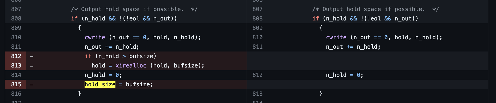

## URL

https://github.com/Valentin-Metz/writeup_split

## Target

- Coreutils < upstream

## Explain

Coreutils은 ls, cat, cp, rm, mv 등 유닉스 계열의 운영체제에서 쓰이는 기본적인 명령어들을 포함하는 GNU 소프트웨어의 패키지로, 대다수의 리눅스 배포판들이 해당 패키지를 사용하고 있습니다. Coreutils 명령어 중 크기가 큰 파일을 나누거나 command line argument를 나누는 등에 사용되는 명령어인 split의 구현에서 Heap Buffer Overflow 취약점이 발견되어 세부 정보가 공개되었습니다.

```cpp
static void
line_bytes_split (intmax_t n_bytes, char *buf, idx_t bufsize)
{
  ssize_t n_read;
  intmax_t n_out = 0;      /* for each split.  */
  idx_t n_hold = 0;
  char *hold = nullptr;        /* for lines > bufsize.  */
```

`split.c`의 `line_bytes_split` 함수는 End of Line 혹은 End of Chunk를 기준으로 입력을 나누고 이를 버퍼에 저장합니다. 이때 line의 크기가 `bufsize`보다 큰 경우를 처리하기 위해 `hold` 버퍼를 사용해 하나의 line을 저장할 공간을 추가로 확보하며 여러 번 hold할 수도 있어 hold된 크기 관리를 위해 `n_hold` 변수 또한 사용합니다. 

```cpp
if (n_hold && !(!eol && n_out))
{
  cwrite (n_out == 0, hold, n_hold);
  n_out += n_hold;
  if (n_hold > bufsize)
    hold = xirealloc (hold, bufsize);
  n_hold = 0;
  hold_size = bufsize;
}
```

취약점은 n번 째 hold를 진행할 때 발생합니다. `n_hold`가 `bufsize`보다 큰 경우 `realloc`으로 `hold` 버퍼가 할당된 크기 및 `hold_size`의 크기를 `bufsize`로 축소시킵니다. 그러나 hold한 뒤에도 남은 line byte가 `bufsize`보다 큰 경우 다음 hold 버퍼가 예상보다 작게 할당되고 Heap Buffer Overflow가 트리거됩니다.

취약점의 패치는 hold_size를 축소하는 코드를 삭제하는 것으로 이루어졌습니다.

