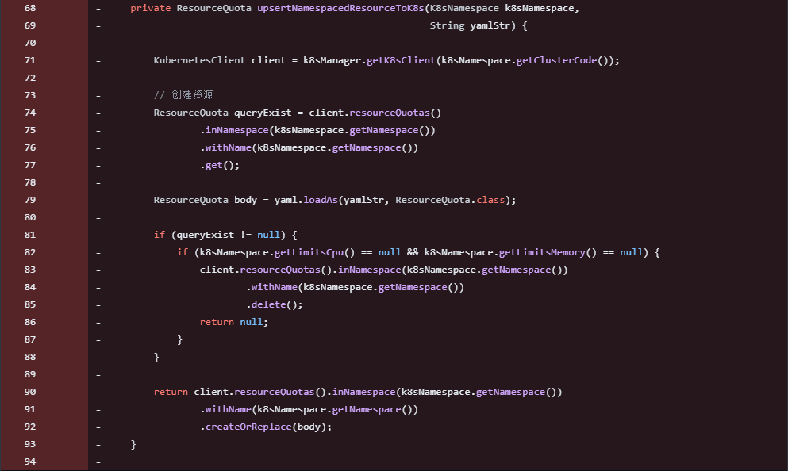

## URL

[https://xz.aliyun.com/t/13913?time__1311=mqmxnQ0%3D3eqQqGNDQiFbFD9Q7fCKAKx](https://xz.aliyun.com/t/13913?time__1311=mqmxnQ0%3D3eqQqGNDQiFbFD9Q7fCKAKx)

## Target

- 3.0.0 <= Apache DolphinScheduler< 3.2.1

## Explain

엔터프라이즈급 시나리오를 위한 워크플로우 스케줄러 시스템인 Apache DolphinScheduler에서 발견된 yaml obejct Deserialization으로 인한 원격 코드 실행 취약점의 세부 정보가 공개되었습니다.

```jsx
@Override  
public Map<String, Object> createK8sNamespace(User loginUser, String namespace, Long clusterCode, Double limitsCpu,  
                                              Integer limitsMemory)

//...
if (!Constants.K8S_LOCAL_TEST_CLUSTER_CODE.equals(k8sNamespaceObj.getClusterCode())) {  
    try {  
        String yamlStr = genDefaultResourceYaml(k8sNamespaceObj);  
        k8sClientService.upsertNamespaceAndResourceToK8s(k8sNamespaceObj, yamlStr);  
    } catch (Exception e) {  
        log.error("Namespace create to k8s error", e);  
        putMsg(result, Status.K8S_CLIENT_OPS_ERROR, e.getMessage());  
        return result;  
    }  
}
//...
```

취약점은 Concrete Class인 `createK8sNamespace`에 존재합니다. 해당 클래스는 request에 포함된 매개변수를 받아 `k8sNamespaceObj`를 생성한 뒤 이를 `yamlStr`으로 변환합니다.

이후 `upsertNamespaceAndResourceToK8s` 메서드에 `yamlStr`을 매개변수로 전달하고 해당 메서드에서는 `yaml.loadAs(yamlStr, ResourceQuota.class);` 와 같이 직렬화된 `yamlStr` 을 역직렬화해 사용합니다.

```jsx
private ResourceQuota upsertNamespacedResourceToK8s(K8sNamespace k8sNamespace,  
                                                    String yamlStr) throws RemotingException {  

    KubernetesClient client = k8sManager.getK8sClient(k8sNamespace.getClusterCode());  

    ResourceQuota queryExist = client.resourceQuotas()  
            .inNamespace(k8sNamespace.getNamespace())  
            .withName(k8sNamespace.getNamespace())  
            .get();  

    ResourceQuota body = yaml.loadAs(yamlStr, ResourceQuota.class);  

    if (queryExist != null) {  
        if (k8sNamespace.getLimitsCpu() == null && k8sNamespace.getLimitsMemory() == null) {  
            client.resourceQuotas().inNamespace(k8sNamespace.getNamespace())  
                    .withName(k8sNamespace.getNamespace())  
                    .delete();  
            return null;  
        }  
    }  

    return client.resourceQuotas().inNamespace(k8sNamespace.getNamespace())  
            .withName(k8sNamespace.getNamespace())  
            .createOrReplace(body);  
}
```

위 과정에서 유저가 제어 가능한 `yamlStr` 오브젝트를 직렬화 및 역직렬화하는 과정에서 적절한 검사가 존재하지 않아 악성 jar 페이로드를 포함한 request를 보내는 것으로 원격 코드 실행이 가능합니다.

패치는 `yaml.loadAs`를 통해 불필요하게 오브젝트를 역직렬화하는 `upsertNamespacedResourceToK8s`메서드와 해당 메서드를 호출하는 코드를 모두 삭제하는 것으로 이루어졌습니다.



## Reference

[Patch - **[Improvement][K8S] Remove ResourceQuota**](https://github.com/apache/dolphinscheduler/pull/14991/files)