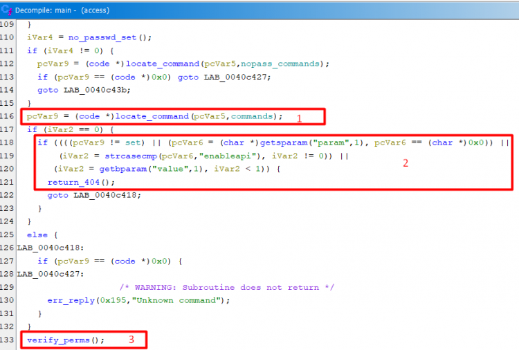
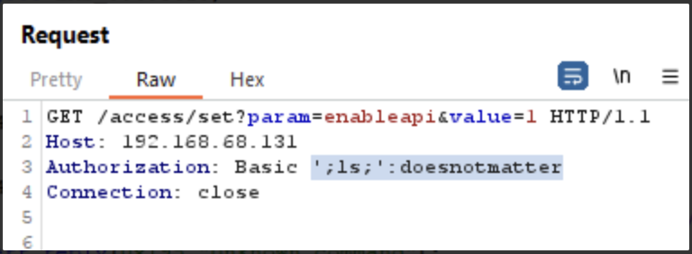

## Title

CVE-2024-1212: Progress Kemp LoadMaster의 Pre-Auth Command injection 취약점

## URL

https://rhinosecuritylabs.com/research/cve-2024-1212unauthenticated-command-injection-in-progress-kemp-loadmaster/

## Target

- Progress Kemp LoadMaster < 7.2.59.2.22338

## Explain

Progress Kemp LoadMaster 로드밸런서에서 발견된 인증 우회를 통한 Command Injection 취약점의 세부 정보가 공개되었습니다.

LoadMaster는 Optional REST API 기능을 통해 API 요청 처리 기능을 enable/disable 수 있습니다. 해당 기능의 설치 기본값은 disable이며 enable 시 REST API 요청은 아래 bash 스크립트에서 처리됩니다.

```bash
export WAF_ENABLE CLIARGS MEMSIZE
export CAPTCHA_DEFAULT_ACCESSURL CAPTCHA_DEFAULT_VERIFYURL

[ ! -f $LCFGDIR/_SWFIPSMODE ] || FIPS=2

exec /bin/${0/*\//} -C $CLUST -F $FIPS -H $HW_VERSION
```

취약한 엔드포인트는 `/access`로, 스크립트는 `/bin/access` 바이너리를 호출해 API 요청을 처리합니다.



`/bin/access` 바이너리는 API 요청을 파싱한 뒤 `verify_perm()` 함수로 전달하는데, 이 과정에서 Optional REST API 기능의 활성화 여부 및 요청에 대한 검사가 부족해 권한 없는 해커가 `/access/set?param=enableapi&value=1` 요청을 통해 비활성화되어있는 Optional REST API 기능을 활성화할 수 있습니다.


이후 요청 헤더 중 `Authorization` 필드로 전달되는 유저명이 유효한지를 검증하는 과정에서  `system` 함수를 이용하나 입력에 대한 검증이 존재하지 않아 `Authorization` 필드에 임의의 명령어를 포함하는 것으로 command injection을 트리거할 수 있습니다.
