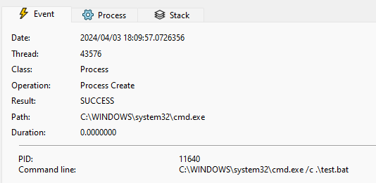

## Title

BatBadBut: 여러 프로그래밍 언어에서 발견된 Windows bat 파일 명령줄 인수를 통한 Command Injection 취약점

## URL

[Multiple programming languages fail to escape arguments properly in Microsoft Windows](https://kb.cert.org/vuls/id/123335)

## Target

- PHP
- Haskell
- Node.js
- Rust
- yt-dlp

## Explain

Rust, PHP, Node.js 등 여러 인기있는 프로그래밍 언어의 Windows 구현에서 발견된 Command Injection 취약점에 대한 세부 정보가 공개되었습니다.

프로그래밍 언어는 일반적으로 운영체제 상호작용을 위해 운영체제 명령 실행을 지원합니다. 이때 명령어의 인수 또한 같이 전달하며 Windows에서는 `CreateProcess` 함수를 이용해 이를 처리합니다.

`CreateProcess` 함수는 `.bat` 파일을 실행할 때 아래와 같이 동작합니다.

```php
wchar_t arguments[] = L".\\test.bat";
STARTUPINFO si{};
PROCESS_INFORMATION pi{};
CreateProcessW(nullptr, arguments, nullptr, nullptr, false, 0, nullptr, nullptr, &si, &pi);
```



사진과 같이 `CreateProcess`는 `.bat` 파일을 실행할 때 암시적으로 `cmd.exe`를 생성해 인수로 `test.bat` 파일을 전달하는 방식으로 동작합니다. 위와 같은 동작은 Windows 환경 자체에서는 문제가 없으나, OS 명령 실행을 지원하는 프로그래밍 언어가 래핑된 `CreateProcess`를 사용할 때 `cmd.exe`에서 인수를 구문 분석하게 되어 아래와 같은 문제가 발생합니다. 

표준 이스케이프 규칙을 사용되는 Unix 쉘의 이스케이프 문자는 백슬래시 `\` 입니다.  `cmd.exe`의 이스케이프 문자는 캐럿 `^`으로 표준 이스케이프 규칙과 차이가 존재하나 취약점이 존재하는 여러 프로그래밍 언어들은 Windows 구현에 적절한 이스케이프 처리를 하지 않아 취약점이 발생합니다.

Command Injection 취약점의 트리거 조건은 다음과 같습니다.

1. Windows 구현에서 이스케이프 처리를 백슬래시 `\` 로 사용하는 경우
2. 1번으로 인해 Sequential 명령 실행 문자인 `&` 가 이스케이프 처리되지 않아 전달되는 인수가 별도의 명령어로 처리되는 경우

### CVE-2024-1874

Windows PHP의 `proc_open`  함수는 아래와 같이 인수를 통해 전달된 외부 명령을 실행합니다.

위와 같은 이스케이프 처리 부족으로 인해 `.bat` 파일의 인수로 `\"&notepad.exe` 을 전달하는 등의 Command Injetion이 가능합니다.

```php
<?php
$descriptorspec = [STDIN, STDOUT, STDOUT];
$proc = proc_open(["test.bat", "\"&notepad.exe"], $descriptorspec, $pipes);
proc_close($proc);
...
```

### CVE-2024-24576

Windows Rust의 표준 라이브러리 API 중 `Command::arg` 및 `Command::args` 에서도 전달되는 인수 이스케이프 처리 부족으로 Command Injection이 가능합니다.

```php
C:\Users\frost\testing>cargo run
    Finished dev [unoptimized + debuginfo] target(s) in 0.01s
     Running `target\debug\testing.exe`
enter payload here
aaa" & whoami
Output:
Argument received: "aaa\"
desktop-8j2vk8b\frost
```

PHP, Rust 외에도 Haskell, Node.js 프로그래밍 언어에서 BatBadBut 취약점이 발견되었습니다.

## Reference

https://github.com/frostb1ten/CVE-2024-24576-PoC

[Command injection via array-ish $command parameter of proc_open even if bypass_shell option enabled on Windows](https://github.com/php/php-src/security/advisories/GHSA-pc52-254m-w9w7)